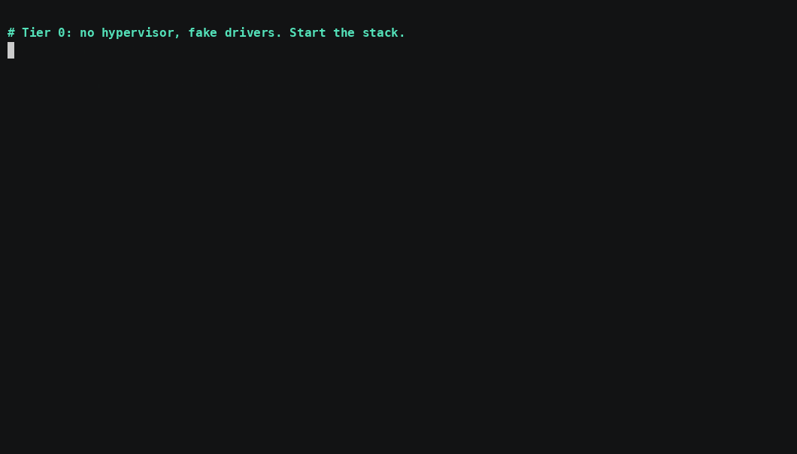
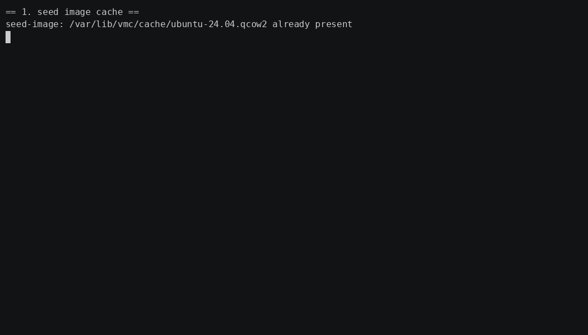

# vm-control-plane

A small, production-shaped VM control plane in Go. It has the same shape as real
libvirt-based compute platforms like OpenStack Nova and KubeVirt: a state-owning
control plane (gRPC API, PostgreSQL desired state, reconciler, scheduler), a
per-host agent that wraps the hypervisor (libvirt/KVM, Open vSwitch, qcow2), and
level-triggered reconciliation between them. You drive it with one CLI, `vmctl`.

## What the demo covers

- Full VM lifecycle over an async, operation-based API: create, boot, stop,
  start, delete. Every mutation returns an operation you can wait on.
- Desired-state reconciliation. You declare what you want, and the control plane
  converges to it and repairs drift. `list vms` shows an `applied/desired`
  revision you can watch catch up.
- Real KVM. The same commands boot a real Ubuntu guest under KVM, reach it over
  SSH, and tear it down. You can also run against fake drivers on any OS, with
  no hypervisor at all.
- Correctness under failure: durable work claims, execution grants, placement
  fencing, crash-safe deletes, and operations that always terminate. A black-box
  test suite exercises all of it with real `kill -9`.

## Quick start

Two ways to run it, simplest first.

### 1. No hypervisor, any OS (fake drivers)



Needs only Go 1.26+. The first run downloads a pinned embedded PostgreSQL, so run
it from a normal (non-admin) shell.

```
make dev
```

Leave that running. It starts the whole stack (embedded Postgres, the
control-plane, and a host agent with two logical nodes) and picks a free port.
Near the top of its output it prints the exact line to run so the CLI can find
it, for example:

```
export VMCTL_SERVER=127.0.0.1:43243     # PowerShell: $env:VMCTL_SERVER='127.0.0.1:43243'
```

Open a second terminal in the repo, copy that line from the output and run it.
The available commands are in the [Operations](#operations) section below. Ctrl-C
in the first terminal stops everything.

### 2. Real KVM (in a Linux VM)



This runs the same control plane against real libvirt/KVM inside a Linux VM.

On the host you need [VirtualBox](https://www.virtualbox.org/) and
[Vagrant](https://www.vagrantup.com/). Hardware virtualization must be enabled in
firmware, and on Windows, Hyper-V and WSL must be off, so VirtualBox can pass
nested VT-x into the guest. That nesting is what gives the guest a working
`/dev/kvm`.

First, bring the VM up from the repo root. The first run downloads the box and
provisions it, which takes a few minutes:

```
cd deploy/vagrant
vagrant up
```

`vagrant up` builds an Ubuntu 24.04 VM with nested KVM, installs QEMU, libvirt,
Open vSwitch, and Go, adds the login user to the `kvm` and `libvirt` groups, and
copies this repo to `~/vm-control-plane` inside the VM.

Then SSH in and run the demo as the normal `vagrant` user. Do not use `sudo`: the
embedded Postgres refuses to run as root, and KVM/libvirt access already comes
from the group membership above.

```
vagrant ssh
cd ~/vm-control-plane
./scripts/demo/01-real-kvm.sh
```

The first run also downloads the Ubuntu cloud image once. After that the script
runs the same operations as Tier 0, now against real KVM: create the VM, wait
for it, SSH into the booted guest, stop it, then delete it. You will see
something like:

```
== create a real VM ==
OPERATION                             VERB    RESOURCE   STATE
d8593327-7655-4f5e-ba2f-c29392622546  CREATE  vm/real-1  DONE
NAME    PHASE    NODE    EPOCH  CPU  MEMORY  IMAGE         REVISION
real-1  RUNNING  node-a  1      1    1GiB    ubuntu-24.04  1/1

guest IP: 192.168.221.128
REAL-KVM GUEST REACHED: real-1 / 6.8.0-136-generic

== stop the VM (ACPI shutdown), then list ==
real-1  STOPPED  node-a  1      1    1GiB    ubuntu-24.04  2/2

== delete ==
7a93c382-15c4-4e58-9dc5-491ffc1a8556  DELETE  vm/real-1  DONE
== demo complete ==
```

There is also a distributed variant, with the control plane and Postgres on the
host and the agent in the VM over an SSH tunnel:
[scripts/demo/02-distributed.ps1](scripts/demo/02-distributed.ps1).

## Operations

`bin/vmctl` talks to the control plane at `$VMCTL_SERVER` (default
`127.0.0.1:7070`; override per command with `--server host:port`). Creates, power
changes, and deletes are asynchronous: each returns an operation id you can wait
on. Sizes accept `MiB` or `GiB` (for example `2GiB`), or raw bytes.

- **Create a VM:** declares the desired VM and returns an operation id; the
  control plane provisions it in the background. Add `--network <tenant-net>` to
  attach a tenant network, or `--idempotency-key <uuid>` to safely replay a
  create after an ambiguous failure (you get the original operation back, not a
  second VM).

  ```
  bin/vmctl create vm web-1 --cpu 2 --memory 2GiB --image ubuntu-24.04 --disk 10GiB
  ```

- **Wait for an operation, or inspect it:** `op wait` blocks until the operation
  reaches a terminal state (DONE, FAILED, and so on); `op get` prints its current
  state.

  ```
  bin/vmctl op wait <operation-id> --timeout 4m
  bin/vmctl op get  <operation-id>
  ```

- **List VMs, or show one:** the `REVISION` column is `applied/desired`; watch it
  converge as the control plane reconciles.

  ```
  bin/vmctl list vms
  bin/vmctl get vm web-1
  ```

- **Stop or start a VM:** power is the mutable part of the spec in v0.1; each
  returns an operation that converges the running state.

  ```
  bin/vmctl stop  vm web-1
  bin/vmctl start vm web-1
  ```

- **Delete a VM:** tombstones it, then the control plane reconciles the teardown
  (storage and networking) and finalizes.

  ```
  bin/vmctl delete vm web-1
  ```

## Crash safety

The black-box suite kills the controller mid-transition and mid-delete, then
recovers by restart alone:

```
go test ./internal/e2e/ -v
```

## Docs

- Development process in detail, the 30 pull requests that built this in order: [docs/build-order.md](docs/build-order.md)
- Design walkthrough, one request in 10 steps: [docs/design.md](docs/design.md)
- Implementation plan (state model, PR-by-PR build order, testing): [docs/implementation-plan.md](docs/implementation-plan.md)
- Decision records: [docs/adr/](docs/adr/)
- Real-hardware findings: [docs/reviews/real-substrate-findings.md](docs/reviews/real-substrate-findings.md)

## License

MIT, see [LICENSE](LICENSE).
