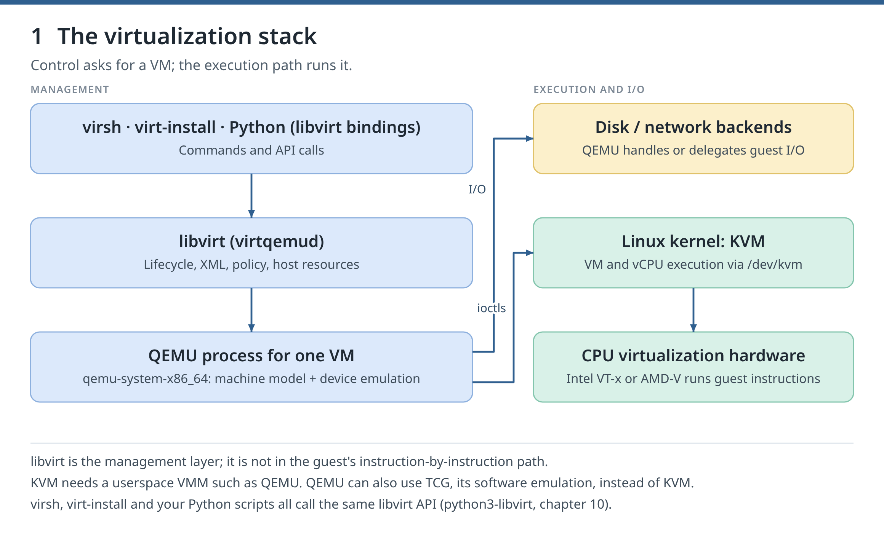
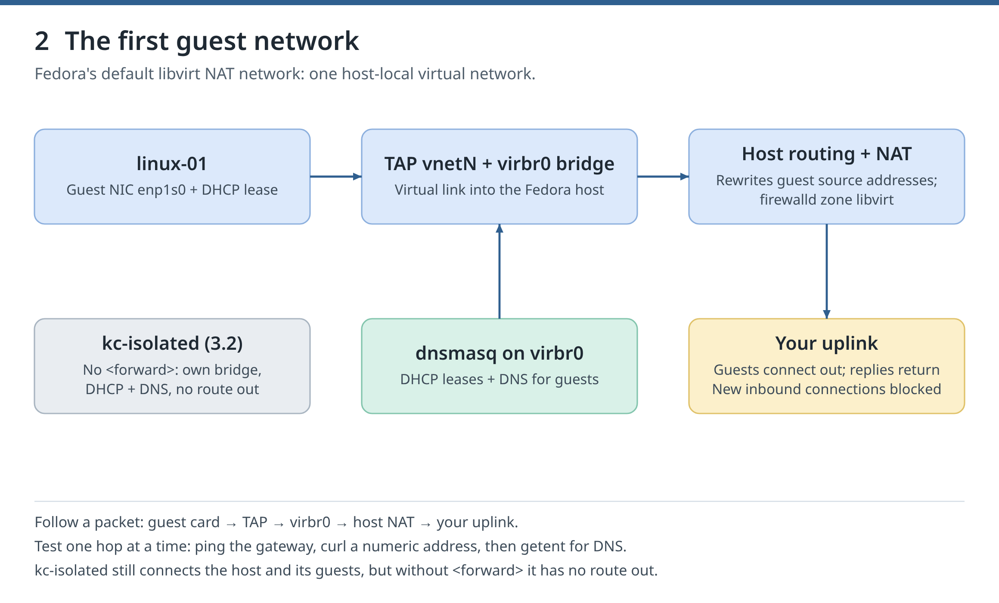
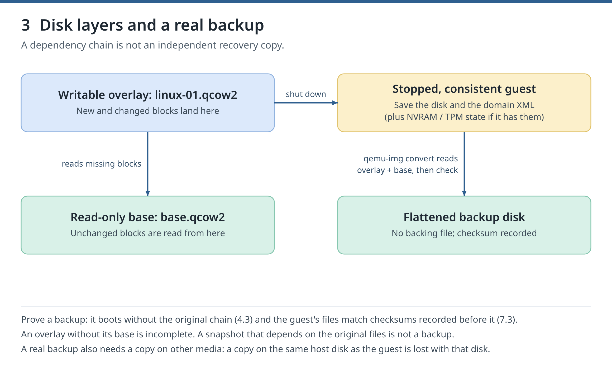
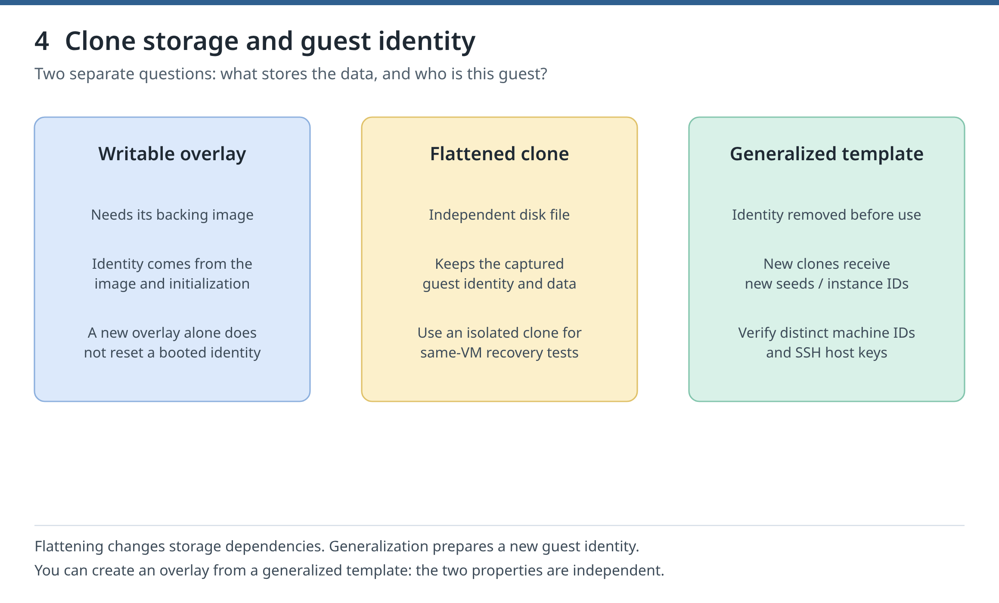
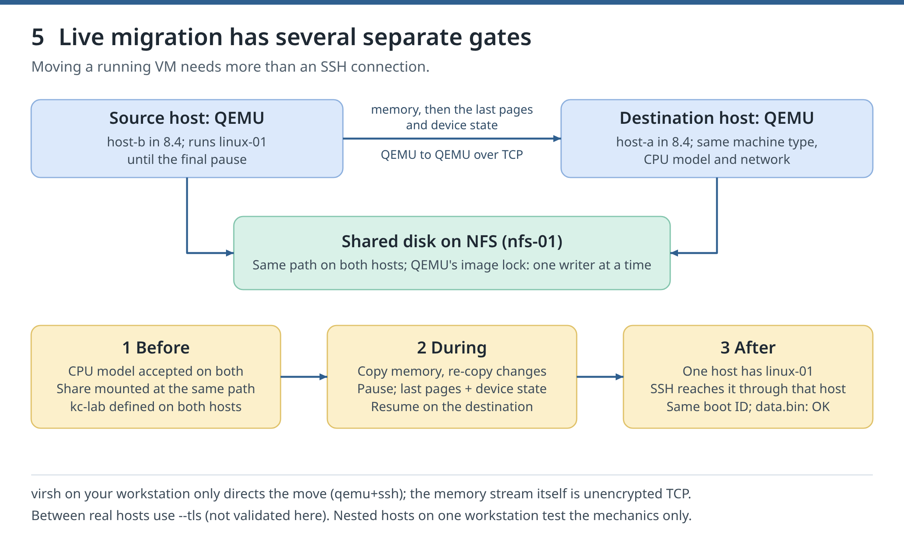
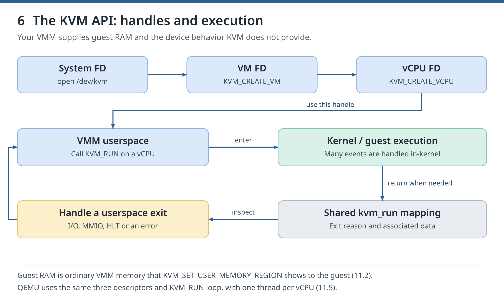
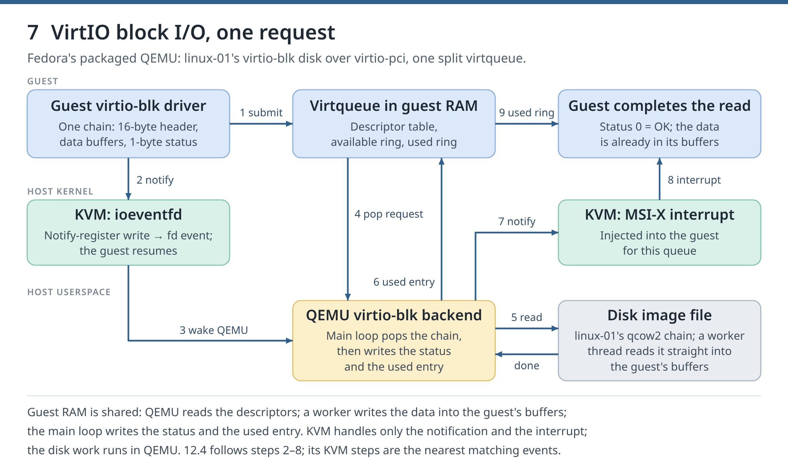
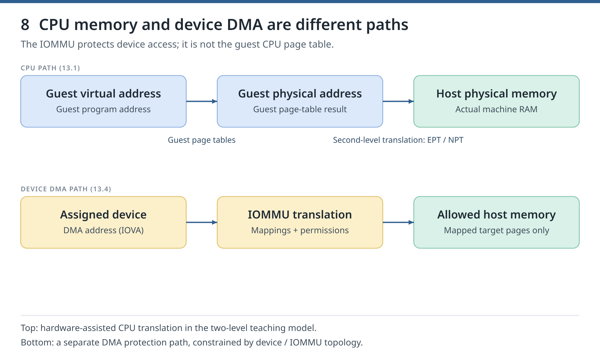

# /dev/kvm: from your first VM to virtualization engineering

## Who this guide is for

You can already use a Linux shell, SSH and a package manager. This course teaches Linux KVM, QEMU, libvirt and virsh on Fedora 44. You start with your first VM, then learn to operate, recover and automate guests, and finally look underneath: the KVM API, QEMU's devices and the CPU's virtualization support. Every lab gives the commands and the output to expect; a few ask you to predict a result or write a check first.

**Start now:** do chapter 0, run Appendix A's host preflight, then create linux-01 in chapter 1. Read the references each step names; the library at the end is optional.

### Four names, four jobs

| Component | Its job |
|---|---|
| **virsh** | The command-line client used to inspect and control libvirt-managed VMs |
| **libvirt** | The API, drivers and services that manage VM definitions, networks and storage |
| **QEMU** | The userspace VM process: machine model, devices and selected CPU accelerator |
| **Linux KVM** | The kernel interface QEMU uses for hardware-assisted guest CPU execution |

A **domain** is libvirt's name for a VM. The **host** runs it; the **guest** is the operating system inside it. A **VMM** (virtual machine monitor) is the program that runs a VM, such as QEMU or the tiny one you write in chapter 11. The course always uses KVM, never TCG, QEMU's slower software emulation. The saved VM definition (**persistent XML**), the running process and the disk data are different things: deleting one does not delete the others.



*Figure 1. Follow a management request downward, then distinguish the CPU path from the I/O path. Revisit this diagram whenever a failure appears to belong to “the hypervisor.”*

## Start here: prepare once

### Setup 1. Use one reference environment

Use **Fedora 44 Workstation or Server on x86-64** with Intel VT-x or AMD-V, SELinux enforcing, firewalld and NetworkManager. Guests use **Fedora 44 Cloud Base Generic**, login `fedora`. The host may be your daily machine: the labs never disable SELinux or firewalld, reload KVM modules, reboot the host or upgrade its operating system. Fedora is not a long-term-support release; check its [lifecycle](https://docs.fedoraproject.org/en-US/releases/lifecycle/) before long-lived use.

Course VMs use the system connection `qemu:///system` ([libvirt QEMU driver](https://libvirt.org/drvqemu.html)); chapter 2 compares it with the per-user connection.

The reference workstation runs kernel 7.2.7-200.fc44, QEMU 10.2.2, libvirt 12.0.0 with modular daemons, virt-install 5.1.0 and Fedora Cloud image build 44-1.7. The osinfo database has no `fedora44` entry yet, so the course uses `--osinfo fedora43`, the nearest one.

Keep a short inventory of your lab: host versions; each VM's machine type, CPU model, RAM and firmware; image checksums; guest addresses; backing chains; backup locations; and tested recovery steps.

### Setup 2. Arrange hardware

Start with about 32 GiB of RAM and 100 GiB of free disk space. Before a chapter adds guests, check with `free -h` that they fit. A thin virtual disk can eventually use its full advertised size.

| Chapters | Arrange before starting | What you can prove |
|---|---|---|
| 0–7 | One x86-64 host with nested virtualization (chapter 0.2) and local console access | KVM execution, networking, storage, images, confinement, backup and restore |
| 8 | Room for two nested hosts and an NFS guest, up to 12 GiB of guests | Migration and host-drain mechanics, labelled nested |
| 9–14 | Nothing more (chapters 11–13 install `gcc`, `bpftrace`, `perf`); 12.4 and parts of 13 are not validated on AMD | Incident response, API automation, the KVM API, QEMU's I/O path, the MMU and a smoke check; chapter 13 never assigns a device |

A **nested host** is a Fedora guest that runs its own KVM guests. It shares the workstation's CPU, power and disks, so it cannot prove recovery from the loss of a physical host. Label such results **nested**.

Never use the host's boot disk, its only management network interface or its only display device as a fault target.

### Setup 3. Reuse the lab and keep notes

Start with linux-01 in chapter 1 and keep it between chapters. Later chapters add guests such as linux-02 (chapter 5) and disposable nested hosts. Chapter 1.7 turns your commands into helper scripts; later starting points reuse a guest or rebuild it.

Everything the course writes in your home directory lives under `~/kvm-course`, including a dedicated SSH key and known_hosts file. VM disks live in the libvirt storage pool `kvm-course`. Course networks and extra pools have names starting with `kc-`. Reserve these names and paths for the course.

Keep notes outside `~/kvm-course`, which Appendix B deletes: per chapter, the commands, expected and observed results, and recovery notes. Mark each outcome **not started**, **in progress**, **passed** or **outstanding: reason**. An exit status of zero alone does not prove a milestone.

Each chapter's Clean up removes its temporary changes and says what to keep. **Appendix B removes the entire course**, including disks and the packages it installed; save what you want first.

### Setup 4. Work one checkpoint at a time

1. Read the goal and the concept explanation.
2. Type the commands for the smallest example.
3. Compare the output with the expected output before adding complexity.
4. Change or break one thing, test one diagnosis, and restore the working state.
5. Save useful commands and observations, then continue.

Run the blocks in **bash**, Fedora's default shell (type `bash` first if your terminal runs zsh or fish), and run a chapter's blocks in order in one terminal: some reuse variables that an earlier block set. Commands run on the host unless sent into a guest. Management commands use `sudo virsh -c qemu:///system COMMAND`. Blocks that must stop at their first failure start with `( set -euo pipefail` or are saved as scripts with that line, so the failure stops them without closing your terminal. To see where a script fails silently, run it with `bash -x SCRIPT`. Placeholders are in CAPITALS and introduced before use; most addresses and UUIDs are derived from the running lab.

If a check fails, compare versions, permissions and logs before changing one thing. Never weaken host protections to force a pass, or change an unrelated VM, pool or network to match a lab.

### Setup 5. Set your own pace

Use chapters 0–2 to estimate your pace. Skip a refresher once you can pass its check, but never skip the result a chapter asks you to demonstrate.

## Milestones and assessment

| Part | Chapters | Milestone |
|---|---|---|
| I — Become comfortable with the stack | 0–5 | Checkpoint C1 (Appendix A): a verified KVM-accelerated first VM; after 4, explain and repair its network and storage; after 5, reproduce distinct guest identities |
| II — Operate and recover VMs | 6–9 | Demonstrate recovery access, a verified restore, a migration and an incident record |
| III — Automate with the libvirt API | 10 | A tested automation script that uses the libvirt API |
| IV — Understand the virtualization machinery | 11–13 | Run a tiny VMM, trace an I/O request through QEMU and VirtIO, and explain the hardware and MMU path |
| V — Integrate and keep learning | 14 | A layer-by-layer smoke check, a diagnosed fault and a plan for further learning |

For an unknown-fault assessment, another person injects a fault without telling you which. Solo practice uses reversible faults with separate answer notes: shuffle them, wait until the solutions are no longer fresh, diagnose, then check the answer. Label that **self-assessed**. Following a printed fix is rehearsal, not assessment.

## Use the right reference

Project documentation explains APIs; your installed Fedora packages decide which commands and options exist, so prefer the installed manual pages (`man virsh`, `man qemu-img`). QEMU's "master" documentation describes the next release. Recipes for Ubuntu or Arch use other package names, services and security policies; RHEL is closest to Fedora but ships older versions. Old books and videos explain concepts well; check their commands against your versions.


## Part I — Become comfortable with the stack

### 0. Linux prerequisites and a safe lab

**Goal.** Check that your Fedora host can run KVM guests, install the virtualization tools, and learn where libvirt reports problems. This chapter creates no VM.

The course runs on Fedora 44 (x86-64), likely your everyday machine, so it never touches what keeps it working: SELinux stays enforcing, firewalld keeps running, and your **management connection** (the interface carrying your default route, and any remote SSH session) is never changed. Know how to reach the host if its network fails (its own keyboard and screen), and keep a backup on another disk. Reading: the [libvirt QEMU driver](https://libvirt.org/drvqemu.html) and `virt-host-validate(1)`.

#### 0.1 Inspect the host

**Goal.** Know the boot disk, management route, free memory and disk space before giving any to a VM.

**Commands.** `LC_ALL=C` makes programs print untranslated messages, so your output matches the examples. `/var` holds libvirt's disk images:

```bash
export LC_ALL=C
uname -r
lscpu | grep -E '^(Architecture|CPU\(s\)|Model name|Virtualization):'
free -h
lsblk -f
findmnt /
df -h /var
ip -brief address
ip route
```

**Expected output.** On the validation host (excerpt); kernel, CPU, sizes and interfaces differ on yours:

```text
7.2.7-200.fc44.x86_64
Architecture:                            x86_64
CPU(s):                                  20
Model name:                              12th Gen Intel(R) Core(TM) i9-12900HK
Virtualization:                          VT-x
```

**Check.** Name your root disk (`findmnt /`) and management interface (`default via … dev NAME` in `ip route`). The first guest needs 2 GiB of RAM and up to 20 GiB of disk; `available` in `free -h` must cover that plus your own work.

**If it fails.** These commands only read; on a minimal install they come from `util-linux`, `util-linux-core`, `procps-ng`, `iproute` and `coreutils`.

**Clean up.** Nothing to undo.

#### 0.2 Check virtualization

**Goal.** Tell apart three things: CPU support, the loaded KVM driver and access to its device.

**Commands.** Intel CPUs show the flag `vmx`, AMD CPUs `svm`. `/dev/kvm` exists when the `kvm_intel` or `kvm_amd` module is loaded. Running VMs inside a VM is **nested** virtualization; `nested` says whether your guests may run KVM themselves (chapters 6 and 8 need it):

```bash
grep -o -m1 -Ew 'vmx|svm' /proc/cpuinfo
ls -l /dev/kvm
if [ -r /sys/module/kvm_intel/parameters/nested ]; then
  cat /sys/module/kvm_intel/parameters/nested
elif [ -r /sys/module/kvm_amd/parameters/nested ]; then
  cat /sys/module/kvm_amd/parameters/nested
fi
```

**Expected output.** This Intel host printed the following (the date varies; AMD shows `svm` and `1`):

```text
vmx
crw-rw-rw-. 1 root kvm 10, 232 Oct  1 23:18 /dev/kvm
Y
```

**Check.** The flag is present and `/dev/kvm` is `crw-rw-rw-`; nesting can wait until chapter 6. A flag does not prove that a guest runs under KVM; chapter 1 does.

**If it fails.** No `vmx` or `svm`: virtualization is off in the firmware setup, or an outer hypervisor hides it. No `/dev/kvm`: `lsmod | grep kvm` shows whether the module is loaded, and `sudo journalctl -k | grep -i kvm` usually names the cause. Never reload a KVM module while VMs run.

**Clean up.** Nothing to undo.

#### 0.3 Install the stack

**Goal.** Install the missing packages, record what you installed, and start libvirt.

**Commands.** Everything the course writes in your home directory goes under `~/kvm-course`. Its file `.created-by-course` shows that the course created it, so Appendix B never deletes a `~/kvm-course` of yours; one without that file is refused. The course also reserves the libvirt storage pool `kvm-course` and network and pool names starting with `kc-`.

```bash
if [ -e ~/kvm-course ] && [ ! -f ~/kvm-course/.created-by-course ]; then
  echo 'STOP: ~/kvm-course was not created by this course' >&2; false
else
  mkdir -p ~/kvm-course/bin
  touch ~/kvm-course/.created-by-course
fi
```

In the list, `virt-install` creates VMs, `cloud-localds` (with `genisoimage`) builds chapter 1's seed, `guestfs-tools` edits images (chapter 5), `edk2-ovmf` is UEFI firmware (chapter 2), and `gpgv` (`gnupg2-verify`) checks chapter 1's signed checksums. Preview: `--assumeno` prints dnf's plan and answers "no"; dnf then reports an error, so `||` prints a reminder:

```bash
PKGS="qemu-kvm qemu-img libvirt-daemon-kvm libvirt-daemon-config-network libvirt-client virt-install
  cloud-utils-cloud-localds genisoimage guestfs-tools edk2-ovmf gnupg2-verify"
sudo dnf install --assumeno $PKGS || echo 'Preview only: nothing was installed'
```

Continue if dnf prints `Nothing to do.` or a plan with no `Upgrading:`, `Downgrading:`, `Removing:` or `Replacing:` section; otherwise update your system first (not exercised here).

The parentheses run the commands between them in a subshell, where `set -euo pipefail` stops at the first failed command without closing your terminal; later chapters use this without comment. `rpm -q` succeeds only if every package is installed; otherwise dnf installs them and the transaction's ID goes to `~/kvm-course/dnf-transactions.txt`, so Appendix B can undo exactly that:

```bash
(
set -euo pipefail
if rpm -q $PKGS >/dev/null; then
  echo 'All packages are already installed'
else
  sudo dnf install -y $PKGS
  dnf history list | awk 'NR==2 {print $1}' >> ~/kvm-course/dnf-transactions.txt
fi
)
rpm -q virt-install cloud-utils-cloud-localds
virsh --version
qemu-system-x86_64 --version
sudo virt-host-validate qemu
```

In `virt-host-validate` the KVM checks must pass; IOMMU matters only for device assignment, and a secure-guest WARN (no SEV or TDX memory encryption) is fine for ordinary VMs.

Fedora runs libvirt as separate daemons: `virtqemud` for VMs, `virtnetworkd` for networks, `virtstoraged` for storage. A systemd **socket** starts each daemon when a client connects. `qemu:///system` is the address (URI) of the host-wide instance run by root, used throughout the course; `qemu:///session` is a separate per-user instance (chapter 2). Start the sockets and list the system instance's VMs:

```bash
sudo systemctl start virtqemud.socket virtnetworkd.socket virtstoraged.socket
systemctl is-active virtqemud.socket
systemctl is-active virtnetworkd.socket
systemctl is-active virtstoraged.socket
sudo virsh -c qemu:///system list --all
```

**Expected output.** On the validation host (excerpt; package releases may differ):

```text
virt-install-5.1.0-4.fc44.noarch
cloud-utils-cloud-localds-0.33-13.fc44.noarch
12.0.0
QEMU emulator version 10.2.2 (qemu-10.2.2-1.fc44)
  QEMU: Checking for hardware virtualization                                 : PASS
  QEMU: Checking for secure guest support                                    : WARN (None of SEV, SEV-ES, SEV-SNP, TDX available)
active
```

**Check.** The packages are installed (with the transaction ID recorded if dnf installed any), the three sockets are `active`, and `virsh list` answers (it may list VMs you already had).

**If it fails.** A socket that is not active: `systemctl status virtqemud.socket` and `sudo journalctl -u virtqemud` (0.5). Do not add yourself to the `libvirt` group to avoid `sudo`: controlling system VMs is as powerful as root.

**Clean up.** Keep everything for chapter 1. Appendix B undoes the recorded installation.

**Not validated here:** a first installation on a fresh host. This workstation already had libvirt, its sockets and the default network.

#### 0.4 Look at the default network

**Goal.** Read the existing NAT network that guests will join, without changing it.

**Commands.** libvirt's `default` network is a private virtual switch: a Linux **bridge**, `virbr0`, where dnsmasq hands out addresses (DHCP) and answers DNS. **NAT** (network address translation) lets guests reach out through your uplink while your LAN cannot reach them:

```bash
sudo virsh -c qemu:///system net-list --all
sudo virsh -c qemu:///system net-info default
sudo virsh -c qemu:///system net-dumpxml default
ip -brief address show virbr0
```

**Expected output.** On the validation host (excerpt; addresses may differ). Here `virbr0` was `DOWN` because no running guest was attached:

```text
Active:         yes
  <forward mode='nat'>
  <bridge name='virbr0' stp='on' delay='0'/>
  <ip address='192.168.122.1' netmask='255.255.255.0'>
      <range start='192.168.122.2' end='192.168.122.254'/>
virbr0           DOWN           192.168.122.1/24
```

**Check.** `default` is active, uses `nat` and has a DHCP range.

**If it fails.** No `default` network: install `libvirt-daemon-config-network` (0.3). An inactive one can be started with `sudo virsh -c qemu:///system net-start default` (not validated here: this host's network was already active). Never move your management interface onto a bridge to fix a guest.

**Clean up.** Leave the network as it is.

#### 0.5 Find the logs

**Goal.** Know where to look when a VM fails.

**Commands.** `systemctl status` shows a unit's state, `journalctl -u` its journal; libvirt writes each VM's QEMU messages to `/var/log/libvirt/qemu/NAME.log` (root only):

```bash
systemctl status virtqemud.socket --no-pager
sudo journalctl -u virtqemud --no-pager -n 5
sudo ls -l /var/log/libvirt/qemu/
```

**Expected output.** On the validation host (excerpt; times differ). The socket shows `active (listening)` while the daemon is idle, `active (running)` while it runs:

```text
* virtqemud.socket - libvirt QEMU daemon socket
     Active: active (running) since Wed 2026-09-30 09:37:10 PDT; 1 day 13h ago
   Triggers: * virtqemud.service
```

**Check.** You can read the socket's state, the daemon's journal and the VM log directory.

**If it fails.** An empty log directory is normal before your first VM.

**Clean up.** Nothing to undo.

#### Clean up

Keep the packages and `~/kvm-course`; next run Appendix A.1, then chapter 1. This chapter changed nothing else on the host except starting libvirt's sockets. To remove the whole course, run Appendix B.2.

### 1. The mental model and the first Linux VM

**Goal.** Boot your first VM, `linux-01`, from a verified Fedora image, prove each layer on its own and save the steps as scripts.

Four layers share the work (Figure 1). **KVM**, the kernel module behind `/dev/kvm`, runs guest instructions directly on the CPU. **QEMU** emulates the VM's hardware (disks, network card), loads its firmware and asks KVM to run its CPUs; each running VM is one `qemu-system-x86_64` process. **libvirt** (`virtqemud`, chapter 0.3) stores VM definitions and runs QEMU. **virsh** sends your requests to libvirt.

Reading: [Fedora image verification](https://fedoraproject.org/security/), [cloud-init NoCloud](https://docs.cloud-init.io/en/latest/reference/datasources/nocloud.html), [libvirt domain XML](https://libvirt.org/formatdomain.html).

#### 1.1 Verify the image

**Goal.** Prove that the image is the file Fedora published before QEMU ever opens it.

**Commands.** Download one exact build (44-1.7) of the image and its checksum list, so the image and the list always match:

```bash
mkdir -p ~/kvm-course/downloads
cd ~/kvm-course/downloads
REL=https://download.fedoraproject.org/pub/fedora/linux/releases/44/Cloud/x86_64/images
curl -fL --retry 3 --progress-bar -O "$REL/Fedora-Cloud-Base-Generic-44-1.7.x86_64.qcow2"
curl -fsSL --retry 3 -O "$REL/Fedora-Cloud-44-1.7-x86_64-CHECKSUM"
```

Fedora signs the checksum list with its release key (package `fedora-gpg-keys`). `GNUPGHOME` keeps GnuPG away from your own keyring. Compare the key's fingerprint, character by character, with the [Fedora security page](https://fedoraproject.org/security/). `gpgv` checks the signature with only that key and writes the signed text to `CHECKSUM.verified`, against which `sha256sum` checks the image:

```bash
export GNUPGHOME=~/kvm-course/gnupg
mkdir -p -m 0700 "$GNUPGHOME"
gpg --show-keys --with-fingerprint /etc/pki/rpm-gpg/RPM-GPG-KEY-fedora-44-primary
cd ~/kvm-course/downloads
gpg --dearmor < /etc/pki/rpm-gpg/RPM-GPG-KEY-fedora-44-primary > fedora-44.gpg
if gpgv --keyring ./fedora-44.gpg --output CHECKSUM.verified Fedora-Cloud-44-1.7-x86_64-CHECKSUM; then
  sha256sum -c --ignore-missing CHECKSUM.verified
else
  echo 'STOP: the checksum file is not signed by the Fedora 44 key' >&2; false
fi
```

**Expected output.** On the validation host (excerpt); your fingerprint must be identical:

```text
pub   rsa4096 2025-01-14 [SCE]
      36F6 12DC F27F 7D1A 48A8  35E4 DBFC F71C 6D9F 90A6
uid                      Fedora (44) <fedora-44-primary@fedoraproject.org>
gpgv: Good signature from "Fedora (44) <fedora-44-primary@fedoraproject.org>"
Fedora-Cloud-Base-Generic-44-1.7.x86_64.qcow2: OK
```

**Check.** The fingerprint matches the security page, `gpgv` prints `Good signature`, and `sha256sum` prints `OK`.

**If it fails.** No good signature: download the checksum file again. `FAILED`: delete and download the image again. Never continue past either error.

**Clean up.** Keep the downloads; 1.3 copies the image.

#### 1.2 Create the seed

**Goal.** Prepare the guest's hostname and the key you will log in with.

**Commands.** Fedora Cloud images run **cloud-init** at first boot. Its **NoCloud** method reads settings from a small disk image, the **seed**: `user-data` says what to configure, and `meta-data` holds an instance ID (a new ID means a new machine).

Make a course SSH key without a passphrase (`-N ''`, so scripts can use it) and a course SSH configuration:

```bash
mkdir -p -m 0700 ~/kvm-course/ssh
[ -e ~/kvm-course/ssh/id_ed25519 ] || ssh-keygen -q -t ed25519 -N '' -f ~/kvm-course/ssh/id_ed25519
cat > ~/kvm-course/ssh/config <<'EOF'
Host *
    User fedora
    IdentityFile ~/kvm-course/ssh/id_ed25519
    UserKnownHostsFile ~/kvm-course/ssh/known_hosts
    IdentitiesOnly yes
    IdentityAgent none
    StrictHostKeyChecking yes
    BatchMode yes
    ConnectTimeout 8
EOF
touch ~/kvm-course/ssh/known_hosts
```

With `-F ~/kvm-course/ssh/config`, ssh uses the course configuration, key and known_hosts file, not those in `~/.ssh`. It refuses unknown host keys (1.5 adds the guest's after checking it), never prompts for a password and allows eight seconds to set up the connection.

Write the seed. Here `<<EOF` has no quotes, so the shell fills in your public key. On Fedora 44, name the guest with `hostname`, `fqdn` and `prefer_fqdn_over_hostname: false` (meta-data's `local-hostname` left cloud-init "degraded"):

```bash
mkdir ~/kvm-course/linux-01
cat > ~/kvm-course/linux-01/user-data <<EOF
#cloud-config
hostname: linux-01
fqdn: linux-01.lab.internal
prefer_fqdn_over_hostname: false
ssh_pwauth: false
ssh_authorized_keys:
  - $(cat ~/kvm-course/ssh/id_ed25519.pub)
EOF
printf 'instance-id: linux-01-%s\n' "$(cat /proc/sys/kernel/random/uuid)" > ~/kvm-course/linux-01/meta-data
cloud-localds ~/kvm-course/linux-01/seed.iso ~/kvm-course/linux-01/user-data ~/kvm-course/linux-01/meta-data
cat ~/kvm-course/linux-01/user-data ~/kvm-course/linux-01/meta-data
```

**Expected output.** On the validation host the end was (your key and ID differ):

```text
  - ssh-ed25519 AAAAC3NzaC1lZDI1NTE5AAAA… daniel@fedora
instance-id: linux-01-c8eb0662-ac89-42e3-9121-35537c0eb9de
```

**Check.** The seed holds your public key, password login is off, and the instance ID is new.

**If it fails.** `cloud-localds: command not found`: chapter 0.3. YAML mistakes show up only inside the guest, in `/var/log/cloud-init.log`.

**Clean up.** Keep the key and the seed.

#### 1.3 Create the disk

**Goal.** Give linux-01 a 20-GiB disk that stores only its changes to the verified image.

**Commands.** A **storage pool** is storage that libvirt manages, here a directory. Define it yourself, or virt-install quietly creates and autostarts one. The block refuses an existing pool or directory; `.created-by-course` lets Appendix B delete this directory and nothing else; `pool-autostart` starts the pool at boot:

```bash
(
set -euo pipefail
P=/var/lib/libvirt/images/kvm-course
if sudo virsh -c qemu:///system pool-info kvm-course >/dev/null 2>&1; then
  echo 'STOP: pool kvm-course already exists' >&2; false
fi
sudo mkdir -m 0755 $P
sudo touch $P/.created-by-course
sudo virsh -c qemu:///system pool-define-as kvm-course dir --target $P
sudo virsh -c qemu:///system pool-start kvm-course
sudo virsh -c qemu:///system pool-autostart kvm-course
)
```

Copy the image into the pool as a read-only **base**, and the seed beside it. Then create an **overlay**, a qcow2 file that stores only the guest's writes and reads the rest from its **backing file**, the base. `-b` and `-F` name the backing file and its format (so QEMU never guesses); `-f` is the overlay's format. 20G is the virtual size; space is used as the guest writes. `pool-refresh` makes libvirt list the new files:

```bash
P=/var/lib/libvirt/images/kvm-course
sudo install -m 0444 ~/kvm-course/downloads/Fedora-Cloud-Base-Generic-44-1.7.x86_64.qcow2 $P/base.qcow2
sudo install -m 0644 ~/kvm-course/linux-01/seed.iso $P/linux-01-seed.iso
sudo qemu-img create -f qcow2 -F qcow2 -b $P/base.qcow2 $P/linux-01.qcow2 20G
sudo qemu-img info --backing-chain $P/linux-01.qcow2
sudo virsh -c qemu:///system pool-refresh kvm-course
```

**Expected output.** On the validation host (excerpt):

```text
image: /var/lib/libvirt/images/kvm-course/linux-01.qcow2
virtual size: 20 GiB (21474836480 bytes)
disk size: 196 KiB
backing file: /var/lib/libvirt/images/kvm-course/base.qcow2
backing file format: qcow2
```

**Check.** The chain is linux-01.qcow2 → base.qcow2, and the overlay is tiny on disk.

**If it fails.** `File exists` or `STOP`: if the directory holds `.created-by-course`, run Appendix B.2 and restart at chapter 0.3. Otherwise it is not the course's: do not use the course on this host.

**Clean up.** Keep the three files; deleting the base breaks every overlay on it.

#### 1.4 Review and launch

**Goal.** Read the VM definition before libvirt saves and starts it.

**Commands.** libvirt calls a VM a **domain** and describes it in XML. `virt-install --print-xml` builds that XML and only prints it:

- `--virt-type kvm`: use KVM. `--machine pc-q35-10.2`: a PC with the Q35 chipset, as QEMU 10.2 models it. `--cpu host-passthrough`: give the guest your CPU's features.
- `--import`: boot the existing disk. `--osinfo fedora43`: Fedora defaults (osinfo has no `fedora44` yet).
- `virtio`: devices designed for VMs. The seed is a CD-ROM; the network card joins the `default` NAT network (chapter 0.4).
- `--graphics none`: no screen, only the serial console; `log.file` copies it to a file for 1.5. `--boot hd`: boot from the disk, with the default BIOS firmware (chapter 2 tries UEFI).

```bash
P=/var/lib/libvirt/images/kvm-course
sudo virt-install --connect qemu:///system --virt-type kvm --name linux-01 \
  --memory 2048 --vcpus 2 --import --osinfo fedora43 \
  --machine pc-q35-10.2 --cpu host-passthrough \
  --disk path=$P/linux-01.qcow2,bus=virtio,format=qcow2 \
  --disk path=$P/linux-01-seed.iso,device=cdrom \
  --network network=default,model=virtio --graphics none \
  --serial pty,log.file=/var/log/libvirt/qemu/linux-01-console.log,log.append=on \
  --boot hd --print-xml > ~/kvm-course/linux-01/domain.xml
grep -E '<domain|<source |<model |<log ' ~/kvm-course/linux-01/domain.xml
```

Find the disk, the seed and the network in the excerpt. Refuse an existing name; then `define --validate` checks the XML and saves it as a persistent domain, and `start` launches its QEMU process:

```bash
(
set -euo pipefail
if sudo virsh -c qemu:///system dominfo linux-01 >/dev/null 2>&1; then
  echo 'STOP: linux-01 already exists; do not start or replace it' >&2; false
fi
sudo virsh -c qemu:///system define --validate ~/kvm-course/linux-01/domain.xml
sudo virsh -c qemu:///system start linux-01
)
```

**Expected output.** On the validation host (excerpt):

```text
<domain type="kvm">
      <source file="/var/lib/libvirt/images/kvm-course/linux-01.qcow2"/>
      <source network="default"/>
Domain 'linux-01' defined from /home/daniel/kvm-course/linux-01/domain.xml
Domain 'linux-01' started
```

**Check.** The domain was defined from the file you read and started.

**If it fails.** `already exists`: if it is your earlier course guest, run Appendix B.2 and restart at chapter 0.3; leave any other VM alone. Start errors are logged in `/var/log/libvirt/qemu/linux-01.log` (use `sudo`).

**Clean up.** Keep linux-01 running.

#### 1.5 Prove the boot

**Goal.** Prove four things one at a time: QEMU uses KVM, the guest booted, cloud-init finished, and you log in to the right machine.

**Commands.** `dominfo` and `domiflist` show the domain's state and network card. **QMP** is QEMU's control protocol; virsh passes the read-only request `query-kvm` to this VM's QEMU process:

```bash
sudo virsh -c qemu:///system dominfo linux-01
sudo virsh -c qemu:///system domiflist linux-01
sudo virsh -c qemu:///system qemu-monitor-command linux-01 '{"execute":"query-kvm"}'
```

Wait for a DHCP lease and save its address. `timeout` limits one command, so each wait loop runs inside `bash -c`. `awk` keeps the first IPv4 address without its `/24`:

```bash
timeout 180 bash -c 'until sudo virsh -c qemu:///system domifaddr linux-01 --source lease | grep ipv4 >/dev/null; do sleep 2; done'
sudo virsh -c qemu:///system domifaddr linux-01 --source lease |
  awk '$3=="ipv4" && !seen {sub(/\/.*/,"",$4);print $4;seen=1}' > ~/kvm-course/linux-01/ip
```

cloud-init prints the guest's SSH host-key fingerprints on the serial console, which libvirt copies to the log; wait for them:

```bash
timeout 240 bash -c 'until sudo grep -q "END SSH HOST KEY FINGERPRINTS" /var/log/libvirt/qemu/linux-01-console.log; do sleep 2; done'
```

Ask that address for its key until sshd answers; an address alone proves nothing:

```bash
IP=$(cat ~/kvm-course/linux-01/ip)
timeout 120 bash -c "until ssh-keyscan -t ed25519 $IP 2>/dev/null | grep ed25519 > ~/kvm-course/linux-01/scan; do sleep 2; done"
ssh-keygen -lf ~/kvm-course/linux-01/scan
```

Only if a fingerprint was read (`SHA256:…`) and it is in the console log, store the key under the name `linux-01` and add a `Host linux-01` entry. `HostKeyAlias` makes ssh look the key up by name, because the address may later belong to another VM:

```bash
FINGERPRINT=$(ssh-keygen -lf ~/kvm-course/linux-01/scan | awk '{print $2}')
if [[ $FINGERPRINT == SHA256:* ]] && sudo grep -F "$FINGERPRINT" /var/log/libvirt/qemu/linux-01-console.log; then
  awk '$2=="ssh-ed25519" {$1="linux-01"; print}' ~/kvm-course/linux-01/scan >> ~/kvm-course/ssh/known_hosts
  printf 'Host linux-01\n    HostName %s\n    HostKeyAlias linux-01\n\n' "$IP" >> ~/kvm-course/ssh/config
else
  echo 'STOP: the scanned key is not in the console log'; false
fi
```

Log in. `cloud-init status --wait` returns when cloud-init is done: exit status 0 means a clean run, 2 a degraded one. `set -e` stops the guest's shell at the first failing check:

```bash
timeout 240 ssh -F ~/kvm-course/ssh/config linux-01 'cloud-init status --wait'
ssh -F ~/kvm-course/ssh/config linux-01 'set -e; hostname; findmnt -no SOURCE,FSTYPE /; df -h /; for unit in qemu-guest-agent serial-getty@ttyS0; do systemctl is-active "$unit"; done'
```

**Expected output.** On the validation host (excerpt; addresses, sizes and fingerprints differ):

```text
{"return":{"enabled":true,"present":true},"id":"libvirt-15"}
<14>Oct  2 07:15:58 cloud-init: 256 SHA256:XPazzvehoG3rn5yreT2MYi4Osu3yHUQfQ07wX98+wbc root@linux-01 (ED25519)
status: done
linux-01
/dev/vda3[/root] btrfs
/dev/vda3        20G  670M   19G   4% /
active
```

**Check.** KVM is enabled and present; the fingerprints match; `status: done`; the hostname is right; the Btrfs root grew to almost 20 GiB; the guest agent and serial login run. This is checkpoint C1 (Appendix A).

**If it fails.** No lease: check `domiflist` and the `default` network (0.4). No fingerprints: read the console log for boot errors. Fingerprint not in the log: stop. Exit status 2: read `/var/log/cloud-init.log` in the guest.

**Clean up.** Keep linux-01 running.

#### 1.6 Run QEMU without libvirt

**Goal.** See that QEMU and KVM alone boot a guest; libvirt only manages them.

**Commands.** Use a new overlay, so this test never touches linux-01's disk. The **monitor** is QEMU's own text console; `-monitor stdio` connects it to your terminal, where `printf` types `info kvm` and `quit` after 45 seconds. `-nic none` means no network. Without KVM, `-accel kvm` refuses to start.

```bash
qemu-img create -f qcow2 -F qcow2 -b /var/lib/libvirt/images/kvm-course/base.qcow2 ~/kvm-course/raw.qcow2
(sleep 45; printf 'info kvm\nquit\n') | timeout 90 qemu-system-x86_64 -accel kvm -machine q35 -cpu host -m 1024 \
  -drive file=$HOME/kvm-course/raw.qcow2,format=qcow2,if=virtio -nic none \
  -display none -serial file:$HOME/kvm-course/raw-console.log -monitor stdio
grep -F 'Linux version' ~/kvm-course/raw-console.log
```

**Expected output.** On the validation host (excerpt):

```text
kvm support: enabled
[    0.000000] Linux version 6.19.10-300.fc44.x86_64 …
```

**Check.** The monitor reports `kvm support: enabled`, and the guest kernel printed its version. You have seen every layer: virsh asked libvirt (1.4), libvirt started QEMU, QEMU used `/dev/kvm` (1.5), and here QEMU and KVM ran a guest without libvirt.

**If it fails.** `Could not access KVM kernel module`: check `/dev/kvm` (chapter 0.2). No `Linux version`: read QEMU's message and `~/kvm-course/raw-console.log`; if the boot was only slow, raise the 45 seconds (below the 90-second timeout).

**Clean up.** After checking, delete the overlay and the log:

```bash
rm -f ~/kvm-course/raw.qcow2 ~/kvm-course/raw-console.log
```

#### 1.7 Save the steps as scripts

**Goal.** Save 1.1–1.5 as scripts that build or rebuild a guest with one command.

**Commands.** Each script repeats what you typed, for any guest name, and stops at its first error (`set -euo pipefail`). Scripts that compare command output set `LC_ALL=C`, so its words stay English. First repeat 0.3's check, so this also works after Appendix B removed the course:

```bash
if [ -e ~/kvm-course ] && [ ! -f ~/kvm-course/.created-by-course ]; then
  echo 'STOP: ~/kvm-course was not created by this course' >&2; false
else
  mkdir -p ~/kvm-course/bin
  touch ~/kvm-course/.created-by-course
fi
```

`init.sh` repeats 0.3 and 1.1. Like 0.3, it installs only if dnf's preview upgrades or removes nothing:

```bash
cat > ~/kvm-course/bin/init.sh <<'EOF'
#!/usr/bin/env bash
set -euo pipefail
export LC_ALL=C
packages="qemu-kvm qemu-img libvirt-daemon-kvm libvirt-daemon-config-network libvirt-client virt-install
  cloud-utils-cloud-localds genisoimage guestfs-tools edk2-ovmf gnupg2-verify"
if ! rpm -q $packages >/dev/null; then
  plan=$(sudo dnf install --assumeno $packages 2>&1 || true)
  if grep -E '^ *(Upgrading|Downgrading|Removing|Replacing)' <<< "$plan"; then
    echo 'STOP: dnf would change installed packages; update your system first (chapter 0.3)' >&2; exit 1
  fi
  sudo dnf install -y $packages
  dnf history list | awk 'NR==2 {print $1}' >> ~/kvm-course/dnf-transactions.txt
fi
sudo systemctl start virtqemud.socket virtnetworkd.socket virtstoraged.socket
mkdir -p ~/kvm-course/downloads
cd ~/kvm-course/downloads
REL=https://download.fedoraproject.org/pub/fedora/linux/releases/44/Cloud/x86_64/images
[ -f Fedora-Cloud-Base-Generic-44-1.7.x86_64.qcow2 ] || curl -fL --retry 3 --progress-bar -O "$REL/Fedora-Cloud-Base-Generic-44-1.7.x86_64.qcow2"
[ -f Fedora-Cloud-44-1.7-x86_64-CHECKSUM ] || curl -fsSL --retry 3 -O "$REL/Fedora-Cloud-44-1.7-x86_64-CHECKSUM"
export GNUPGHOME=~/kvm-course/gnupg
mkdir -p -m 0700 "$GNUPGHOME"
gpg --dearmor < /etc/pki/rpm-gpg/RPM-GPG-KEY-fedora-44-primary > fedora-44.gpg
gpgv --keyring ./fedora-44.gpg --output CHECKSUM.verified Fedora-Cloud-44-1.7-x86_64-CHECKSUM
sha256sum -c --ignore-missing CHECKSUM.verified
EOF
```

`seed.sh NAME` repeats 1.2: the SSH key and configuration if missing, then the seed. It and `remove-guest.sh` accept only simple lowercase names and refuse those of shared course files (`base`, `bin`, `chNN`, `downloads`, `gnupg`, `ssh`):

```bash
cat > ~/kvm-course/bin/seed.sh <<'EOF'
#!/usr/bin/env bash
set -euo pipefail
name=${1:?usage: seed.sh NAME}
[[ $name =~ ^[a-z][a-z0-9-]*$ ]] || { echo "STOP: $name is not a simple lowercase name" >&2; exit 1; }
case $name in base|bin|ch[0-9][0-9]|downloads|gnupg|ssh)
  echo "STOP: $name is reserved for course files" >&2; exit 1 ;; esac
mkdir -p -m 0700 ~/kvm-course/ssh
[ -e ~/kvm-course/ssh/id_ed25519 ] || ssh-keygen -q -t ed25519 -N '' -f ~/kvm-course/ssh/id_ed25519
[ -e ~/kvm-course/ssh/config ] || cat > ~/kvm-course/ssh/config <<'CONFIG'
Host *
    User fedora
    IdentityFile ~/kvm-course/ssh/id_ed25519
    UserKnownHostsFile ~/kvm-course/ssh/known_hosts
    IdentitiesOnly yes
    IdentityAgent none
    StrictHostKeyChecking yes
    BatchMode yes
    ConnectTimeout 8
CONFIG
touch ~/kvm-course/ssh/known_hosts
mkdir ~/kvm-course/$name
cd ~/kvm-course/$name
cat > user-data <<USERDATA
#cloud-config
hostname: $name
fqdn: $name.lab.internal
prefer_fqdn_over_hostname: false
ssh_pwauth: false
ssh_authorized_keys:
  - $(cat ~/kvm-course/ssh/id_ed25519.pub)
USERDATA
printf 'instance-id: %s-%s\n' "$name" "$(cat /proc/sys/kernel/random/uuid)" > meta-data
cloud-localds seed.iso user-data meta-data
EOF
```

`disk.sh NAME` repeats 1.3: the pool and base if missing, then the overlay. It refuses a `kvm-course` pool that is not the course's, and an existing disk:

```bash
cat > ~/kvm-course/bin/disk.sh <<'EOF'
#!/usr/bin/env bash
set -euo pipefail
name=${1:?usage: disk.sh NAME}
P=/var/lib/libvirt/images/kvm-course
if sudo virsh -c qemu:///system pool-info kvm-course >/dev/null 2>&1; then
  if ! sudo test -f $P/.created-by-course || ! sudo virsh -c qemu:///system pool-dumpxml kvm-course | grep -F "<path>$P</path>" >/dev/null; then
    echo "STOP: pool kvm-course is not the course pool (see 1.3)" >&2; exit 1
  fi
else
  sudo mkdir -m 0755 $P
  sudo touch $P/.created-by-course
  sudo virsh -c qemu:///system pool-define-as kvm-course dir --target $P
  sudo virsh -c qemu:///system pool-start kvm-course
  sudo virsh -c qemu:///system pool-autostart kvm-course
fi
sudo test -e $P/base.qcow2 ||
  sudo install -m 0444 ~/kvm-course/downloads/Fedora-Cloud-Base-Generic-44-1.7.x86_64.qcow2 $P/base.qcow2
if sudo test -e $P/$name.qcow2; then echo "STOP: $P/$name.qcow2 already exists" >&2; exit 1; fi
sudo install -m 0644 ~/kvm-course/$name/seed.iso $P/$name-seed.iso
sudo qemu-img create -f qcow2 -F qcow2 -b $P/base.qcow2 $P/$name.qcow2 20G
sudo virsh -c qemu:///system pool-refresh kvm-course
EOF
```

`launch.sh NAME` repeats 1.4. `MEMORY_MIB` (default 2048), `VCPUS` (2) and `FIRMWARE=uefi` change the defaults:

```bash
cat > ~/kvm-course/bin/launch.sh <<'EOF'
#!/usr/bin/env bash
set -euo pipefail
name=${1:?usage: launch.sh NAME}
P=/var/lib/libvirt/images/kvm-course
log=/var/log/libvirt/qemu/$name-console.log
if sudo test -e $log; then echo "STOP: old console log $log (remove-guest.sh deletes it)" >&2; exit 1; fi
if [ "${FIRMWARE:-bios}" = uefi ]; then boot=uefi; else boot=hd; fi
sudo virt-install --connect qemu:///system --virt-type kvm --name $name \
  --memory ${MEMORY_MIB:-2048} --vcpus ${VCPUS:-2} --import --osinfo fedora43 \
  --machine pc-q35-10.2 --cpu host-passthrough \
  --disk path=$P/$name.qcow2,bus=virtio,format=qcow2 \
  --disk path=$P/$name-seed.iso,device=cdrom \
  --network network=default,model=virtio --graphics none \
  --serial pty,log.file=$log,log.append=on \
  --boot $boot --print-xml > ~/kvm-course/$name/domain.xml
sudo virsh -c qemu:///system define --validate ~/kvm-course/$name/domain.xml
sudo virsh -c qemu:///system start $name
EOF
```

`trust.sh NAME` repeats 1.5, replacing older SSH entries for NAME; `ssh -n` keeps ssh from reading its caller's input:

```bash
cat > ~/kvm-course/bin/trust.sh <<'EOF'
#!/usr/bin/env bash
set -euo pipefail
name=${1:?usage: trust.sh NAME}
D=~/kvm-course
log=/var/log/libvirt/qemu/$name-console.log
timeout 180 bash -c "until sudo virsh -c qemu:///system domifaddr $name --source lease | grep ipv4 >/dev/null; do sleep 2; done"
sudo virsh -c qemu:///system domifaddr $name --source lease |
  awk '$3=="ipv4" && !seen {sub(/\/.*/,"",$4);print $4;seen=1}' > $D/$name/ip
ip=$(cat $D/$name/ip)
timeout 240 bash -c "until sudo grep -q 'END SSH HOST KEY FINGERPRINTS' $log; do sleep 2; done"
timeout 120 bash -c "until ssh-keyscan -t ed25519 $ip 2>/dev/null | grep ed25519 > $D/$name/scan; do sleep 2; done"
fingerprint=$(ssh-keygen -lf $D/$name/scan | awk '{print $2}')
if ! sudo grep -F "$fingerprint" $log; then
  echo "STOP: the key at $ip is not in the console log of $name" >&2; exit 1
fi
ssh-keygen -R $name -f $D/ssh/known_hosts >/dev/null 2>&1 || true
awk -v n=$name '$2=="ssh-ed25519" {$1=n; print}' $D/$name/scan >> $D/ssh/known_hosts
sed -i "/^Host $name\$/,/^\$/d" $D/ssh/config
printf 'Host %s\n    HostName %s\n    HostKeyAlias %s\n\n' $name $ip $name >> $D/ssh/config
timeout 240 ssh -n -F $D/ssh/config $name 'cloud-init status --wait'
ssh -n -F $D/ssh/config $name hostname
EOF
```

`new-guest.sh NAME` runs them in order. An existing course guest is only started if needed and checked again; a domain with no disk in the course pool is refused:

```bash
cat > ~/kvm-course/bin/new-guest.sh <<'EOF'
#!/usr/bin/env bash
set -euo pipefail
name=${1:?usage: new-guest.sh NAME}
export LC_ALL=C
B=~/kvm-course/bin
if sudo virsh -c qemu:///system dominfo $name >/dev/null 2>&1; then
  if ! sudo virsh -c qemu:///system domblklist $name | grep -F ' /var/lib/libvirt/images/kvm-course/' >/dev/null; then
    echo "STOP: $name exists and is not a course guest" >&2; exit 1
  fi
  if [ "$(sudo virsh -c qemu:///system domstate $name)" = "shut off" ]; then
    sudo virsh -c qemu:///system start $name
  fi
else
  bash $B/init.sh
  bash $B/seed.sh $name
  bash $B/disk.sh $name
  bash $B/launch.sh $name
fi
bash $B/trust.sh $name
EOF
```

`stop-guest.sh NAME` shuts a guest down and waits up to two minutes:

```bash
cat > ~/kvm-course/bin/stop-guest.sh <<'EOF'
#!/usr/bin/env bash
set -euo pipefail
name=${1:?usage: stop-guest.sh NAME}
export LC_ALL=C
if [ "$(sudo virsh -c qemu:///system domstate $name)" != "shut off" ]; then
  sudo virsh -c qemu:///system shutdown $name
fi
timeout 120 bash -c "until sudo virsh -c qemu:///system domstate $name | grep -x 'shut off' >/dev/null; do sleep 1; done" ||
  { echo "STOP: $name is still running after 120 seconds" >&2; exit 1; }
EOF
```

`remove-guest.sh NAME` deletes a course guest with its UEFI variables, TPM state, saved-state and snapshot records, disk, seed, logs, files and `Host` entry; missing parts are skipped. It checks the name first, like `seed.sh`:

```bash
cat > ~/kvm-course/bin/remove-guest.sh <<'EOF'
#!/usr/bin/env bash
set -euo pipefail
name=${1:?usage: remove-guest.sh NAME}
[[ $name =~ ^[a-z][a-z0-9-]*$ ]] || { echo "STOP: $name is not a simple lowercase name" >&2; exit 1; }
case $name in base|bin|ch[0-9][0-9]|downloads|gnupg|ssh)
  echo "STOP: $name is reserved for course files" >&2; exit 1 ;; esac
export LC_ALL=C
P=/var/lib/libvirt/images/kvm-course
if sudo virsh -c qemu:///system dominfo $name >/dev/null 2>&1; then
  if ! sudo virsh -c qemu:///system domblklist $name | grep -F " $P/" >/dev/null; then
    echo "STOP: $name has no disk in $P, so it is not a course guest" >&2; exit 1
  fi
  if [ "$(sudo virsh -c qemu:///system domstate $name)" != "shut off" ]; then
    sudo virsh -c qemu:///system destroy $name
  fi
  sudo virsh -c qemu:///system undefine $name --nvram --tpm --managed-save --snapshots-metadata --checkpoints-metadata
fi
sudo rm -f $P/$name.qcow2 $P/$name-seed.iso /var/log/libvirt/qemu/$name.log \
  /var/log/libvirt/qemu/$name-console.log /var/log/swtpm/libvirt/qemu/$name-swtpm.log
sudo virsh -c qemu:///system pool-refresh kvm-course >/dev/null 2>&1 || true
rm -rf ~/kvm-course/$name
[ ! -f ~/kvm-course/ssh/config ] || sed -i "/^Host $name\$/,/^\$/d" ~/kvm-course/ssh/config
EOF
```

Try `new-guest.sh` on linux-01: it finds the running guest and runs only `trust.sh`. Then see `remove-guest.sh` refuse a reserved name:

```bash
bash ~/kvm-course/bin/new-guest.sh linux-01
if bash ~/kvm-course/bin/remove-guest.sh base; then echo 'UNEXPECTED: base accepted' >&2; false; else echo 'expected: base refused'; fi
```

**Expected output.** On the validation host the end was:

```text
status: done
linux-01
STOP: base is reserved for course files
expected: base refused
```

**Check.** The fingerprint check passed again, cloud-init reports `done`, and `base.qcow2` was not touched. Chapter 2 uses `stop-guest.sh` and `remove-guest.sh`.

**If it fails.** The last lines show the failing command or a `STOP:` line. Fix the cause, run `remove-guest.sh NAME`, then `new-guest.sh NAME` again. `bash -x SCRIPT` shows each command.

**Clean up.** Keep the scripts; later chapters use them.

#### Clean up

Keep linux-01 and the scripts for chapter 2. To remove the whole course instead, run Appendix B.2.

### 2. VM lifecycle, XML and libvirt daemons

**Goal.** Tell a VM's saved definition apart from its running QEMU process: predict what survives a shutdown, what waits for the next boot, and which libvirt connection owns a VM. Reading: [domain XML](https://libvirt.org/formatdomain.html), [libvirt daemons](https://libvirt.org/daemons.html) and `virsh(1)`.

#### 2.0 Starting point

**Goal.** Make sure `linux-01` is running and reachable.

**Commands.** `new-guest.sh` (chapter 1.7) finds `linux-01`, starts it if needed and checks its SSH key again. If you removed the course, save the 1.7 scripts first; `new-guest.sh` then rebuilds `linux-01`:

```bash
export LC_ALL=C
bash ~/kvm-course/bin/new-guest.sh linux-01
sudo virsh -c qemu:///system dominfo linux-01
```

**Expected output.** On the validation host (excerpt):

```text
State:          running
Persistent:     yes
Autostart:      disable
Security model: selinux
```

**Check.** `State: running`.

**If it fails.** `No such file or directory`: save the 1.7 scripts. `not a course guest`: a VM of yours is called `linux-01`; leave it alone and do not run the course on this host (chapter 1.4).

**Clean up.** Keep linux-01.

#### 2.1 Inspect the definition

**Goal.** Find each part of the VM in its XML, and see how the running VM differs from the saved one.

**Commands.** libvirt keeps two descriptions of a running VM. The **inactive** XML is the saved, persistent definition that the next start uses. The **active** XML describes the running VM and adds runtime details, such as the **TAP** device (the host end of the virtual network cable), the SELinux label and the disk's backing chain:

```bash
mkdir ~/kvm-course/ch02
cd ~/kvm-course/ch02
sudo virsh -c qemu:///system dumpxml linux-01 --inactive > inactive.xml
sudo virsh -c qemu:///system dumpxml linux-01 > active.xml
grep -E '<uuid>|<type |<boot |<source |<model ' inactive.xml
diff -u inactive.xml active.xml > live-vs-saved.diff || head -30 live-vs-saved.diff
```

`diff` exits with status 1 when the files differ, so `||` shows the start of the difference.

**Domain capabilities** list what this host's QEMU and libvirt can offer one machine type: firmware, CPU models and devices. `domxml-to-native` shows the QEMU command line libvirt would build from the XML (libvirt also prepares devices, labels and cgroups around it); `tr` puts each word on its own line, and `grep -A1` prints five options with the value after each:

```bash
cd ~/kvm-course/ch02
sudo virsh -c qemu:///system domcapabilities --machine pc-q35-10.2 --arch x86_64 --virttype kvm > domcaps.xml
grep -A2 "<enum name='firmware'>" domcaps.xml
sudo virsh -c qemu:///system domxml-to-native qemu-argv --xml inactive.xml | tr ' ' '\n' | grep -A1 -xE -- '-(machine|accel|cpu|m|smp)'
```

**Expected output.** On the validation host this printed (excerpt; the UUID differs). The 14 `pcie-root-port` lines are PCIe slots: the disk, the network card and the other PCIe devices each use one, and the rest stay free for hotplug (2.4):

```text
  <uuid>758ace24-7ca0-471c-a669-d32e6d74e56e</uuid>
    <type arch='x86_64' machine='pc-q35-10.2'>hvm</type>
    <boot dev='hd'/>
      <source file='/var/lib/libvirt/images/kvm-course/linux-01.qcow2'/>
      <source file='/var/lib/libvirt/images/kvm-course/linux-01-seed.iso'/>
      <model name='pcie-root-port'/>
      <source network='default'/>
      <model type='virtio'/>
      <value>efi</value>
-accel
kvm
-cpu
host,migratable=on
```

**Check.** Find the UUID, disk, seed, virtio network card, Q35 machine and BIOS boot (`<boot dev='hd'/>`, no `firmware='efi'`). In the diff, find a line only the active XML has, such as `<backingStore>`. In the QEMU arguments, find `-accel kvm` and `-cpu host`.

**If it fails.** `failed to get domain`: you asked another connection; pass `-c qemu:///system` (2.5).

**Clean up.** Keep `~/kvm-course/ch02` for this chapter.

#### 2.2 Boot with UEFI

**Goal.** Boot a second, disposable guest with UEFI firmware and see where its firmware settings live.

**Commands.** **UEFI** is the modern replacement for BIOS firmware; QEMU's UEFI firmware is **OVMF** from `edk2-ovmf`. UEFI keeps settings (boot order, Secure Boot keys) in a variables store, **NVRAM**, and each VM gets its own writable copy. Check that the machine type offers `efi`:

```bash
grep -A2 "<enum name='firmware'>" ~/kvm-course/ch02/domcaps.xml | grep efi
```

`FIRMWARE=uefi` makes `launch.sh` pass `--boot uefi`; libvirt then picks the OVMF files from Fedora's firmware descriptions, so you never type their paths. The guest booted with UEFI if `/sys/firmware/efi` exists:

```bash
FIRMWARE=uefi bash ~/kvm-course/bin/new-guest.sh profile-probe
ssh -F ~/kvm-course/ssh/config profile-probe 'test -d /sys/firmware/efi && echo "Guest booted with UEFI"'
sudo virsh -c qemu:///system dumpxml profile-probe --inactive > ~/kvm-course/ch02/probe.xml
sed -n '/<os/,/<\/os>/p' ~/kvm-course/ch02/probe.xml
grep -A2 '<tpm' ~/kvm-course/ch02/probe.xml
```

`<nvram>` is this VM's own variables file; back it up with the disk. `secure-boot` selects firmware able to check boot-loader signatures, `enrolled-keys` a template holding the keys. virt-install also added an emulated **TPM** security chip (`swtpm`) with its own state.

**Expected output.** On the validation host this printed (excerpt):

```text
Guest booted with UEFI
  <os firmware='efi'>
    <firmware>
      <feature enabled='yes' name='enrolled-keys'/>
      <feature enabled='yes' name='secure-boot'/>
    </firmware>
    <nvram template='/usr/share/edk2/ovmf/OVMF_VARS_4M.secboot.qcow2' templateFormat='qcow2' format='qcow2'>/var/lib/libvirt/qemu/nvram/profile-probe_VARS.qcow2</nvram>
    <tpm model='tpm-crb'>
      <backend type='emulator' version='2.0'>
```

**Check.** The guest printed `Guest booted with UEFI`, and the definition has its own `<nvram>` file.

**If it fails.** No `efi` in the capabilities: install `edk2-ovmf`. The VM does not start: read `/var/log/libvirt/qemu/profile-probe.log` for loader or NVRAM errors.

**Clean up.** Keep profile-probe for 2.3 and 2.4.

#### 2.3 Predict the lifecycle

**Goal.** See that the saved definition and the running process have separate lifetimes.

**Commands.** Predict each result with this table first:

| Operation | Running process | Saved definition | Disk data |
|---|---|---|---|
| define | unchanged | created or updated | unchanged |
| start | starts | kept | guest may write |
| shutdown | asks the guest to stop | kept | guest flushes its writes |
| destroy | killed at once, like pulling the plug | kept | unflushed writes can be lost |
| undefine while running | keeps running, now **transient** | removed | kept |
| autostart | unchanged now | kept; autostart enabled | unchanged |

Use only the disposable profile-probe. **Autostart** starts a VM when the host boots; turn it on, look, and turn it off:

```bash
sudo virsh -c qemu:///system autostart profile-probe
sudo virsh -c qemu:///system dominfo profile-probe | grep -E '^(State|Autostart):'
sudo virsh -c qemu:///system autostart profile-probe --disable
```

`stop-guest.sh` sends `shutdown` and waits; `destroy` stops QEMU at once:

```bash
bash ~/kvm-course/bin/stop-guest.sh profile-probe
sudo virsh -c qemu:///system domstate profile-probe
sudo virsh -c qemu:///system start profile-probe
sudo virsh -c qemu:///system destroy profile-probe
sudo virsh -c qemu:///system domstate profile-probe
```

Now remove the definition while the VM runs. `undefine` refuses to drop a VM with NVRAM unless you choose `--nvram` (delete it) or `--keep-nvram`. The TPM state has no such guard: a transient VM's TPM state is discarded when it stops.

```bash
sudo virsh -c qemu:///system start profile-probe
sudo virsh -c qemu:///system undefine profile-probe --keep-nvram
sudo virsh -c qemu:///system dominfo profile-probe | grep -E '^(State|Persistent):'
sudo virsh -c qemu:///system destroy profile-probe
sudo virsh -c qemu:///system list --all --name > ~/kvm-course/ch02/after-destroy.txt
if grep -Fx profile-probe ~/kvm-course/ch02/after-destroy.txt; then
  echo 'UNEXPECTED: the stopped transient VM still exists' >&2; false
else
  echo 'expected: the transient VM disappeared when it stopped'
fi
```

Bring it back from the XML saved in 2.2: same UUID, disks and NVRAM file, fresh TPM state:

```bash
sudo virsh -c qemu:///system define ~/kvm-course/ch02/probe.xml
sudo virsh -c qemu:///system start profile-probe
```

**Expected output.** On the validation host this printed (excerpt):

```text
Autostart:      enable
Domain 'profile-probe' unmarked as autostarted
shut off
Domain 'profile-probe' destroyed
shut off
Domain 'profile-probe' has been undefined
State:          running
Persistent:     no
expected: the transient VM disappeared when it stopped
Domain 'profile-probe' defined from /home/daniel/kvm-course/ch02/probe.xml
```

**Check.** The transient VM kept running after `undefine`, vanished after `destroy` and came back from the saved XML.

**If it fails.** `stop-guest.sh` timed out: a booting guest can ignore the shutdown request; run it again. If a step failed after `undefine`, run the last block to get the persistent VM back.

**Clean up.** profile-probe is persistent and running again.

#### 2.4 Hotplug a disk

**Goal.** See what `--live` and `--config` do when you add a disk to a running VM.

**Commands.** **Hotplug** means adding a device to a running VM. `--live` changes only the running VM, `--config` only the saved definition; both together change both. Make an empty 1-GiB disk; `vdb` is its target name (a hint: the guest may name it differently) and `--subdriver qcow2` its format. `--print-xml` shows the device XML virsh would send, without attaching it:

```bash
P=/var/lib/libvirt/images/kvm-course
sudo qemu-img create -f qcow2 $P/hotplug.qcow2 1G
sudo virsh -c qemu:///system attach-disk profile-probe $P/hotplug.qcow2 vdb --targetbus virtio --subdriver qcow2 --live --print-xml
```

libvirt reports state changes as **events**. Record them in the background (`&`). `sudo true` asks for your password now, because the background `sudo -n` never asks; `$!` is the listener's process ID; `timeout 1h` ends it if you forget:

```bash
sudo true
timeout 1h sudo -n virsh -c qemu:///system event profile-probe --event lifecycle --loop > ~/kvm-course/ch02/events.txt &
EVENTS=$!
```

Attach with `--live` only: the disk is in the running VM but not in the saved definition (`--inactive`). Then shut the VM down and start it again. A booting guest may ignore a shutdown request, so `trust.sh` first waits until it answers. Each block stops at its first failure:

```bash
(
set -euo pipefail
P=/var/lib/libvirt/images/kvm-course
sudo virsh -c qemu:///system attach-disk profile-probe $P/hotplug.qcow2 vdb --targetbus virtio --subdriver qcow2 --live
sudo virsh -c qemu:///system domblklist profile-probe
sudo virsh -c qemu:///system domblklist profile-probe --inactive
bash ~/kvm-course/bin/trust.sh profile-probe
bash ~/kvm-course/bin/stop-guest.sh profile-probe
sudo virsh -c qemu:///system start profile-probe
sudo virsh -c qemu:///system domblklist profile-probe > ~/kvm-course/ch02/after-restart.txt
if grep -w vdb ~/kvm-course/ch02/after-restart.txt; then
  echo 'UNEXPECTED: the live-only disk survived a restart' >&2; false
else
  echo 'expected: the live-only disk is gone after the restart'
fi
)
```

Attach with `--live --config`, restart, and see that the disk stays. Then, once the guest answers (unplugging needs its help), detach it from both:

```bash
(
set -euo pipefail
P=/var/lib/libvirt/images/kvm-course
sudo virsh -c qemu:///system attach-disk profile-probe $P/hotplug.qcow2 vdb --targetbus virtio --subdriver qcow2 --live --config
bash ~/kvm-course/bin/trust.sh profile-probe
bash ~/kvm-course/bin/stop-guest.sh profile-probe
sudo virsh -c qemu:///system start profile-probe
sudo virsh -c qemu:///system domblklist profile-probe | grep -w vdb
bash ~/kvm-course/bin/trust.sh profile-probe
sudo virsh -c qemu:///system detach-disk profile-probe vdb --live --config
)
```

Stop the listener and read what it saw:

```bash
kill $EVENTS; wait $EVENTS || true
cat ~/kvm-course/ch02/events.txt
if ! grep -F 'Started Booted' ~/kvm-course/ch02/events.txt >/dev/null; then echo 'UNEXPECTED: no events recorded' >&2; false; fi
```

**Expected output.** On the validation host this printed (excerpt):

```text
expected: the live-only disk is gone after the restart
 vdb      /var/lib/libvirt/images/kvm-course/hotplug.qcow2
event 'lifecycle' for domain 'profile-probe': Shutdown Finished after guest request
event 'lifecycle' for domain 'profile-probe': Stopped Shutdown
event 'lifecycle' for domain 'profile-probe': Resumed Unpaused
event 'lifecycle' for domain 'profile-probe': Started Booted
event 'lifecycle' for domain 'profile-probe': Defined Updated
```

**Check.** The `--live` disk vanished at the restart and the `--live --config` disk survived it. Each restart shows up as events: libvirt starts QEMU with its vCPUs paused and lets them run (`Resumed Unpaused`) before `Started Booted`. `Defined Updated` is a `--config` change.

**If it fails.** `No more available PCI slots`: Q35 needs a free PCIe root port per hotplugged device. No events: the listener could not use `sudo -n`; run `sudo true` and restart it.

**Clean up.** The detach request was sent. Live unplug can finish after the command reports success; the chapter Clean up stops profile-probe before deleting the disk file.

#### 2.5 Compare connections

**Goal.** See that libvirt's system and session connections are separate managers with separate VM lists.

**Commands.** A connection **URI** names the libvirt instance virsh talks to. `qemu:///system` is the host-wide instance: root's `virtqemud`, started by its systemd socket (chapter 0.3). `qemu:///session` is your user's own instance: libvirt starts a second `virtqemud` running as you, which keeps its own VM definitions under `~/.config/libvirt`. Compare their lists and processes:

```bash
sudo virsh -c qemu:///system list --all
virsh -c qemu:///session list --all
ps -o user=,args= -C virtqemud
```

Each running VM is its own QEMU process, so restarting `virtqemud` does not stop running VMs. A URI can also name another host. `qemu+ssh://USER@HOST/system` makes virsh log in to HOST over SSH as USER and talk to that host's system instance; the VMs, their QEMU processes and their disks stay on HOST. Chapter 8 uses this form to migrate guests between hosts.

**Expected output.** On the validation host this printed (excerpt; VM lists, IDs and user names differ):

```text
 108   linux-01            running
 114   profile-probe       running
 Id   Name   State
--------------------
root     /usr/bin/virtqemud --timeout 120
daniel   /usr/bin/virtqemud --timeout=120
```

**Check.** The system list shows linux-01 and profile-probe. The session list does not (it is empty unless you made per-user VMs; a session VM with the same name would be a different VM). One `virtqemud` runs as root and one as you.

**If it fails.** A session error such as `Failed to connect socket`: run it again and read the message. Never add yourself to the `libvirt` group to make the system connection work without `sudo` (chapter 0.3).

**Clean up.** With `--timeout=120`, the session daemon exits after two minutes without clients or running VMs. Your first session connection creates two small directories, `~/.config/libvirt` and `~/.cache/libvirt`. Appendix B leaves them, because they may predate the course; if you had neither before and keep no session VMs, you may delete them.

**Chapter pass.** From your own output, explain which XML the next start uses, why the transient VM vanished, why the `--live` disk was lost, and which daemon owns linux-01. Section 10.3 makes lifecycle calls through libvirt's Python API.

#### Clean up

Keep linux-01 for chapter 3. Remove profile-probe, the hotplug disk and this chapter's files:

```bash
if [ -n "${EVENTS:-}" ]; then kill $EVENTS 2>/dev/null || true; fi
(
set -euo pipefail
bash ~/kvm-course/bin/remove-guest.sh profile-probe
sudo rm -f /var/lib/libvirt/images/kvm-course/hotplug.qcow2
rm -rf ~/kvm-course/ch02
)
```

To remove the whole course instead, run Appendix B.2.

### 3. Networking

**Goal.** Follow a guest's packets from its network card to the Internet, build an isolated network with libvirt, separate guests on a Linux bridge with libvirt's VLAN setting, and locate a broken virtual link with virsh. Read [libvirt network XML](https://libvirt.org/formatnetwork.html) and the [network interfaces](https://libvirt.org/formatdomain.html#network-interfaces) part of the domain XML.



*Figure 2. Trace the packet before changing a bridge or firewall rule. The first lab deliberately uses host-local NAT.*

Each guest network card in this chapter has a host end, a **TAP** device (`vnet0`, `vnet1`, …): what the guest sends comes out of its TAP on the host. A **bridge** is a virtual switch in the host kernel, and TAPs are its ports. No lab here touches a physical network card, so your own connection keeps working. Blocks in parentheses stop at their first failing command (chapter 0.3).

#### 3.0 Starting point

**Goal.** Reuse linux-01, or rebuild it with the chapter 1.7 scripts.

**Commands.** If you removed the course, save the 1.7 scripts again first. `new-guest.sh` starts linux-01 if it is off, or builds it if it is missing:

```bash
export LC_ALL=C
bash ~/kvm-course/bin/new-guest.sh linux-01
```

**Expected output.** The last two lines; the lines before them vary:

```text
status: done
linux-01
```

**Check.** The last lines are `status: done` and `linux-01`.

**If it fails.** `No such file or directory`: save the 1.7 scripts. `exists and is not a course guest`: a VM of yours is called linux-01; leave it alone and do not run the course on this host (chapter 1.4). Otherwise read the `STOP:` line or the cloud-init or SSH message it printed.

**Clean up.** Keep linux-01.

#### 3.1 Trace NAT

**Goal.** See each hop between linux-01 and the Internet, and test the gateway, the route out and DNS one at a time.

**Commands.** linux-01 uses libvirt's `default` network (chapter 0.4): the bridge `virbr0`, where dnsmasq hands out addresses (DHCP) and answers DNS. **NAT** (network address translation) rewrites the guests' private source addresses to the host's. Guests can open connections to outside networks and get the replies; libvirt's firewall rules block new connections that start outside. The host can reach the guests, and the guests on `default` can reach one another. On the host, `domiflist` names linux-01's TAP, `bridge link` shows each TAP plugged into its bridge, and firewalld lists virbr0 in its `libvirt` zone, which by default lets guests reach the host itself only for ping, DHCP, DNS, SSH and TFTP:

```bash
mkdir -p ~/kvm-course/ch03
sudo virsh -c qemu:///system net-dumpxml default
sudo virsh -c qemu:///system domiflist linux-01
bridge link show
ip -brief address show virbr0
sudo firewall-cmd --get-active-zones
```

Now look from inside the guest. `ssh linux-01 'bash -se'` runs the lines up to the `GUEST` marker in a shell in the guest (`-s`: read commands from input, `-e`: stop at the first failing one). `ping` tests the first hop, the gateway on virbr0. `curl` to a numeric address tests the way out through NAT without DNS. `getent` tests name resolution alone. Fedora guests ask a local DNS stub (`127.0.0.53`); `resolvectl dns` shows the real server behind it:

```bash
ssh -F ~/kvm-course/ssh/config linux-01 'bash -se' <<'GUEST'
set -euo pipefail
ip -brief address
ip route
resolvectl dns
gateway=$(ip route show default | awk '{print $3}')
ping -c 2 -W 2 "$gateway"
curl -sS --max-time 10 -I http://1.1.1.1
getent hosts fedoraproject.org
GUEST
```

**Expected output.** Excerpt from the validation run; names, addresses and MACs differ on your machine:

```text
 vnet103     network   default   virtio   52:54:00:11:b3:0f
870: vnet103: <BROADCAST,MULTICAST,UP,LOWER_UP> mtu 1500 master virbr0 state forwarding priority 32 cost 2
virbr0           UP             192.168.122.1/24
libvirt
  interfaces: virbr0
default via 192.168.122.1 dev enp1s0 proto dhcp src 192.168.122.251 metric 100
Link 2 (enp1s0): 192.168.122.1
2 packets transmitted, 2 received, 0% packet loss, time 999ms
HTTP/1.1 301 Moved Permanently
35.90.167.38    fedoraproject.org
```

**Check.** Draw guest card → TAP → virbr0 → host NAT → your uplink, and name the guest's DNS server.

**If it fails.** No ping reply: check the guest's address and that its TAP is on virbr0. Ping works but numeric `curl` fails: check the host's own Internet access. Only `getent` fails: DNS is the problem, not the path.

**Clean up.** Keep linux-01 on NAT for comparison.

#### 3.2 Add an isolated network

**Goal.** Show that a network without a route out still connects the host and its guests.

**Commands.** A libvirt network without a `<forward>` element is **isolated**: libvirt forwards none of its packets to other networks. The XML below also gives its bridge an address and turns on DHCP, and dnsmasq answers DNS. First build a disposable second guest, profile-probe, with chapter 1's helper:

```bash
bash ~/kvm-course/bin/new-guest.sh profile-probe
```

Define the network kc-isolated on 192.168.250.0/24 and start it. The block first stops if the name exists or if your host already uses part of that range: `ip route show root` lists the host's routes inside the range, `match` lists routes that contain it, and any line except the default route (which contains every address) means the range is taken:

```bash
(
set -euo pipefail
if sudo virsh -c qemu:///system net-info kc-isolated >/dev/null 2>&1; then
  echo 'STOP: kc-isolated already exists'; false
fi
if { ip -4 route show root 192.168.250.0/24; ip -4 route show match 192.168.250.0/24; } | grep -v '^default'; then
  echo 'STOP: your host already uses 192.168.250.0/24; choose another range'; false
fi
cat > ~/kvm-course/ch03/isolated.xml <<'XML'
<network>
  <name>kc-isolated</name>
  <bridge name='virbr-kciso'/>
  <ip address='192.168.250.1' netmask='255.255.255.0'>
    <dhcp><range start='192.168.250.100' end='192.168.250.150'/></dhcp>
  </ip>
</network>
XML
sudo virsh -c qemu:///system net-define ~/kvm-course/ch03/isolated.xml
sudo virsh -c qemu:///system net-start kc-isolated
)
```

Move profile-probe's card to kc-isolated: stop the guest, change the card's network in the saved definition with `virt-xml` (from the virt-install package; it edits a domain's XML from the command line, and `--edit 1` picks the first card), start it, and let `trust.sh` find its new address:

```bash
(
set -euo pipefail
bash ~/kvm-course/bin/stop-guest.sh profile-probe
sudo virt-xml --connect qemu:///system profile-probe --edit 1 --network network=kc-isolated
sudo virsh -c qemu:///system start profile-probe
bash ~/kvm-course/bin/trust.sh profile-probe
)
```

The guest gets a lease and reaches the host's end of the bridge, but it has no default route, so the Internet is out of reach:

```bash
sudo virsh -c qemu:///system net-dhcp-leases kc-isolated
ssh -F ~/kvm-course/ssh/config profile-probe 'bash -se' <<'GUEST'
set -euo pipefail
ip route
ping -c 2 -W 2 192.168.250.1
if curl -sS --max-time 5 -I http://1.1.1.1; then echo 'UNEXPECTED: the isolated guest reached the Internet'; false; fi
echo 'expected: no route out of kc-isolated'
GUEST
```

Put the card back on `default` and repeat the Internet test. It works again, so the guest itself was never broken:

```bash
(
set -euo pipefail
bash ~/kvm-course/bin/stop-guest.sh profile-probe
sudo virt-xml --connect qemu:///system profile-probe --edit 1 --network network=default
sudo virsh -c qemu:///system start profile-probe
bash ~/kvm-course/bin/trust.sh profile-probe
ssh -F ~/kvm-course/ssh/config profile-probe 'curl -sS --max-time 10 -I http://1.1.1.1'
)
```

**Expected output.** Excerpt; addresses, MACs and times differ:

```text
 2026-10-02 01:30:18   52:54:00:74:f6:cd   ipv4       192.168.250.142/24   profile-probe   01:52:54:00:74:f6:cd
192.168.250.0/24 dev enp1s0 proto kernel scope link src 192.168.250.142 metric 100
2 packets transmitted, 2 received, 0% packet loss, time 1045ms
curl: (7) Failed to connect to 1.1.1.1 port 80 after 0 ms: Could not connect to server
expected: no route out of kc-isolated
HTTP/1.1 301 Moved Permanently
```

The route list has no `default` line, so the guest has no way out; libvirt would forward none of kc-isolated's packets anyway. The gateway answers because it is on the same network.

**Check.** On kc-isolated the gateway answers and the Internet does not; back on `default`, the Internet answers.

**If it fails.** `STOP: your host already uses 192.168.250.0/24`: replace `192.168.250` everywhere in this section with a free range. `trust.sh` stops after three minutes without a message: the guest got no lease; check its card with `sudo virsh -c qemu:///system domiflist profile-probe` and read `sudo cat /var/log/libvirt/qemu/profile-probe-console.log`. `trust.sh` stops at the fingerprint: never bypass host-key checking.

**Clean up.** Keep profile-probe, now back on `default`, for 3.3. The chapter Clean up removes kc-isolated.

#### 3.3 Separate guests with VLANs

**Goal.** Connect both guests to a bridge of your own, then separate and rejoin them with libvirt's VLAN setting.

**Commands.** A **VLAN** (virtual LAN) splits one switch into separate groups: each port belongs to a VLAN number, and the bridge forwards frames only between ports of the same VLAN. Create the bridge `kc-br` with VLAN filtering on, and bring it up. It has no IP address and no physical port, so it links guests only to each other. It disappears when the host restarts:

```bash
(
set -euo pipefail
if ip link show kc-br >/dev/null 2>&1; then echo 'STOP: kc-br already exists'; false; fi
sudo ip link add kc-br type bridge vlan_filtering 1
sudo ip link set kc-br up
)
```

Give each guest a second card on kc-br, in VLAN 10. In this XML, `type='bridge'` plugs the TAP into an existing bridge, `<vlan><tag id='10'/>` puts its port in VLAN 10 (libvirt supports this on Linux bridges since version 11.0), and `<target dev>` names the TAP. `sed` makes profile-probe's copy with another MAC and TAP name. `--live` attaches the card to the running guest only; it is gone after the guest stops:

```bash
cat > ~/kvm-course/ch03/linux-01-vlan.xml <<'XML'
<interface type='bridge'>
  <mac address='52:54:00:03:30:01'/>
  <source bridge='kc-br'/>
  <vlan><tag id='10'/></vlan>
  <target dev='kc-l01'/>
  <model type='virtio'/>
</interface>
XML
sed 's/30:01/30:02/; s/kc-l01/kc-pp/' ~/kvm-course/ch03/linux-01-vlan.xml > ~/kvm-course/ch03/profile-probe-vlan.xml
sudo virsh -c qemu:///system attach-device linux-01 ~/kvm-course/ch03/linux-01-vlan.xml --live
sudo virsh -c qemu:///system attach-device profile-probe ~/kvm-course/ch03/profile-probe-vlan.xml --live
bridge vlan show
```

Give the new cards fixed addresses. Save this guest script: it waits up to 30 seconds for the card with the MAC given as `$1` (`timeout` limits one command, hence `bash -c`), tells NetworkManager to leave that card alone, and sets the address `$2` with `ip`. Nothing is saved in the guest, so the address goes away with the card:

```bash
cat > ~/kvm-course/ch03/data-ip.sh <<'GUEST'
set -euo pipefail
timeout 30 bash -c "until ip -br link | grep -q $1; do sleep 1; done"
iface=$(ip -br link | awk -v mac="$1" '$3 == mac {print $1}')
sudo nmcli device set "$iface" managed no
sudo ip address add "$2" dev "$iface"
sudo ip link set "$iface" up
ip -br address show "$iface"
GUEST
ssh -F ~/kvm-course/ssh/config linux-01 bash -s 52:54:00:03:30:01 172.30.77.1/24 < ~/kvm-course/ch03/data-ip.sh
ssh -F ~/kvm-course/ssh/config profile-probe bash -s 52:54:00:03:30:02 172.30.77.2/24 < ~/kvm-course/ch03/data-ip.sh
ssh -F ~/kvm-course/ssh/config linux-01 'ping -c 2 -W 2 172.30.77.2'
```

Move profile-probe's port to VLAN 20: change the tag in its file and apply it to the running guest with `update-device`, which finds the card by its MAC. Now the bridge keeps the two ports apart. Ping's exit status 1 means "no reply"; any other failure, such as an SSH error, is not a pass:

```bash
(
set -euo pipefail
sed -i "s/tag id='10'/tag id='20'/" ~/kvm-course/ch03/profile-probe-vlan.xml
sudo virsh -c qemu:///system update-device profile-probe ~/kvm-course/ch03/profile-probe-vlan.xml --live
bridge vlan show dev kc-pp
if ssh -F ~/kvm-course/ssh/config linux-01 'ping -c 2 -W 2 172.30.77.2'; then
  echo 'UNEXPECTED: VLAN 10 reached VLAN 20'; false
elif [ $? -eq 1 ]; then
  echo 'expected: no reply across VLANs'
else
  echo 'FAILED: SSH or ping error'; false
fi
)
```

Put the port back in VLAN 10; the ping works again:

```bash
(
set -euo pipefail
sed -i "s/tag id='20'/tag id='10'/" ~/kvm-course/ch03/profile-probe-vlan.xml
sudo virsh -c qemu:///system update-device profile-probe ~/kvm-course/ch03/profile-probe-vlan.xml --live
bridge vlan show dev kc-pp
ssh -F ~/kvm-course/ssh/config linux-01 'ping -c 2 -W 2 172.30.77.2'
)
```

**Expected output.** Excerpt; interface names and times differ:

```text
kc-l01            10 PVID Egress Untagged
kc-pp             10 PVID Egress Untagged
enp7s0           UP             172.30.77.1/24 fe80::5054:ff:fe03:3001/64
enp7s0           UP             172.30.77.2/24 fe80::5054:ff:fe03:3002/64
2 packets transmitted, 2 received, 0% packet loss, time 1039ms
kc-pp             20 PVID Egress Untagged
2 packets transmitted, 0 received, 100% packet loss, time 1023ms
expected: no reply across VLANs
kc-pp             10 PVID Egress Untagged
2 packets transmitted, 2 received, 0% packet loss, time 1009ms
```

**PVID** means untagged frames from the guest join that VLAN; **Egress Untagged** means frames leave toward the guest without a VLAN tag, so the guest needs no VLAN setup.

**Check.** Same VLAN: replies. VLAN 10 to VLAN 20: no reply. Back in VLAN 10: replies.

**If it fails.** Check one layer at a time: the guest's address (`ip -br address` in the guest), the TAP on kc-br (`bridge link show`), its VLAN (`bridge vlan show`).

**Clean up.** Keep both data cards for 3.4.

#### 3.4 Find a broken link

**Goal.** Break one virtual link on purpose, then find it layer by layer.

**Commands.** `domif-setlink` sets a card's **link state**: `down` is like pulling out its cable, while the card stays in the guest. Pull profile-probe's data cable; the ping fails, just as in the VLAN test:

```bash
(
set -euo pipefail
sudo virsh -c qemu:///system domif-setlink profile-probe kc-pp down
if ssh -F ~/kvm-course/ssh/config linux-01 'ping -c 2 -W 2 172.30.77.2'; then
  echo 'UNEXPECTED: the unplugged card replied'; false
elif [ $? -eq 1 ]; then
  echo 'expected: no reply'
else
  echo 'FAILED: SSH or ping error'; false
fi
)
```

Find the cause. The guest shows `NO-CARRIER` on its data card, libvirt reports the link `down`, and the bridge port is still in VLAN 10:

```bash
ssh -F ~/kvm-course/ssh/config profile-probe 'ip -br link'
sudo virsh -c qemu:///system domif-getlink profile-probe kc-pp
bridge vlan show dev kc-pp
```

Plug the cable back in:

```bash
sudo virsh -c qemu:///system domif-setlink profile-probe kc-pp up
ssh -F ~/kvm-course/ssh/config linux-01 'ping -c 2 -W 2 172.30.77.2'
```

**Expected output.** Excerpt; interface names and times differ:

```text
expected: no reply
enp7s0           DOWN           52:54:00:03:30:02 <NO-CARRIER,BROADCAST,MULTICAST,UP>
kc-pp down
kc-pp             10 PVID Egress Untagged
2 packets transmitted, 2 received, 0% packet loss, time 1010ms
```

**Check.** The same symptom, no reply, had a different cause in 3.3 and 3.4, and one command per layer told them apart (`virsh` stands for `sudo virsh -c qemu:///system`):

| Layer | Command | Finds |
|---|---|---|
| Guest card | `ip -br link` and `ip -br address` in the guest | missing card, no carrier, wrong address |
| Virtual cable | `virsh domif-getlink DOMAIN TAP` | link set down |
| Bridge port | `bridge link show`, `bridge vlan show` | TAP on the wrong bridge or VLAN |
| Route and NAT | `ip route` in the guest, `virsh net-dumpxml NETWORK` | no route out |
| DNS | `resolvectl dns`, `getent hosts` | names fail while addresses work |

**If it fails.** Ping still fails after `up`: wait a few seconds and repeat it; the guest needs a moment to see the carrier.

**Clean up.** The link is up again. The chapter Clean up removes the data cards.

Three other ways to connect guests are not covered or validated here. **macvtap** puts a guest directly on a host network card without a bridge, but the host itself cannot reach the guest through that card, and Wi-Fi cards usually cannot carry the guests' extra MAC addresses. **Open vSwitch** is a programmable switch that libvirt also supports (`<virtualport type='openvswitch'/>`). Putting guests on your physical LAN through a bridge means moving your wired card into it, which changes your host's own connection.

#### Clean up

Keep linux-01 for chapter 4. Remove linux-01's data card if it is still attached (a shutdown has already removed it), then the disposable guest and the bridge:

```bash
(
set -euo pipefail
if sudo virsh -c qemu:///system domiflist linux-01 | grep 52:54:00:03:30:01 >/dev/null; then
  sudo virsh -c qemu:///system detach-interface linux-01 bridge --mac 52:54:00:03:30:01 --live
fi
bash ~/kvm-course/bin/remove-guest.sh profile-probe
if ip link show kc-br >/dev/null 2>&1; then sudo ip link delete kc-br; fi
)
```

Stop and remove the isolated network. libvirt leaves the stopped network's dnsmasq PID file behind, so delete it too (`-v` names it), then this chapter's files:

```bash
(
set -euo pipefail
if sudo virsh -c qemu:///system net-info kc-isolated 2>/dev/null | grep '^Active: *yes' >/dev/null; then
  sudo virsh -c qemu:///system net-destroy kc-isolated
fi
if sudo virsh -c qemu:///system net-info kc-isolated >/dev/null 2>&1; then
  sudo virsh -c qemu:///system net-undefine kc-isolated
fi
sudo rm -fv /run/libvirt/network/kc-isolated.pid
rm -rf ~/kvm-course/ch03
)
```

To remove the whole course instead, use Appendix B.

### 4. Storage and backing chains

**Goal.** Know which file stores each write, which files a guest disk needs, and how to change a chain safely. Read [qemu-img](https://www.qemu.org/docs/master/tools/qemu-img.html), [libvirt backing chains](https://libvirt.org/kbase/backing_chains.html) and the [virsh manual](https://www.libvirt.org/manpages/virsh.html).



*Figure 3. Separate the active disk chain from an independent backup you can restore.*

Chapter 1.3 made linux-01's disk an overlay on base.qcow2. A **backing chain** is that list of files: the top file takes the writes and reads everything else from the files below it. Two rules follow. Never change an image with `qemu-img` while a guest uses it. And a snapshot that depends on the original files is not a backup. Blocks in parentheses stop at their first failing command (chapter 0.3).

#### 4.0 Starting point

**Goal.** Reuse linux-01, or rebuild it with the chapter 1.7 scripts.

**Commands.** If you removed the course, save the 1.7 scripts again first. `new-guest.sh` starts linux-01 if it is off, or builds it if it is missing:

```bash
export LC_ALL=C
bash ~/kvm-course/bin/new-guest.sh linux-01
```

**Expected output.** The last two lines; the lines before them vary:

```text
status: done
linux-01
```

**Check.** The last lines are `status: done` and `linux-01`.

**If it fails.** `No such file or directory`: save the 1.7 scripts. `exists and is not a course guest`: a VM of yours is called linux-01; leave it alone and do not run the course on this host (chapter 1.4). Otherwise read the `STOP:` line or the cloud-init or SSH message it printed.

**Clean up.** Keep linux-01.

#### 4.1 Map the chain

**Goal.** Read a disk's chain and tell its three sizes apart.

**Commands.** `qemu-img` must not open a disk that a running guest writes, and QEMU locks the disk to enforce this: the first `qemu-img` below fails while linux-01 runs. Stop linux-01, then print the chain and the space each file takes on the host:

```bash
mkdir -p ~/kvm-course/ch04
P=/var/lib/libvirt/images/kvm-course
if sudo qemu-img info "$P/linux-01.qcow2"; then echo 'UNEXPECTED: qemu-img opened a disk in use'; false; fi
bash ~/kvm-course/bin/stop-guest.sh linux-01
sudo qemu-img info --backing-chain "$P/linux-01.qcow2"
sudo du -h "$P/base.qcow2" "$P/linux-01.qcow2"
```

A disk has three sizes. The **virtual size** is what the guest sees. The **disk size** is the space the file really takes on the host (`du`). The **file length** (`ls -l`, or `du --apparent-size`) can differ from both. A **raw** image has no qcow2 layer: byte N of the file is byte N of the disk. A new raw image is **sparse**: the host stores only the blocks that were written, so a 1-GiB file can take almost no space:

```bash
qemu-img create -f raw ~/kvm-course/ch04/raw-demo.img 1G
du -h ~/kvm-course/ch04/raw-demo.img
du -h --apparent-size ~/kvm-course/ch04/raw-demo.img
```

**Expected output.** Excerpt; sizes and your home directory differ:

```text
qemu-img: Could not open '/var/lib/libvirt/images/kvm-course/linux-01.qcow2': Failed to get shared "write" lock
image: /var/lib/libvirt/images/kvm-course/linux-01.qcow2
virtual size: 20 GiB (21474836480 bytes)
disk size: 49.6 MiB
backing file: /var/lib/libvirt/images/kvm-course/base.qcow2
image: /var/lib/libvirt/images/kvm-course/base.qcow2
virtual size: 5 GiB (5368709120 bytes)
557M	/var/lib/libvirt/images/kvm-course/base.qcow2
50M	/var/lib/libvirt/images/kvm-course/linux-01.qcow2
4.0K	/home/daniel/kvm-course/ch04/raw-demo.img
1.0G	/home/daniel/kvm-course/ch04/raw-demo.img
```

**Check.** Draw linux-01.qcow2 → base.qcow2 (the arrow points from an overlay to its backing file, as in 1.3), and explain why linux-01.qcow2 is 20 GiB to the guest but takes only the space `du` shows on the host: it grows as the guest writes.

**If it fails.** The second `qemu-img` also reports the `write` lock: the guest still runs; stop it. An error about the backing file means the chain is broken; 4.3 shows how libvirt reports that (`Cannot access backing file`).

**Clean up.** linux-01 stays off; chapter 5 starts it again. The chapter Clean up deletes raw-demo.img with `~/kvm-course/ch04`.

#### 4.2 Add an overlay

**Goal.** Show that a guest's writes land in its overlay and never in the base below it.

**Commands.** Later sections hide and delete this guest's base, so give it a private, read-only copy of base.qcow2 and record the copy's checksum:

```bash
(
set -euo pipefail
P=/var/lib/libvirt/images/kvm-course
for f in private-base.qcow2 clone-01.qcow2; do
  if sudo test -e "$P/$f"; then echo "STOP: $f already exists; run this chapter's Clean up first"; false; fi
done
sudo install -m 0444 "$P/base.qcow2" "$P/private-base.qcow2"
sudo sha256sum "$P/private-base.qcow2" > ~/kvm-course/ch04/private-base.sha256
)
```

Build clone-01 as in chapter 1, but with `-b` naming the private copy:

```bash
(
set -euo pipefail
P=/var/lib/libvirt/images/kvm-course
bash ~/kvm-course/bin/seed.sh clone-01
sudo install -m 0644 ~/kvm-course/clone-01/seed.iso "$P/clone-01-seed.iso"
sudo qemu-img create -f qcow2 -F qcow2 -b "$P/private-base.qcow2" "$P/clone-01.qcow2" 20G
bash ~/kvm-course/bin/launch.sh clone-01
bash ~/kvm-course/bin/trust.sh clone-01
)
```

Write a file in the guest, then check that the base is unchanged:

```bash
ssh -F ~/kvm-course/ssh/config clone-01 'echo written-in-4.2 > marker.txt; cat marker.txt'
sudo sha256sum -c ~/kvm-course/ch04/private-base.sha256
```

**Expected output.**

```text
written-in-4.2
/var/lib/libvirt/images/kvm-course/private-base.qcow2: OK
```

**Check.** The base is still `OK` after a whole boot and a write: every change went to clone-01.qcow2.

**If it fails.** `FAILED`: something wrote to the base; find out what before you build more overlays on it. An SELinux denial: see chapter 6.3. `virt_image_t` is the pool's default file type, and libvirt relabels a running guest's writable disks itself (`svirt_image_t`); never relabel a running guest's files or disable SELinux.

**Clean up.** Keep clone-01 for 4.3–4.5.

#### 4.3 Flatten a copy

**Goal.** Show that an overlay cannot start without its base, while a flattened copy can.

**Commands.** `qemu-img convert` reads the whole chain and writes one standalone file. Stop clone-01 and flatten its disk into `restore-01.qcow2`. The copy keeps the disk's current data from the whole chain, which can include blocks left by deleted files. QEMU can omit zero-filled regions, but qcow2 metadata also takes space. This copy took 759 MiB; a fuller disk can require its entire 20-GiB virtual size plus metadata:

```bash
(
set -euo pipefail
P=/var/lib/libvirt/images/kvm-course
bash ~/kvm-course/bin/stop-guest.sh clone-01
if sudo test -e "$P/restore-01.qcow2"; then echo 'STOP: restore-01.qcow2 already exists'; false; fi
sudo qemu-img convert -O qcow2 "$P/clone-01.qcow2" "$P/restore-01.qcow2"
sudo qemu-img info "$P/restore-01.qcow2"
if sudo qemu-img info "$P/restore-01.qcow2" | grep 'backing file'; then echo 'UNEXPECTED: the copy has a backing file'; false; fi
)
```

Hide the private base by renaming it. clone-01 now refuses to start, because its chain is broken:

```bash
(
set -euo pipefail
P=/var/lib/libvirt/images/kvm-course
sudo mv "$P/private-base.qcow2" "$P/private-base.hidden"
if sudo virsh -c qemu:///system start clone-01; then echo 'UNEXPECTED: clone-01 started without its base'; false; fi
)
```

The flat copy boots on its own. Create and start restore-01 on it with `virt-install`, with no network card (`--network none`) and with clone-01's seed, the one this disk already booted with, so cloud-init does not run its first-boot setup again (chapter 5.4). Inside, it is still clone-01, with the same hostname, machine ID and SSH keys, and two machines with one identity must never share a network. Its serial console log shows the login prompt once it has booted. The block first refuses an existing restore-01 or an old log, which could hold an old prompt:

```bash
(
set -euo pipefail
P=/var/lib/libvirt/images/kvm-course
LOG=/var/log/libvirt/qemu/restore-01-console.log
if sudo virsh -c qemu:///system dominfo restore-01 >/dev/null 2>&1 || sudo test -e "$LOG"; then
  echo 'STOP: restore-01 or its log already exists'; false
fi
sudo virt-install --connect qemu:///system --name restore-01 --memory 2048 --vcpus 2 \
  --import --osinfo fedora43 --disk path="$P/restore-01.qcow2",bus=virtio,format=qcow2 \
  --disk path="$P/clone-01-seed.iso",device=cdrom \
  --network none --graphics none --serial pty,log.file="$LOG" --noautoconsole
timeout 180 bash -c "until sudo grep -q 'login:' $LOG; do sleep 2; done"
sudo grep 'login:' "$LOG"
sudo virsh -c qemu:///system destroy restore-01
)
```

Put the base back; clone-01 starts again:

```bash
(
set -euo pipefail
P=/var/lib/libvirt/images/kvm-course
sudo mv "$P/private-base.hidden" "$P/private-base.qcow2"
sudo virsh -c qemu:///system start clone-01
bash ~/kvm-course/bin/trust.sh clone-01
)
```

**Expected output.** Excerpt; sizes differ:

```text
disk size: 759 MiB
error: Cannot access backing file '/var/lib/libvirt/images/kvm-course/private-base.qcow2' of storage file '/var/lib/libvirt/images/kvm-course/clone-01.qcow2' (as uid:107, gid:107): No such file or directory
clone-01 login:
Domain 'restore-01' destroyed
Domain 'clone-01' started
```

**Check.** `qemu-img info` shows no `backing file` line for the copy; clone-01 fails without its base; restore-01 boots to `clone-01 login:` while the base is hidden; clone-01 starts once the base is back.

**If it fails.** No login line within three minutes: read the whole log with `sudo cat` for boot errors. If a block stopped while the base was hidden, put it back with the `mv` above before anything else.

**Clean up.** restore-01 stays defined and off; the chapter Clean up removes it.

#### 4.4 Grow a disk

**Goal.** Give a running guest more space, layer by layer: virtual disk, partition, filesystem.

**Commands.** `virsh blockresize` grows the virtual disk of a running guest, and QEMU tells the guest at once. Never use it to shrink a disk: data past the new end is lost.

```bash
sudo virsh -c qemu:///system blockresize clone-01 vda 24G
```

The guest now sees a 24-GiB disk, but partition 3 and its filesystem keep their old size. `growpart` extends partition 3 into the new space, then `btrfs filesystem resize` extends the filesystem (Fedora Cloud uses Btrfs, so `resize2fs` is the wrong tool):

```bash
ssh -F ~/kvm-course/ssh/config clone-01 'bash -se' <<'GUEST'
set -euo pipefail
lsblk -o NAME,SIZE,FSTYPE /dev/vda
sudo growpart /dev/vda 3
sudo btrfs filesystem resize max /
df -h /
GUEST
```

**Expected output.** Excerpt:

```text
Block device 'vda' is resized
vda      24G
└─vda3 19.9G btrfs
CHANGED: partition=3 start=210944 old: size=41732063 end=41943006 new: size=50120671 end=50331614
Resize device id 1 (/dev/vda3) from 19.90GiB to max
/dev/vda3        24G  680M   23G   3% /
```

**Check.** `df -h /` shows about 24G.

**If it fails.** `growpart: command not found`: install `cloud-utils-growpart` in the guest (not validated here: the Fedora 44 Cloud image includes it). `NOCHANGE`: the partition already fills the disk; compare with `lsblk`.

**Clean up.** The chapter Clean up deletes clone-01 and its larger disk.

#### 4.5 Change a chain while the guest runs

**Goal.** Add a temporary top file to a running guest, merge it back, then remove the guest's last dependency on its base.

**Commands.** A **block job** is QEMU copying data inside a disk chain while the guest runs; libvirt starts and watches it. First make an **external snapshot**: a new, empty top file that takes all new writes. `--disk-only` skips guest memory, `--no-metadata` keeps no snapshot record, and `sda,snapshot=no` leaves the seed CD-ROM alone. `dumpxml` lists the chain from the top down, each backing file one indent deeper. Then write a second marker line and `sync` it, so that it is on disk, in the new top, before the commit:

```bash
(
set -euo pipefail
P=/var/lib/libvirt/images/kvm-course
if sudo test -e "$P/clone-01-top.qcow2"; then echo 'STOP: clone-01-top.qcow2 already exists'; false; fi
sudo virsh -c qemu:///system snapshot-create-as clone-01 --disk-only --no-metadata \
  --diskspec vda,snapshot=external,file="$P/clone-01-top.qcow2" --diskspec sda,snapshot=no
sudo virsh -c qemu:///system dumpxml clone-01 | grep '<source file='
ssh -F ~/kvm-course/ssh/config clone-01 'echo written-on-top >> marker.txt; sync'
)
```

**Commit** copies data down from an upper file into a lower one. `--base` names the lower file, clone-01.qcow2; without it, libvirt would commit into the bottom of the chain, the private base. `--pivot` commits the file the guest is writing, waits for the copy and then switches the guest to the lower file; `--verbose` prints progress. Delete the old top only after both the running and the saved definition use clone-01.qcow2:

```bash
(
set -euo pipefail
P=/var/lib/libvirt/images/kvm-course
sudo virsh -c qemu:///system blockcommit clone-01 vda --base "$P/clone-01.qcow2" --pivot --verbose
sudo virsh -c qemu:///system domblklist clone-01 | grep -w vda | grep -F "$P/clone-01.qcow2"
sudo virsh -c qemu:///system domblklist clone-01 --inactive | grep -w vda | grep -F "$P/clone-01.qcow2"
sudo rm "$P/clone-01-top.qcow2"
sudo sha256sum -c ~/kvm-course/ch04/private-base.sha256
)
```

A **pull** copies data up: `blockpull` copies into clone-01.qcow2 everything it still reads from the base, so the guest no longer needs the base; `--wait` keeps virsh waiting until the job ends, because the next line shuts the guest down. Prove it: stop the guest, check the chain, delete the private base and start the guest again. Both marker lines are still there:

```bash
(
set -euo pipefail
P=/var/lib/libvirt/images/kvm-course
sudo virsh -c qemu:///system blockpull clone-01 vda --wait --verbose
bash ~/kvm-course/bin/stop-guest.sh clone-01
sudo qemu-img info --backing-chain "$P/clone-01.qcow2"
if sudo qemu-img info "$P/clone-01.qcow2" | grep 'backing file'; then echo 'UNEXPECTED: a backing file remains'; false; fi
sudo rm "$P/private-base.qcow2"
sudo virsh -c qemu:///system start clone-01
bash ~/kvm-course/bin/trust.sh clone-01
ssh -F ~/kvm-course/ssh/config clone-01 'cat marker.txt'
)
```

**Expected output.** Excerpt; sizes differ:

```text
      <source file='/var/lib/libvirt/images/kvm-course/clone-01-top.qcow2' index='4'/>
        <source file='/var/lib/libvirt/images/kvm-course/clone-01.qcow2'/>
          <source file='/var/lib/libvirt/images/kvm-course/private-base.qcow2'/>
Successfully pivoted
/var/lib/libvirt/images/kvm-course/private-base.qcow2: OK
Pull complete
disk size: 766 MiB
written-in-4.2
written-on-top
```

**Check.** Draw the chain at each stage: base ← clone-01 ← top; base ← clone-01 after the commit; clone-01 alone after the pull. The base stayed `OK` until you deleted it, and both marker lines survived.

**If it fails.** A failed block job can leave a half-changed chain: read `sudo virsh -c qemu:///system domblklist clone-01` and `sudo virsh -c qemu:///system blockjob clone-01 vda --info` before you delete any file. Never "repair" a missing backing file by pointing the overlay at another file (`qemu-img rebase -u`): its bytes would not match.

**Clean up.** The chapter Clean up removes clone-01 and restore-01.

Choose formats and pools by need, not by a speed ranking:

| Choice | What it gives | What you must still check |
|---|---|---|
| raw file | No metadata layer; sparse if the host filesystem allows | Space use and performance for your workload |
| qcow2 file | Overlays, backing chains, snapshots | Chain dependencies and recovery |
| directory pool | Volumes are files in a directory | Host filesystem space and SELinux labels |
| LVM pool | Volumes are logical volumes (block devices) | Volume group space; never use your workstation's volume group |
| virtio-blk or virtio-scsi | A simple VirtIO disk, or a VirtIO SCSI controller with SCSI features | Guest drivers and workload behaviour |

Whether a write survives a power cut depends on the guest flushing its writes, on QEMU's cache mode (the disk's `cache=` setting: whether QEMU uses the host's page cache and how it passes on the guest's flushes) and on the host storage, all together; no single setting guarantees it. These labs show dependencies, not performance or power-loss behaviour.

#### Clean up

Keep linux-01 for chapter 5. Remove the two disposable guests (`remove-guest.sh` also deletes each guest's own disk, `clone-01.qcow2` and `restore-01.qcow2`), then this chapter's other images and files. The block stops if a guest cannot be removed, before any image it may use is deleted:

```bash
(
set -euo pipefail
P=/var/lib/libvirt/images/kvm-course
bash ~/kvm-course/bin/remove-guest.sh restore-01
bash ~/kvm-course/bin/remove-guest.sh clone-01
sudo rm -f "$P/private-base.qcow2" "$P/private-base.hidden" "$P/clone-01-top.qcow2"
sudo virsh -c qemu:///system pool-refresh kvm-course
rm -rf ~/kvm-course/ch04
)
```

To remove the whole course instead, use Appendix B.

### 5. Repeatable Linux images

**Goal.** Build a customized template image once, record what went into it, and create guests from it that each get their own identity. Read [virt-customize](https://libguestfs.org/virt-customize.1.html), [virt-sysprep](https://libguestfs.org/virt-sysprep.1.html), [cloud-init clean](https://docs.cloud-init.io/en/latest/reference/cli.html) and [first-boot determination](https://docs.cloud-init.io/en/latest/explanation/first_boot.html).



*Figure 4. Storage independence and guest identity are separate checks.*

A flattened disk (chapter 4.3) no longer needs its base, but it still carries the **identity** of the machine it came from: hostname, machine ID, SSH host keys and cloud-init's record of its first boot. A **template** is an image with that identity removed, or **generalized**, so that every guest made from it gets its own. The image tools in this chapter change disks offline; never point them at the disk of a running guest. Blocks in parentheses stop at their first failing command (chapter 0.3).

#### 5.0 Starting point

**Goal.** Reuse linux-01, or rebuild it with the chapter 1.7 scripts.

**Commands.** If you removed the course, save the 1.7 scripts again first. `new-guest.sh` starts linux-01 if it is off, or builds it if it is missing:

```bash
export LC_ALL=C
bash ~/kvm-course/bin/new-guest.sh linux-01
```

**Expected output.** The last two lines; the lines before them vary:

```text
status: done
linux-01
```

**Check.** The last lines are `status: done` and `linux-01`.

**If it fails.** `No such file or directory`: save the 1.7 scripts. `exists and is not a course guest`: a VM of yours is called linux-01; leave it alone and do not run the course on this host (chapter 1.4). Otherwise read the message it printed.

**Clean up.** Keep linux-01.

#### 5.1 Customize an image offline

**Goal.** Change a copy of the verified Fedora image without booting it, and write down what went in.

**Commands.** A **manifest** records the inputs of a build: the source image, its checksum and the tool versions. Start one:

```bash
mkdir -p ~/kvm-course/ch05
{
  echo 'source: Fedora-Cloud-Base-Generic-44-1.7.x86_64.qcow2, verified in chapter 1.1'
  sudo sha256sum /var/lib/libvirt/images/kvm-course/base.qcow2
  rpm -q guestfs-tools libguestfs qemu-img
} | tee ~/kvm-course/ch05/manifest.txt
```

**libguestfs** tools such as `virt-customize` open a disk image by booting a tiny helper VM of their own, the **appliance**, with the image attached. Save a helper that runs them as root (the pool's images belong to root), starts the appliance with QEMU directly, not through libvirt (`LIBGUESTFS_BACKEND=direct`), and keeps its cache and temporary files in `~/kvm-course/ch05/guestfs`:

```bash
cat > ~/kvm-course/bin/guestfs.sh <<'BASH'
#!/usr/bin/env bash
# guestfs.sh TOOL ARGS...: run a libguestfs tool as root, keeping its files in ~/kvm-course/ch05/guestfs
set -euo pipefail
G=$HOME/kvm-course/ch05/guestfs
mkdir -p "$G"
exec sudo env LIBGUESTFS_BACKEND=direct LIBGUESTFS_CACHEDIR="$G" LIBGUESTFS_TMPDIR="$G" "$@"
BASH
```

Copy the base into `build.qcow2` and list its filesystems without booting it. Inside the appliance the image is `/dev/sda`; a guest sees the same disk as `/dev/vda`. `--format=qcow2` states the format, so the tool never guesses:

```bash
(
set -euo pipefail
P=/var/lib/libvirt/images/kvm-course
if sudo test -e "$P/build.qcow2"; then echo 'STOP: build.qcow2 already exists; run the chapter Clean up first'; false; fi
sudo install -m 0644 "$P/base.qcow2" "$P/build.qcow2"
bash ~/kvm-course/bin/guestfs.sh virt-filesystems --format=qcow2 -a "$P/build.qcow2" --filesystems --long -h
)
```

`virt-customize` adds a marker line to `/etc/course-build` inside the image and then relabels the files for SELinux by itself. Make the build read-only and add its checksum to the manifest:

```bash
(
set -euo pipefail
P=/var/lib/libvirt/images/kvm-course
bash ~/kvm-course/bin/guestfs.sh virt-customize --format=qcow2 -a "$P/build.qcow2" \
  --append-line /etc/course-build:fedora44-course-v1
sudo chmod 0444 "$P/build.qcow2"
sudo sha256sum "$P/build.qcow2" | tee -a ~/kvm-course/ch05/manifest.txt
)
```

**Expected output.** Excerpt (`…` marks a cut); versions and checksums differ:

```text
guestfs-tools-1.56.0-1.fc44.x86_64
/dev/sda3                filesystem  btrfs  fedora  4.9G  -
[   3.6] Setting a random seed
[   3.6] Appending line to /etc/course-build
[   3.6] SELinux relabelling
bff84b655a403a75…  /var/lib/libvirt/images/kvm-course/build.qcow2
```

**Check.** The manifest names the source, its checksum, the tool versions and the build's checksum.

**If it fails.** The appliance does not start: add `-v -x` after the tool name for a detailed log; keep SELinux enforcing. No `btrfs` line: a wrong or damaged file; compare its checksum with the manifest.

**Clean up.** Keep build.qcow2 for 5.2.

#### 5.2 Generalize a template

**Goal.** Boot the build once to test it, then remove the identity that the boot created.

**Commands.** Boot template-01 on an overlay of build.qcow2, as in chapter 1, and read the marker. The boot gives the guest an identity: a machine ID (`/etc/machine-id`, systemd's ID for this installation), SSH host keys, DHCP leases, logs and cloud-init's record of its instance:

```bash
(
set -euo pipefail
P=/var/lib/libvirt/images/kvm-course
if sudo test -e "$P/template-01.qcow2"; then echo 'STOP: template-01.qcow2 already exists'; false; fi
bash ~/kvm-course/bin/seed.sh template-01
sudo install -m 0644 ~/kvm-course/template-01/seed.iso "$P/template-01-seed.iso"
sudo qemu-img create -f qcow2 -F qcow2 -b "$P/build.qcow2" "$P/template-01.qcow2" 20G
bash ~/kvm-course/bin/launch.sh template-01
bash ~/kvm-course/bin/trust.sh template-01
ssh -F ~/kvm-course/ssh/config template-01 'cat /etc/course-build /etc/machine-id'
)
```

`cloud-init clean` deletes what cloud-init keeps under `/var/lib/cloud`, so that it runs its first-boot setup again on the next boot; `--seed` also removes `/var/lib/cloud/seed`, where an image can carry seed files, and `--configs network` removes the network settings cloud-init wrote. virt-sysprep, below, removes the logs and the machine ID. Run `cloud-init clean` as the guest's last action, then shut the guest down:

```bash
(
set -euo pipefail
ssh -F ~/kvm-course/ssh/config template-01 'sudo cloud-init clean --seed --configs network'
bash ~/kvm-course/bin/stop-guest.sh template-01
)
```

Flatten the stopped disk into a standalone `template.qcow2` (chapter 4.3). **virt-sysprep** then cleans what the operating system keeps; `--operations` picks the SSH host keys, the machine ID, DHCP leases and log files. Make the template read-only and record its checksum:

```bash
(
set -euo pipefail
P=/var/lib/libvirt/images/kvm-course
if sudo test -e "$P/template.qcow2"; then echo 'STOP: template.qcow2 already exists and guests may depend on it'; false; fi
sudo qemu-img convert -O qcow2 "$P/template-01.qcow2" "$P/template.qcow2"
bash ~/kvm-course/bin/guestfs.sh virt-sysprep --format=qcow2 -a "$P/template.qcow2" \
  --operations ssh-hostkeys,machine-id,dhcp-client-state,logfiles
sudo chmod 0444 "$P/template.qcow2"
sudo sha256sum "$P/template.qcow2" | tee ~/kvm-course/ch05/template.sha256
)
```

Never boot template.qcow2 itself; guests boot from overlays on it. It holds the course's SSH public key, so your course key can log in to every guest made from it: do not share it outside your lab.

**Expected output.** Excerpt; the machine ID and checksum differ:

```text
fedora44-course-v1
267aab1fec5f4ac79924b081ecd5b099
[   1.5] Performing "dhcp-client-state" ...
[   1.5] Performing "logfiles" ...
[   1.6] Performing "machine-id" ...
[   1.6] Performing "ssh-hostkeys" ...
```

**Check.** template-01 was shut off before sysprep ran, sysprep performed the four operations, and template.qcow2 has a recorded checksum.

**If it fails.** `stop-guest.sh` times out: never sysprep a disk that a running VM may still write; find out why it did not stop. sysprep stops with an error: delete template.qcow2 and flatten again; a half-cleaned template gives its guests duplicate identities.

**Clean up.** template-01 stays off until the chapter Clean up.

#### 5.3 Provision two guests

**Goal.** Create two guests from the template and show that each has its own identity.

**Commands.** Check that the template is the one you recorded, then create linux-02 and clone-01 as overlays on it. Each gets its own seed, with a new hostname and a new cloud-init **instance ID**, and virt-install gives each a new UUID and MAC address. Save each guest's machine ID, SSH host-key fingerprint and instance ID in a file; `cut` keeps only the fingerprint, because the comment after it (`root@NAME`) is a free label, not part of the key:

```bash
(
set -euo pipefail
P=/var/lib/libvirt/images/kvm-course
sudo sha256sum -c ~/kvm-course/ch05/template.sha256
for name in linux-02 clone-01; do
  if sudo test -e "$P/$name.qcow2"; then echo "STOP: $name.qcow2 already exists"; false; fi
  bash ~/kvm-course/bin/seed.sh "$name"
  sudo install -m 0644 ~/kvm-course/"$name"/seed.iso "$P/$name-seed.iso"
  sudo qemu-img create -f qcow2 -F qcow2 -b "$P/template.qcow2" "$P/$name.qcow2" 20G
  bash ~/kvm-course/bin/launch.sh "$name"
  bash ~/kvm-course/bin/trust.sh "$name"
  ssh -n -F ~/kvm-course/ssh/config "$name" 'cat /etc/machine-id; sudo ssh-keygen -lf /etc/ssh/ssh_host_ed25519_key.pub | cut -d" " -f2; cloud-init query v1.instance_id' > ~/kvm-course/ch05/"$name".id
done
)
```

`paste` shows the two files side by side; `grep -Fxf A B` prints the lines of B that also appear in A, and must print nothing. Then show each guest's build marker and VM UUID:

```bash
(
set -euo pipefail
cd ~/kvm-course/ch05
paste linux-02.id clone-01.id
if grep -Fxf linux-02.id clone-01.id; then echo 'UNEXPECTED: the guests share an identity'; false; fi
for name in linux-02 clone-01; do
  ssh -n -F ~/kvm-course/ssh/config "$name" 'cat /etc/course-build'
  sudo virsh -c qemu:///system domuuid "$name"
done
)
```

Each machine ID is its VM's UUID without the dashes: sysprep emptied `/etc/machine-id`, so systemd took the UUID that libvirt gives the virtual firmware (DMI `product_uuid`, machine-id(5)). A copy that kept its domain UUID would keep its machine ID too.

**Expected output.** Excerpt (`…` marks a cut); identities differ:

```text
/var/lib/libvirt/images/kvm-course/template.qcow2: OK
6f2c174c8fa74687aa739f1b9415d667	b739c4ee1e3f4aacbe68fdc742880c4b
SHA256:dS+kBJI5…	SHA256:1aNtyb+u…
linux-02-28f712f9-d778-4dfc-97e9-aac504420160	clone-01-6c5ec304-4294-4e09-b36c-5bb70fb54d1a
fedora44-course-v1
6f2c174c-8fa7-4687-aa73-9f1b9415d667
fedora44-course-v1
b739c4ee-1e3f-4aac-be68-fdc742880c4b
```

**Check.** The machine IDs, key fingerprints and instance IDs differ, both guests have the marker, each machine ID matches its VM's UUID, and the template checksum was `OK`.

**If it fails.** `grep` printed a line: the template was not generalized; rebuild it from 5.2 instead of repairing the guests.

**Clean up.** The chapter Clean up removes both guests.

#### 5.4 Reproduce identity trouble

**Goal.** Show that a new seed with the old instance ID does not rerun first-boot setup on a disk that has already booted, then fix it.

**Commands.** cloud-init runs some modules once per **instance**, that is, once per instance ID from the seed's meta-data, and records the ID it has handled under `/var/lib/cloud`. **runcmd**, which runs shell commands, is one of them. Build the disposable guest profile-probe with a runcmd line that appends `first` to a file; after editing user-data, rebuild the seed with `cloud-localds` (chapter 1.2):

```bash
(
set -euo pipefail
bash ~/kvm-course/bin/seed.sh profile-probe
cat >> ~/kvm-course/profile-probe/user-data <<'YAML'
runcmd:
  - [sh, -c, 'echo first >> /var/tmp/runcmd.txt']
YAML
cloud-localds ~/kvm-course/profile-probe/seed.iso ~/kvm-course/profile-probe/user-data ~/kvm-course/profile-probe/meta-data
bash ~/kvm-course/bin/disk.sh profile-probe
bash ~/kvm-course/bin/launch.sh profile-probe
bash ~/kvm-course/bin/trust.sh profile-probe
ssh -F ~/kvm-course/ssh/config profile-probe 'cat /var/tmp/runcmd.txt'
)
```

Change the runcmd line to `second` and rebuild the seed with the **same** meta-data, so the instance ID stays. Stop the guest, put the new seed in the pool and start the guest. cloud-init knows this instance ID, so runcmd does not run again and the file keeps one line:

```bash
(
set -euo pipefail
P=/var/lib/libvirt/images/kvm-course
bash ~/kvm-course/bin/stop-guest.sh profile-probe
sed -i 's/echo first/echo second/' ~/kvm-course/profile-probe/user-data
cloud-localds ~/kvm-course/profile-probe/seed.iso ~/kvm-course/profile-probe/user-data ~/kvm-course/profile-probe/meta-data
sudo install -m 0644 ~/kvm-course/profile-probe/seed.iso "$P/profile-probe-seed.iso"
sudo virsh -c qemu:///system start profile-probe
bash ~/kvm-course/bin/trust.sh profile-probe
lines=$(ssh -F ~/kvm-course/ssh/config profile-probe 'cat /var/tmp/runcmd.txt')
echo "$lines"
if [ "$lines" != first ]; then echo 'UNEXPECTED: runcmd ran again'; false; fi
)
```

Fix it with a new instance ID. cloud-init then treats the disk as a new instance: it reruns runcmd and makes new SSH host keys. Empty the old serial log first, so that `trust.sh` waits for this boot's fingerprints and checks the new key against them:

```bash
(
set -euo pipefail
P=/var/lib/libvirt/images/kvm-course
bash ~/kvm-course/bin/stop-guest.sh profile-probe
printf 'instance-id: profile-probe-%s\n' "$(cat /proc/sys/kernel/random/uuid)" > ~/kvm-course/profile-probe/meta-data
cloud-localds ~/kvm-course/profile-probe/seed.iso ~/kvm-course/profile-probe/user-data ~/kvm-course/profile-probe/meta-data
sudo install -m 0644 ~/kvm-course/profile-probe/seed.iso "$P/profile-probe-seed.iso"
sudo truncate -s 0 /var/log/libvirt/qemu/profile-probe-console.log
sudo virsh -c qemu:///system start profile-probe
bash ~/kvm-course/bin/trust.sh profile-probe
lines=$(ssh -F ~/kvm-course/ssh/config profile-probe 'cat /var/tmp/runcmd.txt')
echo "$lines"
if [ "$lines" != "$(printf 'first\nsecond')" ]; then echo 'UNEXPECTED: runcmd did not run again'; false; fi
)
```

**Expected output.** The file printed `first` after the first boot, still only `first` after the boot with the old instance ID, and then:

```text
first
second
```

**Check.** One line with the old instance ID; two lines with the new one; `trust.sh` checked the new host key against this boot's console.

**If it fails.** Two lines already after the second boot: compare `cloud-init query v1.instance_id` in the guest with the seed's meta-data. `trust.sh` stops at the fingerprint: read the console log; never accept a changed host key without that check.

**Clean up.** profile-probe is disposable; the chapter Clean up removes it.

To rebuild the template later, keep a copy of `manifest.txt` (the Clean up deletes it), repeat 5.1 and 5.2, and compare: the source checksum and tool versions should match, but the build checksum never does, because virt-customize writes a new random seed into each build (`Setting a random seed`). An independent rebuild by another person on another host is not validated here.

#### Clean up

Keep linux-01 for chapter 6. Nothing later needs linux-02 or the template. Remove the four guests with chapter 1's helper, then the images build.qcow2 and template.qcow2 with `virsh vol-delete`, then this chapter's files (some belong to root) and the helper. The block stops if a guest cannot be removed, before any image it may use is deleted:

```bash
(
set -euo pipefail
for name in template-01 clone-01 profile-probe linux-02; do
  bash ~/kvm-course/bin/remove-guest.sh "$name"
done
for vol in build.qcow2 template.qcow2; do
  if sudo virsh -c qemu:///system vol-info --pool kvm-course "$vol" >/dev/null 2>&1; then
    sudo virsh -c qemu:///system vol-delete --pool kvm-course "$vol"
  fi
done
sudo rm -rf ~/kvm-course/ch05
rm -f ~/kvm-course/bin/guestfs.sh
)
```

To remove the whole course instead, use Appendix B.


## Part II — Operate and recover VMs


### 6. Security boundaries and recovery access

**Goal.** See who controls each part of a VM, reach a guest without network through its serial console, prove an SELinux denial, and limit which VMs a user controls. Unrestricted management access to `qemu:///system` is effectively root on the host; 6.4 shows how API access rules restrict it.

Read libvirt's [QEMU driver](https://libvirt.org/drvqemu.html), [ACL](https://libvirt.org/acl.html) and [label](https://libvirt.org/formatdomain.html#security-label) pages. Keep SELinux enforcing.

#### 6.0 Starting point

**Goal.** Start linux-01.

**Commands.** If you removed the course, save the 1.7 scripts again first. `LC_ALL=C` keeps output in English for later checks. `new-guest.sh` starts linux-01, or builds it:

```bash
export LC_ALL=C
bash ~/kvm-course/bin/new-guest.sh linux-01
mkdir -p ~/kvm-course/ch06
```

**Expected output.** The last lines are `status: done` and `linux-01`.

**If it fails.** `No such file`: save the 1.7 scripts. `STOP: linux-01 exists and is not a course guest`: that VM is yours; leave it alone and do not run the course on this host (chapter 1.4).

**Clean up.** Keep linux-01 running.

#### 6.1 Map authority

**Goal.** Find who controls linux-01's socket, QEMU process, disk, console and guest users.

**Commands.** **Discretionary access control (DAC)** means Unix owners and modes; **SELinux** adds rules that even root obeys. **sVirt** gives each course QEMU process the type `svirt_t` and its writable disk `svirt_image_t`, with matching **MCS (Multi-Category Security) categories**, such as `c18,c616`. By Fedora's default these processes run as `qemu`; their distinct categories separate the guests' private disks:

```bash
sudo virsh -c qemu:///system dominfo linux-01 | grep '^Security label'
pid=$(sudo cat /run/libvirt/qemu/linux-01.pid)
ps -p "$pid" -o user,label,comm
sudo ls -lZ /var/lib/libvirt/images/kvm-course/linux-01.qcow2
```

The devices: a network card, a logged serial console and a channel to the **guest agent**, a guest service that runs host requests (6.5). No `<graphics>` means libvirt configured no VNC or SPICE screen for linux-01:

```bash
sudo virsh -c qemu:///system dumpxml linux-01 > ~/kvm-course/ch06/linux-01.xml
grep -E "<interface |<serial |<log |<channel " ~/kvm-course/ch06/linux-01.xml
if grep '<graphics' ~/kvm-course/ch06/linux-01.xml; then echo 'UNEXPECTED: linux-01 has a screen'; false; fi
```

Every local user may connect to both libvirt sockets; **polkit**, the authorization service, decides what they may do. The `-ro` socket only reads; read-write use needs the polkit action `org.libvirt.unix.manage`. Root has it, and Fedora's rule `/usr/share/polkit-1/rules.d/50-libvirt.rules` gives it to every member of the `libvirt` group without a password: that membership is effectively root. In the guest, `fedora` is in **wheel**, Fedora's administrator group, with passwordless sudo from cloud-init:

```bash
ls -lZ /run/libvirt/virtqemud-sock /run/libvirt/virtqemud-sock-ro
getent group libvirt
ssh -F ~/kvm-course/ssh/config linux-01 'set -e; id; getenforce'
```

**Expected output.** Trimmed; categories and the group number differ. The course adds no one to the `libvirt` group (chapter 0.3): after the last colon you see only existing members, such as the validation account `daniel`, or nothing:

```text
Security label: system_u:system_r:svirt_t:s0:c18,c616 (enforcing)
qemu     system_u:system_r:svirt_t:s0:c18,c616 qemu-system-x86
-rw-r--r--. 1 qemu qemu system_u:object_r:svirt_image_t:s0:c18,c616 … /var/lib/libvirt/images/kvm-course/linux-01.qcow2
libvirt:x:985:daniel
uid=1000(fedora) gid=1000(fedora) groups=1000(fedora),4(adm),10(wheel),…
Enforcing
```

**Check.** Process and disk carry the same categories. Draw the chains: sudo → socket → QEMU → disk and console; SSH → fedora → guest sudo. Anyone listed in the `libvirt` group can do what sudo does here, without a password.

**If it fails.** No PID file: repeat 6.0. A disk without categories: run `getenforce`; never turn SELinux off.

**Clean up.** Nothing changed.

#### 6.2 Recover through the serial console

**Goal.** Log in on the serial console with a password and administer a guest whose network is down.

**Commands.** Create `recovery` on disposable profile-probe: `-m` makes its home; `-G wheel` allows sudo with its own password. `ssh_pwauth: false` (chapter 1) keeps SSH password login off while you enable console login:

```bash
bash ~/kvm-course/bin/new-guest.sh profile-probe
ssh -F ~/kvm-course/ssh/config profile-probe 'set -e; sudo useradd -m -G wheel recovery; id recovery'
```

Set a temporary password of your own. `ssh -t` gives `passwd` a terminal; it asks twice and echoes nothing. Type:

```console
$ ssh -t -F ~/kvm-course/ssh/config profile-probe 'sudo passwd recovery'
```

Unplug the virtual cable with `domif-setlink … down` (chapter 3.4); SSH must fail:

```bash
MAC=$(sudo virsh -c qemu:///system domiflist profile-probe | awk '$3=="default" {print $5}')
sudo virsh -c qemu:///system domif-setlink profile-probe "$MAC" down
if ssh -F ~/kvm-course/ssh/config -o ConnectTimeout=3 profile-probe true; then
  echo 'UNEXPECTED: SSH still works'; false
else
  echo 'expected: SSH fails while the link is down'
fi
```

The console needs no network. Log in as `recovery`, prove admin rights with `sudo -v`, and look at the card with `ip -br link`. `exit` logs out; `Ctrl+]` leaves the console. Type:

```console
$ sudo virsh -c qemu:///system console profile-probe
(press Enter)
profile-probe login: recovery
Password:
[recovery@profile-probe ~]$ sudo -v
[sudo] password for recovery:
[recovery@profile-probe ~]$ ip -br link
[recovery@profile-probe ~]$ exit
(press Ctrl+])
```

Plug the cable back in and wait for SSH:

```bash
MAC=$(sudo virsh -c qemu:///system domiflist profile-probe | awk '$3=="default" {print $5}')
sudo virsh -c qemu:///system domif-setlink profile-probe "$MAC" up
timeout 120 bash -c 'until ssh -F ~/kvm-course/ssh/config profile-probe true 2>/dev/null; do sleep 2; done'
ssh -F ~/kvm-course/ssh/config profile-probe 'systemctl is-active sshd'
```

**Expected output.** Host and console, trimmed; addresses differ:

```text
uid=1001(recovery) gid=1001(recovery) groups=1001(recovery),10(wheel)
expected: SSH fails while the link is down
profile-probe login: recovery
[recovery@profile-probe ~]$ ip -br link
enp1s0           DOWN           52:54:00:d1:a3:de <NO-CARRIER,BROADCAST,MULTICAST,UP>
active
```

**Check.** During the outage SSH failed while console login and sudo worked; SSH returned after the repair. No autologin or passwordless sudo was added.

**If it fails.** No `login:`: press Enter again; `serial-getty@ttyS0` must be active (1.5). `Login incorrect`: set the password again. sudo refuses: `id recovery` must show `wheel`.

**Clean up.** Keep profile-probe for 6.3; the chapter Clean up deletes it.

#### 6.3 Diagnose a denial

**Goal.** Cause one SELinux denial, prove it from the audit log, and fix only that file's label.

**Commands.** Make a test disk whose mode 0644 lets DAC allow reads, but whose home-file type `user_home_t` sVirt forbids:

```bash
(
set -euo pipefail
P=/var/lib/libvirt/images/kvm-course
if sudo test -e $P/denied.img; then echo 'STOP: denied.img is left from an earlier try; see If it fails'; false; fi
sudo qemu-img create -f raw $P/denied.img 16M
sudo chmod 0644 $P/denied.img
sudo chcon -t user_home_t $P/denied.img
sudo ls -lZ $P/denied.img
)
```

libvirt normally relabels a disk at attach. `relabel='no'` in the source keeps the wrong label:

```bash
cat > ~/kvm-course/ch06/denied.xml <<'XML'
<disk type='file' device='disk'>
  <driver name='qemu' type='raw'/>
  <source file='/var/lib/libvirt/images/kvm-course/denied.img'>
    <seclabel model='selinux' relabel='no'/>
  </source>
  <target dev='vdc' bus='virtio'/>
  <readonly/>
</disk>
XML
```

An **AVC** (Access Vector Cache) message records an SELinux decision. Attach the disk, then find this QEMU process's refusal for the file:

```bash
pid=$(sudo cat /run/libvirt/qemu/profile-probe.pid)
if sudo virsh -c qemu:///system attach-device profile-probe ~/kvm-course/ch06/denied.xml --live; then
  echo 'UNEXPECTED: the wrongly labelled disk was attached'; false
else
  echo 'expected: QEMU could not open the disk'
fi
sudo ausearch -m AVC,USER_AVC -ts recent -p "$pid" -f denied.img | tee ~/kvm-course/ch06/denial.txt
grep -E 'denied.*scontext=[^ ]*:svirt_t:.*tcontext=[^ ]*:user_home_t:.*permissive=0' ~/kvm-course/ch06/denial.txt
```

`permissive=0` means SELinux enforced it. `restorecon` restores the default type; without `relabel='no'`, libvirt labels the disk at attach, and a read-only disk gets the shared type `virt_content_t` instead of the VM's categories. Delete the file only once `domblklist` drops `vdc`; the guest finishes an unplug later:

```bash
(
set -euo pipefail
P=/var/lib/libvirt/images/kvm-course
sed '/<seclabel model=/d' ~/kvm-course/ch06/denied.xml > ~/kvm-course/ch06/fixed.xml
sudo restorecon -v $P/denied.img
sudo virsh -c qemu:///system attach-device profile-probe ~/kvm-course/ch06/fixed.xml --live
sudo ls -lZ $P/denied.img
sudo virsh -c qemu:///system detach-disk profile-probe vdc --live
timeout 60 bash -ec 'while :; do disks=$(sudo virsh -c qemu:///system domblklist profile-probe); grep -qw vdc <<< "$disks" || break; sleep 1; done'
sudo rm $P/denied.img
)
```

**Expected output.** Trimmed; numbers differ:

```text
expected: QEMU could not open the disk
type=AVC … avc:  denied  { read } for  pid=93212 comm="qemu-system-x86" name="denied.img" … scontext=system_u:system_r:svirt_t:s0:c875,c967 tcontext=unconfined_u:object_r:user_home_t:s0 tclass=file permissive=0
Relabeled … from unconfined_u:object_r:user_home_t:s0 to unconfined_u:object_r:virt_image_t:s0
Device attached successfully
-rw-r--r--. 1 qemu qemu system_u:object_r:virt_content_t:s0 … denied.img
```

**Check.** The AVC names `svirt_t`, `user_home_t` and `permissive=0`; after the label repair the disk attaches, with SELinux enforcing.

**If it fails.** Leftover `denied.img`: if `domblklist profile-probe` lists `vdc`, run the repair block's detach and wait lines; stop if either fails. Once a successful listing has no `vdc`, run `sudo rm -f /var/lib/libvirt/images/kvm-course/denied.img` and retry. No AVC: check path, mode and `auditd`; no AVC does not prove access was allowed. Attached at once: check `relabel='no'` and `getenforce`.

**Clean up.** The test disk is gone.

#### 6.4 Limit libvirt access

**Goal.** Compare a socket-wide grant with per-VM access control.

**Commands.** Work in host-b, a disposable nested host (chapter 0.2), so no rule touches your workstation. Install libvirt there (`install_weak_deps=False` skips optional packages; still a 200 MiB download), define two paused 128 MiB guests without disks, and add the user `kc-reader`, which cannot log in; `runuser` runs commands as it:

```bash
bash ~/kvm-course/bin/new-guest.sh host-b
ssh -F ~/kvm-course/ssh/config host-b 'bash -se' <<'GUEST'
set -e
sudo dnf install -y --setopt=install_weak_deps=False qemu-kvm libvirt-daemon-kvm libvirt-client
sudo systemctl start virtqemud.socket
sudo useradd --system --no-create-home --shell /usr/sbin/nologin kc-reader
mkdir -p ~/kvm-course
for name in acl-a acl-b; do
  cat > ~/kvm-course/$name.xml <<XML
<domain type='kvm'>
  <name>$name</name><memory unit='MiB'>128</memory><vcpu>1</vcpu>
  <os><type arch='x86_64' machine='q35'>hvm</type></os>
  <devices><emulator>/usr/bin/qemu-system-x86_64</emulator></devices>
</domain>
XML
  sudo virsh -c qemu:///system define ~/kvm-course/$name.xml
  sudo virsh -c qemu:///system start "$name" --paused
done
GUEST
```

Without a grant, kc-reader must get an authentication refusal (a timeout proves nothing). A **polkit rule** is JavaScript in `/etc/polkit-1/rules.d`. Granted `org.libvirt.unix.manage`, kc-reader can stop any VM, here acl-b:

```bash
ssh -F ~/kvm-course/ssh/config host-b 'bash -se' <<'GUEST'
set -e
if timeout 10 sudo runuser -u kc-reader -- virsh -c qemu:///system list --all 2> ~/kvm-course/denied.txt; then
  echo 'UNEXPECTED: access without a grant'; false
fi
grep 'authentication unavailable' ~/kvm-course/denied.txt
sudo tee /etc/polkit-1/rules.d/49-kc-libvirt.rules >/dev/null <<'RULE'
polkit.addRule(function(action, subject) {
    if (action.id == "org.libvirt.unix.manage" && subject.user == "kc-reader") {
        return polkit.Result.YES;
    }
});
RULE
sleep 2
sudo runuser -u kc-reader -- virsh -c qemu:///system destroy acl-b
sudo virsh -c qemu:///system start acl-b --paused
GUEST
```

The **access control driver** checks each API call against polkit actions `org.libvirt.api.*`. Turn it on and add rule 48; polkit reads rule files in name order, so 48 comes before 49. For kc-reader's API calls on the QEMU driver, it allows connecting, reading every VM, and start and stop for acl-a's UUID alone; it refuses everything else. Rule 49 still lets kc-reader open the socket. Unquoted `RULE` lets the shell fill in `$uuid`; pauses let polkit load rules:

```bash
ssh -F ~/kvm-course/ssh/config host-b 'bash -se' <<'GUEST'
set -e
printf '\naccess_drivers = [ "polkit" ]\n' | sudo tee -a /etc/libvirt/virtqemud.conf >/dev/null
uuid=$(sudo virsh -c qemu:///system domuuid acl-a)
sudo tee /etc/polkit-1/rules.d/48-kc-api.rules >/dev/null <<RULE
polkit.addRule(function(action, subject) {
    if (subject.user != "kc-reader" || action.id.indexOf("org.libvirt.api.") != 0) return;
    if (action.lookup("connect_driver") != "QEMU") return polkit.Result.NO;
    if (["org.libvirt.api.connect.getattr", "org.libvirt.api.connect.search-domains",
         "org.libvirt.api.domain.getattr", "org.libvirt.api.domain.read"].indexOf(action.id) >= 0)
        return polkit.Result.YES;
    if (["org.libvirt.api.domain.start", "org.libvirt.api.domain.stop"].indexOf(action.id) >= 0 &&
        action.lookup("domain_uuid") == "$uuid") return polkit.Result.YES;
    return polkit.Result.NO;
});
RULE
sudo systemctl restart virtqemud
sleep 2
sudo runuser -u kc-reader -- virsh -c qemu:///system domstate acl-b
if sudo runuser -u kc-reader -- virsh -c qemu:///system destroy acl-b 2> ~/kvm-course/acl-denied.txt; then
  echo 'UNEXPECTED: kc-reader stopped acl-b'; false
fi
grep 'access denied' ~/kvm-course/acl-denied.txt
sudo runuser -u kc-reader -- virsh -c qemu:///system destroy acl-a
sudo runuser -u kc-reader -- virsh -c qemu:///system start acl-a --paused
GUEST
```

**Expected output.** Trimmed:

```text
error: authentication unavailable: no polkit agent available to authenticate action 'org.libvirt.unix.manage'
Domain 'acl-b' destroyed
paused
error: access denied: 'QEMU' denied access
Domain 'acl-a' destroyed
Domain 'acl-a' started
```

**Check.** No grant: refused. Socket grant: any VM. Access control: acl-b readable but not stoppable; acl-a still controlled.

**If it fails.** `journalctl -u polkit` in host-b shows rule errors. acl-a or acl-b does not start: check nesting (chapter 0.2). To repeat 6.4, first run `bash ~/kvm-course/bin/remove-guest.sh host-b`, then start again from its first block. Never add grants on your workstation.

**Clean up.** The chapter Clean up deletes host-b and all it holds.

#### 6.5 Audit secret paths

**Goal.** Find who can read the course's credentials and what the guest agent may do, printing no secret.

**Commands.** Only you may read the private SSH key. The seed ISO is unencrypted, so modes decide who reads its user-data; `namei -l` shows each directory's mode on a path. The guest agent runs requests as root; `guest-exec` runs any command:

```bash
stat -c '%a %U:%G %n' ~/kvm-course/ssh ~/kvm-course/ssh/id_ed25519
if [ "$(stat -c %a ~/kvm-course/ssh)" != 700 ]; then echo 'UNEXPECTED: ssh dir not 700'; false; fi
if [ "$(stat -c %a ~/kvm-course/ssh/id_ed25519)" != 600 ]; then echo 'UNEXPECTED: private key not 600'; false; fi
namei -l ~/kvm-course/linux-01/user-data
sudo namei -l /var/lib/libvirt/images/kvm-course/linux-01-seed.iso
sudo virsh -c qemu:///system qemu-agent-command linux-01 '{"execute":"guest-info"}' |
  grep -oE '\{[^}]*"name": *"guest-exec(-status)?"[^}]*\}'
```

**Expected output.** Trimmed; your user name differs:

```text
700 daniel:daniel /home/daniel/kvm-course/ssh
600 daniel:daniel /home/daniel/kvm-course/ssh/id_ed25519
f: /home/daniel/kvm-course/linux-01/user-data
drwx------ daniel daniel daniel
-rw-r--r-- daniel daniel user-data
f: /var/lib/libvirt/images/kvm-course/linux-01-seed.iso
drwxr-xr-x root root kvm-course
-rw-r--r-- qemu qemu linux-01-seed.iso
{"enabled":true,"name":"guest-exec","success-response":true}
{"enabled":true,"name":"guest-exec-status","success-response":true}
```

**Check.** The key is `600` in a `700` directory and your home (`drwx------`) hides user-data, but every local user can read the seed ISO: never put passwords or private keys in user-data. With `guest-exec` enabled, permission to send guest-agent commands means root inside this guest.

**If it fails.** Wrong modes: fix them with `chmod`. No agent answer: check the channel (6.1) and `qemu-guest-agent`. `guest-exec` disabled in `/etc/sysconfig/qemu-ga` is safer, not an error.

**Clean up.** Nothing changed.

#### Clean up

Keep linux-01 for chapter 7. Remove profile-probe, host-b, a leftover test disk and this chapter's files:

```bash
(
set -euo pipefail
bash ~/kvm-course/bin/remove-guest.sh profile-probe
bash ~/kvm-course/bin/remove-guest.sh host-b
sudo rm -f /var/lib/libvirt/images/kvm-course/denied.img
rm -rf ~/kvm-course/ch06
)
```

To remove the whole course instead, run Appendix B.2.

### 7. Backups and restore

**Goal.** Back up linux-01 while it is stopped and while it runs, make the live copy consistent with the guest agent, back up only what changed, and prove every restore by checking file checksums inside the guest. A guest that boots after a restore is not yet proof: its data must match.

Read [domain state capture](https://libvirt.org/kbase/domainstatecapture.html), [backup XML](https://libvirt.org/formatbackup.html), [checkpoint XML](https://libvirt.org/formatcheckpoint.html) and [qemu-img](https://www.qemu.org/docs/master/tools/qemu-img.html). The backups stay in the course pool, on the same disk as the guest. A real backup also needs a copy on other media, which this chapter does not validate.

#### 7.0 Starting point

**Goal.** Start linux-01.

**Commands.** If you removed the course, save the chapter 1.7 scripts again first. `LC_ALL=C` makes commands in this terminal print the English words that later checks match, such as `Job type: Completed`. `new-guest.sh` starts linux-01, or builds it if it is missing:

```bash
export LC_ALL=C
bash ~/kvm-course/bin/new-guest.sh linux-01
mkdir -p ~/kvm-course/ch07
```

**Expected output.** The last lines are cloud-init's state and the guest's hostname:

```text
status: done
linux-01
```

**If it fails.** `No such file`: save the 1.7 scripts. `STOP: linux-01 exists and is not a course guest`: a VM of yours is called linux-01; leave it alone and do not run the course on this host (chapter 1.4).

**Clean up.** Keep linux-01 running.

#### 7.1 Write data to check later

**Goal.** Put files with known contents in the guest and record their checksums outside it.

**Commands.** A **checksum** (here SHA-256) is a fingerprint of a file's contents: change one byte and it changes. Write three files of random data to `~/data` in the guest, then save their checksums on the host:

```bash
ssh -F ~/kvm-course/ssh/config linux-01 'set -e; mkdir -p data; for f in a b c; do head -c 4M /dev/urandom > data/$f.bin; done; sync'
ssh -F ~/kvm-course/ssh/config linux-01 'sha256sum data/*' > ~/kvm-course/ch07/set1.sha256
cat ~/kvm-course/ch07/set1.sha256
```

Later, `ssh … 'sha256sum -c' < set1.sha256` sends this list to the guest, which checks every file against it.

**Expected output.** On the validation host this printed the following; your checksums differ, because the data are random:

```text
5b9f04f52367f3c9b837dbead1a3859eb448960ddc24c5bedf357fd530e8bdbc  data/a.bin
bd514936651671f31f50dc38968d455b6606cb584e9508815fdc696f24055638  data/b.bin
f53869f40c5bc86191054adf45bc781d2eeae6af36a93c805280b0dd540a154a  data/c.bin
```

**Check.** The list names `data/a.bin`, `data/b.bin` and `data/c.bin`.

**If it fails.** SSH refuses or times out: run 7.0 again; `new-guest.sh` refreshes the guest's address and checks its key.

**Clean up.** Keep the files: every restore below checks them.

#### 7.2 Back up the stopped guest

**Goal.** Copy the disk of the shut-off guest into one self-contained file.

**Commands.** An **offline backup** is taken while the guest is shut off, so nothing writes to the disk during the copy. linux-01's disk is an overlay on `base.qcow2` (chapter 1.3), so the overlay alone would miss most of the system. `qemu-img convert` reads the whole chain and writes one standalone image, as the right side of Figure 3 (chapter 4) shows.

The domain XML belongs to the backup too. A UEFI guest also needs its NVRAM file, and a guest with an emulated TPM its TPM state; `grep` confirms that linux-01 has neither. A disk backup holds all of the guest's data, so only root should read it: `umask 077` makes new files readable only by their owner, and `sudo` keeps this stricter umask for `qemu-img`, which runs as root.

```bash
(
set -euo pipefail
umask 077
P=/var/lib/libvirt/images/kvm-course
bash ~/kvm-course/bin/stop-guest.sh linux-01
sudo virsh -c qemu:///system dumpxml linux-01 --inactive > ~/kvm-course/ch07/linux-01.xml
if grep -E '<nvram|<tpm' ~/kvm-course/ch07/linux-01.xml; then echo 'STOP: back up the NVRAM and TPM state too'; false; fi
sudo qemu-img convert -O qcow2 $P/linux-01.qcow2 $P/linux-01-offline.qcow2
sudo qemu-img info $P/linux-01-offline.qcow2
sudo qemu-img check $P/linux-01-offline.qcow2
sudo sha256sum $P/linux-01-offline.qcow2 > ~/kvm-course/ch07/offline.sha256
sudo ls -l $P/linux-01-offline.qcow2
bash ~/kvm-course/bin/new-guest.sh linux-01
)
```

**Expected output.** Trimmed; sizes and dates differ:

```text
Domain 'linux-01' is being shutdown
image: /var/lib/libvirt/images/kvm-course/linux-01-offline.qcow2
file format: qcow2
virtual size: 20 GiB (21474836480 bytes)
disk size: 772 MiB
No errors were found on the image.
-rw-------. 1 root root 809172992 Oct  2 03:01 /var/lib/libvirt/images/kvm-course/linux-01-offline.qcow2
Domain 'linux-01' started
```

**Check.** `qemu-img info` shows no `backing file:` line, `check` finds no errors, and only root may read the file.

**If it fails.** `STOP: linux-01 is still running after 120 seconds`: log in and look for a hung service, or force it off with `sudo virsh -c qemu:///system destroy linux-01` (like pulling the plug). `No space left on device`: the backup needs about as much space as the guest uses.

**Clean up.** Keep the backup and its checksum for 7.3.

#### 7.3 Restore and verify

**Goal.** Lose data on purpose, restore the offline backup over the disk, and prove the restore with the checksums.

**Commands.** Simulate the accident: delete the data, and write one file after the backup:

```bash
ssh -F ~/kvm-course/ssh/config linux-01 'set -e; rm -r data; echo written after the backup > after.txt; sync'
```

Restore: stop the guest, check the backup against its recorded checksum (never restore a damaged backup), then copy it over the disk. The domain definition did not change, so the disk is all you replace:

```bash
(
set -euo pipefail
P=/var/lib/libvirt/images/kvm-course
bash ~/kvm-course/bin/stop-guest.sh linux-01
sudo sha256sum -c ~/kvm-course/ch07/offline.sha256
sudo cp $P/linux-01-offline.qcow2 $P/linux-01.qcow2
bash ~/kvm-course/bin/new-guest.sh linux-01
)
```

Verify inside the guest. A restore returns the disk to the moment of the backup, so `after.txt` must be gone. One guest command checks both, so an SSH error cannot pass as success:

```bash
ssh -F ~/kvm-course/ssh/config linux-01 'set -e; sha256sum -c; test ! -e after.txt; echo "expected: after.txt is gone"' < ~/kvm-course/ch07/set1.sha256
```

**Expected output.** Trimmed:

```text
/var/lib/libvirt/images/kvm-course/linux-01-offline.qcow2: OK
Domain 'linux-01' started
data/a.bin: OK
data/b.bin: OK
data/c.bin: OK
expected: after.txt is gone
```

**Check.** The backup and all three files print `OK`, and `after.txt` is gone. Whatever was written after the last backup is lost, so how often you back up decides how much you can lose.

**If it fails.** `FAILED` for the backup: it changed after 7.2; do not restore it. A data file `FAILED` or missing: the restore is bad, even though the guest boots.

**Clean up.** linux-01 now runs from the restored standalone disk; keep it.

#### 7.4 Back up the running guest

**Goal.** Take a live backup at a consistent moment, and start tracking changes for an incremental backup.

**Commands.** A **live backup** copies the disk while the guest runs. In libvirt's **push mode**, QEMU writes a file containing the disk's contents at the job's start, even as the guest keeps writing. Without guest coordination this is **crash-consistent**, like storage after a power cut. `virsh domfsfreeze` asks the **guest agent** (the guest service of 6.1) to flush and freeze supported local filesystems; `virsh domfsthaw` releases them. This gives filesystem consistency, not a copy of RAM or a guarantee that applications flushed their own buffers. Our test files are already closed and synced. Freeze only while starting the job.

A **checkpoint** marks a moment: from then on QEMU records which disk blocks change, in a **bitmap** kept in the qcow2 file. 7.5 uses it to copy only those blocks.

Describe the backup and the checkpoint. `vda` is linux-01's disk; `sda`, the seed CD-ROM, is read-only and left out:

```bash
cat > ~/kvm-course/ch07/full.xml <<'EOF'
<domainbackup mode='push'>
  <disks>
    <disk name='vda' type='file'>
      <driver type='qcow2'/>
      <target file='/var/lib/libvirt/images/kvm-course/linux-01-full.qcow2'/>
    </disk>
    <disk name='sda' backup='no'/>
  </disks>
</domainbackup>
EOF
cat > ~/kvm-course/ch07/checkpoint.xml <<'EOF'
<domaincheckpoint>
  <name>full</name>
  <disks>
    <disk name='vda' checkpoint='bitmap'/>
    <disk name='sda' checkpoint='no'/>
  </disks>
</domaincheckpoint>
EOF
```

Freeze, start the job together with its checkpoint, then thaw. `trap … EXIT` attempts thawing when the subshell exits, including when `backup-begin` fails. A killed shell, host failure or failed thaw can still leave the guest frozen. Check for `thawed` below; otherwise use the manual thaw in **If it fails** before continuing:

```bash
(
set -euo pipefail
sudo virsh -c qemu:///system domfsfreeze linux-01
trap 'sudo virsh -c qemu:///system domfsthaw linux-01' EXIT
sudo virsh -c qemu:///system backup-begin linux-01 ~/kvm-course/ch07/full.xml --checkpointxml ~/kvm-course/ch07/checkpoint.xml
)
sudo virsh -c qemu:///system qemu-agent-command linux-01 '{"execute":"guest-fsfreeze-status"}'
```

`Backup started` means only that the job began. `domjobinfo` shows `Job type: None` once no job runs. Then `--completed` shows how the last job ended, `--anystats` adds the details of a failed job, and `--keep-completed` keeps that result so you can ask again. `tee` saves it for inspection, and `sha256sum` records the backup's checksum for the restore. Continue only if this block succeeds:

```bash
(
set -euo pipefail
timeout 300 bash -c 'until sudo virsh -c qemu:///system domjobinfo linux-01 | grep -q "Job type: *None"; do sleep 2; done'
sudo virsh -c qemu:///system domjobinfo linux-01 --completed --keep-completed --anystats | tee ~/kvm-course/ch07/job.txt
grep 'Job type: *Completed' ~/kvm-course/ch07/job.txt
sudo sha256sum /var/lib/libvirt/images/kvm-course/linux-01-full.qcow2 > ~/kvm-course/ch07/full.sha256
sudo virsh -c qemu:///system checkpoint-list linux-01
)
```

**Expected output.** Trimmed; the time differs. The job counts the disk's whole virtual size (20 GiB), but unused parts take no space in the file:

```text
Froze 1 filesystem(s)
Backup started
Thawed 1 filesystem(s)
{"return":"thawed"}
Job type:         Completed
Operation:        Backup
File processed:   20.000 GiB
 Name   Creation Time
-----------------------------------
 full   2026-10-02 03:01:53 -0700
```

**Check.** The agent reports `thawed`, the job `Completed`, and the checkpoint `full` exists.

**If it fails.** `domfsfreeze` fails: the guest agent is not running (`systemctl status qemu-guest-agent` in the guest). A guest that hangs after an interrupted block may still be frozen: `sudo virsh -c qemu:///system domfsthaw linux-01`. `Job type: Failed`: read its `Error message:` line in `~/kvm-course/ch07/job.txt`, and do not use the file.

**Clean up.** Keep the full backup and the checkpoint for 7.5.

#### 7.5 Back up only the changes

**Goal.** Copy only the blocks changed since the checkpoint, restore full plus incremental, and check the newest data.

**Commands.** Change the data: replace `a.bin`, delete `b.bin`, add `d.bin`. Record the new list:

```bash
ssh -F ~/kvm-course/ssh/config linux-01 'set -e; head -c 4M /dev/urandom > data/a.bin; rm data/b.bin; head -c 4M /dev/urandom > data/d.bin; sync'
ssh -F ~/kvm-course/ssh/config linux-01 'sha256sum data/*' > ~/kvm-course/ch07/set2.sha256
```

An **incremental backup** names the checkpoint it starts from in `<incremental>` and copies only the blocks changed since then:

```bash
cat > ~/kvm-course/ch07/inc.xml <<'EOF'
<domainbackup mode='push'>
  <incremental>full</incremental>
  <disks>
    <disk name='vda' type='file'>
      <driver type='qcow2'/>
      <target file='/var/lib/libvirt/images/kvm-course/linux-01-inc.qcow2'/>
    </disk>
    <disk name='sda' backup='no'/>
  </disks>
</domainbackup>
EOF
```

Take it the same way as the full one, wait for successful completion, record its checksum, and compare the sizes of the two backups. Continue to the loss-and-restore drill only if both subshells succeed:

```bash
(
set -euo pipefail
sudo virsh -c qemu:///system domfsfreeze linux-01
trap 'sudo virsh -c qemu:///system domfsthaw linux-01' EXIT
sudo virsh -c qemu:///system backup-begin linux-01 ~/kvm-course/ch07/inc.xml
)
(
set -euo pipefail
timeout 300 bash -c 'until sudo virsh -c qemu:///system domjobinfo linux-01 | grep -q "Job type: *None"; do sleep 2; done'
sudo virsh -c qemu:///system domjobinfo linux-01 --completed --keep-completed --anystats | tee ~/kvm-course/ch07/job.txt
grep 'Job type: *Completed' ~/kvm-course/ch07/job.txt
sudo sha256sum /var/lib/libvirt/images/kvm-course/linux-01-inc.qcow2 > ~/kvm-course/ch07/inc.sha256
sudo du -h /var/lib/libvirt/images/kvm-course/linux-01-full.qcow2 /var/lib/libvirt/images/kvm-course/linux-01-inc.qcow2
)
```

Simulate the loss again, then restore. First check both backups against their recorded checksums (never restore a damaged backup, 7.3). The incremental file is not a disk on its own. `qemu-img rebase -u` writes the full backup's path into its header as its backing file (`-u` changes only the header and copies no data), so the two files read as one chain, and `convert` flattens that chain into linux-01's disk. The restored disk carries no bitmap, so the checkpoint no longer matches it: `checkpoint-delete --metadata` drops libvirt's record, and the next backup must again be a full one.

```bash
ssh -F ~/kvm-course/ssh/config linux-01 'rm -r data'
(
set -euo pipefail
P=/var/lib/libvirt/images/kvm-course
bash ~/kvm-course/bin/stop-guest.sh linux-01
sudo sha256sum -c ~/kvm-course/ch07/full.sha256 ~/kvm-course/ch07/inc.sha256
sudo qemu-img rebase -u -F qcow2 -b $P/linux-01-full.qcow2 $P/linux-01-inc.qcow2
sudo qemu-img info --backing-chain $P/linux-01-inc.qcow2 | grep -E '^(image|backing file):'
sudo qemu-img convert -O qcow2 $P/linux-01-inc.qcow2 $P/linux-01.qcow2
sudo virsh -c qemu:///system checkpoint-delete linux-01 full --metadata
bash ~/kvm-course/bin/new-guest.sh linux-01
)
```

Verify, again in one guest command: the new list must match, and `b.bin` must stay deleted:

```bash
ssh -F ~/kvm-course/ssh/config linux-01 'set -e; sha256sum -c; test ! -e data/b.bin; echo "expected: b.bin stays deleted"' < ~/kvm-course/ch07/set2.sha256
```

**Expected output.** Trimmed; sizes differ:

```text
File processed:   16.062 MiB
780M	/var/lib/libvirt/images/kvm-course/linux-01-full.qcow2
17M	/var/lib/libvirt/images/kvm-course/linux-01-inc.qcow2
/var/lib/libvirt/images/kvm-course/linux-01-full.qcow2: OK
/var/lib/libvirt/images/kvm-course/linux-01-inc.qcow2: OK
image: /var/lib/libvirt/images/kvm-course/linux-01-inc.qcow2
backing file: /var/lib/libvirt/images/kvm-course/linux-01-full.qcow2
image: /var/lib/libvirt/images/kvm-course/linux-01-full.qcow2
Domain checkpoint full deleted
data/a.bin: OK
data/c.bin: OK
data/d.bin: OK
expected: b.bin stays deleted
```

**Check.** Both backups print `OK` before the restore, and the incremental file is a small fraction of the full one. The restored guest holds the newest `a.bin`, `c.bin` and `d.bin`, and `b.bin` stays deleted.

**If it fails.** `FAILED` for a backup on the first run: it changed after you recorded it; do not restore it. If the restore block stopped after its `rebase` line, do not run the whole block again: `rebase -u` changed the incremental's header and checksum. Fix the cause, set `P=/var/lib/libvirt/images/kvm-course`, then rerun the remaining commands one at a time, starting with the failed command and ending with `new-guest.sh`. Stop if any command fails. An incremental is usable only on top of the exact full it followed: rebased onto another full, it gives a wrong disk without any error, so keep each incremental with its full. `backup-begin` fails with a checkpoint or bitmap error, such as `missing or broken bitmap`: the record of changed blocks is gone, so take a new full backup with a new checkpoint (7.4).

**Clean up.** Nothing more; the chapter Clean up removes the backups.

#### Clean up

Chapter 8 builds a fresh linux-01 in its 8.0. Remove this one, whose disk is now a restored standalone image, then the three backups and this chapter's files:

```bash
(
set -euo pipefail
bash ~/kvm-course/bin/remove-guest.sh linux-01
sudo rm -f /var/lib/libvirt/images/kvm-course/linux-01-{offline,full,inc}.qcow2
rm -rf ~/kvm-course/ch07
)
```

To remove the whole course instead, run Appendix B.2.

### 8. Migration and host maintenance

**Goal.** Move a VM between two KVM hosts while it is stopped, while it runs, and while it runs together with its disk; then empty a host for maintenance. After every move, prove that exactly one host has the VM and that its data is intact.

Two Fedora 44 guests, host-a and host-b, act as the KVM hosts. Like host-b in chapter 6.4, they are **nested** hosts: VMs that run KVM VMs themselves (chapter 0.2). A third guest, nfs-01, holds their shared storage. All three run on your one workstation, so this lab tests the mechanics only: losing a real physical host is **not validated here**, and neither are AMD processors (the validation host is Intel). Validated with libvirt 12.0.0 and QEMU 10.2.2 inside the nested hosts.

References: [libvirt migration](https://libvirt.org/migration.html), [virsh migrate](https://libvirt.org/manpages/virsh.html#migrate), [CPU models](https://libvirt.org/formatdomain.html#cpu-model-and-topology), [network XML](https://libvirt.org/formatnetwork.html).



*Figure 5. A live migration with a shared disk, as in 8.4: what must be ready before, what moves during, and what you check after.*

#### 8.0 Starting point

**Goal.** Start linux-01; 8.2 copies it into the lab.

**Commands.** If `new-guest.sh` is missing, repeat chapter 1.7 first:

```bash
bash ~/kvm-course/bin/new-guest.sh linux-01
```

**Expected output.** The last line is `linux-01`.

**Check.** The script ends without an error.

**If it fails.** Read the script's last error. After a half-built guest, run `bash ~/kvm-course/bin/remove-guest.sh linux-01` and retry.

**Clean up.** Keep linux-01.

#### 8.1 Build two hosts and shared storage

**Goal.** Build host-a and host-b, which can both run linux-01, and nfs-01, which stores linux-01's disk for both.

**Commands.** A **migration** moves a VM from one host, the **source**, to another, the **destination**. The destination must offer the CPU features, the disks and the networks the VM uses. Create the three guests. The hosts get 4 GiB each, nfs-01 the default 2 GiB; with linux-01 that is 12 GiB at most, and linux-01 stops in 8.2:

```bash
(
set -euo pipefail
mkdir -m 0700 ~/kvm-course/ch08
MEMORY_MIB=4096 bash ~/kvm-course/bin/new-guest.sh host-a
MEMORY_MIB=4096 bash ~/kvm-course/bin/new-guest.sh host-b
bash ~/kvm-course/bin/new-guest.sh nfs-01
)
```

nfs-01 shares one directory, `/srv/kc-shared`, with **NFS** (Network File System: files served over the network). `bash -s -- A B` runs the lines between the `GUEST` markers in nfs-01, with the two host addresses A and B as `$1` and `$2`:

- The export line names the two hosts that may mount the share. `no_root_squash` lets root on those hosts act as root on the share; libvirt needs that to hand a disk to the `qemu` user when a VM starts. Allow it only on a private storage network like this one.
- A **delegation** lets one NFS client cache a file as if it were the only user. On the validation host, once host-a had written to the disk, host-b could not even read its attributes (`Operation not permitted`) and could not start the VM. `fs.leases-enable = 0` turns delegations off, also after a reboot.
- Fedora Cloud images run no firewall, so no port needs opening.

```bash
(
set -euo pipefail
a=$(cat ~/kvm-course/host-a/ip)
b=$(cat ~/kvm-course/host-b/ip)
ssh -F ~/kvm-course/ssh/config nfs-01 bash -s -- "$a" "$b" <<'GUEST'
set -euo pipefail
sudo dnf install -y nfs-utils
echo 'fs.leases-enable = 0' | sudo tee /etc/sysctl.d/90-kc-nfs.conf
sudo sysctl -p /etc/sysctl.d/90-kc-nfs.conf
sudo install -d -o fedora -g fedora /srv/kc-shared
echo "/srv/kc-shared $1(rw,sync,no_root_squash) $2(rw,sync,no_root_squash)" | sudo tee /etc/exports.d/kc-shared.exports
sudo systemctl enable --now nfs-server
GUEST
)
```

Make host-a and host-b KVM hosts: install QEMU and libvirt as in chapter 6.4 (`install_weak_deps=False` skips optional packages), plus `nfs-utils` to mount the share. Each host downloads about 200 MiB.

- Both mount the share at the same path, `/var/lib/libvirt/images/kc-shared`, from a line in `/etc/fstab`, so the mount returns after a reboot (8.5). `kc-local` is a plain local directory for 8.6.
- `systemctl enable --now` starts libvirt's sockets now and at every boot.
- libvirt's polkit rule gives members of the `libvirt` group full control of the system instance (the action `org.libvirt.unix.manage`, chapter 6.1). Remote virsh logs in as `fedora`, so `fedora` joins that group. Grant this only in disposable hosts like these, never on your workstation.
- `getsebool` shows `virt_use_nfs`, on by default in Fedora: it lets QEMU, confined by sVirt (chapter 6), use files on NFS.

```bash
(
set -euo pipefail
n=$(cat ~/kvm-course/nfs-01/ip)
for host in host-a host-b; do
  ssh -F ~/kvm-course/ssh/config "$host" bash -s -- "$n" <<'GUEST'
set -euo pipefail
sudo dnf install -y --setopt=install_weak_deps=False qemu-kvm libvirt-daemon-kvm libvirt-client nfs-utils
sudo systemctl enable --now virtqemud.socket virtnetworkd.socket virtstoraged.socket
sudo usermod -aG libvirt fedora
sudo mkdir /var/lib/libvirt/images/kc-shared /var/lib/libvirt/images/kc-local
echo "$1:/srv/kc-shared /var/lib/libvirt/images/kc-shared nfs defaults 0 0" | sudo tee -a /etc/fstab
sudo systemctl daemon-reload
sudo mount /var/lib/libvirt/images/kc-shared
findmnt /var/lib/libvirt/images/kc-shared
getsebool virt_use_nfs
GUEST
done
)
```

**Expected output.** On the validation host (excerpt; addresses differ on yours):

```text
fs.leases-enable = 0
/srv/kc-shared 192.168.122.105(rw,sync,no_root_squash) 192.168.122.160(rw,sync,no_root_squash)
/var/lib/libvirt/images/kc-shared 192.168.122.20:/srv/kc-shared nfs4   rw,relatime,vers=4.2,…
virt_use_nfs --> on
```

**Check.** nfs-01 prints its export line; both hosts show the share in `findmnt` and `virt_use_nfs --> on`.

**If it fails.** `mount` fails: run `sudo exportfs -v` in nfs-01 and compare the addresses with `cat ~/kvm-course/host-a/ip`.

**Clean up.** Keep everything for 8.2.

#### 8.2 Drive both hosts and start linux-01

**Goal.** Control both hosts from your workstation, give them the same network, check the CPU model, and start linux-01 from the share on host-a.

**Commands.** A connection URI can name another host (chapter 2.5); here you use one for the first time:

- With `virsh -c qemu+ssh://host-a/system`, virsh logs in to host-a over SSH and talks to the system instance there; the VMs stay on host-a. The URI names no user, because the course SSH settings supply `fedora`.
- virsh starts `ssh` itself. `command=` in the URI makes it start a two-line wrapper instead, which adds those settings.
- The two URIs go into `env`, which later blocks load with `.`. This heredoc's `EOF` is not quoted, so the shell fills in `$HOME`. The *If it fails* hints use `$A` and `$B` too: run `. ~/kvm-course/ch08/env` at your prompt first.

```bash
(
set -euo pipefail
cat > ~/kvm-course/bin/course-ssh.sh <<'BASH'
#!/usr/bin/env bash
exec ssh -F ~/kvm-course/ssh/config "$@"
BASH
chmod +x ~/kvm-course/bin/course-ssh.sh
cat > ~/kvm-course/ch08/env <<EOF
A='qemu+ssh://host-a/system?command=$HOME/kvm-course/bin/course-ssh.sh'
B='qemu+ssh://host-b/system?command=$HOME/kvm-course/bin/course-ssh.sh'
EOF
. ~/kvm-course/ch08/env
for uri in "$A" "$B"; do
  virsh -c "$uri" hostname
  virsh -c "$uri" version
done
)
```

Now write two definitions on your workstation. **kc-lab** is a private network that both hosts get, identical: the same subnet, router address and router MAC, and the fixed address 192.168.108.10 for linux-01's MAC. Wherever linux-01 runs, it keeps its address and sees the same router. Without a `<forward>` element the network is **isolated**: linux-01 reaches only the host it runs on.

linux-01's definition is short, and each part matters for migration:

- `pc-q35-10.2` is a versioned machine type, so the destination builds exactly the same virtual hardware; its QEMU must be 10.2 or newer. `<acpi/>` gives the guest a power button for `virsh shutdown`.
- `Nehalem` is a named **CPU model**, an old Intel model; the check below must accept it on both hosts. `match='exact'` adds no extra features, and `fallback='forbid'` makes the start fail rather than use another model. A moved VM must find every CPU feature it started with; chapter 1's `host-passthrough` copies one host's exact CPU, which only identical hosts can offer.
- The disk is on the share. `cache='none'` makes QEMU bypass the host's page cache, the recommended setting for shared disks.
- The seed (chapter 1.2) comes along as a read-only CD-ROM, and the network card keeps linux-01's MAC. The SSH host key and the data travel inside the disk, so the guest is still linux-01.

The unquoted `EOF` again lets the shell fill in `$mac` (from `domiflist`) and `$S`:

```bash
(
set -euo pipefail
mac=$(sudo virsh -c qemu:///system domiflist linux-01 | awk '$2 == "network" {print $5}')
S=/var/lib/libvirt/images/kc-shared
cat > ~/kvm-course/ch08/kc-lab.xml <<EOF
<network>
  <name>kc-lab</name>
  <bridge name='kc-lab0'/>
  <mac address='52:54:00:08:00:01'/>
  <ip address='192.168.108.1' netmask='255.255.255.0'>
    <dhcp>
      <range start='192.168.108.100' end='192.168.108.200'/>
      <host mac='$mac' ip='192.168.108.10'/>
    </dhcp>
  </ip>
</network>
EOF
cat > ~/kvm-course/ch08/linux-01.xml <<EOF
<domain type='kvm'>
  <name>linux-01</name>
  <memory unit='MiB'>1024</memory>
  <vcpu>1</vcpu>
  <os><type arch='x86_64' machine='pc-q35-10.2'>hvm</type></os>
  <features><acpi/></features>
  <cpu mode='custom' match='exact'><model fallback='forbid'>Nehalem</model></cpu>
  <devices>
    <disk type='file' device='disk'>
      <driver name='qemu' type='qcow2' cache='none'/>
      <source file='$S/linux-01.qcow2'/>
      <target dev='vda' bus='virtio'/>
    </disk>
    <disk type='file' device='cdrom'>
      <source file='$S/linux-01-seed.iso'/>
      <target dev='sda' bus='sata'/>
      <readonly/>
    </disk>
    <interface type='network'>
      <source network='kc-lab'/>
      <mac address='$mac'/>
      <model type='virtio'/>
    </interface>
  </devices>
</domain>
EOF
)
```

Define, start and autostart kc-lab on both hosts. Autostart lets libvirt's network daemon start kc-lab automatically when it first starts after a reboot. `hypervisor-cpu-compare --error` takes the `<cpu>` element from linux-01's definition and fails unless the host can provide that CPU:

```bash
(
set -euo pipefail
. ~/kvm-course/ch08/env
for uri in "$A" "$B"; do
  virsh -c "$uri" net-define ~/kvm-course/ch08/kc-lab.xml
  virsh -c "$uri" net-start kc-lab
  virsh -c "$uri" net-autostart kc-lab
  virsh -c "$uri" hypervisor-cpu-compare --error ~/kvm-course/ch08/linux-01.xml
done
)
```

Give linux-01 data that every move must keep: 64 MiB of random bytes and their SHA-256 checksum. Then stop linux-01 on your workstation; it stays off for the rest of the chapter, so only one linux-01 runs. `qemu-img convert` flattens its disk chain into one file (chapter 4.3), because the share has no base image. Copy that file and the seed to the share:

```bash
(
set -euo pipefail
ssh -F ~/kvm-course/ssh/config linux-01 'set -e
sudo install -d -o fedora -g fedora /srv/kc-data
cd /srv/kc-data
head -c 64M /dev/urandom > data.bin
sha256sum data.bin | tee SHA256SUMS'
bash ~/kvm-course/bin/stop-guest.sh linux-01
sudo qemu-img convert -f qcow2 -O qcow2 /var/lib/libvirt/images/kvm-course/linux-01.qcow2 ~/kvm-course/ch08/linux-01.qcow2
cp ~/kvm-course/linux-01/seed.iso ~/kvm-course/ch08/linux-01-seed.iso
scp -F ~/kvm-course/ssh/config ~/kvm-course/ch08/linux-01.qcow2 ~/kvm-course/ch08/linux-01-seed.iso nfs-01:/srv/kc-shared/
)
```

You will check the same things after every move, so save them as a script:

- Both hosts are asked about linux-01: the target must run it and the other must not even have its definition. `domstate --reason` also prints libvirt's reason for that state.
- linux-01 sits on the target's private network, so SSH reaches it through that host: `-J HOST` (**jump host**) logs in to HOST first, and `HostName` replaces the address in the course's `linux-01` entry, whose trusted host key still applies.
- The guest prints its **boot ID**, which changes at every boot: a live move keeps it, a restart does not. `sha256sum -c` checks the data.

```bash
cat > ~/kvm-course/bin/check-guest.sh <<'BASH'
#!/usr/bin/env bash
# check-guest.sh HOST: after a move to HOST (host-a or host-b), check linux-01
set -euo pipefail
host=${1:?usage: check-guest.sh host-a|host-b}
. ~/kvm-course/ch08/env
if [ "$host" = host-a ]; then here=$A; there=$B; else here=$B; there=$A; fi
virsh -c "$here" domstate linux-01 --reason
others=$(virsh -c "$there" list --all --name)
if grep -x linux-01 <<< "$others"; then echo 'STOP: the other host also has linux-01' >&2; exit 1; fi
guest() { ssh -F ~/kvm-course/ssh/config -J "$host" -o HostName=192.168.108.10 linux-01 "$@"; }
for i in $(seq 60); do guest true 2>/dev/null && break; sleep 3; done
guest 'echo "boot ID: $(cat /proc/sys/kernel/random/boot_id)"; cd /srv/kc-data && sha256sum -c SHA256SUMS'
BASH
```

Define linux-01 on host-a only (a migration carries the definition to the other host), start it and check it:

```bash
(
set -euo pipefail
. ~/kvm-course/ch08/env
virsh -c "$A" define ~/kvm-course/ch08/linux-01.xml
virsh -c "$A" start linux-01
bash ~/kvm-course/bin/check-guest.sh host-a
)
```

**Expected output.** On the validation host (excerpt; paths, checksums and IDs differ on yours):

```text
host-a
Running hypervisor: QEMU 10.2.2
The CPU provided by hypervisor on the host is a superset of CPU described in /home/daniel/kvm-course/ch08/linux-01.xml
4ba99842e4808a47c838442a3a083be9c9d3885a9c0aeecb1d860b8c29158e8f  data.bin
running (booted)
boot ID: 8e42a368-dcf3-4ee3-b146-ba18d8ff9e78
data.bin: OK
```

**Check.** Both hosts accept the CPU model, and linux-01 runs on host-a only with `data.bin: OK`.

**If it fails.** `hypervisor-cpu-compare` says incompatible: check nested virtualization (chapter 0.2). linux-01 does not start with `Permission denied`: run `ls -ln /var/lib/libvirt/images/kc-shared` in the host. SSH never answers: `virsh -c "$A" net-dhcp-leases kc-lab` shows whether linux-01 got its address.

**Clean up.** Keep everything for 8.3.

#### 8.3 Move a stopped VM

**Goal.** Move the stopped linux-01 from host-a to host-b, and see that the shared disk still has only one user.

**Commands.** An **offline migration** (`--offline`) copies only a VM's definition, never its memory or disks, and does not stop the VM: shut it down first. With shared storage that is all a move needs, because host-b opens the same disk file. `--persistent` defines linux-01 on host-b and `--undefinesource` removes its definition from host-a, so only one host can start it. `virsh await … --condition domain-inactive` waits until the shutdown has finished:

```bash
(
set -euo pipefail
. ~/kvm-course/ch08/env
virsh -c "$A" shutdown linux-01
virsh -c "$A" await linux-01 --condition domain-inactive --timeout 120
virsh -c "$A" migrate --offline --persistent --undefinesource linux-01 "$B"
virsh -c "$B" start linux-01
bash ~/kvm-course/bin/check-guest.sh host-b
)
```

host-a still sees the same file on the share. QEMU locks the disk images it opens, and in this lab the lock works across NFS. `qemu-img info` opens the image as QEMU does, so on host-a it must be refused; `grep` proves the lock was the reason. Never test this with `virsh start` on host-a: libvirt hands the disk to the `qemu` user before QEMU tries the lock, and after the failed start gives it back to root, cutting off the running linux-01's writes:

```bash
(
set -euo pipefail
if ssh -F ~/kvm-course/ssh/config host-a sudo qemu-img info /var/lib/libvirt/images/kc-shared/linux-01.qcow2 2> ~/kvm-course/ch08/lock.txt; then
  echo 'UNEXPECTED: host-a opened the disk in use'; false
fi
grep -F 'Failed to get shared "write" lock' ~/kvm-course/ch08/lock.txt
)
```

**Expected output.** On the validation host (excerpt; IDs and times differ on yours):

```text
running (booted)
boot ID: c5d107c2-5e32-4dc9-9e0b-0155f2789c5e
data.bin: OK
qemu-img: Could not open '/var/lib/libvirt/images/kc-shared/linux-01.qcow2': Failed to get shared "write" lock
```

**Check.** linux-01 runs on host-b with a new boot ID (it restarted) and `data.bin: OK`, and host-a's `qemu-img info` was refused with `Failed to get shared "write" lock`.

**If it fails.** `await` times out: the guest ignored the shutdown request; look at `virsh -c "$A" domstate linux-01 --reason` before doing anything else. `qemu-img info` printed the image details: the lock did not reach nfs-01; `findmnt /var/lib/libvirt/images/kc-shared` on both hosts must show `local_lock=none`. Another error: `lock.txt` names it; the test proved nothing yet.

**Clean up.** linux-01 runs on host-b; host-a has no definition of it.

#### 8.4 Move a running VM

**Goal.** Move the running linux-01 from host-b back to host-a without restarting it, and measure how long it was paused.

**Commands.** A **live migration** (`--live`) copies the guest's memory to the destination while the guest keeps running, then copies again the pages the guest changed meanwhile, round after round. When the pages left can be sent within the allowed pause (300 ms by default), it pauses the guest for those pages and the device state, and resumes it on the destination. This method is called **pre-copy**. A guest that changes memory faster than the network can carry may not reach that point; `virsh -c "$B" domjobabort linux-01`, sent to the source from a second terminal, cancels the move, and the guest keeps running there (**not validated here**: idle linux-01 always converges). The disk is not copied: both hosts open the same file. The destination's QEMU opens it without the write lock; at the pause the source flushes its writes and lets go, and the destination takes the lock before the guest resumes: one writer at a time.

The memory goes straight from host-b's QEMU to host-a's QEMU over TCP; `--migrateuri tcp://ADDRESS` says where to send it (otherwise libvirt uses host-a's host name, which host-b may not resolve); your workstation's virsh only directs the move. That stream is **not encrypted**. Here it stays on your workstation's private NAT network; between real hosts use `--tls`, which needs certificates on both hosts (**not validated here**).

Watch with `virsh event` (chapter 2.4) on both hosts during the move. `domjobinfo --completed` then shows the statistics of the finished migration job:

```bash
(
set -euo pipefail
. ~/kvm-course/ch08/env
virsh -c "$A" event --event lifecycle --loop --timestamp --timeout 40 > ~/kvm-course/ch08/events-a.txt &
virsh -c "$B" event --event lifecycle --loop --timestamp --timeout 40 > ~/kvm-course/ch08/events-b.txt &
sleep 3
virsh -c "$B" migrate --live --persistent --undefinesource --verbose linux-01 "$A" --migrateuri "tcp://$(cat ~/kvm-course/host-a/ip)"
wait
cat ~/kvm-course/ch08/events-b.txt ~/kvm-course/ch08/events-a.txt
virsh -c "$A" domjobinfo linux-01 --completed
bash ~/kvm-course/bin/check-guest.sh host-a
)
```

**Expected output.** On the validation host (excerpt; times, sizes and IDs differ on yours). In time order: host-a starts a QEMU to receive the guest (`Started Migrated`), host-b pauses the guest for the last pages (`Suspended Migrated`), host-a resumes it (`Resumed Migrated`), and host-b's QEMU ends. `Memory processed` is smaller than `Memory total` because pages full of zeros (`Constant pages`) travel as a short marker; `Iteration` counts the pre-copy passes:

```text
Migration: [100.00 %]
2026-10-02 07:41:50.826+0000: event 'lifecycle' for domain 'linux-01': Suspended Migrated
2026-10-02 07:41:51.120+0000: event 'lifecycle' for domain 'linux-01': Shutdown Finished after host request
2026-10-02 07:41:51.156+0000: event 'lifecycle' for domain 'linux-01': Stopped Migrated
2026-10-02 07:41:50.716+0000: event 'lifecycle' for domain 'linux-01': Started Migrated
2026-10-02 07:41:50.910+0000: event 'lifecycle' for domain 'linux-01': Defined Added
2026-10-02 07:41:50.913+0000: event 'lifecycle' for domain 'linux-01': Resumed Migrated
Operation:        Incoming migration
Time elapsed:     301          ms
Memory processed: 480.108 MiB
Memory total:     1.001 GiB
Iteration:        3
Constant pages:   140087
Total downtime:   89           ms
running (migrated)
boot ID: c5d107c2-5e32-4dc9-9e0b-0155f2789c5e
data.bin: OK
```

**Check.** host-b's events end with `Stopped Migrated`, host-a's with `Resumed Migrated`; `domstate` says `running (migrated)`; the boot ID is the one from 8.3; `Total downtime` is the pause.

**If it fails.** `Migration without shared storage is unsafe`: the disk is not on an NFS mount on the source (`findmnt /var/lib/libvirt/images/kc-shared` there). `Connection refused` or a timeout: check the address after `tcp://`. Never add `--unsafe`.

**Clean up.** linux-01 runs on host-a.

#### 8.5 Drain a host for maintenance

**Goal.** Empty host-a, reboot it as the maintenance step, check its storage and network, and move linux-01 back.

**Commands.** **Draining** a host means moving every VM off it before maintenance such as installing updates and rebooting. Here the maintenance is a reboot of the nested host-a; never reboot your workstation. Migrate each running VM to host-b; an empty `list --all` then means host-a is drained:

```bash
(
set -euo pipefail
. ~/kvm-course/ch08/env
for vm in $(virsh -c "$A" list --name); do
  virsh -c "$A" migrate --live --persistent --undefinesource "$vm" "$B" --migrateuri "tcp://$(cat ~/kvm-course/host-b/ip)"
done
left=$(virsh -c "$A" list --all --name)
test -z "$left"
bash ~/kvm-course/bin/check-guest.sh host-b
)
```

Reboot host-a. SSH may report a closed connection. `sleep 10` gives host-a time to go down; then the loop tries SSH every 3 seconds, as `check-guest.sh` does. The changed boot ID proves the reboot:

```bash
(
set -euo pipefail
before=$(ssh -F ~/kvm-course/ssh/config host-a cat /proc/sys/kernel/random/boot_id)
ssh -F ~/kvm-course/ssh/config host-a sudo systemctl reboot || true
sleep 10
for i in $(seq 100); do ssh -F ~/kvm-course/ssh/config host-a true 2>/dev/null && break; sleep 3; done
after=$(ssh -F ~/kvm-course/ssh/config host-a cat /proc/sys/kernel/random/boot_id)
echo "host-a boot ID before: $before, after: $after"
test "$before" != "$after"
)
```

After the reboot, check the mount from `/etc/fstab` and kc-lab before moving linux-01 back. `net-info` can start libvirt's network daemon through its socket; the daemon then starts kc-lab because you enabled autostart:

```bash
(
set -euo pipefail
. ~/kvm-course/ch08/env
ssh -F ~/kvm-course/ssh/config host-a findmnt /var/lib/libvirt/images/kc-shared
virsh -c "$A" net-info kc-lab
virsh -c "$B" migrate --live --persistent --undefinesource linux-01 "$A" --migrateuri "tcp://$(cat ~/kvm-course/host-a/ip)"
bash ~/kvm-course/bin/check-guest.sh host-a
)
```

**Expected output.** On the validation host (excerpt; IDs and addresses differ on yours):

```text
running (migrated)
host-a boot ID before: 06a3ddba-1bdc-4bbb-8324-0b7ca4be485e, after: 77ba70f1-9a38-472e-8ef3-f9ee7152e1db
/var/lib/libvirt/images/kc-shared 192.168.122.20:/srv/kc-shared nfs4   rw,relatime,vers=4.2,…
Active:         yes
Autostart:      yes
running (migrated)
boot ID: c5d107c2-5e32-4dc9-9e0b-0155f2789c5e
data.bin: OK
```

**Check.** host-a was empty before its reboot, its boot ID changed, the share is mounted, kc-lab is active with autostart enabled, and linux-01 runs on host-a again with the same boot ID as in 8.4 and `data.bin: OK`.

**If it fails.** host-a does not come back: read its console with `sudo virsh -c qemu:///system console host-a` (leave with `Ctrl+]`). The share is missing: check the `/etc/fstab` line in host-a. kc-lab is inactive: `virsh -c "$A" net-autostart kc-lab` was skipped. The drain stops at `test -z`: `virsh -c "$A" list --all` names a VM that was not running; move it as in 8.3.

**Clean up.** linux-01 runs on host-a.

#### 8.6 Move a running VM with its disk

**Goal.** Move the running linux-01 to a host that cannot see its disk, copying the disk during the migration.

**Commands.** Hosts without shared storage can still live-migrate: `--copy-storage-all` copies every writable disk to the destination while the guest runs, then moves the memory; the read-only seed stays on the share, which host-b also sees. First give linux-01 a disk that only host-a has: shut it down, copy the disk into host-a's local directory, and point the definition at the copy with `sed`. Once it runs from the copy, the file on the share is stale; delete it:

```bash
(
set -euo pipefail
. ~/kvm-course/ch08/env
virsh -c "$A" shutdown linux-01
virsh -c "$A" await linux-01 --condition domain-inactive --timeout 120
ssh -F ~/kvm-course/ssh/config host-a sudo cp /var/lib/libvirt/images/kc-shared/linux-01.qcow2 /var/lib/libvirt/images/kc-local/
virsh -c "$A" dumpxml linux-01 --inactive | sed 's#kc-shared/linux-01.qcow2#kc-local/linux-01.qcow2#' > ~/kvm-course/ch08/local.xml
grep -F kc-local/linux-01.qcow2 ~/kvm-course/ch08/local.xml
virsh -c "$A" define ~/kvm-course/ch08/local.xml
virsh -c "$A" start linux-01
bash ~/kvm-course/bin/check-guest.sh host-a
ssh -F ~/kvm-course/ssh/config host-a sudo rm /var/lib/libvirt/images/kc-shared/linux-01.qcow2
)
```

The destination needs an empty disk image at the same path with the same virtual size. `domblkinfo` prints the size (`Capacity`, in bytes); `LC_ALL=C` keeps that label in English for `awk`:

```bash
(
set -euo pipefail
. ~/kvm-course/ch08/env
size=$(LC_ALL=C virsh -c "$A" domblkinfo linux-01 vda | awk '/^Capacity:/ {print $2}')
echo "Capacity: $size bytes"
ssh -F ~/kvm-course/ssh/config host-b sudo qemu-img create -f qcow2 /var/lib/libvirt/images/kc-local/linux-01.qcow2 "$size"
)
```

Migrate in the background and look at the job while it runs: `domjobinfo` shows the disk copy (`File processed`); the memory follows once the disk is copied. `--bandwidth 50` caps the move at 50 MiB/s: time to look, and on a shared network, room for other traffic. The disk travels over its own unencrypted TCP connection, like the memory. Afterwards host-a still holds the old disk; delete that stale copy:

```bash
(
set -euo pipefail
. ~/kvm-course/ch08/env
virsh -c "$A" migrate --live --copy-storage-all --bandwidth 50 --persistent --undefinesource linux-01 "$B" --migrateuri "tcp://$(cat ~/kvm-course/host-b/ip)" &
migration=$!
sleep 5
virsh -c "$A" domjobinfo linux-01
wait "$migration"
virsh -c "$B" domjobinfo linux-01 --completed
bash ~/kvm-course/bin/check-guest.sh host-b
ssh -F ~/kvm-course/ssh/config host-a sudo rm /var/lib/libvirt/images/kc-local/linux-01.qcow2
)
```

**Expected output.** On the validation host (excerpt; sizes, times and IDs differ on yours). The copy covered the 835 MiB of data the image holds, not its 20 GiB virtual size; the destination's statistics count only the memory. At 50 MiB/s the move took about 27 seconds, but the guest paused for 65 ms:

```text
Job type:         Unbounded
Operation:        Outgoing migration
Time elapsed:     4848         ms
File processed:   241.938 MiB
File remaining:   593.500 MiB
File total:       835.438 MiB
Job type:         Completed
Operation:        Incoming migration
Time elapsed:     26826        ms
Memory processed: 503.818 MiB
Memory bandwidth: 51.133 MiB/s
Total downtime:   65           ms
running (migrated)
boot ID: b9ce8fe4-d6df-4aeb-b51e-887c37af3832
data.bin: OK
```

**Check.** The running job showed disk progress; linux-01 runs on host-b with the boot ID it had after the restart in this section and `data.bin: OK`; no disk of linux-01 is left on host-a.

**If it fails.** `no storage pool with matching target path` or a size error on host-b: the empty image is missing, at another path, or of another size. `Migration without shared storage is unsafe`: `--copy-storage-all` is missing.

**Clean up.** linux-01 runs on host-b from host-b's local disk.

#### Clean up

linux-01 on your workstation is still shut off with its data; chapter 9 starts it again. Removing the three lab guests also removes everything inside them: the moved linux-01, the share and kc-lab. Then delete the chapter folder and this chapter's two scripts:

```bash
(
set -euo pipefail
bash ~/kvm-course/bin/remove-guest.sh host-a
bash ~/kvm-course/bin/remove-guest.sh host-b
bash ~/kvm-course/bin/remove-guest.sh nfs-01
rm -rf ~/kvm-course/ch08
rm -f ~/kvm-course/bin/course-ssh.sh ~/kvm-course/bin/check-guest.sh
)
```

To remove the whole course instead, use Appendix B.

### 9. Incident response

**Goal.** Practise an operator's incident routine on linux-01: break it in three ways that real incidents produce, find each cause with libvirt's own tools, make the smallest repair, and prove that the guest's data survived.

Every drill follows the same steps. **Impact**: what stopped working. **Evidence**: look from the outside in, at libvirt's view of the VM, its virtual CPUs, its network card, then the guest. **Hypothesis**: the cause the evidence points to. **Smallest repair**: change only what the cause needs. **Verify**: the data checksum from chapter 8.2. **Record**: write down what happened. You inject each fault yourself, so this is a rehearsal; diagnosing a fault someone else chose, and losing a physical host, are **not validated here**.

Reference: [libvirt logging and debugging](https://libvirt.org/kbase/debuglogs.html).

#### 9.0 Starting point

**Goal.** Start linux-01 with its test data.

**Commands.** linux-01 still holds the data and checksum written in chapter 8.2. If you rebuilt it since, the block writes new data. `sync` writes the guest's pending file writes to its disk now: 9.4 kills the VM without warning, and whatever is then only in memory is lost:

```bash
(
set -euo pipefail
bash ~/kvm-course/bin/new-guest.sh linux-01
ssh -F ~/kvm-course/ssh/config linux-01 'set -e
if [ ! -f /srv/kc-data/SHA256SUMS ]; then
  sudo install -d -o fedora -g fedora /srv/kc-data
  head -c 64M /dev/urandom > /srv/kc-data/data.bin
  cd /srv/kc-data && sha256sum data.bin > SHA256SUMS
fi
cd /srv/kc-data && sha256sum -c SHA256SUMS
sync'
)
```

**Expected output.** The last line is `data.bin: OK`.

**Check.** The block ends without an error.

**If it fails.** `new-guest.sh` is missing: repeat chapter 1.7. `FAILED` from `sha256sum`: the data changed; delete `/srv/kc-data` in linux-01 and run the block again.

**Clean up.** Keep linux-01.

#### 9.1 Record the healthy state

**Goal.** Start a timeline, and know what "healthy" looks like before anything breaks.

**Commands.** Start the timeline: `virsh event` (chapter 2.4) writes every lifecycle event of linux-01, with a timestamp, to a file in the background. 9.5 stops it (`timeout 4h` would after 4 hours); `EVENTS=$!` saves its process ID. The `domstate` line lets `sudo` ask for your password now; the background `sudo -n` cannot ask:

```bash
mkdir -p ~/kvm-course/ch09
sudo virsh -c qemu:///system domstate linux-01
timeout 4h sudo -n virsh -c qemu:///system event linux-01 --event lifecycle --loop --timestamp > ~/kvm-course/ch09/events.txt &
EVENTS=$!
```

Every drill ends with the same checks; save them: libvirt's state and reason (`domstate --reason`), then the guest's boot ID (new at every boot) and data checksum:

```bash
cat > ~/kvm-course/ch09/verify.sh <<'BASH'
#!/usr/bin/env bash
set -euo pipefail
sudo virsh -c qemu:///system domstate linux-01 --reason
ssh -F ~/kvm-course/ssh/config linux-01 'echo "boot ID: $(cat /proc/sys/kernel/random/boot_id)"; cd /srv/kc-data && sha256sum -c SHA256SUMS'
BASH
```

Record the healthy state. `domstats` prints counters that libvirt reads on the host: `cpu.time` is the CPU time, in nanoseconds, used by linux-01's QEMU process (guest plus QEMU's own work); `net.0.rx.bytes` and `net.0.tx.bytes` count the bytes towards and from the guest's first network card, read from its host device (`net.0.name`). `domblkerror` lists disks currently in an error state:

```bash
(
set -euo pipefail
bash ~/kvm-course/ch09/verify.sh
sudo virsh -c qemu:///system domstats linux-01 --cpu-total --interface
sudo virsh -c qemu:///system domblkerror linux-01
)
```

**Expected output.** On the validation host (excerpt; boot IDs, counters, addresses and the device name differ on yours):

```text
running (booted)
boot ID: 1a78630f-ae2c-42a0-8930-c1b2eb44fd9c
data.bin: OK
  cpu.time=8291926000
  net.0.name=vnet123
  net.0.rx.bytes=54800
  net.0.tx.bytes=43976
No errors found
```

**Check.** linux-01 is `running (booted)`, `data.bin: OK`, and no disk is in an error state.

**If it fails.** The terminal showed `sudo: a password is required` and `events.txt` stays empty: sudo had forgotten your password. Run the first block again, including `EVENTS=$!`.

**Clean up.** Keep the timeline running until 9.5.

#### 9.2 The guest stops answering

**Goal.** Find out why linux-01 stops answering while its QEMU process still runs, and bring it back without a reboot.

**Commands.** Inject the fault: `virsh suspend` pauses linux-01's virtual CPUs, while QEMU keeps its memory. In real incidents a guest is paused by an operator or, after a disk error such as a full host filesystem, by QEMU itself (state `paused (I/O error)`, **not validated here**). The impact: SSH times out:

```bash
(
set -euo pipefail
sudo virsh -c qemu:///system suspend linux-01
if ssh -F ~/kvm-course/ssh/config -o ConnectTimeout=5 linux-01 true; then
  echo 'UNEXPECTED: linux-01 still answers'; false
fi
)
```

Evidence, from the outside in: libvirt's state and reason, then `cpu.time` twice, five seconds apart. A running guest uses CPU time even when idle; with its virtual CPUs paused, only QEMU's own small work remains:

```bash
(
set -euo pipefail
sudo virsh -c qemu:///system domstate linux-01 --reason
sudo virsh -c qemu:///system domstats linux-01 --cpu-total | grep 'cpu.time='
sleep 5
sudo virsh -c qemu:///system domstats linux-01 --cpu-total | grep 'cpu.time='
)
```

Hypothesis: linux-01 is paused, not broken, and its memory is intact. Smallest repair: `virsh resume`. Then verify; the boot ID must be the one from 9.1:

```bash
(
set -euo pipefail
sudo virsh -c qemu:///system resume linux-01
bash ~/kvm-course/ch09/verify.sh
)
```

**Expected output.** On the validation host (excerpt; addresses, IDs and counters differ on yours):

```text
Domain 'linux-01' suspended
ssh: connect to host 192.168.122.238 port 22: Connection timed out
paused (user)
  cpu.time=8295140000
  cpu.time=8296830000
Domain 'linux-01' resumed
running (unpaused)
boot ID: 1a78630f-ae2c-42a0-8930-c1b2eb44fd9c
data.bin: OK
```

**Check.** The state was `paused (user)`, `cpu.time` hardly changed, and after `resume` the boot ID is unchanged and `data.bin: OK`.

**If it fails.** The reason is `I/O error`: `sudo virsh -c qemu:///system domblkerror linux-01` names the disk and the error; fix that (for example, free space) before you resume.

**Clean up.** linux-01 runs again.

#### 9.3 The network is cut

**Goal.** Tell a network fault from a guest fault, and repair only the network.

**Commands.** Inject the fault: set the link of linux-01's network card down, like pulling its cable (chapter 3.4):

```bash
(
set -euo pipefail
mac=$(sudo virsh -c qemu:///system domiflist linux-01 | awk '$2 == "network" {print $5}')
sudo virsh -c qemu:///system domif-setlink linux-01 "$mac" down
if ssh -F ~/kvm-course/ssh/config -o ConnectTimeout=5 linux-01 true; then
  echo 'UNEXPECTED: linux-01 still answers'; false
fi
)
```

Evidence: libvirt says `running` and `cpu.time` keeps growing, so the VM was not paused. `net.0.tx.bytes`, what the guest sent, stops growing (`rx` may still grow: the host keeps delivering packets that the card drops), and `domif-getlink` checks the link:

```bash
(
set -euo pipefail
mac=$(sudo virsh -c qemu:///system domiflist linux-01 | awk '$2 == "network" {print $5}')
sudo virsh -c qemu:///system domstate linux-01 --reason
sudo virsh -c qemu:///system domstats linux-01 --cpu-total --interface | grep -E 'cpu.time=|net.0.(rx|tx).bytes='
sleep 5
sudo virsh -c qemu:///system domstats linux-01 --cpu-total --interface | grep -E 'cpu.time=|net.0.(rx|tx).bytes='
sudo virsh -c qemu:///system domif-getlink linux-01 "$mac"
)
```

Hypothesis: the down link explains the failed SSH. Smallest repair: set the link up, then verify; the boot ID is still the one from 9.1:

```bash
(
set -euo pipefail
mac=$(sudo virsh -c qemu:///system domiflist linux-01 | awk '$2 == "network" {print $5}')
sudo virsh -c qemu:///system domif-setlink linux-01 "$mac" up
bash ~/kvm-course/ch09/verify.sh
)
```

**Expected output.** On the validation host (excerpt; addresses, MAC, IDs and counters differ on yours):

```text
Device updated successfully
ssh: connect to host 192.168.122.238 port 22: Connection timed out
running (unpaused)
  cpu.time=8417439000
  net.0.rx.bytes=61442
  net.0.tx.bytes=49994
  cpu.time=8516547000
  net.0.rx.bytes=61738
  net.0.tx.bytes=49994
52:54:00:61:b6:8c down
Device updated successfully
running (unpaused)
boot ID: 1a78630f-ae2c-42a0-8930-c1b2eb44fd9c
data.bin: OK
```

**Check.** During the fault `cpu.time` grew while `net.0.tx.bytes` stood still and the link was `down`; after the repair the boot ID is unchanged and `data.bin: OK`.

**If it fails.** The link is `up` but SSH still fails: look further out, at the host's network (chapter 3.1).

**Clean up.** The link is up again.

#### 9.4 The QEMU process dies

**Goal.** Recognise a crashed VM, restart it, and check its data.

**Commands.** Inject the fault: kill linux-01's QEMU process. When a host runs out of memory, the kernel's out-of-memory killer can do the same to QEMU. libvirt keeps the process ID in `/run/libvirt/qemu/linux-01.pid`. The impact: SSH fails, here with `No route to host` (a timeout is also possible):

```bash
(
set -euo pipefail
sudo kill -9 "$(sudo cat /run/libvirt/qemu/linux-01.pid)"
if ssh -F ~/kvm-course/ssh/config -o ConnectTimeout=5 linux-01 true; then
  echo 'UNEXPECTED: linux-01 still answers'; false
fi
)
```

Evidence: the state and reason, and the end of QEMU's log, where libvirt notes how the VM stopped:

```bash
(
set -euo pipefail
sudo virsh -c qemu:///system domstate linux-01 --reason
sudo tail -n 2 /var/log/libvirt/qemu/linux-01.log
)
```

Hypothesis: QEMU ended without libvirt asking; `crashed` says no more (on a real host, look for an out-of-memory kill in the kernel log). The guest lost what was only in memory; data on its disk should be intact. Repair: start it, wait with `trust.sh` (chapter 1.7) until SSH answers, then verify; this time the boot ID must change:

```bash
(
set -euo pipefail
sudo virsh -c qemu:///system start linux-01
bash ~/kvm-course/bin/trust.sh linux-01
bash ~/kvm-course/ch09/verify.sh
)
```

**Expected output.** On the validation host (excerpt; addresses, times and IDs differ on yours):

```text
ssh: connect to host 192.168.122.238 port 22: No route to host
shut off (crashed)
char device redirected to /dev/pts/3 (label charserial0)
2026-10-02 07:45:08.212+0000: shutting down, reason=crashed
Domain 'linux-01' started
running (booted)
boot ID: 051953d6-aa34-4eae-9eb6-eca3d432a835
data.bin: OK
```

**Check.** The state was `shut off (crashed)`; after the restart the boot ID is new and `data.bin: OK`.

**If it fails.** The VM does not start: read `sudo tail -n 20 /var/log/libvirt/qemu/linux-01.log` and `sudo journalctl -u virtqemud -n 20`. `FAILED` from `sha256sum`: restore from your backup (chapter 7.3).

**Clean up.** linux-01 runs again.

#### 9.5 Write the incident record

**Goal.** Leave a record that the next operator can use.

**Commands.** Stop the timeline and read it. It records the pause and the crash with their times; the link fault leaves no lifecycle event:

```bash
kill $EVENTS; wait $EVENTS || true
cat ~/kvm-course/ch09/events.txt
```

Write the record. Its rows describe the validated drills; change them to match what you saw. The timeline and versions follow:

```bash
(
set -euo pipefail
cat > ~/kvm-course/ch09/record.md <<'EOF'
# Incident drill on linux-01
| Impact | Deciding evidence | Cause | Repair | Verified |
|---|---|---|---|---|
| SSH timed out | domstate: paused (user); cpu.time barely moves | VM paused | virsh resume | same boot ID, checksum OK |
| SSH timed out | running; cpu.time grows; tx bytes still; link down | link down | domif-setlink up | same boot ID, checksum OK |
| No route to host | domstate: shut off (crashed); QEMU log | QEMU killed | virsh start | new boot ID, checksum OK |
## Timeline
EOF
cat ~/kvm-course/ch09/events.txt >> ~/kvm-course/ch09/record.md
sudo virsh -c qemu:///system version >> ~/kvm-course/ch09/record.md
cat ~/kvm-course/ch09/record.md
)
```

**Expected output.** On the validation host (excerpt; times differ on yours). A restart shows `Resumed Unpaused` before `Started Booted`, as in chapter 2.4:

```text
2026-10-02 07:44:45.855+0000: event 'lifecycle' for domain 'linux-01': Suspended Paused
2026-10-02 07:44:56.020+0000: event 'lifecycle' for domain 'linux-01': Resumed Unpaused
2026-10-02 07:45:08.254+0000: event 'lifecycle' for domain 'linux-01': Stopped Failed
2026-10-02 07:45:12.355+0000: event 'lifecycle' for domain 'linux-01': Resumed Unpaused
2026-10-02 07:45:12.355+0000: event 'lifecycle' for domain 'linux-01': Started Booted
| No route to host | domstate: shut off (crashed); QEMU log | QEMU killed | virsh start | new boot ID, checksum OK |
Running hypervisor: QEMU 10.2.2
```

**Check.** The record has one row per incident, the timeline and the versions.

**If it fails.** The timeline is empty: the listener was not running (9.1).

**Clean up.** Copy `record.md` to your own notes if you want to keep it.

#### Clean up

Keep linux-01 for chapter 10. Stop the timeline if it still runs. If a drill stopped halfway, linux-01 may still be paused or have its link down: resume it and set the link up (`LC_ALL=C` keeps virsh's state words in English). Then delete the chapter folder:

```bash
if [ -n "${EVENTS:-}" ]; then kill "$EVENTS" 2>/dev/null || true; wait "$EVENTS" 2>/dev/null || true; fi
(
set -euo pipefail
export LC_ALL=C
state=$(sudo virsh -c qemu:///system domstate linux-01 2>/dev/null || true)
if [ "$state" = paused ]; then sudo virsh -c qemu:///system resume linux-01; state=running; fi
if [ "$state" = running ]; then
  mac=$(sudo virsh -c qemu:///system domiflist linux-01 | awk '$2 == "network" {print $5}')
  sudo virsh -c qemu:///system domif-setlink linux-01 "$mac" up
fi
rm -rf ~/kvm-course/ch09
)
```

To remove the whole course instead, use Appendix B.


## Part III — Automate with the libvirt API

### 10. The libvirt API

**Goal.** Control libvirt from short Python programs instead of virsh: connect, list domains, define a domain from XML and read it back, change its state, handle errors, receive events, and write one small tested automation script.

virsh is itself a libvirt client: each command calls libvirt's C library, which talks to the daemons from chapter 2. `python3-libvirt` is libvirt's Python binding to the same API, mostly generated from the C functions: `conn.listAllDomains()` wraps `virConnectListAllDomains`. Python needs no compiler, and virt-install itself is written in Python on these bindings.

Reading: [libvirt API concepts](https://libvirt.org/api.html), [Python API bindings](https://libvirt.org/python.html) and the [libvirt-python examples](https://gitlab.com/libvirt/libvirt-python/-/tree/master/examples). `pydoc3 libvirt.virDomain` lists a domain object's methods.

#### 10.0 Starting point

**Goal.** Check that the binding is installed and create the working directory. The chapter defines its own small domain, `api-demo`.

**Commands.** virt-install depends on `python3-libvirt`, so chapter 0.3 already installed it:

```bash
(
set -euo pipefail
if [ ! -f ~/kvm-course/.created-by-course ]; then echo 'Set up the course first (chapter 0.3)'; exit 1; fi
rpm -q python3-libvirt
python3 -c 'import libvirt; print(libvirt.getVersion())'
mkdir -p ~/kvm-course/ch10
)
cd ~/kvm-course/ch10
```

**Expected output.** On the validation host:

```text
python3-libvirt-12.0.0-1.fc44.x86_64
12000000
```

libvirt packs its version into one number, major × 1,000,000 + minor × 1,000 + release: 12000000 is libvirt 12.0.0.

Run every script of this chapter from `~/kvm-course/ch10`.

#### 10.1 Connect read-only and list domains

**Goal.** Open a connection, list every domain with its state, and see that looking needs no sudo.

A **connection URI** names the libvirt driver to talk to: `qemu:///system` is the system QEMU driver in `virtqemud`, which manages the course VMs (chapter 2). A connection is either **read-only** or **read-write**. Read-only connections use the daemon's `-ro` socket, which any local user may use to look but never to change anything (chapter 6), so this script needs no sudo.

**Commands.** `listAllDomains()` returns one domain object for each domain, running or not. `state()` returns two numbers: the state and the reason for it. The `STATES` list turns the state number into the word virsh prints.

```bash
cat > list.py <<'EOF'
import libvirt

# List index = libvirt's state number: libvirt.VIR_DOMAIN_RUNNING is 1, and so on.
STATES = ['no state', 'running', 'idle', 'paused', 'in shutdown', 'shut off', 'crashed', 'pmsuspended']

conn = libvirt.openReadOnly('qemu:///system')
print('connected to', conn.getURI())
for dom in conn.listAllDomains():
    state, reason = dom.state()
    print(f'{dom.name():20} {STATES[state]}')
conn.close()
EOF
python3 list.py
virsh -r -c qemu:///system list --all
```

`virsh -r` opens the same kind of read-only connection.

**Expected output.** Trimmed: an unrelated domain is left out, and your own domains and IDs differ.

```text
connected to qemu:///system
linux-01             running
 Id   Name                State
------------------------------------
 3    linux-01            running
```

**Check.** The script and virsh list the same domains with the same states.

**If it fails.** `No module named 'libvirt'`: install `python3-libvirt`. A connection error naming `virtqemud-sock-ro`: check `systemctl status virtqemud-ro.socket`, the read-only socket's unit.

#### 10.2 Define a domain and read its XML

**Goal.** Store a new domain definition through the API, then read back what libvirt stored.

**Commands.** `api-demo` is the smallest useful domain: 64 MiB of memory, one vCPU, and no disk, network or operating system. Started, its firmware finds nothing to boot and waits, which is all the lifecycle and event calls need. Write its XML:

```bash
cat > api-demo.xml <<'EOF'
<domain type='kvm'>
  <name>api-demo</name>
  <memory unit='MiB'>64</memory>
  <vcpu>1</vcpu>
  <os>
    <type arch='x86_64' machine='q35'>hvm</type>
  </os>
</domain>
EOF
```

`libvirt.open()` opens a read-write connection, which the system daemon grants to root and the `libvirt` group (chapters 0.3 and 6.1); the course uses sudo, as with `sudo virsh`. `defineXML()` stores a persistent definition without starting it (`virsh define`), and `XMLDesc()` returns the stored XML (`virsh dumpxml`). Python's ElementTree module parses it so the script can pick out fields.

```bash
cat > define.py <<'EOF'
import xml.etree.ElementTree as ET
import libvirt

conn = libvirt.open('qemu:///system')
with open('api-demo.xml') as f:
    dom = conn.defineXML(f.read())
print('defined', dom.name(), dom.UUIDString())

stored = ET.fromstring(dom.XMLDesc())
print('machine:', stored.find('os/type').get('machine'))
print('emulator:', stored.find('devices/emulator').text)
print('devices:', ' '.join(device.tag for device in stored.find('devices')))
conn.close()
EOF
sudo python3 define.py
python3 list.py
```

**Expected output.** Trimmed. The UUID differs on your machine.

```text
defined api-demo 25067963-ce43-49e9-a15b-6e9919d89148
machine: pc-q35-10.2
emulator: /usr/bin/qemu-system-x86_64
devices: emulator controller controller controller controller controller controller input input audio watchdog memballoon
connected to qemu:///system
linux-01             running
api-demo             shut off
```

libvirt filled in what the file left out: a random UUID, the exact machine type (chapter 2), the emulator path and default devices such as controllers and a memory balloon.

**Check.** `list.py` now shows `api-demo` as `shut off`.

**If it fails.** An authentication or permission error: you ran `define.py` without sudo. `already exists with uuid`: the name is taken (10.4 explains the check). If this chapter created it, run the Clean up and restart at 10.0; otherwise leave that domain alone.

#### 10.3 Start, pause and stop

**Goal.** Change a domain's state with lifecycle calls and read the state after each call.

**Commands.** `lookupByName()` finds a domain by name. The lifecycle calls match virsh commands: `create()` starts a defined domain (`virsh start`), `suspend()` pauses its vCPUs and `resume()` lets them run again, and `destroy()` stops it at once, like pulling the power plug. That is safe here because `api-demo` has no operating system. For a real guest, `shutdown()` asks the guest to power off and returns before it has finished; 10.5 shows how to find out when it has.

```bash
cat > lifecycle.py <<'EOF'
import sys
import libvirt

STATES = ['no state', 'running', 'idle', 'paused', 'in shutdown', 'shut off', 'crashed', 'pmsuspended']

conn = libvirt.open('qemu:///system')
dom = conn.lookupByName(sys.argv[1])
for step in (dom.create, dom.suspend, dom.resume, dom.destroy):
    step()
    state, reason = dom.state()
    print(f'{step.__name__:8} -> {STATES[state]}')
conn.close()
EOF
sudo python3 lifecycle.py api-demo
```

**Expected output.**

```text
create   -> running
suspend  -> paused
resume   -> running
destroy  -> shut off
```

**Check.** Four lines, ending in `shut off`.

**If it fails.** `domain is already running`: an interrupted attempt left `api-demo` running. Stop it with `sudo virsh -c qemu:///system destroy api-demo` and run the script again.

#### 10.4 Handle libvirt errors

**Goal.** Recognize the errors a libvirt program meets most often, and tell them apart by their code.

**Commands.** Every failed call raises `libvirt.libvirtError`, whose `get_error_code()` returns a number with a named constant in the `libvirt` module. Compare codes, not messages, which can change between versions. libvirt also prints every error to stderr; `registerErrorHandler()` with a function that does nothing turns that off, so each error prints once.

```bash
cat > errors.py <<'EOF'
import libvirt

libvirt.registerErrorHandler(lambda userdata, err: None, None)


def attempt(what, call):
    try:
        call()
        print(f'{what}: ok')
    except libvirt.libvirtError as e:
        print(f'{what}: error {e.get_error_code()}: {e.get_error_message()}')


ro = libvirt.openReadOnly('qemu:///system')
rw = libvirt.open('qemu:///system')
with open('api-demo.xml') as f:
    xml = f.read()
attempt('define on a read-only connection', lambda: ro.defineXML(xml))
attempt('define api-demo again', lambda: rw.defineXML(xml))
attempt('look up a missing domain', lambda: rw.lookupByName('no-such-domain'))
attempt('destroy a stopped domain', lambda: rw.lookupByName('api-demo').destroy())
ro.close()
rw.close()
EOF
sudo python3 errors.py
```

**Expected output.** The UUID differs on your machine.

```text
define on a read-only connection: error 29: operation forbidden: read only access prevents virDomainDefineXML
define api-demo again: error 9: operation failed: domain 'api-demo' already exists with uuid 25067963-ce43-49e9-a15b-6e9919d89148
look up a missing domain: error 42: Domain not found: no domain with matching name 'no-such-domain'
destroy a stopped domain: error 55: Requested operation is not valid: domain is not running
```

The codes and their constants:

| Code | Constant | Meaning in this run |
|---|---|---|
| 29 | `VIR_ERR_OPERATION_DENIED` | A read-only connection refused a change. |
| 9 | `VIR_ERR_OPERATION_FAILED` | The name `api-demo` is already used by a domain with another UUID. |
| 42 | `VIR_ERR_NO_DOMAIN` | No domain has that name. |
| 55 | `VIR_ERR_OPERATION_INVALID` | The domain's state does not allow the call. |

The second error protects you. `api-demo.xml` has no `<uuid>`, so libvirt generates a new UUID for each define. It then refuses to reuse a name that already belongs to a domain with another UUID. XML that contains the existing UUID replaces the definition instead; that is how `virsh edit` saves your changes.

**Check.** Four errors with the codes 29, 9, 42 and 55.

**If it fails.** `ok` on the second line: `api-demo` did not exist, so this call defined it; run `sudo python3 errors.py` again.

#### 10.5 Watch domain events

**Goal.** Receive lifecycle events as they happen instead of polling the state.

**Commands.** libvirt sends an **event** to interested clients whenever a domain changes, whoever made the change. A program receives events in three steps, in this order:

1. Register libvirt's default **event loop**, the code that waits for messages from the daemon, before opening a connection.
2. Register a **callback**, a function libvirt calls for each event of the chosen type.
3. Keep running the loop: each iteration waits for activity, then runs the callbacks.

An iteration blocks until something happens, so a one-second timer wakes the loop and the script stops on time. `virsh event --event lifecycle --loop` (chapter 2.4) does the same job from the command line.

```bash
cat > events.py <<'EOF'
import sys
import time
import libvirt

# List index = libvirt's event number: libvirt.VIR_DOMAIN_EVENT_STARTED is 2, and so on.
EVENTS = ['defined', 'undefined', 'started', 'suspended', 'resumed', 'stopped', 'shutdown', 'pmsuspended', 'crashed']


def on_lifecycle(conn, dom, event, detail, opaque):
    print(dom.name(), EVENTS[event], detail, flush=True)


libvirt.virEventRegisterDefaultImpl()
conn = libvirt.openReadOnly('qemu:///system')
conn.domainEventRegisterAny(None, libvirt.VIR_DOMAIN_EVENT_ID_LIFECYCLE, on_lifecycle, None)
libvirt.virEventAddTimeout(1000, lambda timer, opaque: None, None)
print('watching', flush=True)
end = time.monotonic() + float(sys.argv[1])
while time.monotonic() < end:
    libvirt.virEventRunDefaultImpl()
conn.close()
EOF
```

`None` as the first argument of `domainEventRegisterAny()` means all domains. The callback's `detail` number gives the reason, for example that a stop was a destroy.

Run the watcher in the background for 15 seconds, wait until it is watching, then run `lifecycle.py` again. `wait` returns when the watcher has finished:

```bash
python3 events.py 15 > events.log &
timeout 10 bash -c 'until grep -q watching events.log; do sleep 0.5; done'
sudo python3 lifecycle.py api-demo
wait
cat events.log
grep -q 'api-demo stopped 1' events.log
```


**Expected output.** On the validation host, after `lifecycle.py`'s four lines from 10.3:

```text
watching
api-demo resumed 0
api-demo started 0
api-demo suspended 0
api-demo resumed 0
api-demo shutdown 2
api-demo stopped 1
```

There are more events than calls. libvirt starts QEMU with its vCPUs paused and lets them run once the domain is ready, so `create()` gave `resumed`, then `started`. `destroy()` first asks QEMU to quit, so it gave `shutdown` (detail 2, `VIR_DOMAIN_EVENT_SHUTDOWN_HOST`), then `stopped` (detail 1, `VIR_DOMAIN_EVENT_STOPPED_DESTROYED`). Detail 0 is the ordinary reason: booted, paused, unpaused. Use events to learn *that* something changed, and `state()` to learn what it is now. A disconnected client misses events, so after reconnecting, list the domains again (10.1).

**Check.** A separate read-only program saw every change, including the destroy (`stopped 1`).

**If it fails.** Nothing after `watching`: read `lifecycle.py`'s output (10.3). If sudo asked for your password, the 15 seconds may have ended first; run the block again.

#### 10.6 A small automation script with a test

**Goal.** Write a script that is safe to run twice, and test it without a real VM.

**Commands.** Automation should be **idempotent**: running it twice has the same effect as running it once. `vmstate.py NAME running|shut-off` starts a stopped domain, resumes a paused one or stops an active one, and says what it did. `state()` tells running from paused; `isActive()` is true for both. Asked to run a domain in any other state (pmsuspended, for example), the script raises an error, because it does not handle that state. It uses `destroy()` because `api-demo` has no operating system; for a real guest, use `shutdown()` and wait for the `stopped` event (10.5). A missing domain is reported plainly; any other error stops the script with its full message.

```bash
cat > vmstate.py <<'EOF'
"""Usage: vmstate.py NAME running|shut-off  (start or stop NAME only if needed)"""
import sys
import libvirt


def ensure_state(dom, wanted):
    """Bring dom to the wanted state. Return 'started', 'resumed', 'stopped' or 'unchanged'."""
    if wanted == 'shut-off':
        if not dom.isActive():
            return 'unchanged'
        dom.destroy()
        return 'stopped'
    state, reason = dom.state()
    if state == libvirt.VIR_DOMAIN_SHUTOFF:
        dom.create()
        return 'started'
    if state == libvirt.VIR_DOMAIN_PAUSED:
        dom.resume()
        return 'resumed'
    if state != libvirt.VIR_DOMAIN_RUNNING:
        raise RuntimeError(f'cannot run a domain in state {state}')
    return 'unchanged'


if __name__ == '__main__':
    if len(sys.argv) != 3 or sys.argv[2] not in ('running', 'shut-off'):
        sys.exit(__doc__)
    libvirt.registerErrorHandler(lambda userdata, err: None, None)
    conn = libvirt.open('qemu:///system')
    try:
        dom = conn.lookupByName(sys.argv[1])
    except libvirt.libvirtError as e:
        if e.get_error_code() != libvirt.VIR_ERR_NO_DOMAIN:
            raise
        sys.exit(f'no domain named {sys.argv[1]}')
    print(sys.argv[1], ensure_state(dom, sys.argv[2]))
    conn.close()
EOF
```

The test uses `test:///default`, libvirt's built-in **test driver**: a fake hypervisor inside your own process, with one running domain called `test`. It needs no daemon or sudo and changes nothing on the host. Python's `unittest` module runs every method whose name starts with `test`.

```bash
cat > test_vmstate.py <<'EOF'
import unittest
import libvirt
from vmstate import ensure_state


class EnsureStateTest(unittest.TestCase):
    def test_acts_only_when_needed(self):
        conn = libvirt.open('test:///default')
        dom = conn.lookupByName('test')
        self.assertEqual(ensure_state(dom, 'running'), 'unchanged')
        dom.suspend()
        self.assertEqual(ensure_state(dom, 'running'), 'resumed')
        self.assertEqual(dom.state()[0], libvirt.VIR_DOMAIN_RUNNING)
        self.assertEqual(ensure_state(dom, 'shut-off'), 'stopped')
        self.assertFalse(dom.isActive())
        self.assertEqual(ensure_state(dom, 'shut-off'), 'unchanged')
        self.assertEqual(ensure_state(dom, 'running'), 'started')
        self.assertTrue(dom.isActive())
        conn.close()


if __name__ == '__main__':
    unittest.main()
EOF
python3 -m unittest -v test_vmstate
```

**Expected output.** Trimmed:

```text
test_acts_only_when_needed (test_vmstate.EnsureStateTest.test_acts_only_when_needed) ... ok
Ran 1 test in 0.001s
OK
```

Use the script on `api-demo`, twice for each state, then with a missing name:

```bash
sudo python3 vmstate.py api-demo running
sudo python3 vmstate.py api-demo running
sudo python3 vmstate.py api-demo shut-off
sudo python3 vmstate.py api-demo shut-off
if sudo python3 vmstate.py no-such-domain running; then echo 'UNEXPECTED: accepted a missing domain'; false; else echo 'expected: missing domain refused'; fi
```

**Expected output.**

```text
api-demo started
api-demo unchanged
api-demo stopped
api-demo unchanged
no domain named no-such-domain
expected: missing domain refused
```

**Check.** The test passes, and each second run reports `unchanged`.

**If it fails.** `ModuleNotFoundError: No module named 'vmstate'`: run the test from `~/kvm-course/ch10`, where `vmstate.py` is.

**Chapter pass.** Trace one call. `dom.create()` calls `virDomainCreate` in libvirt's C library. The library sends it as a *remote procedure call* over the UNIX socket `/run/libvirt/virtqemud-sock` to `virtqemud`, and its QEMU driver starts a `qemu-system-x86_64` process. `sudo virsh start` takes exactly the same path.

#### Clean up

Chapter 11 needs nothing from this chapter. Appendix B finds course guests by their disks in the course pool, and `api-demo` has no disk, so remove it here.

Stop `api-demo` if it is still active (`virsh list --name` prints active domain names), then delete its definition:

```bash
if sudo virsh -c qemu:///system list --name | grep -x api-demo >/dev/null; then
  sudo virsh -c qemu:///system destroy api-demo
fi
if sudo virsh -c qemu:///system dominfo api-demo >/dev/null 2>&1; then
  sudo virsh -c qemu:///system undefine api-demo
fi
```

Delete its QEMU log and the chapter's scripts:

```bash
sudo rm -f /var/log/libvirt/qemu/api-demo.log
cd ~
rm -rf ~/kvm-course/ch10
```

To remove the whole course instead, use Appendix B.


## Part IV — Understand the virtualization machinery


### 11. The KVM API and a tiny VMM

**Goal.** Write a *VMM* (virtual machine monitor) of about 110 lines of C that runs a guest through `/dev/kvm`, the same kernel interface QEMU uses. You will read KVM's capabilities, create a VM, give it memory and a virtual CPU, run 16 bytes of guest code, and handle every exit that reaches your program.

Until now QEMU was the VMM: the user-space program that asks KVM to run guest code and emulates the hardware around it. Here you replace QEMU with your own program, so that chapter 12 can show what QEMU adds. You need to read simple C; no guest, kernel build or extra hardware is needed.

Reading: [Using the KVM API](https://lwn.net/Articles/658511/) (LWN), the [KVM API reference](https://docs.kernel.org/virt/kvm/api.html), and `ioctl(2)`.

#### 11.0 Starting point

**Goal.** Check access to `/dev/kvm` and install the C compiler.

**Commands.** On Fedora, `/dev/kvm` is readable and writable by every local user (mode `crw-rw-rw-`), so your program needs no sudo. `gcc` also pulls in the kernel's user-space headers, which define the KVM interface in `<linux/kvm.h>`. Install it if it is missing and record the transaction, as in chapter 0.3:

```bash
(
set -euo pipefail
if [ ! -f ~/kvm-course/.created-by-course ]; then echo 'Set up the course first (chapter 0.3)'; exit 1; fi
ls -l /dev/kvm
if rpm -q gcc >/dev/null; then
  echo 'gcc is already installed'
else
  sudo dnf install -y gcc
  dnf history list | awk 'NR==2 {print $1}' >> ~/kvm-course/dnf-transactions.txt
fi
gcc --version | head -1
rpm -qf /usr/include/linux/kvm.h
mkdir -p ~/kvm-course/ch11
)
cd ~/kvm-course/ch11
```

**Expected output.** On the validation host, where gcc was already installed (dates and versions differ):

```text
crw-rw-rw-. 1 root kvm 10, 232 Oct  2 00:22 /dev/kvm
gcc is already installed
gcc (GCC) 16.2.1 20260819 (Red Hat 16.2.1-2)
kernel-headers-7.2.4-200.fc44.x86_64
```

**Check.** `/dev/kvm` is a character device you can read and write, and `gcc` runs.

**If it fails.** No `/dev/kvm`: repeat chapter 0.2. `Permission denied` later: compare the mode with the line above. Never reload the KVM modules on a host with running VMs.

All later commands run in `~/kvm-course/ch11`. In a new terminal, `cd` there first.

#### 11.1 Ask KVM what it supports

**Goal.** Make your first KVM request and read the answers.

**How a program talks to KVM.** A *file descriptor* (fd) is a number that stands for an open file or device. An *ioctl* ("I/O control") is a request sent to a device through such a descriptor: `ioctl(fd, REQUEST, argument)`. A VMM controls KVM with ioctls on three kinds of descriptor (the KVM API also has a fourth, for in-kernel devices, which this chapter does not need):

1. The *system* descriptor, from `open("/dev/kvm")`, answers questions about KVM itself and creates VMs.
2. A *VM* descriptor, returned by `KVM_CREATE_VM`, owns the guest's memory map and creates virtual CPUs.
3. A *vCPU* descriptor, returned by `KVM_CREATE_VCPU`, holds one virtual CPU's registers and runs it.

A *capability* is an optional KVM feature. `KVM_CHECK_EXTENSION` asks about one: the answer is 0 when it is absent, and otherwise 1 or a number such as a limit. Ask about features this way rather than guessing from the kernel version.

**Commands.** Save a program that asks eight questions on the system descriptor: the API version, six capabilities and the size of the vCPU run area. The last capability exists only on IBM s390 mainframes, so an x86 host answers 0:

```bash
cat > ~/kvm-course/ch11/caps.c <<'EOF'
/* caps.c: ask KVM about itself through the system descriptor, /dev/kvm. */
#include <fcntl.h>
#include <linux/kvm.h>
#include <stdio.h>
#include <sys/ioctl.h>

static void show(int kvm, const char *name, int capability)
{
    /* KVM_CHECK_EXTENSION answers 0 (absent), 1 (present) or a number such as a limit. */
    printf("%-24s %d\n", name, ioctl(kvm, KVM_CHECK_EXTENSION, capability));
}

int main(void)
{
    int kvm = open("/dev/kvm", O_RDWR | O_CLOEXEC);
    if (kvm < 0) {
        perror("open /dev/kvm");
        return 1;
    }
    printf("%-24s %d\n", "KVM_GET_API_VERSION", ioctl(kvm, KVM_GET_API_VERSION, 0));
    show(kvm, "KVM_CAP_USER_MEMORY", KVM_CAP_USER_MEMORY);
    show(kvm, "KVM_CAP_IRQCHIP", KVM_CAP_IRQCHIP);
    show(kvm, "KVM_CAP_NR_VCPUS", KVM_CAP_NR_VCPUS);
    show(kvm, "KVM_CAP_MAX_VCPUS", KVM_CAP_MAX_VCPUS);
    show(kvm, "KVM_CAP_NR_MEMSLOTS", KVM_CAP_NR_MEMSLOTS);
    show(kvm, "KVM_CAP_S390_UCONTROL", KVM_CAP_S390_UCONTROL);
    printf("%-24s %d\n", "KVM_GET_VCPU_MMAP_SIZE", ioctl(kvm, KVM_GET_VCPU_MMAP_SIZE, 0));
    return 0;
}
EOF
```

Compile it with all warnings turned into errors, and run it:

```bash
gcc -std=gnu11 -Wall -Wextra -Werror -O2 -o caps caps.c
./caps
```

**Expected output.** On the validation host (20 host CPUs):

```text
KVM_GET_API_VERSION      12
KVM_CAP_USER_MEMORY      1
KVM_CAP_IRQCHIP          1
KVM_CAP_NR_VCPUS         20
KVM_CAP_MAX_VCPUS        4096
KVM_CAP_NR_MEMSLOTS      32764
KVM_CAP_S390_UCONTROL    0
KVM_GET_VCPU_MMAP_SIZE   12288
```

The KVM documentation tells programs to refuse any API version other than 12. `USER_MEMORY` (guest RAM taken from the VMM's own memory) and `IRQCHIP` (interrupt controllers emulated inside KVM) are present. The next three are numbers: KVM recommends at most 20 vCPUs here (one per host CPU) and allows 4096, and a VM can have 32764 memory slots (guest RAM areas, 11.2). The last line is the size of the area each vCPU shares with its VMM; 11.3 maps it.

**Check.** The API version is 12 and the s390 capability is 0.

**If it fails.** `fatal error: linux/kvm.h: No such file or directory`: 11.0 did not finish (its `rpm -qf` line checks that file); run 11.0 again. Different numbers on your host are expected; they depend on its CPUs and kernel.

#### 11.2 Create the VM and its memory

**Goal.** Create a VM and give it one page of RAM that holds the guest program.

**The guest program.** A new x86 vCPU starts in *real mode*, the 16-bit mode of the original 8086. There the CPU adds a *segment base* to each address in an instruction (one base for code, one for data); with a base of 0, an address is used as it is. That keeps the guest tiny. Its 16 bytes read a number from an I/O *port*, add 3, write the result as a digit, store it to an address where there is no RAM, write `!`, and halt. A port is a separate x86 address space for devices, used with the `IN` and `OUT` instructions. Port 0x3f8 is where PCs have their first serial port; here it is a toy device your VMM invents.

**Guest memory.** Guest RAM is ordinary memory of the VMM process. `mmap` allocates one 4 KiB page, and `KVM_SET_USER_MEMORY_REGION` tells KVM that this page appears to the guest at *guest physical address* (GPA) 0x1000. Such a mapping is a *memory slot*. Guest addresses outside every slot have no RAM behind them.

**Commands.** The first block creates `tiny-vmm.c`; 11.3 and 11.4 append the rest of the program. If you paste a block twice, start again here.

```bash
cat > ~/kvm-course/ch11/tiny-vmm.c <<'EOF'
/* tiny-vmm.c: a minimal VMM that runs 16 bytes of real-mode x86 code with KVM. */
#include <err.h>
#include <fcntl.h>
#include <linux/kvm.h>
#include <stdint.h>
#include <stdio.h>
#include <string.h>
#include <sys/ioctl.h>
#include <sys/mman.h>

/* The guest program. It runs in real mode from guest physical address 0x1000. */
static const uint8_t code[] = {
    0xba, 0xf8, 0x03,   /* mov dx, 0x3f8     the I/O port of our toy device   */
    0xec,               /* in  al, dx        read a number from the device    */
    0x00, 0xd8,         /* add al, bl        add BL (the VMM sets it to 3)    */
    0x04, '0',          /* add al, '0'       turn the number into a digit     */
    0xee,               /* out dx, al        write the digit to the device    */
    0xa2, 0x00, 0x50,   /* mov [0x5000], al  store to an address without RAM  */
    0xb0, '!',          /* mov al, '!'                                        */
    0xee,               /* out dx, al        write '!' to the device          */
    0xf4,               /* hlt               stop the CPU                     */
};

int main(void)
{
    /* 1. The system descriptor: check the API before using it. */
    int kvm = open("/dev/kvm", O_RDWR | O_CLOEXEC);
    if (kvm < 0)
        err(1, "open /dev/kvm");
    if (ioctl(kvm, KVM_GET_API_VERSION, 0) != KVM_API_VERSION)
        errx(1, "unexpected KVM API version");
    if (ioctl(kvm, KVM_CHECK_EXTENSION, KVM_CAP_USER_MEMORY) <= 0)
        errx(1, "KVM_CAP_USER_MEMORY is missing");

    /* 2. The VM descriptor. */
    int vm = ioctl(kvm, KVM_CREATE_VM, 0);
    if (vm < 0)
        err(1, "KVM_CREATE_VM");

    /* 3. Guest RAM: one page of this process's memory, seen by the guest at 0x1000. */
    uint8_t *ram = mmap(NULL, 0x1000, PROT_READ | PROT_WRITE, MAP_SHARED | MAP_ANONYMOUS, -1, 0);
    if (ram == MAP_FAILED)
        err(1, "mmap guest RAM");
    memcpy(ram, code, sizeof(code));
    struct kvm_userspace_memory_region region = {
        .slot = 0,
        .guest_phys_addr = 0x1000,
        .memory_size = 0x1000,
        .userspace_addr = (uint64_t)ram,
    };
    if (ioctl(vm, KVM_SET_USER_MEMORY_REGION, &region) < 0)
        err(1, "KVM_SET_USER_MEMORY_REGION");
EOF
```

`err()` prints the program name, your message and the system error, then exits; `errx()` does the same without a system error. Two addresses describe the same page: `ram` is where the VMM sees it, 0x1000 is where the guest sees it. The guest can never see VMM memory outside its slots.

**Check.** You can say which line creates the VM descriptor and which line makes guest address 0x1000 usable.

#### 11.3 Create the vCPU and set its registers

**Goal.** Create one virtual CPU, map its shared run area and point it at the guest program.

**The run area.** Each vCPU has a `struct kvm_run` that the kernel and the VMM share: `mmap` on the vCPU descriptor maps it (its size came from `KVM_GET_VCPU_MMAP_SIZE` in 11.1). When the guest stops, KVM writes there why it stopped and the details, such as the port and data of an `OUT`.

**Registers.** `KVM_GET_SREGS` and `KVM_SET_SREGS` read and write the *special* registers: segment registers, control registers and descriptor tables. At reset the code segment's base is 0xffff0000, so the CPU fetches its first instruction near 4 GiB; the program sets that base to 0 (the data segment's base is already 0). Then `KVM_SET_REGS` sets the general registers: `RIP` (the next instruction) to 0x1000, and `RBX` to 3, the number the guest adds.

**Commands.** Append the next part:

```bash
cat >> ~/kvm-course/ch11/tiny-vmm.c <<'EOF'

    /* 4. The vCPU descriptor, and the kvm_run structure it shares with this process. */
    int vcpu = ioctl(vm, KVM_CREATE_VCPU, 0);
    if (vcpu < 0)
        err(1, "KVM_CREATE_VCPU");
    int run_size = ioctl(kvm, KVM_GET_VCPU_MMAP_SIZE, 0);
    if (run_size < (int)sizeof(struct kvm_run))
        errx(1, "KVM_GET_VCPU_MMAP_SIZE failed");
    struct kvm_run *run = mmap(NULL, run_size, PROT_READ | PROT_WRITE, MAP_SHARED, vcpu, 0);
    if (run == MAP_FAILED)
        err(1, "mmap kvm_run");

    /* 5. Registers. Real mode with code segment base 0: the CPU fetches from address RIP. */
    struct kvm_sregs sregs;
    if (ioctl(vcpu, KVM_GET_SREGS, &sregs) < 0)
        err(1, "KVM_GET_SREGS");
    sregs.cs.base = 0;
    sregs.cs.selector = 0;
    if (ioctl(vcpu, KVM_SET_SREGS, &sregs) < 0)
        err(1, "KVM_SET_SREGS");
    struct kvm_regs regs = {
        .rip = 0x1000,      /* the first instruction */
        .rbx = 3,           /* the number the program adds */
        .rflags = 0x2,      /* bit 1 of RFLAGS is always 1 */
    };
    if (ioctl(vcpu, KVM_SET_REGS, &regs) < 0)
        err(1, "KVM_SET_REGS");
EOF
```

**Check.** You can name the three descriptors the program now holds (`kvm`, `vm`, `vcpu`) and what each one is for.

#### 11.4 Run the guest and handle its exits

**Goal.** Run the vCPU and handle each reason the guest stops, until it halts.

**The run loop.** `KVM_RUN` makes the calling thread execute guest code on the real CPU until something needs attention. Then the ioctl returns, and `run->exit_reason` says why. Each such return is an *exit*. Many events never reach your program, because KVM handles them inside the kernel (chapter 13 counts them). Three kinds reach this VMM:

- `KVM_EXIT_IO`: the guest used `IN` or `OUT`. For `OUT`, the byte is already in the run area. For `IN`, the VMM writes the answer there; the next `KVM_RUN` finishes the instruction with that value.
- `KVM_EXIT_MMIO`: a load or store to a guest address without RAM. Real devices are often reached this way (*memory-mapped I/O*, MMIO), so a VMM emulates such devices here.
- `KVM_EXIT_HLT`: the guest executed `HLT`. A VMM without KVM's interrupt controllers gets this exit, and here it ends the program. QEMU uses the in-kernel controllers, so its halted vCPUs wait inside KVM instead.



*Figure 6. Return to KVM_RUN only when the exit is handled and execution should continue; HLT ends the tiny guest program.*

**Commands.** Append the loop, which completes the program:

```bash
cat >> ~/kvm-course/ch11/tiny-vmm.c <<'EOF'

    /* 6. Run the guest. Every return from KVM_RUN is an exit the VMM must handle. */
    for (int n = 1;; n++) {
        if (ioctl(vcpu, KVM_RUN, 0) < 0)
            err(1, "KVM_RUN");
        switch (run->exit_reason) {
        case KVM_EXIT_IO: {
            uint8_t *data = (uint8_t *)run + run->io.data_offset;
            if (run->io.port != 0x3f8 || run->io.size != 1 || run->io.count != 1)
                errx(1, "unexpected I/O at port 0x%x", run->io.port);
            if (run->io.direction == KVM_EXIT_IO_IN) {
                *data = 2;  /* what the guest's IN instruction receives */
                printf("exit %d: KVM_EXIT_IO   in  port 0x3f8: the VMM answers 2\n", n);
            } else {
                printf("exit %d: KVM_EXIT_IO   out port 0x3f8: the guest wrote '%c'\n", n, *data);
            }
            break;
        }
        case KVM_EXIT_MMIO:
            printf("exit %d: KVM_EXIT_MMIO %s address 0x%llx: '%c'\n", n,
                   run->mmio.is_write ? "write to" : "read from",
                   (unsigned long long)run->mmio.phys_addr, run->mmio.data[0]);
            break;
        case KVM_EXIT_HLT:
            if (ioctl(vcpu, KVM_GET_REGS, &regs) < 0)
                err(1, "KVM_GET_REGS");
            printf("exit %d: KVM_EXIT_HLT  the guest halted, RIP=0x%llx\n", n,
                   (unsigned long long)regs.rip);
            return 0;
        default:
            errx(1, "exit %d: unexpected exit reason %u", n, run->exit_reason);
        }
    }
}
EOF
```

When the program returns, the kernel closes the three descriptors and frees the VM. Compile and run it:

```bash
gcc -std=gnu11 -Wall -Wextra -Werror -O2 -o tiny-vmm tiny-vmm.c
./tiny-vmm
```

**Expected output.** On the validation host, an Intel system with unrestricted guest execution (chapter 13.1). **Not validated here:** AMD hosts and Intel hosts without that feature; no such machine was available.

```text
exit 1: KVM_EXIT_IO   in  port 0x3f8: the VMM answers 2
exit 2: KVM_EXIT_IO   out port 0x3f8: the guest wrote '5'
exit 3: KVM_EXIT_MMIO write to address 0x5000: '5'
exit 4: KVM_EXIT_IO   out port 0x3f8: the guest wrote '!'
exit 5: KVM_EXIT_HLT  the guest halted, RIP=0x1010
```

Read it against the guest program. The guest received 2 from your VMM, added the 3 you put in `RBX`, and wrote the digit `5`. The store to 0x5000 caused an exit because no slot covers that address; a VMM with a device there would act on it, and this one only reports it. `RIP` is 0x1010, just after the `HLT` at 0x100f.

**Check.** Five exits in this order, ending with `KVM_EXIT_HLT`, and exit status 0.

**If it fails.** `KVM_SET_USER_MEMORY_REGION: Invalid argument`: a guest address, size or host address that is not a multiple of 4 KiB. `unexpected exit reason 17` (`KVM_EXIT_INTERNAL_ERROR`): KVM could not run the guest code, usually because a code byte or the registers in 11.3 are wrong. Without the code-segment change, for example, the vCPU starts near 4 GiB, where there is no memory.

#### 11.5 From the tiny VMM to QEMU

**Goal.** Know what a real VMM adds to the loop you just wrote.

Your program has one vCPU, one page of RAM, one toy port and no interrupts. QEMU uses the same three descriptors and the same `KVM_RUN` loop, and adds everything a real operating system needs:

- one thread per vCPU, each calling `KVM_RUN` in its own loop, plus a main thread that runs device emulation and executes monitor commands (chapter 12);
- several memory slots for guest RAM and firmware, with device registers in the gaps between them, so device accesses arrive as MMIO exits;
- `KVM_CREATE_IRQCHIP` and timers inside KVM, so interrupts and halts no longer cost a trip to user space;
- firmware (SeaBIOS or OVMF) and emulated hardware, such as a PCI bus, a serial port and the VirtIO devices of chapter 12;
- `KVM_SET_CPUID2`, which tells the guest which CPU features it may use; the CPU you choose in libvirt (`--cpu host-passthrough` in chapter 1, the `<cpu>` element in chapter 8) ends up there.

**Chapter pass.** Explain, using your program: what each of the three descriptors is for, the two addresses of guest RAM, why the `IN` answer is written before the next `KVM_RUN`, and why the store to 0x5000 produced an exit.

#### Clean up

Keep `~/kvm-course/ch11`: chapter 13 runs `tiny-vmm` again to count the exits KVM handles without telling your program. It holds only a few small files. Appendix B removes it, and undoes the `gcc` installation, with the rest of the course.

### 12. QEMU, VirtIO and the I/O path

**Goal.** Look inside the QEMU process that runs linux-01: its threads, its monitor and its VirtIO devices. You will follow one 3.5 KiB disk read through KVM and QEMU and back, then measure why a VirtIO disk is faster than an emulated one.

Your chapter 11 VMM handled every exit in one thread; QEMU does the same job at full scale. This chapter uses Fedora's packaged QEMU under libvirt: you inspect and trace linux-01, then briefly attach a scratch disk to compare two device models.

Reading: [QEMU monitor](https://www.qemu.org/docs/master/system/monitor.html), [VirtIO 1.2](https://docs.oasis-open.org/virtio/virtio/v1.2/virtio-v1.2.html) (sections 2.7 and 5.2), [Virtqueues and virtio ring](https://www.redhat.com/en/blog/virtqueues-and-virtio-ring-how-data-travels), and `bpftrace(8)`.

#### 12.0 Starting point

**Goal.** Have linux-01 running and install the tracing tool.

**Commands.** `new-guest.sh` (chapter 1.7) starts linux-01, or rebuilds it if a Clean up removed it:

```bash
bash ~/kvm-course/bin/new-guest.sh linux-01
```

*bpftrace* runs small tracing programs inside the kernel. Each time QEMU passes one of the markers compiled into it, or KVM passes one of its *tracepoints* (fixed spots in the kernel that report events), bpftrace can run a short action, such as printing what it sees. Install it if it is missing and record the transaction, as in chapter 0.3:

```bash
(
set -euo pipefail
if rpm -q bpftrace >/dev/null; then
  echo 'bpftrace is already installed'
else
  sudo dnf install -y bpftrace
  dnf history list | awk 'NR==2 {print $1}' >> ~/kvm-course/dnf-transactions.txt
fi
bpftrace --version
mkdir -p ~/kvm-course/ch12
)
cd ~/kvm-course/ch12
```

**Expected output, trimmed.** On the validation host:

```text
linux-01
bpftrace v0.24.2
```

**Check.** `new-guest.sh` ends with `linux-01`, and bpftrace prints its version. All later commands run in `~/kvm-course/ch12`.

#### 12.1 One process, many threads

**Goal.** Find linux-01's QEMU process and its threads, and see guest code run in a vCPU thread.

**Commands.** libvirt writes the process ID of each running guest's QEMU to `/run/libvirt/qemu/NAME.pid`. Save it in `PID`, then list the process, its threads and its KVM descriptors:

```bash
PID=$(sudo cat /run/libvirt/qemu/linux-01.pid)
ps -o pid,nlwp,rss,comm -p "$PID"
ps -T -o tid,comm -p "$PID"
sudo ls -l /proc/"$PID"/fd | grep -E '/dev/kvm|anon_inode:kvm'
```

**Expected output, trimmed.** On the validation host (numbers differ):

```text
    PID NLWP   RSS COMMAND
  39581   17 616608 qemu-system-x86
    TID COMMAND
  39581 qemu-system-x86
  39588 qemu-system-x86
  39589 worker
  39590 vhost-39581
  39591 IO mon_iothread
  39592 CPU 0/KVM
  39593 CPU 1/KVM
  39595 kvm-nx-lpage-re
lrwx------. 1 qemu qemu 64 Oct  2 00:48 17 -> /dev/kvm
lrwx------. 1 qemu qemu 64 Oct  2 00:48 18 -> anon_inode:kvm-vm
lrwx------. 1 qemu qemu 64 Oct  2 00:48 31 -> anon_inode:kvm-vcpu:0
lr-x------. 1 qemu qemu 64 Oct  2 00:48 32 -> anon_inode:kvm-vcpu-stats:0
lrwx------. 1 qemu qemu 64 Oct  2 00:48 33 -> anon_inode:kvm-vcpu:1
lr-x------. 1 qemu qemu 64 Oct  2 00:48 34 -> anon_inode:kvm-vcpu-stats:1
```

`NLWP` is the number of threads, `RSS` the memory in use in KiB. libvirt starts QEMU with `debug-threads=on`, which names the threads:

- The main thread, whose TID equals the PID, runs QEMU's *main loop*. It waits on many file descriptors at once (disk completions, timers, notifications from the guest) and runs the device code each event needs. It also executes the monitor commands of 12.2. Most device code is protected by one lock, the *Big QEMU Lock* (BQL).
- `CPU 0/KVM` and `CPU 1/KVM` are the vCPU threads. Each calls `KVM_RUN` in a loop, like your tiny VMM. When an exit needs a device, the vCPU thread takes the BQL and runs that device's code itself.
- The rest are helpers. The second `qemu-system-x86` thread is QEMU's RCU helper, which frees memory no thread uses any more; it starts before thread naming is on. `IO mon_iothread` only reads and writes the monitor socket and hands each command to the main thread. `worker` threads come and go with disk I/O, to run blocking file reads and writes. `vhost-PID` runs kernel code that moves the VirtIO network card's packets (*vhost-net*), and `kvm-nx-lpage-re` is a KVM housekeeping task; the kernel creates both inside QEMU's process.

The descriptors are the three kinds from chapter 11: `/dev/kvm`, one `kvm-vm`, and one `kvm-vcpu` per vCPU. Each `kvm-vcpu-stats` descriptor gives that vCPU's KVM counters, which 12.5 reads.

Now make the guest busy on its second vCPU for five seconds and compare the threads' CPU time. `timeout` stops `sha256sum` with status 124, which the `echo` reports:

```bash
ps -T -o tid,comm,time -p "$PID" | grep -E 'TIME|CPU'
ssh -F ~/kvm-course/ssh/config linux-01 'timeout 5 taskset -c 1 sha256sum /dev/zero; echo "stopped with status $?"'
ps -T -o tid,comm,time -p "$PID" | grep -E 'TIME|CPU'
```

**Expected output.** On the validation host:

```text
    TID COMMAND             TIME
  39592 CPU 0/KVM       00:00:04
  39593 CPU 1/KVM       00:00:02
stopped with status 124
    TID COMMAND             TIME
  39592 CPU 0/KVM       00:00:04
  39593 CPU 1/KVM       00:00:07
```

**Check.** `CPU 1/KVM` gained about five seconds; the other vCPU barely changed. The guest's instructions ran inside that thread's `KVM_RUN`.

**If it fails.** `No such file or directory` for the PID file: linux-01 is not running; rerun 12.0.

#### 12.2 Ask QEMU directly: QMP and HMP

**Goal.** Read QEMU's own view of the VM through its monitor.

**QMP**, the QEMU Machine Protocol (chapter 1.5), takes commands in JSON over a socket. libvirt opens that socket when it starts QEMU and is its only user. `virsh qemu-monitor-command` passes one command through libvirt, as `query-kvm` did in chapter 1.5. With `--hmp` it sends a command of the *HMP*, the human monitor you used in chapter 1.6 (`info kvm`). HMP output is for people and may change between QEMU versions; programs use QMP.

Use these commands only to read. A command that changes the VM behind libvirt's back leaves libvirt with a wrong picture of it. The first time you use `qemu-monitor-command` on a running guest, libvirt marks the domain *tainted* in its log, so that a bug report shows it.

**Commands.** `query-cpus-fast` maps each vCPU to its thread ID; `info block` shows the disks; the last command finds the taint message:

```bash
sudo virsh -c qemu:///system qemu-monitor-command linux-01 --pretty '{"execute":"query-cpus-fast"}' | grep -E 'cpu-index|thread-id'
sudo virsh -c qemu:///system qemu-monitor-command linux-01 --hmp 'info block'
sudo grep -m1 'tainted: custom-monitor' /var/log/libvirt/qemu/linux-01.log
```

**Expected output, trimmed.** On the validation host:

```text
      "thread-id": 39592,
        "thread-id": 0,
      "cpu-index": 0,
      "thread-id": 39593,
        "thread-id": 0,
      "cpu-index": 1,
libvirt-2-format: /var/lib/libvirt/images/kvm-course/linux-01.qcow2 (qcow2)
    Attached to:      /machine/peripheral/virtio-disk0/virtio-backend
    Cache mode:       writeback
    Backing file:     /var/lib/libvirt/images/kvm-course/base.qcow2 (chain depth: 1)
2026-10-02 07:48:09.876+0000: Domain id=156 is tainted: custom-monitor
```

The indented `"thread-id": 0` lines belong to each vCPU's place in the guest's CPU topology (socket, core, thread), not to a host thread.

**Check.** The two top-level thread IDs equal the vCPU TIDs from 12.1, and `info block` shows your overlay and its base image attached to `virtio-disk0`.

#### 12.3 VirtIO: devices designed for VMs

**Goal.** Understand how a VirtIO device and its driver exchange requests, and read the state of linux-01's disk queues.

An *emulated device* reproduces real hardware's registers, so an unmodified driver works; each register access that QEMU emulates is an exit to QEMU. A *paravirtual* device is designed for VMs instead, and its guest driver knows it talks to a hypervisor. **VirtIO** is the standard family of paravirtual devices: virtio-blk for disks, virtio-net for networks, and others; Fedora's guest kernel includes their drivers.

**How a request travels** (*split virtqueue*, VirtIO 1.2 section 2.7). Driver and device share a *virtqueue* in guest RAM, made of three parts:

1. The *descriptor table*: each entry gives a buffer's guest physical address, its length and flags. `NEXT` chains descriptors together; `WRITE` marks a buffer the device fills.
2. The *available ring*: the driver puts the first descriptor of each new chain here and counts up its `idx`.
3. The *used ring*: the device puts each finished chain here, with the number of bytes it wrote, and counts up its own `idx`.

A virtio-blk read is one chain: a 16-byte header (request type and starting sector), the data buffers, and a 1-byte status the device fills (0 means OK). After adding work, the driver *notifies* the device by writing to a register in the device's PCI memory area. QEMU registers that address as an *ioeventfd*: KVM turns the write into an event on a file descriptor without leaving the kernel and resumes the guest, and QEMU's main loop wakes up to do the work. When the request is done, QEMU asks KVM to inject the device's interrupt into the guest. On PCI this is an *MSI-X* interrupt, a message written to a special address instead of a signal on a wire, so each queue can have its own.



*Figure 7. One virtio-blk read on virtio-pci: descriptors and the available ring, a notification, QEMU's read from the image, then the used ring and an interrupt.*

At boot, driver and device also agree on optional *features* (bits such as `VIRTIO_RING_F_EVENT_IDX`, which lets each side skip unneeded notifications), and the driver sets *status* bits up to `DRIVER_OK`.

**Commands.** List the VirtIO devices, then the disk's negotiated state and its first queue. `DEV` is the disk's path in QEMU's object tree, from `info virtio`:

```bash
sudo virsh -c qemu:///system qemu-monitor-command linux-01 --hmp 'info virtio'
DEV=/machine/peripheral/virtio-disk0/virtio-backend
sudo virsh -c qemu:///system qemu-monitor-command linux-01 --hmp "info virtio-status $DEV" | grep -E 'num_vqs|DRIVER_OK|EVENT_IDX|BLK_F_MQ'
sudo virsh -c qemu:///system qemu-monitor-command linux-01 --hmp "info virtio-queue-status $DEV 0"
```

**Expected output, trimmed.** On the validation host (counters and addresses differ; each feature line also appears a second time, in the device's own list):

```text
/machine/peripheral/balloon0/virtio-backend [virtio-balloon]
/machine/peripheral/virtio-disk0/virtio-backend [virtio-blk]
/machine/peripheral/net0/virtio-backend [virtio-net]
/machine/peripheral/virtio-serial0/virtio-backend [virtio-serial]
/machine/peripheral/rng0/virtio-backend [virtio-rng]
  num_vqs:                 2
	VIRTIO_CONFIG_S_DRIVER_OK: Driver setup and ready
	VIRTIO_RING_F_EVENT_IDX: Used & avail. event fields enabled,
	VIRTIO_BLK_F_MQ: Multiqueue supported,
/machine/peripheral/virtio-disk0/virtio-backend:
  device_name:          virtio-blk
  queue_index:          0
  inuse:                0
  used_idx:             1929
  signalled_used:       1929
  signalled_used_valid: true
  last_avail_idx:       1929
  shadow_avail_idx:     1929
  VRing:
    num:          256
    num_default:  256
    align:        4096
    desc:         0x00000000019c0000
    avail:        0x00000000019c1000
    used:         0x00000000019c1240
```

The disk has two queues, one per vCPU (`num_vqs`, feature `VIRTIO_BLK_F_MQ`), so each vCPU submits requests to its own ring. The queue holds 256 descriptors. `desc`, `avail` and `used` are the guest physical addresses of its three parts. `last_avail_idx` and `used_idx` count the requests this queue has taken and finished since boot; they wrap at 65536. `inuse 0` means none is in flight.

In the guest, each queue has its own MSI-X interrupt. virtio-blk names its queues `req.0`, `req.1`, so `virtio2` is the disk here:

```bash
ssh -F ~/kvm-course/ssh/config linux-01 'grep virtio /proc/interrupts'
```

**Expected output, trimmed.** On the validation host (the disk's lines; the other VirtIO devices have their own):

```text
 42:          0          0 PCI-MSIX-0000:04:00.0   0-edge      virtio2-config
 43:       1595          0 PCI-MSIX-0000:04:00.0   1-edge      virtio2-req.0
 44:          0       1353 PCI-MSIX-0000:04:00.0   2-edge      virtio2-req.1
```

**Check.** The disk's status includes `DRIVER_OK`, and `used_idx` equals `last_avail_idx`.

#### 12.4 Follow one disk read

**Goal.** Follow a disk read in QEMU and nearby KVM events. **Not validated here:** this trace on AMD hosts; no AMD machine was available. On AMD, study the worked output, then continue at 12.5.

**Markers.** QEMU has thousands of trace points. Fedora builds them as *USDT markers* (user-level statically defined tracing): spots in the program that do nothing until a tracer such as bpftrace attaches to them. List the virtio-blk markers; `2>/dev/null` hides bpftrace's warnings about a few markers it cannot decode, and `grep -v zone` drops the markers for zoned disks, which linux-01 does not have:

```bash
sudo bpftrace -l 'usdt:/usr/bin/qemu-system-x86_64:qemu:virtio_blk_*' 2>/dev/null | grep -v zone
```

**The trace.** The program picks out one read by its size, 3,584 bytes (7 sectors), which other guest I/O rarely uses. How to read it:

- A bpftrace program is a list of probes, `WHERE /CONDITION/ { ACTIONS }`. `arg0`, `arg1`… are a marker's arguments and `args.NAME` a tracepoint's fields; `comm` is the thread's name, `nsecs` a timestamp in nanoseconds, and `$1` QEMU's process ID, given on the command line.
- `@name` variables keep values between probes; `@pop[arg1]` keeps one value per address. QEMU's virtio-blk request (`req`) begins with its queue element (`elem`), so both have the same address, and the QEMU probes follow that address and its queue from step to step.
- The KVM and system-call probes select nearby events, not a request ID: the latest `kvm_fast_mmio` event (a guest notification, 12.3), a read syscall while the request is open, and an MSI request from the thread that called `virtio_notify`. These need not belong to this read. Times start at that notification.
- `END` empties the variables, which bpftrace would otherwise print when it exits.

Save it:

```bash
cat > ~/kvm-course/ch12/one-read.bt <<'EOF'
// one-read.bt QEMU_PID: follow one 3584-byte virtio-blk read through KVM and QEMU.
tracepoint:kvm:kvm_fast_mmio /pid == $1/ { @kick = nsecs; @kicker = comm; }
usdt:/usr/bin/qemu-system-x86_64:qemu:virtqueue_pop { @pop[arg1] = nsecs; @vq[arg1] = arg0; }
usdt:/usr/bin/qemu-system-x86_64:qemu:virtio_blk_handle_read /arg3 == 7/ {
  @req = arg1; @q = @vq[arg1]; @t0 = @kick;
  printf("%4d us  %-15s the guest notified the queue (kvm_fast_mmio)\n", 0, @kicker);
  printf("%4d us  %-15s took the request from the ring (virtqueue_pop)\n", (@pop[arg1] - @t0) / 1000, comm);
  printf("%4d us  %-15s read sector %d, %d sectors (virtio_blk_handle_read)\n", (nsecs - @t0) / 1000, comm, arg2, arg3);
}
usdt:/usr/bin/qemu-system-x86_64:qemu:blk_co_preadv /@req && arg3 == 3584/ {
  printf("%4d us  %-15s read %d bytes at disk offset %d (blk_co_preadv)\n", (nsecs - @t0) / 1000, comm, arg3, arg2);
}
tracepoint:syscalls:sys_enter_pread64,tracepoint:syscalls:sys_enter_preadv /@req && pid == $1/ {
  printf("%4d us  %-15s read the image file (pread system call)\n", (nsecs - @t0) / 1000, comm);
}
usdt:/usr/bin/qemu-system-x86_64:qemu:virtio_blk_rw_complete /arg1 == @req/ {
  printf("%4d us  %-15s read finished, ret %d (virtio_blk_rw_complete)\n", (nsecs - @t0) / 1000, comm, arg2);
}
usdt:/usr/bin/qemu-system-x86_64:qemu:virtqueue_fill /arg1 == @req/ {
  printf("%4d us  %-15s used entry: %d bytes written (virtqueue_fill)\n", (nsecs - @t0) / 1000, comm, arg2);
}
usdt:/usr/bin/qemu-system-x86_64:qemu:virtqueue_flush /@req && arg0 == @q/ {
  printf("%4d us  %-15s used index moved on (virtqueue_flush)\n", (nsecs - @t0) / 1000, comm);
}
usdt:/usr/bin/qemu-system-x86_64:qemu:virtio_notify /@req && arg1 == @q/ {
  printf("%4d us  %-15s interrupt the guest (virtio_notify)\n", (nsecs - @t0) / 1000, comm);
  @irq = tid;
}
tracepoint:kvm:kvm_msi_set_irq /@irq && tid == @irq/ {
  printf("%4d us  %-15s KVM delivers MSI vector %d (kvm_msi_set_irq)\n", (nsecs - @t0) / 1000, comm, args.data & 0xff);
  exit();
}
interval:s:60 { exit(); }
END { clear(@kick); clear(@kicker); clear(@pop); clear(@vq); clear(@req); clear(@q); clear(@t0); clear(@irq); }
EOF
```

Start the trace in the background and wait until bpftrace has attached. Then, in one SSH session, read the guest's queue-0 interrupt count, run the read on guest CPU 0 (whose requests use queue 0), and read the count again; `set -e` stops the guest's shell if a step fails:

```bash
(
set -euo pipefail
PID=$(sudo cat /run/libvirt/qemu/linux-01.pid)
sudo bpftrace -p "$PID" one-read.bt "$PID" > one-read.txt 2> one-read.err &
TRACE_PID=$!
timeout 60 bash -c 'until grep -q Attached one-read.err; do sleep 1; done'
ssh -F ~/kvm-course/ssh/config linux-01 'set -e; grep req.0 /proc/interrupts; sudo taskset -c 0 dd if=/dev/vda of=/dev/null bs=3584 count=1 skip=1000 iflag=direct; grep req.0 /proc/interrupts'
wait "$TRACE_PID"
cat one-read.txt
)
```

`-p "$PID"` attaches the QEMU markers to linux-01's QEMU only; the second `"$PID"` becomes `$1`. bpftrace writes the trace to `one-read.txt` and its own messages, such as `Attached 14 probes`, to `one-read.err`. It exits after the interrupt, or after 60 seconds, and `wait "$TRACE_PID"` returns its exit status. `iflag=direct` bypasses the guest's page cache, so the read really reaches the disk; `skip=1000` starts at sector 7000.

**Expected output, trimmed.** On the validation host (times and counts differ):

```text
 43:       1595          0 PCI-MSIX-0000:04:00.0   1-edge      virtio2-req.0
3584 bytes (3.6 kB, 3.5 KiB) copied, 0.000374186 s, 9.6 MB/s
 43:       1608          0 PCI-MSIX-0000:04:00.0   1-edge      virtio2-req.0
   0 us  CPU 0/KVM       the guest notified the queue (kvm_fast_mmio)
  46 us  qemu-system-x86 took the request from the ring (virtqueue_pop)
  55 us  qemu-system-x86 read sector 7000, 7 sectors (virtio_blk_handle_read)
  57 us  qemu-system-x86 read 3584 bytes at disk offset 3584000 (blk_co_preadv)
  98 us  worker          read the image file (pread system call)
 333 us  qemu-system-x86 read finished, ret 0 (virtio_blk_rw_complete)
 335 us  qemu-system-x86 used entry: 3585 bytes written (virtqueue_fill)
 335 us  qemu-system-x86 used index moved on (virtqueue_flush)
 336 us  qemu-system-x86 interrupt the guest (virtio_notify)
 338 us  qemu-system-x86 KVM delivers MSI vector 42 (kvm_msi_set_irq)
```

**Read it with Figure 7.** QEMU's main thread took the sector-7000, 7-sector request from the ring (byte offset 3,584,000). A nearby probe saw a worker enter a read syscall; QEMU's worker threads read the image straight into the guest's buffers. The request completed with `ret 0`, then the main thread wrote the status and used entry (3,585 bytes: data plus status). The gap from `pread` to `read finished` includes scheduling and the hand-back to the main thread. The first and last lines are examples of Figure 7's steps 2 and 8. MSI vector 42 is a CPU vector chosen by the guest kernel, not queue 0's IRQ number 43 in `/proc/interrupts`. The queue-0 count rose by 13; other guest I/O can use it too.

**Check.** The sector-7000, 7-sector request appears with `ret 0` and a 3,585-byte used entry, between a notification and an interrupt.

**If it fails.** No `Attached` line within a minute: inspect `one-read.err` for bpftrace's error. Empty `one-read.txt`: no matching read was captured; check the SSH output and the `dd` options `iflag=direct` and `bs=3584`.

#### 12.5 Emulated device versus VirtIO

**Goal.** Read the same image through an emulated USB disk and through a VirtIO disk, and compare time and exits.

QEMU emulates a USB 3 (xHCI) controller for linux-01. A USB disk behind it is fully emulated: the guest's ordinary USB driver works the controller's registers, and QEMU emulates each access after an MMIO exit. KVM counts exits per vCPU; HMP's `info stats vcpu` shows the counters of vCPU 0 (`exits`: all VM exits; `mmio_exits`: MMIO exits returned to QEMU).

**Commands.** Find the USB controller in linux-01's definition, then create a 128 MiB empty raw image in the course pool:

```bash
sudo virsh -c qemu:///system dumpxml linux-01 | grep "controller type='usb'"
P=/var/lib/libvirt/images/kvm-course
sudo qemu-img create -f raw $P/ch12-scratch.raw 128M
sudo virsh -c qemu:///system pool-refresh kvm-course
```

Save a test that waits for a disk to appear in the guest, then reads 20,000 blocks of 4 KiB from it on guest CPU 0 and prints how much vCPU 0's two counters grew:

```bash
cat > ~/kvm-course/ch12/read-test.sh <<'EOF'
#!/usr/bin/env bash
# read-test.sh DISK: read 20,000 x 4 KiB from DISK in linux-01 and count vCPU 0's exits.
set -euo pipefail
stats() { sudo virsh -c qemu:///system qemu-monitor-command linux-01 --hmp 'info stats vcpu exits,mmio_exits' | grep exits; }
ssh -F ~/kvm-course/ssh/config linux-01 "timeout 60 sh -c 'until [ -b $1 ]; do sleep 1; done'"
stats > before.txt
ssh -F ~/kvm-course/ssh/config linux-01 "sudo taskset -c 0 dd if=$1 of=/dev/null bs=4k count=20000 iflag=direct"
stats > after.txt
paste before.txt after.txt | awk '{print $1, "grew by", $6 - $3}'
EOF
```

Attach the image as a VirtIO disk, test it, and detach it. `--serial` gives the disk a name, so it appears in the guest under `/dev/disk/by-id`. Unplugging a PCI disk needs the guest's cooperation and finishes a moment after `detach-disk` returns, so the last line waits until libvirt no longer lists `vdb`:

```bash
sudo virsh -c qemu:///system attach-disk linux-01 $P/ch12-scratch.raw vdb --targetbus virtio --serial ch12virtio
bash read-test.sh /dev/disk/by-id/virtio-ch12virtio
sudo virsh -c qemu:///system detach-disk linux-01 vdb
timeout 60 bash -c 'while sudo virsh -c qemu:///system domblklist linux-01 | grep -q "^ *vdb "; do sleep 1; done'
```

Attach the same image as a USB disk, test it, and detach it:

```bash
sudo virsh -c qemu:///system attach-disk linux-01 $P/ch12-scratch.raw sdb --targetbus usb --serial ch12usb
bash read-test.sh /dev/disk/by-id/usb-QEMU_QEMU_HARDDISK_ch12usb-0:0
sudo virsh -c qemu:///system detach-disk linux-01 sdb
```

**Expected output, trimmed.** On the validation host (your numbers differ):

```text
    <controller type='usb' index='0' model='qemu-xhci' ports='15'>
Disk attached successfully
81920000 bytes (82 MB, 78 MiB) copied, 0.325279 s, 252 MB/s
mmio_exits grew by 0
exits grew by 42816
Disk detached successfully
Disk attached successfully
81920000 bytes (82 MB, 78 MiB) copied, 1.87093 s, 43.8 MB/s
mmio_exits grew by 118528
exits grew by 186994
Disk detached successfully
```

The same 20,000 reads took 0.33 s through VirtIO and 1.87 s through USB. For VirtIO, QEMU handled no MMIO exits at all: the guest's notifications ended in KVM as ioeventfds, about two exits per read in total. For USB, QEMU handled about six MMIO exits per read, each one a register access of the emulated controller, and the reads took more than five times as long. Both disks read the same empty (sparse) file, so no physical disk was involved: the difference is the device model.

**Check.** The USB disk needs many `mmio_exits` per block; the VirtIO disk needs almost none.

**If it fails.** `read-test.sh` stops after 60 seconds without the disk: `sudo virsh -c qemu:///system domblklist linux-01` shows whether libvirt attached it. `Failed to get "write" lock`: the previous disk is still attached; wait for its detach to finish.

**Chapter pass.** Using your own output, explain: which thread ran the guest's instructions, which thread emulated the disk, what the guest wrote to notify the disk, which ring told the guest the read was done, and why the USB disk needs more exits than the VirtIO disk.

#### Clean up

Keep linux-01 for chapter 13. The block stops linux-01, which ends any live scratch-disk attachment, deletes the scratch image and starts linux-01 from its saved definition. bpftrace made the kernel mount its tracing file system again under `/sys/kernel/debug`, an *automount* that returns whenever a program looks there; the block unmounts it, then deletes this chapter's files. It stops at the first failure, so an attached image is never deleted:

```bash
cd ~
(
set -euo pipefail
if sudo virsh -c qemu:///system dominfo linux-01 >/dev/null 2>&1; then
  bash ~/kvm-course/bin/stop-guest.sh linux-01
  sudo rm -f /var/lib/libvirt/images/kvm-course/ch12-scratch.raw
  sudo virsh -c qemu:///system pool-refresh kvm-course
  sudo virsh -c qemu:///system start linux-01
fi
if sudo mountpoint -q /sys/kernel/debug/tracing; then sudo umount /sys/kernel/debug/tracing; fi
rm -rf ~/kvm-course/ch12
)
```

Appendix B removes the rest of the course, including bpftrace.

### 13. Hardware virtualization, the KVM MMU and VFIO

**Goal.** Connect what you have seen to the CPU features underneath: count the VM exits behind your tiny VMM and linux-01, measure how vCPU placement and the host pages behind guest RAM change speed, and check, without doing it, whether this host could give a physical device to a guest.

Reading: [KVM x86 MMU](https://docs.kernel.org/virt/kvm/x86/mmu.html), [VFIO](https://docs.kernel.org/driver-api/vfio.html), [libvirt domain XML](https://libvirt.org/formatdomain.html), and the book [Hardware and Software Support for Virtualization](https://link.springer.com/book/10.1007/978-3-031-01753-7).

#### 13.0 Starting point

**Goal.** Have linux-01 running, chapter 11's `tiny-vmm` built, and `perf` installed.

**Commands.** Start or rebuild linux-01:

```bash
bash ~/kvm-course/bin/new-guest.sh linux-01
```

*perf* is the kernel's performance tool. Install it if it is missing and record the transaction, as in chapter 0.3:

```bash
(
set -euo pipefail
if [ ! -x ~/kvm-course/ch11/tiny-vmm ]; then echo 'Build tiny-vmm first (chapter 11.0-11.4)'; exit 1; fi
if rpm -q perf >/dev/null; then
  echo 'perf is already installed'
else
  sudo dnf install -y perf
  dnf history list | awk 'NR==2 {print $1}' >> ~/kvm-course/dnf-transactions.txt
fi
perf --version
mkdir -p ~/kvm-course/ch13
)
cd ~/kvm-course/ch13
```

**Expected output, trimmed.** On the validation host:

```text
linux-01
perf version 7.2.8-200.fc44.x86_64
```

**Check.** `new-guest.sh` ends with `linux-01`, and perf prints its version. All later commands run in `~/kvm-course/ch13`.

#### 13.1 VT-x and EPT in brief

**Goal.** Know what a VM exit is and how a guest address becomes a host address.

**VM entry and exit.** This section follows Intel's VT-x (AMD-V is alike under other names). It gives the CPU a *root* mode for the host and KVM and a *non-root* mode for guests (unrelated to the root user). `KVM_RUN` makes a *VM entry*, and the guest's instructions run directly on the CPU. When the guest does something the hypervisor must see (an I/O instruction, `HLT`, a memory access KVM has not mapped) or the host needs the CPU back, the CPU makes a *VM exit* to KVM and records an *exit reason*. Intel's *VMCS* (VM control structure), one per vCPU, holds the guest's saved state and the rules for which events exit. KVM handles most exits itself; only the rest return from `KVM_RUN` to the VMM, as in chapter 11.

**Two levels of address translation.** A guest program uses *guest virtual addresses* (GVA); the guest's own page tables translate them to *guest physical addresses* (GPA), as on real hardware. *EPT* (extended page tables; NPT on AMD) translate GPAs to *host physical addresses* (HPA). KVM builds the EPT tables, and the CPU walks both levels in hardware whenever its translation cache, the *TLB*, misses.

KVM fills the EPT tables lazily. The first access to a guest page without an EPT entry causes an *EPT violation* exit: KVM finds the memory slot (chapter 11) and the host page behind it, writes the entry and resumes the guest. For a GPA without a memory slot, KVM writes a deliberately invalid entry instead, so later accesses cause *EPT misconfiguration* exits, handled as MMIO. KVM's *TDP MMU* (two-dimensional paging) manages these tables.



*Figure 8. CPU translation maps guest addresses to host memory; the IOMMU controls device DMA separately.*

This section covers the top of Figure 8; 13.4 covers the bottom. Without EPT, KVM must combine both levels in software, in slower *shadow page tables*.

**Commands.** Read KVM's settings: `ept` (EPT in use), `unrestricted_guest` (the CPU runs real-mode guests such as chapter 11's directly), `enable_apicv` (the CPU virtualizes the interrupt controller, saving exits) and `tdp_mmu`. **Not validated here:** AMD hosts (none available); there the `kvm_intel` lines fail, `kvm_amd`'s `npt` replaces `ept`, and 13.2's exit names differ.

```bash
for p in ept unrestricted_guest enable_apicv; do echo "kvm_intel.$p=$(cat /sys/module/kvm_intel/parameters/$p)"; done
echo "kvm.tdp_mmu=$(cat /sys/module/kvm/parameters/tdp_mmu)"
```

**Expected output.** On the validation host (Intel Core i9-12900HK):

```text
kvm_intel.ept=Y
kvm_intel.unrestricted_guest=Y
kvm_intel.enable_apicv=Y
kvm.tdp_mmu=Y
```

**Check.** `ept=Y` and `tdp_mmu=Y`.

#### 13.2 Count VM exits

**Goal.** See the exits KVM handles without telling the VMM.

**Commands.** `perf record` records chosen KVM tracepoints (12.0) while a command runs; `perf script` prints them in order. Start with your tiny VMM, which printed five exits in chapter 11. `-e` names the two tracepoints: `kvm_exit` fires on every VM exit, `kvm_userspace_exit` when `KVM_RUN` returns to the VMM. `-N` stops perf from writing a build-ID cache into root's home directory, `-q` silences its progress messages, and `-F trace:event,trace` prints only each event's name and details:

```bash
sudo perf record -N -q -e kvm:kvm_exit -e kvm:kvm_userspace_exit -o tiny.data ~/kvm-course/ch11/tiny-vmm
sudo perf script -i tiny.data -F trace:event,trace
```

**Expected output, trimmed** (after tiny-vmm's own five lines). On the validation host:

```text
          kvm:kvm_exit: reason EPT_VIOLATION rip 0x1000 info 784 0
          kvm:kvm_exit: reason IO_INSTRUCTION rip 0x1003 info 3f80008 0
kvm:kvm_userspace_exit: reason KVM_EXIT_IO (2)
          kvm:kvm_exit: reason IO_INSTRUCTION rip 0x1008 info 3f80000 0
kvm:kvm_userspace_exit: reason KVM_EXIT_IO (2)
          kvm:kvm_exit: reason EPT_VIOLATION rip 0x1009 info 782 0
kvm:kvm_userspace_exit: reason KVM_EXIT_MMIO (6)
          kvm:kvm_exit: reason IO_INSTRUCTION rip 0x100e info 3f80000 0
kvm:kvm_userspace_exit: reason KVM_EXIT_IO (2)
          kvm:kvm_exit: reason HLT rip 0x100f info 0 0
kvm:kvm_userspace_exit: reason KVM_EXIT_HLT (5)
```

The CPU left the guest six times; `KVM_RUN` returned five times. The first `EPT_VIOLATION`, at the first instruction (RIP 0x1000), is the guest's first touch of its page: KVM mapped it and resumed the guest without telling your VMM. The second, at the store (RIP 0x1009), found no memory slot behind 0x5000, so KVM passed it on as `KVM_EXIT_MMIO`. Each I/O instruction and the `HLT` became one exit to user space.

Now record linux-01's QEMU for two seconds during a four-second disk read in 4 KiB blocks, started in the background; `wait "$READ_PID"` reports whether it succeeded. `perf kvm stat report` pairs each exit with the next entry and groups the intervals by exit reason; an interval includes any time the vCPU spent waiting:

```bash
(
set -euo pipefail
PID=$(sudo cat /run/libvirt/qemu/linux-01.pid)
ssh -F ~/kvm-course/ssh/config linux-01 'sudo dd if=/dev/vda of=/dev/null bs=4k count=100000 iflag=direct' &
READ_PID=$!
sleep 1
sudo perf record -N -q -e kvm:kvm_entry -e kvm:kvm_exit -p "$PID" -o guest.data sleep 2
wait "$READ_PID"
sudo perf kvm -i guest.data stat report
)
```

**Expected output, trimmed.** On the validation host:

```text
                                 VM-EXIT    Samples  Samples%     Time%    Min Time    Max Time         Avg time 
                                     HLT      43606    46.82%    99.12%      0.19us  86369.62us     86.51us ( +-   6.75% )
                           EPT_MISCONFIG      41918    45.01%     0.80%      0.56us     41.09us      0.73us ( +-   0.37% )
                               MSR_WRITE       7046     7.57%     0.05%      0.17us      5.13us      0.25us ( +-   0.93% )
Total Samples:93130, Total events handled time:3805952.99us.
```

During the two-second recording, linux-01's vCPUs left the guest about 93,000 times. `EPT_MISCONFIG` exits are MMIO accesses (13.1): KVM handles some itself, such as the disk notifications it turns into ioeventfds (12.4), and passes others to QEMU, such as 12.5's USB registers. They averaged 0.73 µs; the report shows neither the register nor whether QEMU was involved. Halted vCPUs wait in KVM for an interrupt, so `HLT` holds 99% of the summed intervals, not of host CPU time. `MSR_WRITE` exits are writes to *model-specific registers* (MSRs), CPU settings that KVM emulates.

**Check.** The tiny VMM shows an exit it never printed, and linux-01's report shows `EPT_MISCONFIG` and `HLT`. Explain why a VM exit need not become a return to QEMU.

#### 13.3 Placement and memory backing, measured

**Goal.** Measure two tuning choices: which host CPU runs a vCPU, and which host pages back guest RAM.

**vCPU pinning.** The host scheduler may run each vCPU thread on any host CPU; *pinning* restricts a vCPU to chosen CPUs. That matters on hybrid CPUs such as the validation host's, which mixes fast *P-cores* (performance) and slower *E-cores* (efficiency). The block sorts `lscpu -p`'s list of maximum clocks to pick the fastest and slowest CPU, shows their lines, then shows where each vCPU may run now:

```bash
FAST=$(lscpu -p=CPU,MAXMHZ | grep -v '^#' | sort -t, -k2,2n | tail -1 | cut -d, -f1)
SLOW=$(lscpu -p=CPU,MAXMHZ | grep -v '^#' | sort -t, -k2,2n | head -1 | cut -d, -f1)
lscpu -e=CPU,CORE,MAXMHZ | grep -E "^ *(CPU|$FAST|$SLOW) "
sudo virsh -c qemu:///system vcpupin linux-01
```

**Expected output.** On the validation host, a P-core, an E-core, and vCPUs allowed on all 20 CPUs:

```text
CPU CORE    MAXMHZ
  7    3 5000.0000
 12    6 3800.0000
 VCPU   CPU Affinity
----------------------
 0      0-19
 1      0-19
```

Pin vCPU 0 to each CPU in turn and time a Python loop on guest CPU 0. `--live` changes only the running guest; the last command restores the affinity saved in `ORIG`:

```bash
ORIG=$(sudo virsh -c qemu:///system vcpupin linux-01 --vcpu 0 | awk '$1 == "0" {print $2}')
for cpu in "$FAST" "$SLOW"; do
  sudo virsh -c qemu:///system vcpupin linux-01 0 "$cpu" --live
  printf 'vCPU 0 on host CPU %s: ' "$cpu"
  ssh -F ~/kvm-course/ssh/config linux-01 'taskset -c 0 python3 -c "import time; t = time.perf_counter(); sum(range(30_000_000)); print(round(time.perf_counter() - t, 2), \"s\")"'
done
sudo virsh -c qemu:///system vcpupin linux-01 0 "$ORIG" --live
```

**Expected output.** On the validation host:

```text
vCPU 0 on host CPU 7: 0.22 s
vCPU 0 on host CPU 12: 0.44 s
```

The same loop took 0.22 s on a P-core and 0.44 s on an E-core. On a host whose cores are all alike, both lines show about the same time.

`virsh vcpupin … --config` pins permanently, writing `<cputune><vcpupin vcpu='0' cpuset='4'/></cputune>`. Pinning does not keep other programs off that CPU.

**NUMA.** On larger servers each group of CPUs has its own nearby memory, a *NUMA node*; memory on another node is slower to reach. Check this host:

```bash
sudo virsh -c qemu:///system capabilities | grep -E '<cells num|<cell id'
```

**Expected output.** On the validation host:

```text
      <cells num='1'>
        <cell id='0'>
```

One node: all memory is equally close to every CPU. On a multi-node host you keep a guest's memory and vCPUs on one node, with `<numatune><memory mode='strict' nodeset='0'/></numatune>` and matching `vcpupin` CPUs. **Not validated here:** remote-node effects (single-node host).

**Host pages behind guest RAM.** Guest RAM is QEMU's memory (chapter 11); this lab compares 4 KiB host pages with 2 MiB *huge pages*. KVM can use a 2 MiB EPT entry only where a large host page backs the guest page; fewer, larger entries mean fewer EPT violations and TLB misses:

| Backing | libvirt XML | Host pages |
| --- | --- | --- |
| default | none | Anonymous memory, with 2 MiB *transparent huge pages* (THP) where possible |
| memfd | `<memoryBacking><source type='memfd'/></memoryBacking>` | A shared-memory file (*memfd*); 4 KiB pages under Fedora's default shared-memory THP policy (`never`) |
| hugetlbfs | `<memoryBacking><hugepages/></memoryBacking>` | 2 MiB pages reserved in advance |

Save a test that writes 512 MiB into the guest's RAM disk `/dev/shm`, touching fresh memory, then shows KVM's EPT entries by size and QEMU's huge pages; the guest command returns the fill's status, so a failed fill stops it:

```bash
cat > ~/kvm-course/ch13/measure.sh <<'EOF'
#!/usr/bin/env bash
# measure.sh: write 512 MiB in linux-01, then show how KVM and the host back its RAM.
set -euo pipefail
ssh -F ~/kvm-course/ssh/config linux-01 'dd if=/dev/zero of=/dev/shm/fill bs=1M count=512; result=$?; rm -f /dev/shm/fill; exit $result'
sudo virsh -c qemu:///system qemu-monitor-command linux-01 --hmp 'info stats vm pages_4k,pages_2m' | grep pages
PID=$(sudo cat /run/libvirt/qemu/linux-01.pid)
sudo grep -E '^(AnonHugePages|Private_Hugetlb):' /proc/"$PID"/smaps_rollup
EOF
```

Run linux-01 once with each backing, from a fresh boot each time. *virt-xml* (from virt-install) edits a domain from the command line; `--no-define --start` boots the guest once with the change, without saving it. First memfd:

```bash
(
set -euo pipefail
bash ~/kvm-course/bin/stop-guest.sh linux-01
sudo virt-xml --connect qemu:///system linux-01 --edit --memorybacking source.type=memfd --no-define --start
bash ~/kvm-course/bin/trust.sh linux-01
bash measure.sh
)
```

Then hugetlbfs: reserve 1024 huge pages of 2 MiB (the guest's 2 GiB), keeping the original value (a retry keeps the first one):

```bash
(
set -euo pipefail
if [ ! -f nr_hugepages.before ]; then cat /proc/sys/vm/nr_hugepages > nr_hugepages.before; fi
sudo sysctl -w vm.nr_hugepages=$(( $(cat nr_hugepages.before) + 1024 ))
grep -E 'HugePages_(Total|Free)' /proc/meminfo
bash ~/kvm-course/bin/stop-guest.sh linux-01
sudo virt-xml --connect qemu:///system linux-01 --edit --memorybacking hugepages=on --no-define --start
bash ~/kvm-course/bin/trust.sh linux-01
bash measure.sh
)
```

Finally the default, which leaves linux-01 running normally for chapter 14. Stopping the hugetlbfs guest frees its pages, so the reservation goes back first:

```bash
(
set -euo pipefail
bash ~/kvm-course/bin/stop-guest.sh linux-01
sudo sysctl -w vm.nr_hugepages="$(cat nr_hugepages.before)"
rm nr_hugepages.before
sudo virsh -c qemu:///system start linux-01
bash ~/kvm-course/bin/trust.sh linux-01
bash measure.sh
)
```

**Expected output, trimmed.** On the validation host (memfd, hugetlbfs, default, in that order; your numbers differ):

```text
536870912 bytes (537 MB, 512 MiB) copied, 0.33084 s, 1.6 GB/s
    pages_2m (instant): 0
    pages_4k (instant): 267094
AnonHugePages:      2048 kB
Private_Hugetlb:       0 kB
HugePages_Total:    1024
536870912 bytes (537 MB, 512 MiB) copied, 0.0915951 s, 5.9 GB/s
    pages_2m (instant): 532
    pages_4k (instant): 478
AnonHugePages:      2048 kB
Private_Hugetlb: 2097152 kB
536870912 bytes (537 MB, 512 MiB) copied, 0.104794 s, 5.1 GB/s
    pages_2m (instant): 512
    pages_4k (instant): 478
AnonHugePages:   1052672 kB
Private_Hugetlb:       0 kB
```

With memfd every EPT entry was 4 KiB (267,094, about 1 GiB of guest RAM) and the fill took 0.33 s. With hugetlbfs and the default, about 520 entries of 2 MiB mapped most of it and the fill took about 0.1 s: one 2 MiB entry replaces 512 small ones, each costing an EPT violation (the times also include host page allocation). On the host, hugetlbfs held the guest's whole 2 GiB in reserved huge pages (`Private_Hugetlb`), the default got about 1 GiB of THP pages (`AnonHugePages`) as the guest touched memory, and memfd none (the 2048 kB of the memfd and hugetlbfs runs lies outside guest RAM). Another shared-memory THP policy could give memfd huge pages. THP was nearly as fast; hugetlbfs adds a guarantee, its pages reserved before boot, at the cost of memory nothing else can use.

**Check.** With Fedora's defaults, memfd shows no `pages_2m`, hugetlbfs `Private_Hugetlb`, the default a large `AnonHugePages`.

**If it fails.** `HugePages_Total` below 1024, or no hugepages boot: the host lacks free 2 MiB blocks. Close programs and retry, or go on with the default run, which restores the reservation.

#### 13.4 IOMMU and VFIO: check, do not assign

**Goal.** Understand device assignment and check, read-only, whether this host supports it.

**Device assignment** (*passthrough*) gives a physical PCI device to a guest, whose own driver then runs it. The difficulty is *DMA* (direct memory access): devices read and write memory themselves, without the CPU's page tables, at addresses the guest's driver gives them, guest physical ones. The *IOMMU* (Intel VT-d, AMD-Vi) translates and restricts every such *I/O virtual address* (IOVA), as the bottom of Figure 8 shows.

- An *IOMMU group* is the smallest set of devices the IOMMU can keep apart. Devices in one group can reach each other, so a whole group has one owner.
- *VFIO* lets QEMU drive a device safely: the `vfio-pci` driver takes the device from its host driver, and QEMU maps guest RAM into the IOMMU through `/dev/vfio` (or the newer *IOMMUFD*, `/dev/iommu`). Neither creates isolation the hardware lacks.
- With `<hostdev mode='subsystem' type='pci' managed='yes'>`, libvirt moves the device to `vfio-pci` when the guest starts and back when it stops.
- A guest with an assigned device usually cannot migrate (chapter 8): the device's state is inside the hardware.

**Commands.** These only read. Check that the IOMMU is on, then list the groups:

```bash
sudo virt-host-validate qemu | grep -i iommu
for g in $(ls /sys/kernel/iommu_groups | sort -n); do echo "group $g: $(ls /sys/kernel/iommu_groups/$g/devices | tr '\n' ' ')"; done
```

**Expected output, trimmed.** On the validation host (5 of its 18 groups):

```text
  QEMU: Checking for device assignment IOMMU support                         : PASS
  QEMU: Checking if IOMMU is enabled by kernel                               : PASS
group 0: 0000:00:02.0 
group 8: 0000:00:0e.0 10000:e0:06.0 10000:e0:06.2 10000:e1:00.0 10000:e2:00.0 
group 11: 0000:00:14.3 
group 16: 0000:01:00.0 0000:01:00.1 
group 17: 0000:2c:00.0 
```

A name such as `0000:2c:00.0` is a PCI address (domain:bus:device.function). Now look at the network card of your default route, a device you must never assign. The block assumes that route uses a PCI card directly, as on the validation host:

```bash
NIC=$(ip route show default | awk '{print $5; exit}')
BDF=$(basename "$(readlink -f /sys/class/net/$NIC/device)")
echo "$NIC is PCI device $BDF"
lspci -nnk -s "$BDF"
echo "IOMMU group $(basename "$(readlink /sys/bus/pci/devices/$BDF/iommu_group)"): $(ls /sys/bus/pci/devices/$BDF/iommu_group/devices | tr '\n' ' ')"
cat /sys/bus/pci/devices/$BDF/reset_method 2>/dev/null || echo 'no reset method listed'
```

**Expected output, trimmed.** On the validation host:

```text
wlo1 is PCI device 0000:00:14.3
0000:00:14.3 Network controller [0280]: Intel Corporation Alder Lake-P PCH CNVi WiFi [8086:51f0] (rev 01)
	Kernel driver in use: iwlwifi
IOMMU group 11: 0000:00:14.3 
flr
```

The group line lists every device in the card's IOMMU group. `reset_method` lists how the kernel can reset the device between owners: `flr` resets only this function; `bus` resets it through its bridge, which the kernel offers only when nothing else sits behind that bridge. The validation host's Wi-Fi card is alone in group 11 and lists `flr`; these prerequisites do not prove that assignment would work, and the card stays with the host as its network connection.

**Assignment itself is not validated here:** the course never takes a device from the workstation it runs on. The validation host's GPUs (groups 0 and 16), NVMe drives (group 8) and Wi-Fi card are in use; its unused Realtek 2.5GbE port, alone in group 17 and behind its bridge, would qualify. On a machine with a spare card that is alone in its group, can be reset, and is not your way in, assignment uses this XML, here with the Realtek port's address (for reading, not run):

```xml
<hostdev mode='subsystem' type='pci' managed='yes'>
  <source>
    <address domain='0x0000' bus='0x2c' slot='0x00' function='0x0'/>
  </source>
</hostdev>
```

Never assign the device you reach the host through, its disk controller or its display, and keep a console that does not depend on the device.

**Check.** You can name your management card's group, its other members, and why the card stays with the host.

**If it fails.** `virt-host-validate` warns that the IOMMU is disabled and no groups are listed: Fedora's kernel turns on an Intel IOMMU only with the boot option `intel_iommu=on` or when the firmware asks, as the validation laptop's does (so this branch is not validated here). The course changes no boot options; read the rest as text. No PCI device for `$NIC`: the route uses a bridge, VPN or USB adapter; set `NIC` to your card's name from `ip link`.

**Chapter pass.** From your output, explain which exits your tiny VMM never saw, what the `EPT_MISCONFIG` exits were, why the E-core run was slower, and why memfd needed more EPT entries.

#### Clean up

Keep linux-01 for chapter 14. The block stops linux-01, restores any saved huge-page reservation and starts linux-01 from its saved definition, which ends live pinning or a one-off backing left by an interrupted step, then deletes this chapter's files; a failure stops it and keeps the saved reservation:

```bash
cd ~
(
set -euo pipefail
if sudo virsh -c qemu:///system dominfo linux-01 >/dev/null 2>&1; then bash ~/kvm-course/bin/stop-guest.sh linux-01; fi
if [ -f ~/kvm-course/ch13/nr_hugepages.before ]; then
  sudo sysctl -w vm.nr_hugepages="$(cat ~/kvm-course/ch13/nr_hugepages.before)"
fi
if sudo virsh -c qemu:///system dominfo linux-01 >/dev/null 2>&1; then sudo virsh -c qemu:///system start linux-01; fi
rm -rf ~/kvm-course/ch13
)
```

Appendix B removes the rest of the course, including perf.


## Part V — Integrate and keep learning

### 14. Final integration and continued expertise

**Goal.** Check one guest layer by layer with a smoke check that draws on chapters 0–13, use it to diagnose an injected fault, and plan how to keep learning.

#### 14.0 Starting point

**Goal.** Make sure `linux-01` is running and reachable.

**Commands.** `new-guest.sh` (chapter 1.7) starts and rechecks `linux-01`, or rebuilds it (after Appendix B, save the 1.7 scripts first):

```bash
bash ~/kvm-course/bin/new-guest.sh linux-01
```

**Check.** It ends with `linux-01`; otherwise see 1.7's **If it fails**.

#### 14.1 Write a smoke check

**Goal.** Prove in seconds that every layer of a guest works, from the host's KVM device to SSH inside the guest.

A **smoke check** is a quick, representative health check to run after any change, not every chapter's full test. **Exercise:** before you read the reference solution, write one check for each layer of `linux-01`, and note the chapter that taught you how to check it.

**Reference solution.** `smoke.sh NAME` runs eight checks, each one command or pipeline; with `pipefail`, a pipeline fails when any part fails. `-U` (force share) lets `qemu-img info` read a running guest's disk despite the lock from chapter 4.1; it only reads. `check` runs a check and prints `PASS`, or `FAIL` followed by the check's last line of output, which usually names the error. The script exits non-zero if any check failed.

```bash
cat > ~/kvm-course/bin/smoke.sh <<'BASH'
#!/usr/bin/env bash
# Usage: smoke.sh NAME   One quick check for each layer of a course guest.
set -uo pipefail
export LC_ALL=C   # English virsh output for the checks
name=${1:?usage: smoke.sh NAME}
P=/var/lib/libvirt/images/kvm-course
v() { sudo virsh -c qemu:///system "$@"; }
g() { timeout 30 ssh -n -F ~/kvm-course/ssh/config "$name" "$@"; }
failed=0
check() {   # check LABEL COMMAND...: print PASS, or FAIL and the last output line
  if out=$("${@:2}" 2>&1); then echo "PASS  $1"; else echo "FAIL  $1"; tail -n 1 <<< "$out"; failed=1; fi
}
nat_up()     { v net-info default | grep -E '^Active: +yes'; }
kvm_used()   { v qemu-monitor-command "$name" '{"execute":"query-kvm"}' | grep '"enabled":true'; }
api_active() { python3 -c 'import libvirt, sys; sys.exit(not libvirt.openReadOnly("qemu:///system").lookupByName(sys.argv[1]).isActive())' "$name"; }
on_base()    { sudo qemu-img info -U --backing-chain "$P/$name.qcow2" | grep -Fx "backing file: $P/base.qcow2"; }
confined()   { v dominfo "$name" | grep -E 'Security label: .*:svirt_t:s0:c[0-9]+,c[0-9]+'; }
guest_ok()   { g 'cloud-init status' | grep -x 'status: done'; }
virtio_net() { g 'ls /sys/bus/virtio/drivers/virtio_net' | grep -E '^virtio[0-9]+$'; }
check 'host: /dev/kvm exists (0, 11)' test -c /dev/kvm
check 'host: default NAT network active (3)' nat_up
check 'QEMU: uses KVM, asked over QMP (1, 12)' kvm_used
check 'API: read-only connection sees it active (10)' api_active
check 'storage: overlay on the course base image (4)' on_base
check 'security: sVirt label with private categories (6)' confined
check 'guest: SSH works and cloud-init is done (1)' guest_ok
check 'devices: guest bound the virtio-net driver (12)' virtio_net
[ "$failed" = 0 ]
BASH
bash ~/kvm-course/bin/smoke.sh linux-01
```

**Expected output.** On the validation host:

```text
PASS  host: /dev/kvm exists (0, 11)
PASS  host: default NAT network active (3)
PASS  QEMU: uses KVM, asked over QMP (1, 12)
PASS  API: read-only connection sees it active (10)
PASS  storage: overlay on the course base image (4)
PASS  security: sVirt label with private categories (6)
PASS  guest: SSH works and cloud-init is done (1)
PASS  devices: guest bound the virtio-net driver (12)
```

As in 12.2, the QMP check marks the domain *tainted* in libvirt's log; `query-kvm` only reads, so this is a note, not damage.

**Check.** Eight `PASS` lines. No check here proves that a backup restores (chapter 7) or a guest migrates (chapter 8); rerun those labs for that.

**If it fails.** Read the first `FAIL` and the line under it; the bracketed chapter explains that layer. Only the `host` and `storage` checks pass with the guest off.

#### 14.2 Diagnose an injected fault

**Goal.** Break one layer, read which checks fail, find the cause, repair it and check again, as in chapter 9.

**Commands.** Unplug the guest's virtual network cable: `domiflist` shows the interface's host-side name, and `domif-setlink` (chapter 3) sets it down:

```bash
iface=$(sudo virsh -c qemu:///system domiflist linux-01 | awk '$3 == "default" {print $1}')
sudo virsh -c qemu:///system domif-setlink linux-01 "$iface" down
if bash ~/kvm-course/bin/smoke.sh linux-01; then echo 'UNEXPECTED: the fault was missed'; false; fi
```

**Expected output.** Trimmed; your guest's address differs:

```text
Device updated successfully
PASS  host: /dev/kvm exists (0, 11)
...
PASS  security: sVirt label with private categories (6)
FAIL  guest: SSH works and cloud-init is done (1)
ssh: connect to host 192.168.122.102 port 22: Connection timed out
FAIL  devices: guest bound the virtio-net driver (12)
ssh: connect to host 192.168.122.102 port 22: Connection timed out
```

The host-side checks pass, but both failing checks need SSH. Here you know the link is down; in an unknown incident, also check the guest's state and the SSH error before blaming the network. Confirm the link state, repair it, and wait until SSH answers again:

```bash
sudo virsh -c qemu:///system domif-getlink linux-01 "$iface"
sudo virsh -c qemu:///system domif-setlink linux-01 "$iface" up
timeout 120 bash -c 'until ssh -n -F ~/kvm-course/ssh/config linux-01 true 2>/dev/null; do sleep 2; done'
bash ~/kvm-course/bin/smoke.sh linux-01
```

**Expected output.** Trimmed; the interface name differs:

```text
vnet6 down
Device updated successfully
PASS  host: /dev/kvm exists (0, 11)
...
PASS  devices: guest bound the virtio-net driver (12)
```

**Check.** Two `FAIL` checks with the link down, eight `PASS` lines after the repair.

**If it fails.** If SSH stays down for two minutes, compare `sudo virsh -c qemu:///system domifaddr linux-01` with `~/kvm-course/linux-01/ip`; if they differ, `new-guest.sh linux-01` records the new address, otherwise use the serial console (chapter 6).

#### 14.3 Keep learning

**Goal.** Keep your skills current after the course.

**Practise unknown faults.** Ask someone to inject a fault while you look away, or shuffle faults written on cards: a destroyed guest (chapter 2), a link set down (chapter 3), a renamed base image while the guest is off (chapter 4). Diagnose with `smoke.sh` and chapter 9's incident routine.

**Track versions.** Record the versions your results came from. After each Fedora update, compare them, rerun `smoke.sh` and read the release notes of what changed: [libvirt news](https://libvirt.org/news.html), the [QEMU changelog](https://wiki.qemu.org/ChangeLog) and the [Fedora release notes](https://docs.fedoraproject.org/en-US/fedora/latest/release-notes/).

```bash
uname -r
rpm -q qemu-kvm libvirt-daemon-kvm python3-libvirt virt-install edk2-ovmf
```

**Expected output.** Trimmed, from the validation host:

```text
7.2.7-200.fc44.x86_64
qemu-kvm-10.2.2-1.fc44.x86_64
libvirt-daemon-kvm-12.0.0-3.fc44.x86_64
```

**Go deeper and contribute.** Follow the libvirt, QEMU and KVM developers through the library's chapter 14 entries. A good first contribution is a reproducible bug report (exact versions, commands and output) or a documentation fix; see how to send one to [libvirt](https://libvirt.org/contribute.html), [QEMU](https://www.qemu.org/docs/master/devel/submitting-a-patch.html) and the [Linux kernel](https://docs.kernel.org/process/submitting-patches.html) for KVM.

**Chapter pass.** Explain, with your own evidence, how a `virsh start` or `dom.create()` request travels through libvirt to a QEMU process (chapters 2 and 10), how that process uses `/dev/kvm` to run guest code (chapters 1 and 11), and how a guest's disk read travels through VirtIO and QEMU (chapter 12).

#### Clean up

This chapter added only `~/kvm-course/bin/smoke.sh`; keep it. If 14.2 stopped with the link down, run its repair commands (in a new terminal, first set `iface` with 14.2's first command). To remove the whole course, run Appendix B.

## Validation status and course maintenance

The reference machine runs Fedora 44 Workstation on x86-64 with an Intel CPU, kernel 7.2.7-200.fc44, QEMU 10.2.2, libvirt 12.0.0 and virt-install 5.1.0. Guests use the Fedora Cloud Base Generic 44-1.7 image: Btrfs, cloud-init and the user `fedora`. No AMD host was available, so nothing was validated on AMD. Record your own versions. A later package update does not prove that an older procedure still works.

**Passed** means three things about a chapter:
- Every printed command block ran unchanged, in one validation run, after the current text of the earlier sections it builds on (usually the chapter 1.7 helper scripts) and before the Appendix B.2 removal. The console keystrokes of chapter 6.2 were typed by a test program that sends exactly the keys shown, in a run of their own.
- The checks and the deliberate failures behaved as the text says.
- Removal returned the workstation to its recorded starting state.

It does not mean every conditional branch was tested. Anything a chapter labels **not validated here** was not run, for the reason given there.

Every unit has three independent reviewers, who check correctness, simplicity and self-study use. A unit is final only when all three score its current text 10/10 for both correctness and simplicity.

Status on **2 October 2026**:

| Part | Status and main limits |
|---|---|
| Image provenance | The signed CHECKSUM file and the image digest were verified. Fedora 44 key: `36F612DCF27F7D1A48A835E4DBFCF71C6D9F90A6`. |
| Part I, chapters 0–5 | Passed. Not validated here: the first install of the virtualization packages on a fresh host, autostart after a host reboot, and connecting guests to a physical network card. |
| Part II, chapters 6–9 | Passed. Migration uses nested hosts on one workstation. Recovery after losing a physical host is not validated here. |
| Part III, chapter 10 | Passed. |
| Part IV, chapters 11–13 | Passed. Intel VT-x was tested; AMD was not. Device assignment (VFIO) is explained with read-only checks only, because the course never takes a device from the workstation it runs on. |
| Part V, chapter 14 | Passed. Assessment by another person is not validated here. |
| Appendices A–B | Passed. Appendix B ran after every chapter's validation run. |

Nested hosts share the workstation's CPU, power and storage. Their exercises (chapter 6.4's access control, chapter 8's migration and disk locking) test mechanics; they do not prove recovery after losing a physical host. Chapter 7 restores guests on the workstation and keeps its backups on the same disk, so a copy on other media is not validated. Restore and migration times are observations, not guarantees.

**Known deviations.** The desktop's software updater sometimes starts the Passim caching service by itself; the before-and-after comparisons tolerate that service. They also ignore the workstation's own Wi-Fi and docking-station state (the dock's network card and display driver), which changed during validation and which no lab touches.

**Keeping the course correct.**
- For each chapter, keep four facts: the last execution date, the software and image versions, the observed result, and any deviation with its resolution.
- After changing the kernel, QEMU, libvirt, the firmware or the image, repeat the affected chapters.
- Run Appendix A before diagnosing a later lab.
- Have a second reader repeat the early chapters without help, and fix every step that needed help.

### Appendix A. Preflight and checkpoint C1

The preflight checks the host before you create a VM; checkpoint C1 checks the running linux-01 after chapter 1. Neither repairs the host: they never change networks or weaken security, and C1 only refreshes the course's own SSH entries for linux-01. A CPU flag and `/dev/kvm` are necessary, but only the running QEMU process can show that a guest really uses KVM. Reading: [virsh](https://www.libvirt.org/manpages/virsh.html) and [QEMU's query-kvm](https://www.qemu.org/docs/master/interop/qemu-qmp-ref.html).

#### A.1 Check the host

**Goal.** Refuse an incomplete host before creating a VM.

**Commands.** Run chapter 0 first. Save the checks as a script and run it; it stops at the first failed check. 40 GiB of free space is enough to start, not for the whole course:

```bash
cat > ~/kvm-course/bin/preflight.sh <<'EOF'
#!/usr/bin/env bash
set -euo pipefail
export LC_ALL=C
. /etc/os-release
[ "$ID" = fedora ]
[ "$VERSION_ID" = 44 ]
[ "$(uname -m)" = x86_64 ]
rpm -q qemu-kvm qemu-img libvirt-daemon-kvm libvirt-daemon-config-network libvirt-client virt-install \
  cloud-utils-cloud-localds genisoimage guestfs-tools edk2-ovmf gnupg2-verify
test -c /dev/kvm
test -f /etc/pki/rpm-gpg/RPM-GPG-KEY-fedora-44-primary
getenforce | grep -x Enforcing
sudo firewall-cmd --state
systemctl is-active virtqemud.socket
systemctl is-active virtnetworkd.socket
systemctl is-active virtstoraged.socket
sudo virsh -c qemu:///system net-info default | grep -E '^Active: +yes'
sudo virsh -c qemu:///system net-dumpxml default | grep "<forward mode='nat'"
avail=$(df -B1 --output=avail /var | tail -n 1)
df -h /var
[ $avail -ge $((40 * 1024 * 1024 * 1024)) ]
free -h
echo 'Host preflight passed; C1 checks the guest.'
EOF
bash ~/kvm-course/bin/preflight.sh
```

**Expected output.** On the validation host (excerpt; the `df` and `free -h` tables are left out, and sizes differ):

```text
Enforcing
running
active
active
active
Active:         yes
  <forward mode='nat'>
Host preflight passed; C1 checks the guest.
```

**Check.** The script ends with `Host preflight passed`. Read the free RAM in the `free -h` output too.

**If it fails.** The script stops at the failed check, often silently. `bash -x ~/kvm-course/bin/preflight.sh` prints each command before it runs; the last one printed failed. Missing package: chapter 0.3. No `/dev/kvm`: chapter 0.2. Inactive socket or network: chapter 0.3–0.4; never edit or remove a network or VM that existed before the course.

**Clean up.** Keep the script; it changed no host configuration.

#### A.2 Check the first VM

**Goal.** Confirm actual KVM use, an authenticated login, a clean cloud-init run and the grown Btrfs root.

**Commands.** Run this after chapter 1.7; it repeats the checks of 1.5. `query-kvm` asks the running QEMU process whether it uses KVM. `trust.sh` trusts the guest's key only if its fingerprint is in the console log and waits for cloud-init. `ssh … 'bash -se' <<'GUEST'` runs the lines up to `GUEST` in a shell inside linux-01 (`-s` reads them from ssh's input, `-e` stops at the first failure). `guest-ping` asks the guest agent inside linux-01 to answer. Because the two queries go to QEMU and to the agent directly, not through libvirt's normal API, libvirt marks the domain *tainted* (`custom-monitor`, `custom-ga-command`): a note for bug reports, not damage.

```bash
cat > ~/kvm-course/bin/checkpoint-c1.sh <<'EOF'
#!/usr/bin/env bash
set -euo pipefail
export LC_ALL=C
[ "$(sudo virsh -c qemu:///system domstate linux-01)" = running ]
sudo virsh -c qemu:///system qemu-monitor-command linux-01 '{"execute":"query-kvm"}' | grep -F '"enabled":true,"present":true'
bash ~/kvm-course/bin/trust.sh linux-01
ssh -F ~/kvm-course/ssh/config linux-01 'bash -se' <<'GUEST'
set -euo pipefail
[ "$(hostname)" = linux-01 ]
[ "$(findmnt -n -o FSTYPE /)" = btrfs ]
size=$(df -B1 --output=size / | tail -n 1)
[ $size -ge $((17 * 1024 * 1024 * 1024)) ]
df -h /
systemctl is-active qemu-guest-agent.service
systemctl is-active serial-getty@ttyS0.service
getenforce | grep -x Enforcing
GUEST
sudo virsh -c qemu:///system qemu-agent-command linux-01 '{"execute":"guest-ping"}'
echo 'C1 passed: KVM, verified SSH, cloud-init, Btrfs growth, SELinux and guest agent.'
EOF
bash ~/kvm-course/bin/checkpoint-c1.sh
```

**Expected output.** On the validation host this printed (excerpt; sizes, times and fingerprints differ: compare yours with your own console log, not with this one):

```text
{"return":{"enabled":true,"present":true},"id":"libvirt-15"}
<14>Oct  2 06:31:15 cloud-init: 256 SHA256:NsAP285xpno0uEf2JyicHCPwnYZXQanIxEU8JD9Bxag root@linux-01 (ED25519)
status: done
linux-01
/dev/vda3        20G  670M   19G   4% /
active
active
Enforcing
{"return":{}}
C1 passed: KVM, verified SSH, cloud-init, Btrfs growth, SELinux and guest agent.
```

**Check.** The script ends with `C1 passed`. The root is Btrfs and at least 17 GiB, because on first boot the guest grew its root partition and file system to fill the 20-GiB disk.

**If it fails.** Run `bash -x ~/kvm-course/bin/checkpoint-c1.sh`; if the last command shown is `ssh`, the failed check is inside the guest. Fingerprint not in the console log: never bypass that check. cloud-init exit status 2 means degraded, not passed: read `/var/log/cloud-init.log` in the guest.

**Clean up.** Only the course's own SSH entries for linux-01 were refreshed; keep linux-01.

#### Clean up

Keep both scripts while you study, and repeat C1 whenever you want to know that linux-01 is healthy. They check the local linux-01 only: after chapter 8 migrates a guest, check it where it runs. Appendix B.2 removes the scripts with the rest of the course.

### Appendix B. Remove the course completely

B.2 deletes all course guests and disks: save what you need. After an interrupted chapter, run its Clean up first; it undoes what B.2 cannot know, like a file in `/etc`.

#### B.1 What the course leaves behind

**Goal.** Know what B.2 removes and why.

`~/kvm-course` and the pool directory `/var/lib/libvirt/images/kvm-course` each hold an empty marker file, `.created-by-course`. **Course guests** have a disk in the pool directory. B.2 removes the network `kc-isolated`, or a log, only if its creation time (`stat -c %W`) is after the marker's in `~/kvm-course`; older or undated ones stay. Without the pool marker, B.2 leaves that directory, its guests and logs alone. The `kc-` prefix is reserved for the course while it is installed: do not create or edit objects of your own with such names.

| Left behind | What B.2 does |
|---|---|
| Course guests with UEFI variables, TPM state, saved memory, snapshot and checkpoint records | `virsh destroy` and `undefine` |
| Their QEMU, serial console and TPM logs | Deletes them |
| Network `kc-isolated` (chapter 3), pool `kvm-course` and its directory | Stops, undefines, deletes; rescans pool `default`, whose directory held it |
| libvirt bookkeeping: empty port directories and `.macs` list, removed networks' PID files | Deletes it |
| Certificate files of the TPM emulator swtpm in `/var/lib/swtpm-localca` (UEFI guests get a TPM) | Deletes new ones if no TPM state remains |
| virt-install's log in `/root/.cache/virt-manager` | Deletes it |
| Modules `vhost_net`, `tap`, `vhost`, `vhost_iotlb`, loaded for guest network cards | `rmmod` if unused; harmless, as the kernel loads them again on demand. `tun`, loaded with them, stays: other programs use it |
| GnuPG helpers of the course keyring (1.1) | Stops them |
| Packages | Undoes the transactions in `~/kvm-course/dnf-transactions.txt`, newest first |
| `~/kvm-course` | Deletes it last, with `sudo` for root-owned files |

B.2 keeps `~/.config/libvirt` and `~/.cache/libvirt`, which session connections (2.5) create: they may hold your own configuration, so if the course created them they stay behind. Removing them is **not validated here**: both predated the course on the validation host.

#### B.2 Remove everything

**Goal.** Return the host to its pre-course state.

**Commands.** `LC_ALL=C` keeps virsh output in English for the checks; `virsh` means `sudo virsh -c qemu:///system`; `after_marker FILE` is true for a file created after the marker. It stops at the first error, keeping `~/kvm-course`.

```bash
(
set -euo pipefail
export LC_ALL=C
D=$HOME/kvm-course
P=/var/lib/libvirt/images/kvm-course
if [ ! -e "$D" ]; then echo 'Nothing to remove: ~/kvm-course does not exist'; exit 0; fi
if [ ! -f "$D/.created-by-course" ]; then echo 'STOP: ~/kvm-course has no course marker' >&2; exit 1; fi
if ! command -v virsh >/dev/null; then
  if [ -s "$D/dnf-transactions.txt" ] || sudo test -f "$P/.created-by-course"; then
    echo 'STOP: virsh is missing but course VMs, disks or packages remain: install libvirt-client, then run B.2 again' >&2; exit 1
  fi
  rm -rf "$D"; echo 'The course has been removed.'; exit 0
fi
virsh() { sudo virsh -c qemu:///system "$@"; }
start=$(stat -c %W "$D/.created-by-course")
after_marker() { born=$(sudo stat -c %W "$1" 2>/dev/null) || return 1; [ "$start" -gt 0 ] && [ "$born" -gt "$start" ]; }
marked=no
if sudo test -f "$P/.created-by-course"; then marked=yes
elif sudo test -e "$P"; then echo "Keeping $P: it has no course marker"; fi

echo 'Remove course guests'
domains=$(virsh list --all --name)
while IFS= read -r name; do
  [ -n "$name" ] && [ "$marked" = yes ] || continue
  disks=$(virsh domblklist "$name")
  grep -qF " $P/" <<< "$disks" || continue
  if [ "$(virsh domstate "$name")" != 'shut off' ]; then virsh destroy "$name"; fi
  if virsh dominfo "$name" >/dev/null 2>&1; then
    virsh undefine "$name" --nvram --tpm --managed-save --snapshots-metadata --checkpoints-metadata
  fi
done <<< "$domains"

echo 'Remove their logs'
logs=$(sudo find /var/log/libvirt/qemu -maxdepth 1 -type f -name '*.log' ! -name '*-console.log')
while IFS= read -r log; do
  [ -n "$log" ] && [ "$marked" = yes ] || continue
  name=$(basename "$log" .log)
  if virsh dominfo "$name" >/dev/null 2>&1 || ! sudo grep -qF "$P/" "$log"; then continue; fi
  for file in $(sudo find /var/log/libvirt/qemu /var/log/swtpm/libvirt/qemu -maxdepth 1 -type f \( -name "$name.log*" -o -name "$name-console.log*" -o -name "$name-swtpm.log*" \) 2>/dev/null); do
    [ "$file" = "$log" ] && continue
    if after_marker "$file"; then sudo rm "$file"; fi
  done
  if after_marker "$log"; then sudo rm "$log"; fi
done <<< "$logs"

echo 'Remove the network kc-isolated (chapter 3) and the pool kvm-course'
if virsh net-info kc-isolated >/dev/null 2>&1; then
  if ! after_marker /etc/libvirt/qemu/networks/kc-isolated.xml; then echo 'Keeping network kc-isolated: older than the course'
  else
    if [ "$(virsh net-info kc-isolated | awk '/^Active:/ {print $2}')" = yes ]; then virsh net-destroy kc-isolated; fi
    virsh net-undefine kc-isolated
    sudo rm -f /run/libvirt/network/kc-isolated.pid
  fi
fi
if virsh pool-info kvm-course >/dev/null 2>&1; then
  xml=$(virsh pool-dumpxml kvm-course)
  if [ "$marked" = no ] || ! grep -qF "<path>$P</path>" <<< "$xml"; then echo "Keeping pool kvm-course: it is not the marked $P"
  else
    if [ "$(virsh pool-info kvm-course | awk '/^State:/ {print $2}')" = running ]; then virsh pool-destroy kvm-course; fi
    virsh pool-undefine kvm-course
  fi
fi
if [ "$marked" = yes ]; then sudo rm -rf "$P"; fi
if [ "$(virsh pool-info default 2>/dev/null | awk '/^State:/ {print $2}')" = running ]; then virsh pool-refresh default; fi

echo 'Remove leftovers'
for dir in /run/libvirt/network/default /run/libvirt/network/kc-isolated; do
  sudo rmdir "$dir/ports" "$dir" 2>/dev/null || true
done
sudo rmdir /run/libvirt/qemu/swtpm 2>/dev/null || true
if [ -z "$(sudo ls -A /var/lib/libvirt/swtpm 2>/dev/null)" ]; then
  for file in $(sudo find /var/lib/swtpm-localca -maxdepth 1 -type f 2>/dev/null); do
    if after_marker "$file"; then sudo rm "$file"; fi
  done
fi
bridge=$(virsh net-info default 2>/dev/null | awk '/^Bridge:/ {print $2}') || true
macs=/var/lib/libvirt/dnsmasq/$bridge.macs
if [ -n "$bridge" ] && [ "$(sudo cat "$macs" 2>/dev/null | tr -d '[:space:]')" = '[]' ]; then sudo rm "$macs"; fi
if after_marker /root/.cache/virt-manager; then sudo rm -rf /root/.cache/virt-manager; fi
if after_marker /root/.cache; then sudo rmdir /root/.cache 2>/dev/null || true; fi
for module in vhost_net tap vhost vhost_iotlb; do
  if [ "$(cat "/sys/module/$module/refcnt" 2>/dev/null)" = 0 ]; then sudo rmmod "$module"; fi
done
if [ -d "$D/gnupg" ]; then GNUPGHOME=$D/gnupg gpgconf --kill all; fi

echo 'What remains in libvirt:'
virsh list --all
virsh net-list --all
virsh pool-list --all
echo 'Undo package installs'
if [ -f "$D/dnf-transactions.txt" ]; then
  for id in $(sort -rnu "$D/dnf-transactions.txt"); do
    sudo dnf history undo "$id" -y
    sed -i "/^$id\$/d" "$D/dnf-transactions.txt"
  done
fi
sudo rm -rf "$D"
echo 'The course has been removed.'
)
```

Confirm:

```bash
if [ -e ~/kvm-course ]; then echo 'Course files remain: read the error above' >&2; false; else echo '~/kvm-course is gone'; fi
```

**Expected output.** To run every step, the validation also made the network `kc-isolated` and a UEFI guest with a TPM, profile-probe (trimmed; yours differs):

```text
Domain 'linux-01' destroyed
Domain 'linux-01' has been undefined
Domain 'profile-probe' has been undefined
Network kc-isolated has been undefined
Pool kvm-course has been undefined
Pool default refreshed
Removing:
 cloud-utils-cloud-localds noarch 0:0.33-13.fc44 fedora      52.8 KiB
 virt-install              noarch 0:5.1.0-4.fc44 fedora      34.9 KiB
The course has been removed.
~/kvm-course is gone
```

**Check.** The three lists show only pre-course objects, and `~/kvm-course` is gone.

**If it fails.** Fix the error and rerun B.2. If a package undo fails, the failing ID is the largest number left in `~/kvm-course/dnf-transactions.txt` (`dnf history list` shows the transactions), and `dnf history info ID` lists what it installed. The usual cause is a package updated or removed since then (**not validated here**: none changed during these runs). To remove those packages anyway, run `sudo dnf remove` with exactly their names and without `-y`, and answer `n` if dnf also lists any other package. Then, or to keep them, delete only that ID's line and rerun B.2.

**Clean up.** A second run prints `Nothing to remove`.

## Where the LPIC-3 book fits

Antonio Vazquez's *LPIC-3 Virtualization and Containerization Study Guide* (Apress, 2024) prepares readers for the LPI exam 305. Use it as a readable companion, not as the curriculum. The table below matches the book's chapter titles, taken from the [publisher's table of contents](https://link.springer.com/book/10.1007/979-8-8688-1080-0), to this course. Almost every chapter is named after an objective in the [LPI exam 305 objectives](https://www.lpi.org/our-certifications/exam-305-objectives/) (version 3.0). The mapping is based on those titles and objectives, not on a reading of the full book.

| Book chapter | Read it with | Why |
|---|---|---|
| 1. Virtualization Concepts and Theory | Chapter 1; its migration and snapshot parts with chapters 8 and 4 | Hypervisor types, terms and the ideas behind migration and snapshots. |
| 2. QEMU | Chapters 1, 2 and 12; the guest agent with 6.5 | The QEMU process, its command line, monitor, VirtIO devices and guest agent. libvirt starts this same QEMU for you. |
| 4. libvirt Virtual Machine Management | Chapter 2; read the book chapter's network, storage-pool and migration parts with chapters 3, 4 and 8 | Objective 351.4 covers virsh, domain XML, virtual networks, storage pools and migration. |
| 5. Virtual Machine Disk Image Management | Chapters 4–5 | qemu-img, guestfish and the other libguestfs tools. |
| 6. Proxmox and Open vSwitch | Chapter 3 | Background only: Open vSwitch is another kind of bridge that libvirt can attach guests to. Proxmox is a comparison: it drives QEMU through its own [qemu-server](https://github.com/proxmox/qemu-server), not through libvirt. |
| 14. cloud-init | Chapters 1 and 5 | The cloud-init seed you write in chapter 1 and the repeatable images of chapter 5. |

The other chapters are not mapped: 3 (Xen), 7–11 (container concepts, LXC, Docker, orchestration, podman), 12 (cloud management tools), 13 (Packer) and 15 (Vagrant). They are on the exam but not in this course.

Two cautions:

- The exam objectives still name the single `libvirtd` daemon, `brctl` and `tunctl`. Fedora 44 runs libvirt as separate daemons (`virtqemud`, `virtnetworkd`, `virtstoraged` and others), and chapter 3 builds its bridge with `ip`. When the book's commands differ, follow the chapter text, which states the versions it was validated with.
- A chapter title does not prove that the chapter covers what a lab here needs. For commands and features, use the project and Fedora documentation.

## Supplementary resource library

This optional library gives a few entries per chapter for a second explanation or more depth. Read a chapter's own links first; they are not repeated here.

- **Most entries explain concepts.** Older posts and talks show commands for older releases. Before copying one, compare it with your versions (`rpm -q qemu-kvm libvirt-daemon virt-install`) and the installed manual pages; this course was validated with QEMU 10.2.2, libvirt 12.0.0 and virt-install 5.1.0.
- **QEMU "master" pages describe the next QEMU release.** A feature documented there may not exist in Fedora 44's QEMU 10.2.2.
- **Red Hat Enterprise Linux 10 guides** are the closest enterprise relative of Fedora's stack; their support limits are Red Hat policy, not Fedora restrictions.
- **Every link was checked on 2026-10-02.** A working link only means the page exists; it is not a review of everything the page says.

Two books for background: Tanenbaum and Bos, *Modern Operating Systems*, 5th edition, chapter 7 "Virtualization and the Cloud" ([contents](https://www.pearson.com/en-us/subject-catalog/p/modern-operating-systems/P200000003295/9780137618880)), and Brendan Gregg, *Systems Performance*, 2nd edition, chapter 11 "Cloud Computing" ([book page](https://www.brendangregg.com/systems-performance-2nd-edition-book.html)).

### Chapters 0–2: a safe lab, the first VM, its lifecycle and libvirt daemons

- [RHEL 10: Configuring and managing Linux virtual machines](https://docs.redhat.com/en/documentation/red_hat_enterprise_linux/10/html/configuring_and_managing_linux_virtual_machines/index): a task-by-task guide to the same libvirt, QEMU and virt-install tools.
- Fedora package pages for [libvirt](https://packages.fedoraproject.org/pkgs/libvirt/libvirt/), [qemu-kvm](https://packages.fedoraproject.org/pkgs/qemu/qemu-kvm/) and [virt-install](https://packages.fedoraproject.org/pkgs/virt-manager/virt-install/): the version each Fedora release ships.
- [KVM Architecture Overview, 2015 edition](https://vmsplice.net/~stefan/qemu-kvm-architecture-2015.pdf) (Stefan Hajnoczi, slides): how the kvm module, the QEMU process and libvirt fit together.
- [Understanding QEMU devices](https://www.qemu.org/2018/02/09/understanding-qemu-devices/) (qemu.org, 2018): what an emulated device is.
- [Fedora Quick Docs: nested virtualization in KVM](https://docs.fedoraproject.org/en-US/quick-docs/using-nested-virtualization-in-kvm/): how to check `/sys/module/kvm_intel/parameters/nested` (chapter 0.2; it printed `Y` on the validation host). Reloading the module, as it describes, needs every VM stopped.

### Chapter 3: networking

- [libvirt: Firewall and network filtering](https://libvirt.org/firewall.html): the rules libvirt's virtual networks add, and why their bridges join the firewalld zone `libvirt`.
- [RHEL 10: Configuring virtual machine network connections](https://docs.redhat.com/en/documentation/red_hat_enterprise_linux/10/html/configuring_and_managing_linux_virtual_machines/configuring-virtual-machine-network-connections): NAT, bridged and isolated networks with `virsh` and `nmcli`.

### Chapter 4: storage and backing chains

- [qcow2 image format](https://www.qemu.org/docs/master/interop/qcow2.html): the on-disk format, including backing files, snapshots and clusters.
- [libvirt: Storage management](https://libvirt.org/storage.html): every pool and volume type `virsh` manages.
- [QEMU: Live block device operations](https://www.qemu.org/docs/master/interop/live-block-operations): the block jobs behind `virsh blockpull`, `blockcommit` and `backup-begin`. Also useful for chapter 7.

### Chapter 5: repeatable Linux images

- [Fedora Cloud downloads](https://fedoraproject.org/cloud/download/): every Fedora 44 Cloud image variant and its signed CHECKSUM file.
- [cloud-init: Run cloud-init locally with libvirt](https://docs.cloud-init.io/en/latest/howto/launch_libvirt.html): virt-install's `--cloud-init` option, which builds the seed for you. Its example uses an Ubuntu image and password logins; use the Fedora image, `--osinfo fedora43` and your course key instead, as in chapter 1.
- [libguestfs](https://libguestfs.org/): the manual of every libguestfs tool, including chapter 5's virt-customize and virt-sysprep (Fedora 44 ships them in guestfs-tools 1.56.0).

### Chapter 6: security boundaries and recovery access

- [Fedora Quick Docs: Getting started with SELinux](https://docs.fedoraproject.org/en-US/quick-docs/selinux-getting-started/): labels, modes and denials on Fedora. Background for sVirt.
- [RHEL 10: Securing virtual machines](https://docs.redhat.com/en/documentation/red_hat_enterprise_linux/10/html/configuring_and_managing_linux_virtual_machines/securing-virtual-machines): sVirt, SELinux booleans and Secure Boot for guests.

### Chapter 7: backups and restore

- [RHEL 10: Backing up and recovering virtual machines](https://docs.redhat.com/en/documentation/red_hat_enterprise_linux/10/html/configuring_and_managing_linux_virtual_machines/backing-up-and-recovering-virtual-machines): saving the XML and disks with `virsh backup-begin`, then rebuilding the VM from them.

### Chapter 8: migration and host maintenance

- [RHEL 10: Migrating virtual machines](https://docs.redhat.com/en/documentation/red_hat_enterprise_linux/10/html/configuring_and_managing_linux_virtual_machines/migrating-virtual-machines): requirements and steps for live and offline migration.
- [CPU model configuration for QEMU/KVM on x86 hosts](https://web.archive.org/web/20260818231623/https://www.berrange.com/posts/2018/06/29/cpu-model-configuration-for-qemu-kvm-on-x86-hosts/) (Daniel Berrangé, 2018, archived): host-passthrough, host-model and named CPU models, and what each means for migration.

### Chapter 9: incident response

- [RHEL 10: Diagnosing virtual machine problems](https://docs.redhat.com/en/documentation/red_hat_enterprise_linux/10/html/configuring_and_managing_linux_virtual_machines/diagnosing-virtual-machine-problems): libvirt debug logs, VM core dumps and backtraces of VM processes.

### Chapter 10: the libvirt API

- [What benefits does libvirt offer to developers targeting QEMU+KVM?](https://web.archive.org/web/20260311034241/https://www.berrange.com/posts/2011/06/07/what-benefits-does-libvirt-offer-to-developers-targetting-qemukvm/) (Daniel Berrangé, 2011, archived): why a stable management API sits between your code and QEMU.
- [libvirt API: domain functions](https://libvirt.org/html/libvirt-libvirt-domain.html): the C reference for every domain call and its flags; most methods in chapter 10 wrap one of these.
- [libvirt API: event functions](https://libvirt.org/html/libvirt-libvirt-event.html): the C reference behind `virEventRegisterDefaultImpl`, `virEventRunDefaultImpl` and `virEventAddTimeout`.

### Chapter 11: the KVM API and a tiny VMM

- [KVM host in a few lines of code](https://zserge.com/posts/kvm/): a tiny KVM host in C, short enough to read in one sitting.
- [kvmtool](https://github.com/kvmtool/kvmtool): a small, real VMM that boots Linux.
- [Firecracker: Lightweight Virtualization for Serverless Applications](https://www.usenix.org/conference/nsdi20/presentation/agache) (NSDI 2020): why a production VMM keeps its device model minimal.

### Chapter 12: QEMU, VirtIO and the I/O path

- [QEMU QMP reference](https://www.qemu.org/docs/master/interop/qemu-qmp-ref.html): every QMP command and event, such as 12.2's `query-cpus-fast`.
- [QEMU internals: overall architecture and threading model](http://blog.vmsplice.net/2011/03/qemu-internals-overall-architecture-and.html) (Stefan Hajnoczi, 2011): the event loop, vCPU threads and the global lock; old, but the picture still applies.
- [QEMU internals: vhost architecture](http://blog.vmsplice.net/2011/09/qemu-internals-vhost-architecture.html) (2011): how vhost-net moves the virtio data path into the kernel.
- [Virtio devices and drivers overview](https://www.redhat.com/en/blog/virtio-devices-and-drivers-overview-headjack-and-phone) (Red Hat): which side does what in virtio.
- [RHEL 10: Optimizing virtual machine performance](https://docs.redhat.com/en/documentation/red_hat_enterprise_linux/10/html/configuring_and_managing_linux_virtual_machines/optimizing-virtual-machine-performance): how to tune vCPUs, memory, disk and network.

### Chapter 13: hardware virtualization, the KVM MMU and VFIO

- [perf-kvm(1)](https://man7.org/linux/man-pages/man1/perf-kvm.1.html): count and trace VM exits from the host, as in 13.2.
- [Kernel: nested VMX](https://docs.kernel.org/virt/kvm/x86/nested-vmx.html): how KVM runs a hypervisor inside a guest on Intel CPUs.
- [Intel SDM manuals](https://www.intel.com/content/www/us/en/developer/articles/technical/intel-sdm.html): the current Intel 64 and IA-32 manuals; volume 3 covers VMX.
- [AMD64 Architecture Programmer's Manual, volume 2](https://docs.amd.com/v/u/en-US/24593_3.45_APM_Vol2_PUB) (revision 3.45): system programming, including the Secure Virtual Machine (SVM) chapter.
- [IOMMU groups, inside and out](http://vfio.blogspot.com/2014/08/iommu-groups-inside-and-out.html) (Alex Williamson, 2014): why IOMMU groups bound DMA isolation and VFIO ownership.
- [Kernel: HugeTLB pages](https://docs.kernel.org/admin-guide/mm/hugetlbpage.html): how huge pages are reserved and accounted for.

### Chapter 14: final integration and continued expertise

- [planet.virt-tools.org](https://planet.virt-tools.org/): blog posts from libvirt, QEMU and KVM developers in one feed.
- [KVM Forum archive](https://kvm-forum.qemu.org/archive/): talks from past KVM Forums.
- [qemu-devel archive](https://lore.kernel.org/qemu-devel/) and [kvm list archive](https://lore.kernel.org/kvm/): the QEMU and KVM development lists, searchable.
