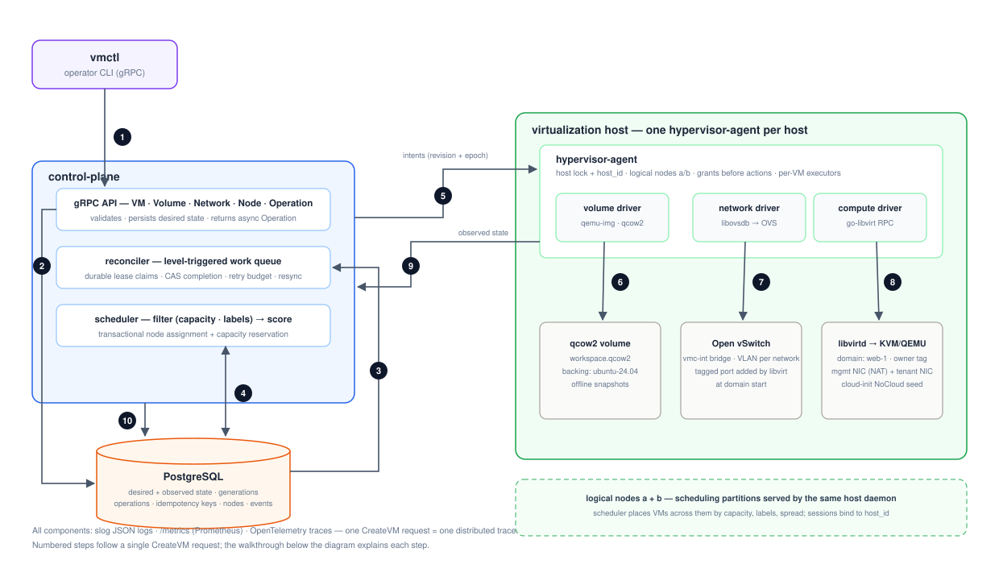

# Design Document — `vm-control-plane`

**A small VM control plane in Go:** gRPC API → PostgreSQL desired state → reconciler → scheduler → hypervisor agent → libvirt/KVM, with Open vSwitch networking and qcow2 storage. Architecturally it follows the common shape of libvirt-based compute platforms (the OpenStack Nova / KubeVirt lineage) at a scope one person can build and defend line by line.

**Status:** Draft for approval · **Companions:** [implementation-plan.md](implementation-plan.md) (state model detail, PR dependency graph, process) and `docs/adr/` (decision records)

---

## 1. Overview

`vm-control-plane` provisions and manages KVM virtual machines across Linux hosts. An operator declares *what should exist* — "a 2-vCPU Ubuntu VM on network `production-a` with a 10 GiB volume" — and the system converges reality toward that declaration and keeps it there: through process crashes, retried requests, agent restarts, partitions, and out-of-band tampering with the hypervisor.

```
vmctl create vm web-1 --image ubuntu-24.04 --cpu 2 --memory 2GiB \
      --network production-a --volume workspace:10GiB
```

The project demonstrates control-plane engineering on top of a **real** virtualization substrate, not mocks all the way down. The hard part is not the happy path but the interleavings: an expired-lease worker committing scheduling side effects, an agent acting before its acknowledgment commits, a stale daemon still mutating the hypervisor, a delete racing a slow provision, an old placement's cleanup touching a new placement's files, a delayed report overwriting fresher drift evidence. Each is a named protocol here (§4), with a named failpoint test.

## 2. Goals

- **One excellent vertical slice** — create *and* delete — every failure boundary designed, documented, tested.
- **Crash-safe by construction, including the hard interleavings** above.
- **Real substrate:** KVM domains via libvirt, an OVS integration bridge with VLAN-isolated ports, sized qcow2 overlays from a digest-verified cache, offline snapshots with durable manifests.
- **Multi-node scheduling** across ≥2 logical nodes — with the host/node split modeled honestly: one daemon per physical host serves multiple logical scheduling partitions.
- **Semantic idempotency for every mutating RPC:** same key + same request → the original operation; different request → explicit rejection; concurrent submissions serialized on the envelope row.
- **Drift reconciliation** via owned-field fingerprint projection, owner- and epoch-scoped.
- **Observable**, with tracing honest across the asynchronous database hop (span links).
- **Runs locally:** fake tier natively on Windows; real KVM in an Ubuntu VM under VirtualBox (nested VT-x) and in capability-gated CI, with an always-on Linux lane proving storage and OVSDB behavior without KVM.

## 3. Non-goals

- **Not a private cloud.**
- **No evacuation of possibly-running VMs.** Reschedule only placements whose **execution grant provably never committed**; granted-but-unreachable parks in `Unknown`. No force-forget: `admin retry-cleanup` resets retry budgets only, and allocations quarantine until teardown is observed — force-freeing an IP or backing image still in use is the worse failure.
- **No authn/authz or TLS** (bootstrap-token → mTLS growth path in the ADRs).
- **Cross-host tenant networking out of scope.** Precise guarantee: tenant-NIC VLAN segmentation on one host's integration bridge, plus a management network that is **NAT with guest-to-guest isolation** (guests reach the host and egress; guests cannot reach each other on it). Both halves positively tested.
- **No HA control plane** — one active controller; the claim/grant protocol is already multi-worker-safe.
- **No Windows/macOS hypervisors.**
- **Stretch, post-MVP only:** streaming intents, volume clones, live snapshots, multi-disk snapshots, dashboards, operation TTL.

## 4. System architecture



Three binaries share one protobuf contract (`proto/vmc/v1`) and one database. The numbers trace a single `CreateVM`. Recurring vocabulary: **spec generation** (user intent; only desired power state is mutable in v0.1), **desired revision** (monotonic, includes the delete tombstone), **placement epoch** (fencing token, bumped per (re)assignment), **host_id** (persistent physical-host identity), **node session** (per registration, bound to host_id). Six protocols hold the system together: **token claims with single-transaction transitions**, **admission-checked execution grants**, **host-daemon fencing**, **per-VM serialization**, **ordered evidence**, and **epoch-owned artifacts**.

**① CLI → API.** `vmctl` mints an idempotency key before the first attempt; retries replay it. Every mutating RPC — create, power update, delete, snapshot create, snapshot restore — carries the same envelope discipline.

**② API persists desired state — serialized on the envelope row.** The idempotency envelope (method, API version, target, canonical request hash) is inserted *first*; on conflict, identical hash → return the committed winner's Operation (briefly waiting; ambiguous → retryable error), different → `FAILED_PRECONDITION`. The envelope discipline covers the **complete mutation inventory** — VM create/power/delete/snapshot/restore, Volume and Network create/delete, and the admin verbs (`retry-cleanup`, which advances a retry *generation* under CAS so a delayed duplicate cannot reset a newer budget, and `clear-recovery`). Then, same transaction: the VM row (`phase=Pending`) and the Operation (resource UUID, verb, **target desired revision**, request hash, **per-verb database-clock deadline**). Operations terminate on *every* path: realized → `Done`; newer revision first → `Superseded`; budget exhausted → `Failed` (same tx as the phase write); **deadline expiry → `DeadlineExceeded` without unsafe cleanup** — an `Unschedulable` create keeps waiting, an exposed placement stays `Unknown`, a quarantined delete keeps running — and late convergence never rewrites a terminal result. `op wait` carries a defensive client deadline. The API never writes `phase`.

**③ Reconciler claims work — token-guarded, lease-aware, single-transaction transitions.** Claims mint an immutable **claim token** with a lease via atomic `UPDATE … RETURNING`. **The committing statement guards on token + input versions + `claim_expires_at > clock_timestamp()`** — a token does not outlive its lease, so an expired worker cannot commit even before takeover replaces it (takeover serializes on the claim row). **Every reconcile transition commits all its durable side effects in one guarded transaction** — including scheduling: an expired worker cannot leave a reservation or placement behind. Durable retry state exists at *both* boundaries: controller transitions (attempts, error class, `next_attempt_at`) **and agent actions** — records keyed (vm, epoch, revision, action, **action_generation**) with attempt-token history and server-controlled `not_before`; a successful action later needing same-revision drift repair opens a *new generation* rather than reusing a terminal record; ambiguous results (timeout, lost response) require re-observation before retry. Driver deadlines are real despite go-libvirt's context-free RPCs, via the **connection supervisor**: deadline → poison/close the connection → fail in-flight calls → reconnect → re-observe before retrying any ambiguous mutation. `PR_SET_PDEATHSIG` for children; startup scavenger with quiescence proof; bounded worker pool.

**④ Scheduler assigns — schema-enforced single placement, skew-proof reservation, host-aggregate capacity.** Filter (Ready, unexpired server-side lease, labels, every capacity dimension) → score (least-allocated) → one conditional `UPDATE` that **rechecks every hard predicate** in the statement itself. Epoch allocation happens under the VM row lock; a **partial unique index guarantees at most one active placement per VM** — the schema forbids double placement, not code discipline. Logical nodes cannot oversubscribe their physical host: the daemon registers host allocatable and **quota sums are validated ≤ host allocatable** at registration and on any quota change (no overcommit in v0.1, stated). Releases are idempotent (`DELETE … RETURNING`). All inside the claim-guarded transition transaction. No candidate → `Unschedulable` condition, retried on resync.

**⑤ The host daemon: grant before action.** One `hypervisor-agent` process per physical host — it holds the host's exclusive lock and persistent `host_id`, and **advertises multiple logical nodes** (scheduling partitions with their own capacities, labels, and leases). This is what makes "two nodes on one laptop" coherent: one writer for the substrate, two partitions for the scheduler; node identities bind to `host_id` and cannot rebind elsewhere while exposure exists. The daemon polls authoritative intent snapshots (snapshot token + explicit completeness marker; local GC prohibited on partial snapshots), acks revisions, and — before the **first substrate action** for a placement — requests an **execution grant** for (vm, epoch) and waits for its commit. The first-grant transition commits only if **all admission predicates** hold: current session bound to this host, unexpired lease (server clock), current placement and revision, no committed tombstone — evaluated under a documented lock order (VM row → placement row) shared with deletion, so a delayed grant after lease expiry, session replacement, or delete **fails admission** rather than creating sticky exposure. After a grant commits, replay is idempotent. Inside the daemon, one serialized executor per VM processes only the latest revision, revalidating before and after every external step — a slow `qemu-img` finishing after a delete cannot resurrect the VM.

**⑥ Volume driver — sized, validated, durable, epoch-owned.** Root disk: `qemu-img create -f qcow2 -b <cache> -F qcow2 <tmp> <size-bytes>` (explicit size ≥ base virtual size, or the request would silently inherit the base's). Publication is genuinely durable: temp-create → `fdatasync` → no-replace publish → **fsync the parent directory** (rename alone does not survive host crash), with parents durably created; paths are epoch-qualified; ownership is re-read before every destroy. Pre-existing files are accepted only after `qemu-img info --backing-chain` validates format, size, canonical backing, and ownership. **Cache admission is strict:** digest-pinned, `sha256` + `qemu-img check` verified, and the base must be a *standalone* qcow2 — no backing file of its own, no external data file, no encryption, bounded size, feature whitelist — so a digest-valid but layered base cannot escape the refcount model.

**⑦ Network driver — host singletons, atomically stamped.** The daemon ensures host singletons once per host: the `vmc-int` integration bridge is created **with its ownership stamp in a single OVSDB transaction** (OVSDB is transactional — there is no created-but-unstamped crash window), and the `vmc-mgmt` libvirt network carries its deterministic UUID and ownership metadata in the define-time XML. Logical networks are unique VLAN tags on `vmc-int`. Foreign same-name objects are conflicts, never adopted. Datapath by capability detection (a real Ubuntu VM kernel ships the openvswitch module; experimental userspace `netdev` only after a TUN/TAP smoke test). Ports are not pre-created — taps don't exist until QEMU starts.

**⑧ Compute driver defines and starts.** Pure-Go libvirt RPC through the connection supervisor; define-if-absent matched by name + UUID + ownership metadata (node, VM, **epoch**); start if not running; **autostart explicitly disabled and owned**. XML wires the isolated management NIC (`vmc-mgmt`, `<port isolated='yes'/>`) and the tenant NIC (`virtualport openvswitch` + VLAN tag), both with **deterministic MAC and interfaceid** (VM UUID + NIC index). The pure-Go NoCloud seed (volume label `CIDATA`, verified in read-back tests) carries `meta-data` (stable instance-id), `user-data` with `ssh_authorized_keys` (ephemeral keypair in CI), and MAC-matched network-config v2 (tenant: static IP from DB IPAM, no default route). After start, the port's `external_ids` (incl. epoch) are stamped and verified; a crash before stamping is closed by the **narrow adoption proof**. **Power semantics are explicit:** Stop = ACPI shutdown → poll → deadline → forced destroy, escalation recorded as events. A **clean-shutdown attestation** — written only when libvirt's stopped-event detail says normal shutdown with no destroy escalation, scoped (vm, epoch, stop revision), cleared on every Start, failing closed when the reason is unavailable — is what snapshot admission requires transactionally: "observed ShutOff" alone can race a crash or a forced destroy.

**⑨ Reports are ordered evidence — across restarts.** All reports flow through one per-session sequencer; ordering is **(session_generation, report_seq) compared lexicographically**, so a restarted daemon's fresh session starting at seq 1 is not rejected behind the old session's seq 100, while a delayed old-session report *is* rejected. A delayed `Running` cannot overwrite newer `ShutOff` drift evidence. Reports carry (session gen, seq, epoch, **applied desired revision**, fingerprints); stale sessions/epochs are rejected for status — while **teardown receipts are a separate message type** allowed to update exactly their matching ledger row. **Fingerprints are owned-field projections over *both* the live XML and the `INACTIVE` (next-boot) definition** — `virsh edit` on a running domain is invisible to live-only comparison — and the daemon also owns **autostart=false** (autostart lives outside the XML and would boot an unfenced domain after host restart). Live-only drift raises a conservative **`RestartRequired` condition** rather than an automatic disruptive restart. Benign libvirt augmentation cannot fake drift; hashing desired XML can never fake reality. Resyncs list only owner-tagged resources; the management IP comes from libvirt's DHCP-lease API.

**⑩ Completion on exact evidence.** One transaction: status CAS, observed revision + seq recorded, `phase=Running`, Operation for exactly this target revision terminalized.

**Deletion runs the machinery in reverse — and is as durable as creation.** Tombstone (set under the shared lock order) → executor tears down its epoch's artifacts (ownership re-read before each destroy; **unlink followed by containing-directory fsync, and epoch-directory removal followed by parent fsync, *before* the receipt is issued** — otherwise a host crash after the receipt could resurrect an artifact whose reservation and backing refcount were already released) → **teardown receipt** → finalization removes the row, releases reservation/IPs/refcounts idempotently, completes the still-queryable Delete operation — while a **placement tombstone** survives to drive cleanup of late or unreachable epochs. An fsync failure marks teardown incomplete: ledger debt and refcounts are retained and rescanned at startup. Unreachable-but-granted placements hold finalization and quarantine their allocations until teardown is proven.

**Node loss.** Lease expiry → NotReady; never-granted placements unassign and reschedule under a new epoch; granted placements park `Unknown`. Old-epoch artifacts are tracked debt in the ledger.

**Snapshots have durable manifests.** Keyed (vm, epoch, snapshot, disk) with per-disk progress and deterministic inspect/resume rules — "qemu-img succeeded but the DB commit was lost" is re-derived by inspection. Create and restore both run `→ Verifying → Ready | Failed` machines; a persistent **RecoveryRequired latch** blocks Start after a failed/ambiguous snapshot or restore until verification or explicit operator clearance. Single-disk scope in v0.1.

**The database is the contract.** API and reconciler never talk directly; crash recovery is a scan, not a replay.

## 5. Components

**`cmd/control-plane`** — gRPC services (VM incl. power updates with preconditions, Volume, Network, Node, Operation), reconciler, scheduler; strict package boundaries.

**`cmd/hypervisor-agent`** — one per physical host: host lock, `host_id`, logical nodes, sessions/leases, intent polling, grants, per-VM executors, report sequencer; drivers behind portable interfaces (go-libvirt / libovsdb / qemu-img, `//go:build linux`) each with a **first-class fake**. Whole tree compiles and unit-tests on Windows; CI runs a native Windows runner.

**`cmd/vmctl`** — `create`, `get`, `describe`, `list`, `start`, `stop`, `delete`, `snapshot`, `op wait`, `debug drift`, `admin retry-cleanup`.

**State schema (PostgreSQL).** Resources: `id`, unique `name`, `spec`/`status` jsonb, `spec_generation`, `resource_version` (CAS), `desired_revision`, claim/retry columns, `deleted_at`. Plus `placements` (grant ledger; partial unique on active), `action_retries` (vm, epoch, revision, action), `reservations` (unique vm+epoch), `ip_allocations` (unique network+address), idempotency envelopes, `operations`, `placement_tombstones`, `snapshot_manifests`, `events`.

## 6. Failure model

Every row cites named failpoints from the checked-in **failpoint manifest** (ID → cut point → invariant → harness → CI lane); ★ rows also run on the real substrate in CI. A **phase-aware invariant auditor** runs after every E2E/chaos test: expected artifacts per (phase, epoch, reachability); at most one active placement (schema-enforced); non-current-epoch artifacts must be ledger-tracked debt; foreign resources preserved; terminal operations immutable. The auditor is tested against valid intermediate states.

| Failure | Recovery | Guarantee |
|---|---|---|
| Retry / different request, same key — any verb | Original op / `FAILED_PRECONDITION` | Envelopes |
| Concurrent same-key mutations | Envelope row serializes | Envelopes |
| Controller dies anywhere | Durable claims + retry; rescan | Token claims |
| **Expired worker attempts scheduling side effects** | Whole transition tx rolls back | Single-tx transitions |
| Concurrent / double placement | All-predicate reservation + partial unique index | Schema |
| Agent acts, grant response lost | Grant committed → exposure recorded; idempotent replay | Grants |
| **Delayed grant after expiry / replacement / delete** | Admission predicates fail | Grant admission |
| Node dies, never granted | Unassign + release → reschedule, new epoch | Grants |
| Node dies after grant | `Unknown`; ledger + allocation quarantine | Exposure rule |
| **Stale daemon vs replacement; node-ID reuse cross-host** | Host lock; host_id binding | Host-daemon fencing |
| ★ Daemon dies mid-provision (incl. mid-`qemu-img`) | Redelivery honoring `not_before`; scavenger; validated ensure | Action retries + epoch paths |
| ★ Dies before port stamp / singleton stamp | Adoption proof / impossible (atomic OVSDB tx) | D9 |
| **Old-epoch cleanup after new placement** | Epoch paths + ownership re-read | Epoch ownership |
| ★ Delete races any provisioning step | Post-step revalidation | Serialization |
| Crash mid-delete / unreachable exposed node | Ledger persists; finalization waits; quarantine | Tombstone ledger |
| **Delayed report vs newer drift evidence** | report_seq monotonicity | Ordered evidence |
| Reordered/duplicate intents; agent restart | Revision monotonicity; durable action retries | §4 ⑤ |
| ★ Out-of-band destroy / port delete / XML tamper vs augmentation | Owned-field projection: repair drift, ignore augmentation | Fingerprints |
| Never converges / hung call | Budgets both sides → `Failed` + Operation terminalized | Terminal policy |
| ★ Kill mid-snapshot; qemu-img success + lost DB commit | Manifest inspect/resume; RecoveryRequired blocks Start | Manifests |
| ENOSPC at publication; daemon restarts; half-open partition on lease | Clean failure; reconnect; action halt | §10 battery |
| PostgreSQL restarts | Back off, resume | DB-as-queue |

## 7. Deployment and local development

- **Tier 0 — native Windows, fake drivers.** `make dev`: embedded PostgreSQL (pinned, UTF-8/locale C) + control-plane + **one host daemon advertising two logical nodes** (disjoint quotas). Loopback binds, stable paths, port diagnostics. The everyday loop and live-demo fallback.
- **Tier 1 — an Ubuntu VM under VirtualBox with nested VT-x, gated on the M0 spike** run under the exact service identity: KVM acceleration (hard fail on TCG), image boot, mgmt DHCP + key-only SSH, OVSDB rights (surviving daemon restart), datapath detection, the full storage ownership cycle. Provisioned by `scripts/spike/vbox-create.ps1` (Hyper-V verified off — VirtualBox passes raw VT-x through); repo cloned to the VM's own filesystem, storage under `/var/lib/vmc`. The spike's written report gates M3+ and re-estimates the schedule.
- **Tier 2 — CI, three lanes.** (1) Always-on portable: lint, both-GOOS, unit + fake-E2E on Linux **and Windows**, race + stress. (2) Always-on Linux substrate (**no KVM needed**): real qemu-img storage battery incl. kill-mid-create/restore, OVSDB under the service UID, seed read-back. (3) Capability-gated guest lane (hosted nested virt is experimental — hard preflight), plus a **release gate requiring a recent provenance-carrying real-KVM run** (the substrate VM or self-hosted) independent of hosted-runner luck.

## 8. Observability

Metrics with components (claim queue, transition durations, grant admissions, placements, action durations, operations). slog JSON: `vm/revision/epoch/session/seq/action`. Traces: persisted origin context, span links per attempt/action, standalone pinned Prometheus + Jaeger. Events via `vmctl describe`.

## 9. Known limitations and future work

Each with a growth path: no evacuation (needs host/power fencing); per-host VLAN isolation (trunk/VXLAN sketch); single active controller (protocol already multi-worker-safe); no auth (token → mTLS); least-allocated scoring; offline single-disk snapshots (external-snapshot flip, multi-disk manifests); no operation TTL; and the **scale analysis** — what breaks at 1,000 nodes: resync scans (LISTEN/NOTIFY or watermarks), poll fan-out (streaming), reconciler sharding, operations hot rows, heartbeat storms. A defensible, honest core — not breadth.
