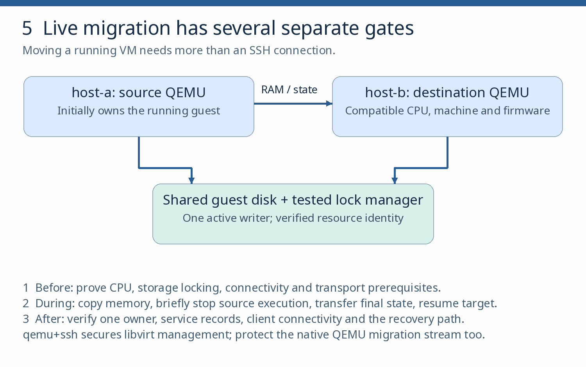

# Migration, host maintenance and upgrades

**Goal.** Add host-b and maintain a host without losing VM ownership or assuming zero application disruption. **Prerequisites:** chapter 8 passed; a second dedicated compatible x86-64 host with tested KVM access, enough RAM/storage, matching libvirt/QEMU/firmware support and a usable management/migration network. Shared-storage exercises also require a storage setup with tested single-writer locking; copied-storage exercises require sufficient free space. If these are missing, keep this practical outstanding and use Setup 2’s continuation rule for the single-host chapters.

**Read first.**  [libvirt migration](https://libvirt.org/migration.html),  [libvirt lock managers](https://libvirt.org/kbase/locking.html),  [daemon lifecycle](https://libvirt.org/daemons.html) and the installed distribution’s upgrade/support notes.

**Quick model.** Cold move, live migration and restart after host failure are different operations. None alone proves disk ownership, client reachability or recoverability.

*Figure 5. The drawing shows the shared-file, pre-copy teaching path. Ownership and guest connectivity are separate checks.*

## 9.1 Compare hosts

1. Inventory both hosts: package/kernel versions, CPU models/features, domain capabilities, selected machine type (including the separate Q35/UEFI profile where used), firmware/NVRAM handling, network names, disk paths and free capacity. Test host-b’s access and restore a **throwaway** guest there first. Record which XML and disk formats the pair supports.

2. The two hosts’ local libvirt default NAT networks are **separate networks even if both are named default**; plan and test guest reachability after a move, or explicitly accept and measure client reconnection. Do not begin migration because both hosts merely say “Ubuntu 24.04.”

**Check:** Both hosts support the chosen VM profile, and a throwaway restore works on host-b.

## 9.2 Move a stopped guest

1. Draw a single-writer ownership state table for linux-01. Start with a disposable guest: shut it down, transfer its definition **and independently transfer/arrange its disk and firmware state**, then start it only on host-b after proving it is off on host-a. virsh migrate --offline moves the definition, not the whole cold workload.

2. Verify application/data and reverse the move.

**Check:** The stopped guest has one owner and complete definition, disk and firmware state at destination.

## 9.3 Migrate a live guest

1. Use a dedicated NFS export mounted at the same path on both hosts. Verify cross-host POSIX locking, configure QEMU lock\_manager = "lockd" on both hosts per the linked guide, and apply its daemon changes.

2. With a disposable disk and no competing autostart, attempt a second start. Require a lock error. If a host becomes unreachable, stop until it is observed stopped or independently fenced. If this gate fails, mark shared-storage migration outstanding and continue cold transfer/recovery.

3. Migrate one simple guest over the tested shared storage. Observe QEMU owner, live/persistent XML, disk path, progress, destination reserve, HTTP results and writes; measure disruption rather than treating ping success as zero downtime.

4. Test a supported non-shared-storage workflow separately, with its own capacity and ownership checks.

**Check:** The competing start is refused, exactly one host owns the guest/disk through migration, and recorded HTTP/data behavior matches the measured interruption. Unsupported or unsafe migration remains outstanding.

## 9.4 Protect migration data

1. A qemu+ssh management connection does **not automatically encrypt a separate native migration stream**; select and test a supported tunnel or native TLS path. Record whether the command uses direct or peer-to-peer control, because client-disconnection behavior differs.

**Check:** The observed migration stream uses the selected protected transport.

## 9.5 Test rollback

1. Reject an incompatible destination before transfer. Interrupt a **disposable** migration at a documented recoverable point and establish the authoritative owner and disk state before restarting anything. Complete the independent-host backup restore from chapter 7.

**Check:** After interruption, the authoritative owner and disk state are known before any restart.

## 9.6 Drain the host

1. Move workloads off host-a, record the active workload owner, update/reboot it using distribution guidance, confirm its new running processes/versions and return it to service. Treat an installed QEMU update and a running QEMU process as distinct; do not assume downgrade safety for changed machine/format state.

**Check:** Maintenance completes with one active owner and recorded app/data behavior.

**Pass and cleanup.** Record compatibility, disruption, data integrity, rollback and exactly one disk/VM owner per transition. Record linux-01’s final host and disk path. Run stateful migration only after the disposable test and recovery route pass.
