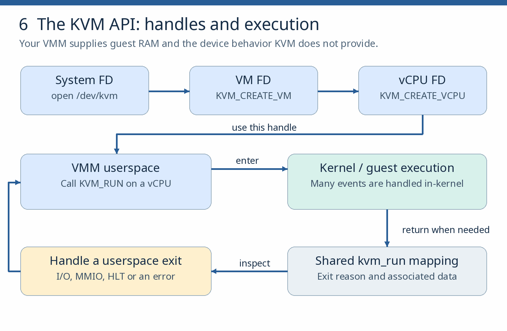

# The KVM API and a tiny VMM

**Goal:** build a working virtual machine monitor from the raw KVM API in three stages: the reference real-mode payload, your own port-I/O extension, then a pinned Linux boot. **Requires:** chapter 12. **Budget:** 8–12 sessions.

**Read first:**  [Using the KVM API](https://lwn.net/Articles/658511/), the  [kernel KVM API reference](https://docs.kernel.org/virt/kvm/api.html), and  [kvm-hello-world](https://github.com/dpw/kvm-hello-world).

## 13.1 C and ABI skill check

Use this quick check to decide whether you need a C refresher. Existing code you can explain and debug is acceptable evidence; skip introductory reading when the check is easy.

1. Write a small C program that declares structs and prints their sizes and field offsets; open a file descriptor; `mmap` a file and modify it; step through everything in a debugger.

2. Explain the pointers, buffer bounds, structure alignment, integer widths, file descriptors and mappings your example uses. Refresh only the gaps, including the x86 registers/paging needed for the selected payload; full MMU analysis comes in chapter 15.

**Check:** predict struct sizes and alignment before the program confirms them, and explain what memory remains valid after a descriptor closes or a mapping is removed.

*Refresher — the Linux boundary:* a file descriptor (FD) is a process handle, not necessarily an ordinary file. An `ioctl` sends a device-specific request through that handle; `mmap` makes memory accessible in the process. With KVM, the system FD creates a VM FD, the VM FD creates vCPU FDs, and each vCPU has a shared run area for exit information. The VMM supplies guest RAM separately.



*Figure 6. Return to KVM\_RUN only when the exit is handled and execution should continue; HLT ends the tiny reference payload.*

## 13.2 Run and annotate the reference

1. Pin the kvm-hello-world commit and record the compiler/binutils versions. Build with `make kvm-hello-world`, then run the real-mode payload with a bounded timeout. Plain `make` also runs other modes; it is not a build-only check. Use the compatibility note below only if the pinned build needs it.

2. Annotate the ioctl sequence from `KVM_GET_API_VERSION` through the `KVM_RUN` loop, each call's purpose in your own words.

3. Match expectations to the payload you ran. The default real-mode run (`-r`) uses  [guest16.s](https://github.com/dpw/kvm-hello-world/blob/master/guest16.s): it stores 42 in AX and guest memory at 0x400 and ends with HLT, handled as `KVM_EXIT_HLT`, with the register/memory checks succeeding. The separate  [guest.c](https://github.com/dpw/kvm-hello-world/blob/master/guest.c) payload used by the other modes prints through port 0xE9 (`KVM_EXIT_IO`) before HLT.

4. Query the API version and required capabilities with `KVM_CHECK_EXTENSION`; do not infer feature availability from the kernel release number.

The author reports Intel testing, not universal AMD validation; on AMD, record any divergence rather than assuming a broken host.

**Check:** explain the sequence without your notes.

**Build compatibility: diagnose the toolchain before KVM.** The reference is older teaching code. On Fedora 44 with GCC 16.2.1, commit `e9ab0f26e892fa3794f2f991144be7fa45ddd082` needed three local Makefile recipe changes. Keep the patch in your repository; do not apply it blindly to a different version. The fixed-address guest write triggers the compiler’s array-bounds warning; keep that warning visible and demote it only in the two guest compile rules. The link step needs a relocatable payload object.

```bash
# Replace the payload.o link recipe: -r produces a relocatable object.
# Keep the recipe’s leading TAB; Makefiles distinguish tabs from spaces.
	$(LD) -r -T $< -o $@

# Replace the guest64.o compile recipe: demote this one payload warning.
	$(CC) $(CFLAGS) -Wno-error=array-bounds -m64 -ffreestanding -fno-pic -c -o $@ $^

# Replace the guest32.o compile recipe in the same narrowly scoped way.
	$(CC) $(CFLAGS) -Wno-error=array-bounds -m32 -ffreestanding -fno-pic -c -o $@ $^
```

These are replacement recipe lines under the existing targets, not a complete Makefile. `make kvm-hello-world` then built successfully in the local check. With a five-second timeout and the example’s 2 MiB guest RAM, real mode (`-r`), protected mode (`-s`) and 32-bit paging (`-p`) exited 0; the latter two printed “Hello, world!”. The unmodified long-mode path (`-l`) failed at `KVM_SET_SREGS: Invalid argument` on that host. A separate diagnostic copy fixed the missing explicit guest CPUID setup: query `KVM_GET_SUPPORTED_CPUID`, construct a guest model consistent with the implemented devices, then apply `KVM_SET_CPUID2` before setting long-mode registers. This tiny VMM has no in-kernel local APIC, so the diagnostic masked x2APIC, TSC-deadline and PV\_UNHALT instead of advertising their unavailable prerequisites; see the  [KVM CPUID API and documented pitfalls](https://docs.kernel.org/virt/kvm/api.html#kvm-get-supported-cpuid). All four modes then exited 0 on kernel 7.2.6-200.fc44.x86\_64, with the three C-payload modes printing “Hello, world!”. The unchanged binary still failed its long-mode check, isolating the change.

These are observed Fedora results, not an Ubuntu or universal CPU compatibility claim. Keep real mode as this chapter’s starting checkpoint; treat the CPUID repair as an optional source-reading exercise before extending to long mode. Preserve the guest payload when adapting a build, and separate compiler/linker failures from runtime failures.

## 13.3 Reimplement it yourself

1. Rewrite the example with explicit error handling on every ioctl and correct file-descriptor and mapped-memory lifetimes.

2. Preserve the HLT result first. Then add a tiny guest OUT instruction and a bounded `KVM_EXIT_IO` handler: check port, direction, width, count and data offset before reading the shared run area. This is an output-port exercise, not yet a complete UART. A `KVM_EXIT_MMIO` handler is a bounded extension exercise.

3. Failure drills, kept separate: (a) supply an invalid memory region and inspect the ioctl failure; (b) query an unsupported capability — `KVM_CHECK_EXTENSION` normally returns zero for unsupported rather than an error, and a positive result may encode a limit rather than a Boolean.

**Check:** distinguish host virtual from guest physical addresses in your own code, `KVM_EXIT_IO` from `KVM_EXIT_MMIO`, and both failure modes — without treating every KVM failure as a host installation issue.

## 13.4 Pinned Linux boot, in four checkpoints

Use the  [zserge](https://zserge.com/posts/kvm/) and  [gokvm](https://github.com/bobuhiro11/gokvm) code paths plus the  [x86 boot protocol](https://docs.kernel.org/arch/x86/boot.html) as references. Choose one skeleton and pin its commit, kernel configuration and initramfs before extending it.

- **13.4a Memory map.** Load the kernel and initramfs into non-overlapping guest-memory regions, build the boot-parameter/zero-page and E820 map required by the selected boot entry, and print a checked address map.

- **13.4b CPU and interrupts.** Reproduce that entry's register, segmentation/paging, CPUID and interrupt-controller/timer setup from the pinned skeleton, recording each API call and capability requirement.

- **13.4c Serial.** Implement the UART behavior the pinned kernel uses and demonstrate early serial output before attempting a shell.

- **13.4d Shell.** Boot an initramfs with a known executable init and required libraries, obtain an interactive serial shell, and stop it cleanly.

Preserve the previous checkpoint before each change. Diagnose a silent guest from the last completed checkpoint, the exit reason and the registers.

**Check:** reproduce the shell and explain which behavior comes from KVM, the kernel image, and your userspace devices.

**Chapter pass:** all checks plus the recorded manifest. You have written a small VMM — this is not "running with no VMM." Its block device arrives in chapter 14, after virtqueues. **Recovery:** run as a lab user with deliberately granted /dev/kvm access and bounded memory/vCPU limits. Avoid duplicate or inherited VM descriptors — resources release when the last relevant descriptor closes. Nothing here touches libvirt-managed guests; keep these builds separate from the distribution installation.
