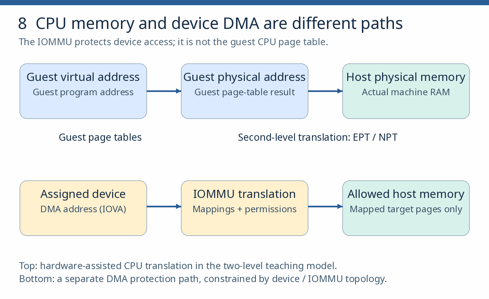

# Hardware virtualization, the KVM MMU and VFIO

**Goal:** connect earlier observed behaviors to CPU, memory and DMA mechanisms, and perform physical device assignment where hardware allows. **Requires:** chapter 14. Sublabs 15.4–15.5 also require suitable isolated hardware; without it, mark them outstanding for the full path — the 15.3 desk-check counts toward the reduced path only. **Budget:** 8–12 sessions.

**Read first:** Bugnion, Nieh and Tsafrir's  [Hardware and Software Support for Virtualization](https://link.springer.com/book/10.1007/978-3-031-01753-7), the  [KVM x86 MMU documentation](https://docs.kernel.org/virt/kvm/x86/mmu.html), and the  [kernel VFIO documentation](https://docs.kernel.org/driver-api/vfio.html). Consult the Intel SDM or AMD APM according to the lab CPU; both are comparative references, not simultaneous first reads.

*Refresher — three address spaces:* a guest application uses guest virtual addresses; guest page tables map them to guest physical addresses. Hardware-assisted second-level translation maps guest physical to host physical memory under KVM’s control. Device DMA needs its own protection through an IOMMU; CPU memory translation alone does not isolate a passed-through device.

*Figure 8. Keep the CPU translation path separate from the DMA path. This diagram assumes hardware-assisted second-level translation; the chapter also compares shadow paging.*

## 15.1 Translation-fault walkthrough

1. Pin a kernel tree matching the lab kernel; locate the two-dimensional (TDP) translation-fault handling path.

2. Write a walkthrough tying file and function names to VM entry/exit, guest and nested page translation, shadow versus two-dimensional MMUs, and where interrupts and nested virtualization enter.

**Check:** explain a translation-related VM exit end to end from your walkthrough.

## 15.2 Measured tuning comparison

1. Rerun a chapter-8 baseline; measure one pinning, NUMA or hugepage change with repeated measurements.

2. Record results with variance, the CPU/NUMA-locality explanation, and the effect on migration constraints.

**Check:** revert cleanly and state which prior performance or compatibility decision this explains.

## 15.3 IOMMU topology desk-check

1. Enumerate IOMMU groups and map every device.

2. Produce a topology map and assignment-eligibility table, including one unsuitable group and one reset limitation, with the unsafe configuration explicitly rejected. An ACS override is not proof of hardware isolation.

**Check:** justify a DMA isolation boundary in writing. This desk-check is the defined reduced-path alternative when assignment hardware is unavailable.

## 15.4 VFIO assignment (hardware-dependent)

1. Keep an out-of-band access path open first. Never unbind the host boot disk, the sole management NIC or the only display device.

2. Assign a spare eligible device — a spare NIC is sufficient; a gaming GPU is not the only route — and demonstrate clean bind, use in a guest, and recovery.

3. Distinguish the older VFIO container/group API from IOMMUFD as supported by the actual kernel and QEMU. IOMMUFD manages userspace I/O address spaces; it does not manufacture isolation absent from the hardware topology ([IOMMUFD API](https://docs.kernel.org/userspace-api/iommufd.html)).

**Check:** describe how assignment affects migration and recovery. Device reset and migration support are device/driver-specific — reject blanket claims in either direction.

## 15.5 SR-IOV and nested virtualization (hardware-dependent)

If hardware permits, create and assign a VF and record its reset behavior; otherwise record precisely what remains untested. Compare what nested virtualization can and cannot demonstrate here.

**Chapter pass:** sublabs complete or explicitly outstanding, with nothing marked passed that hardware prevented. **Recovery:** every unbind step pre-planned with a tested return path. **Further reading (comparative):** the supplementary Williamson talks, IOMMUFD/SR-IOV references, nested-VMX material, LWN MMU articles, hardware-lab exercises and the defensive vulnerability case study. Looking Glass, VirGL/Venus and gaming-specific tuning follow their own display/device prerequisites; they are examples, not platform requirements.
