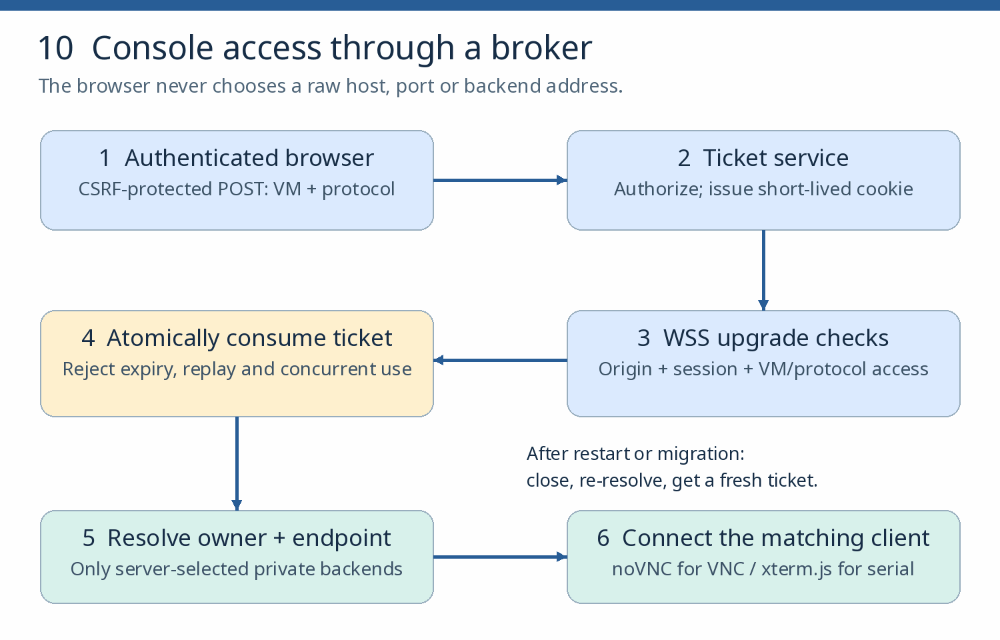

# A secure console broker

**Goal:** expose reliable pre-network console access through the control plane without exposing raw console endpoints. **Requires:** chapter 17; chapter 6 taught console use and chapter 11 added Windows recovery access. **Budget:** 8–12 sessions.

**Read first:**  [libvirt domain XML graphics/console sections](https://libvirt.org/formatdomain.html),  [QEMU VNC security](https://www.qemu.org/docs/master/system/vnc-security.html), and  [noVNC embedding](https://novnc.com/noVNC/docs/EMBEDDING.html).

**Session contract** — implement exactly this, then extend:

- **Surface:** a same-origin HTTPS page and WSS endpoint behind an authenticated application.

- **Request:** an authorized, CSRF-protected POST names one VM UUID and protocol.

- **Ticket:** the server creates an unpredictable ticket (60-second lifetime as a lab default), storing its user/session binding and unused state. One pending ticket per browser login in this first implementation; requesting another replaces it. Multiple simultaneous pending consoles are an extension.

- **Delivery:** a Secure, HttpOnly, SameSite=Strict cookie scoped to the console endpoint. The browser WebSocket handshake sends it automatically — this avoids custom headers the browser/noVNC API cannot supply. Neither ticket nor session cookie belongs in URLs or logs.

- **Upgrade:** validate the login and exact allowed Origin, recheck VM/protocol authorization, and atomically consume the ticket before opening the backend. Reject concurrent use, replay, expiry and revoked sessions; require a fresh authorized request after a failed connection.

- **Backend:** resolved server-side from current ownership and domain XML; client-provided backend addresses are rejected.

- **Limits and audit:** per-user/global connection limits, a bounded handshake timeout, idle/lifetime limits, logout-driven closure of active sessions; audit decisions without credentials.

*Why the extra checks:* WSS protects transport, but does not replace application login or per-VM authorization — validate the Origin and session as well ([OWASP WebSocket guidance](https://cheatsheetseries.owasp.org/cheatsheets/WebSocket_Security_Cheat_Sheet.html)).

*Figure 10. Read the session contract above with this flow. Serial and VNC use different clients and protocols.*

## 18.1 Private console integration

Expose serial and VNC through private endpoints or a supported libvirt-mediated stream, with no raw routable console port.

**Check:** direct connection attempts from outside the broker fail.

## 18.2 Authorization and ticket service

Implement the session contract inside the chapter-17 control plane, authorizing the user against the exact VM and protocol and issuing the cookie-delivered single-use ticket.

**Check:** audit records for grants and denials exist; a ticket replay and a second concurrent use both fail.

## 18.3 Browser clients, one protocol at a time

1. **VNC:** embed the noVNC `RFB` library via its library API documentation — do not confuse it with the full `vnc.html` application's URL settings. noVNC supplies a client, not your authorization system.

2. **Serial:** implement a separate xterm.js client and broker path to a supported libvirt console stream. Forward guest output into `Terminal.write`, encode terminal input correctly for the stream, bound buffers and implement flow control ([xterm.js encoding](https://xtermjs.org/docs/guides/encoding/),  [flow control](https://xtermjs.org/docs/guides/flowcontrol/)). Do not send raw serial bytes to noVNC.

**Check:** independent VNC and serial browser sessions work over WSS through the broker, including typed input and recovery output.

## 18.4 Lifecycle handling

Handle disconnect, VM restart, endpoint discovery and migration explicitly: re-resolve the owning host and reconnect per the contract. Do not promise an uninterrupted socket through migration without implementing and testing it.

**Check:** the stale connection closes; once ownership and endpoint state are known, the user obtains a fresh ticket and reconnects. Verify the documented behavior across both a restart and a migration.

## 18.5 Denial tests

Against disposable lab endpoints only — never third-party services — test: another user's VM, ticket replay, reconnect after expiry, unapproved browser Origin, revoked login, exhausted connection allowance, and an attempted client-supplied backend address.

**Check:** every denial is recorded with its audit event.

**Chapter pass:** a user sees supported pre-boot/installer output without guest networking; unauthorized access and replay fail; no raw routable console port exists; proxies are cleaned up; endpoint capabilities are reported truthfully. **Recovery:** broker restart cleans orphaned proxies. **Further reading (comparative):** the supplementary SPICE, virtio-gpu, D-Bus display, Cockpit/KubeVirt console patterns and remote-desktop material. SPICE and acceleration are capability- and distribution-dependent; RDP, Sunshine and Looking Glass are separate desktop/graphics features, not substitutes for a recovery console.
