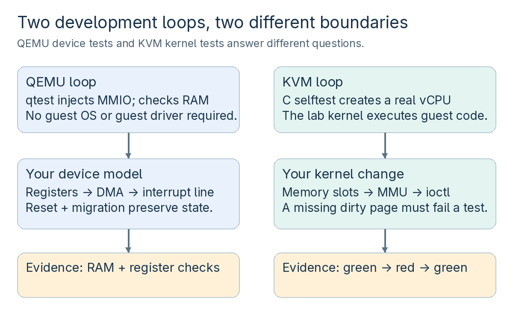
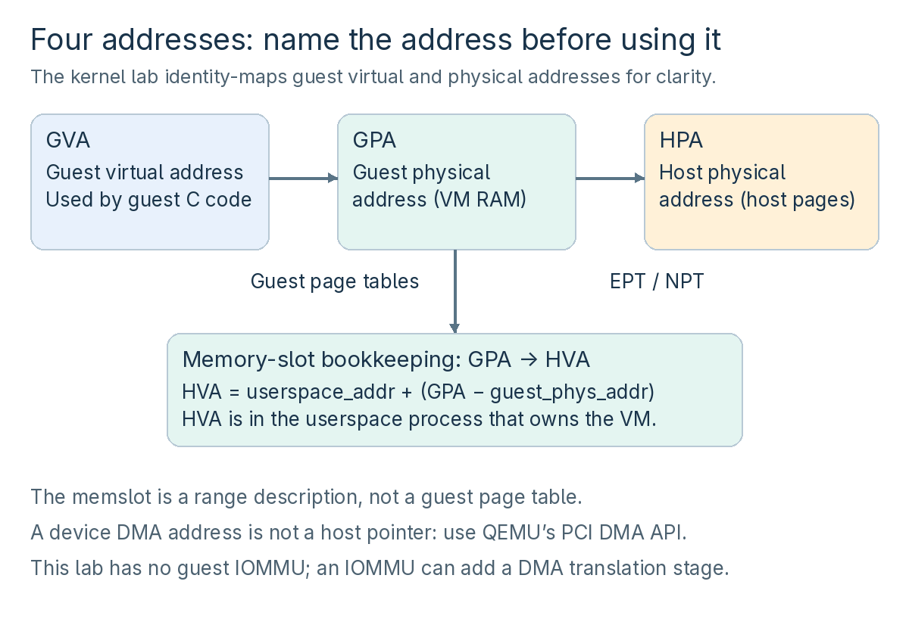

# The development method and environment

You have already learned to run and manage VMs. This extension turns that operational knowledge into a development loop: define a contract, implement it, write a test that can fail, inspect the failure, repair the code, and preserve the behavior across reset and migration. You will build a QEMU PCI device, create a kernel test appliance and debug a deliberately introduced KVM dirty-logging regression, then connect the two with a real Linux guest driver.

Everything needed for the worked exercises is in this extension: complete source, build instructions, expected observations, failure checks, and worked explanations. The earlier supplementary resource list is optional. Read this section in order. Keep the final source listings available while doing each lab; they are part of the course, not an external dependency.

## 20.1 What you will be able to demonstrate

| **Milestone** | **Evidence you produce** |
| --- | --- |
| Implement a QEMU device | A versioned register ABI, reset, masked INTx, bounded DMA, and migration state |
| Test its failure cases | qtests reject invalid accesses and catch an intentionally omitted migration field |
| Connect the device to Linux | A guest driver verifies MMIO, an actual interrupt, every DMA byte, and clean removal |
| Develop inside KVM | A new C selftest follows a memory slot through ioctl validation, dirty tracking, clearing, and rearming |
| Diagnose a kernel regression | A source-level trace, a GDB breakpoint, green–red–green runs, and a bisect that names the planted change |
| Prepare a reviewable change | A narrow patch, explicit invariants, focused tests, and a clear account of what was and was not exercised |

These are concrete development skills. Reading alone does not establish them: the checkpoint is explaining and reproducing the result, then answering the completion interview without consulting the worked answers. This course does not claim that one device and one MMU path cover all of QEMU or KVM. It gives you a working method for approaching the next subsystem responsibly.



*Figure 11. qtest exercises a QEMU device without a guest OS; a KVM selftest runs real guest instructions against the kernel under test. The Linux driver lab connects the two layers.*

## 20.2 The short refresher you need

**QEMU models hardware.** A device instance holds software state. A memory-region callback interprets reads and writes to its registers. PCI supplies discovery, configuration space, BAR placement, interrupts, and a DMA address space. QEMU's object model (QOM) supplies types and instances; qdev supplies the device lifecycle and its bus relationships. Realize creates resources; reset restores the specified initial state; migration serializes the state needed to continue elsewhere. None of those operations is interchangeable.

**KVM executes guest CPUs and manages the kernel side of virtualization.** Userspace creates a VM and vCPUs through file descriptors and ioctls. A memory slot describes a guest-physical range backed by userspace memory. Guest page tables and the hardware's second-stage translation turn guest addresses into host pages. Dirty tracking tells userspace which guest pages need attention, for example during migration. The userspace QEMU device model and the kernel KVM MMU are different codebases and different trust boundaries.

**libvirt and virsh remain the management layer.** You use direct source-built QEMU commands here because you are testing private device and kernel behavior. An upstream QEMU feature later needs management integration and compatibility review before it becomes a normal libvirt configuration.



*Figure 12. GVA, GPA, HVA, and HPA name different address spaces. The KVM fixture deliberately uses an identity guest mapping, so its GVA equals its GPA; that does not make either one a host pointer. The DMA API returns a device address, which may include an IOMMU translation.*

## 20.3 Use one controlled development environment

The executable kernel track is **x86-64 with Intel VMX and nested KVM enabled**. The QEMU qtests do not require KVM and can be done first. The worked kernel path uses a disposable, diskless VM: your workstation keeps its installed kernel. Inside that VM, the custom kernel supplies `/dev/kvm` to the small selftest guests.

The source pins are QEMU **v11.1.1**, commit `c3d48b7d1e89604920e5b81b91140c2ad39a1943`, and Linux **v6.12**, release archive SHA-256 `b1a2562be56e42afb3f8489d4c2a7ac472ac23098f1ef1c1e40da601f54625eb`. Linux 6.12 is a deliberate teaching baseline for these exact patches, not a recommendation to replace a maintained workstation kernel with the original 6.12 release.

Use Ubuntu 24.04 userspace for the kernel build commands and allow roughly 40 GiB of free workspace. Eight build jobs and a 4 GiB test appliance are the examples; reduce build parallelism if needed. You need comfortable C, pointers, bit masks, Git, and ordinary shell usage. Each new virtualization-specific concept is explained before it is used. Keep `QEMU_LAB` and `KVM_DEV` exported with the values established below; restore those variables when opening a new shell. Their paths are reused across chapters. On every physical-runner shell, also restore `export QEMU_COURSE="$QEMU_LAB/build/qemu-system-x86_64"` after completing chapter 21; the kernel harness uses this exact binary.

**Where commands run:** Build QEMU on the physical runner using its native libraries; do not copy a dynamically linked binary across distributions. QEMU qtests run in that source build directory. Kernel build commands run in the Ubuntu build environment. The diskless kernel appliances run on the physical Linux KVM workstation. These can be the same machine. If your Ubuntu build environment is a VM, copy the generated `images/`, `course-initramfs.cpio.gz`, and `run-kernel.py` to the same `KVM_DEV` layout on the physical workstation; run the appliance there. This avoids accidentally adding an extra nesting level. The recorded validation used an Ubuntu 24.04 builder and a Fedora 44 physical runner; that split is disclosed in the results table.

Keep this location map beside the terminal. “Builder” and “runner” can be the same machine; use the separate rows when they are not.

| **Work** | **Machine and directory** | **What crosses to the next stage** |
| --- | --- | --- |
| Q1–Q6: build and qtest | Physical QEMU build/runner; source in `$QEMU_LAB/qemu`, tests in `$QEMU_LAB/build` | The built QEMU binary stays on the physical runner; the shared register header is also needed by the driver builder |
| K1–K2 and K4/K6 builds | Ubuntu builder; `$KVM_DEV/linux-6.12` | Copy `images/`, the current initramfs, and the host harness to the runner's `KVM_DEV` mirror |
| K3–K6: boot, debug, classify | Physical KVM runner; `$KVM_DEV` and exported `QEMU_COURSE` | Bring each observed good/bad/skip decision back to the builder's Git checkout for bisect |
| D1: compile the guest module | Ubuntu builder; `$KVM_DEV/driver` | Repack and copy the updated initramfs and matching repaired kernel |
| D2: exercise the real driver | Physical KVM runner; `$KVM_DEV` | Save the MMIO, IRQ, DMA, and removal results |

Run this preflight on the physical workstation before the kernel track:

```bash
# Require the architecture used by the code and bitmap layout.
test "$(uname -m)" = x86_64
# Require this user to be able to open the host KVM device.
test -r /dev/kvm && test -w /dev/kvm
# Require Intel virtualization instructions in the exposed CPU flags.
grep -m1 -w vmx /proc/cpuinfo
# Nested VMX must already be enabled for the appliance's selftest guests.
cat /sys/module/kvm_intel/parameters/nested
```

**Check:** every command succeeds and the final value is `Y` or `1`. If it does not, resolve virtualization support using the earlier host setup chapter before continuing. AMD and other architectures need a separate validation pass; do not interpret their untested behavior as a result from this Intel exercise.

Keep the following discipline throughout: a timeout, a prerequisite skip, and a crash are not a pass; a successfully launched QEMU process is not proof that its guest tests passed; and a style checker is not a correctness proof. Each lab states the observation that actually establishes its result.

## 20.4 File checklist — create each file when its lab asks

Use this as your progress checklist, not as a second setup procedure. Save each complete listing under the exact path shown by its lab, then check its box. The shared driver header is copied and its tiny Makefile is generated by the D1 commands; neither needs retyping.

| **Done / file** | **Workspace and instructions** |
| --- | --- |
| ☐ `kvm-course-pci.h` | QEMU: `include/hw/misc/`; create in Q1 from the listing in 21.9 |
| ☐ `kvm-course-pci.c` | QEMU: `hw/misc/`; create in Q1 from 21.9 |
| ☐ `kvm-course-pci-test.c` | QEMU: `tests/qtest/`; create in Q1 from 21.9 |
| ☐ `build-kernel.sh` | `$KVM_DEV/`; K1 / 22.1 |
| ☐ `course_dirty_log_test.c` | Kernel: `tools/testing/selftests/kvm/x86_64/`; K2 / 22.2 |
| ☐ `init` | `$KVM_DEV/`; K3 / 22.3 |
| ☐ `make-initramfs.sh` | `$KVM_DEV/`; K3 / 22.3 |
| ☐ `run-kernel.py` | `$KVM_DEV/`; K3 / 22.3; also copy to a separate physical runner |
| ☐ `course_guest.c` | `$KVM_DEV/driver/`; D1 / 23.2 |

**Progress gates:** Q1 builds → Q2–Q6 test the device → K1–K3 establish the kernel baseline → K4 proves failure and repair → K5–K6 diagnose it → D1–D2 test the real driver → chapter 24 checks your explanation and patch evidence.
