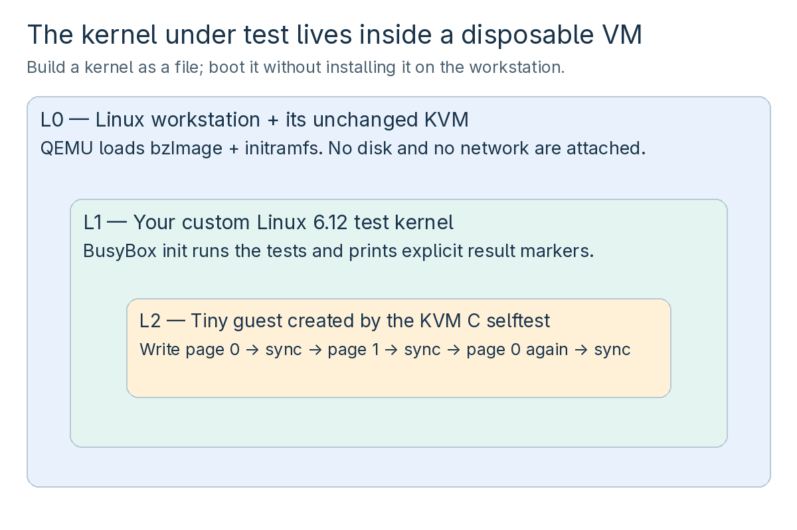
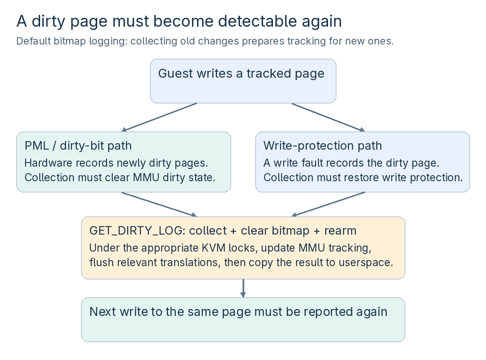

# Develop and debug one Linux KVM path

The kernel project answers a concrete question: **after userspace collects a page's dirty bit, will a later guest write to that same page be reported again?** That one invariant connects memory-slot ownership, a userspace ABI, atomic bitmap operations, MMU state, TLB invalidation, tracing, tests, and regression diagnosis.

The lab's kernel is an ordinary file passed to QEMU with `-kernel`. Its root filesystem is a small initramfs held in RAM. It is never installed in the workstation's bootloader. The changes are private teaching changes; the intentional bug is not an upstream Linux defect.



*Figure 15. The physical host is L0, the custom kernel is L1, and the selftest guest is L2. A separate build VM is a compiler environment, not another layer in this runtime path.*

## 22.1 Lab K1 — pin and build the kernel appliance

**Goal:** produce a recognizable kernel image, its matching debugger symbols, and a small set of selftests. Run the following setup in Ubuntu 24.04 userspace. Keep the `KVM_DEV` variable exported in every build shell.

```bash
# Refresh metadata for the reference userspace's build dependencies.
sudo apt-get update
# Install compiler, kernel build tools, static BusyBox, and debugger tools.
sudo apt-get install --no-install-recommends \
  build-essential git curl file xz-utils flex bison libssl-dev libelf-dev \
  bc dwarves busybox-static cpio python3 gdb
# Keep the exercise separate from every existing kernel checkout.
export KVM_DEV="$HOME/src/kvm-course-v6.12"
# Stop if this would reuse a workspace whose state you have not checked.
test ! -e "$KVM_DEV" || { echo "Choose a new KVM_DEV path" >&2; exit 1; }
# Create the private workspace, then enter it.
mkdir -p "$KVM_DEV"
cd "$KVM_DEV"
# Download the exact release archive from the official kernel distribution.
curl -fL --retry 3 -o linux-6.12.tar.xz \
  https://cdn.kernel.org/pub/linux/kernel/v6.x/linux-6.12.tar.xz
# Verify the archive against the pinned official SHA-256 value.
printf '%s  %s\n' \
  b1a2562be56e42afb3f8489d4c2a7ac472ac23098f1ef1c1e40da601f54625eb \
  linux-6.12.tar.xz | sha256sum -c -
# Extract the source while preserving its normal top-level directory.
tar -xJf linux-6.12.tar.xz
# Establish a private training history from the unchanged archive.
cd "$KVM_DEV/linux-6.12"
git init -b course
# These deliberately fictional identities label local exercise commits only.
git config user.name 'Course Lab'
git config user.email 'course@example.invalid'
# Record the release snapshot; this local commit is not the upstream tag hash.
git add .
git commit -m 'Import the unmodified Linux 6.12 release archive'
git tag course-source
```

**Check:** the checksum says `OK`. The hash was checked against the  [official kernel archive manifest](https://cdn.kernel.org/pub/linux/kernel/v6.x/sha256sums.asc). This workflow checks archive integrity against that HTTPS-delivered value; it does not claim an independently verified PGP signature. The corresponding upstream v6.12 commit is `adc218676eef25575469234709c2d87185ca223a`, useful when comparing the release source with a Git checkout.

Create the out-of-tree configuration:

```bash
# Start with the pinned x86 reference configuration.
cd "$KVM_DEV/linux-6.12"
make O="$KVM_DEV/build" x86_64_defconfig
# Enable KVM in the appliance, boot-from-initramfs, tracing, and debug symbols.
# THP is required by the selected upstream memory-slot control test.
scripts/config --file "$KVM_DEV/build/.config" \
  --enable KVM --enable KVM_INTEL --enable KVM_AMD \
  --enable BLK_DEV_INITRD --enable DEVTMPFS --enable DEVTMPFS_MOUNT \
  --enable PROC_FS --enable SYSFS --enable TMPFS --enable DEBUG_FS \
  --enable TRANSPARENT_HUGEPAGE \
  --enable FTRACE --enable FUNCTION_TRACER --enable FUNCTION_GRAPH_TRACER \
  --enable EVENT_TRACING --enable IKCONFIG --enable IKCONFIG_PROC \
  --enable DEBUG_KERNEL --enable DEBUG_INFO_DWARF4 \
  --disable DEBUG_INFO_NONE --disable DEBUG_INFO_DWARF_TOOLCHAIN_DEFAULT \
  --disable DEBUG_INFO_BTF --enable GDB_SCRIPTS --disable WERROR \
  --disable LOCALVERSION_AUTO \
  --set-str SYSTEM_TRUSTED_KEYS '' --set-str SYSTEM_REVOCATION_KEYS ''
```

Save the following as `$KVM_DEV/build-kernel.sh`. `LOCALVERSION=` suppresses Git's automatic suffix while the explicit configuration label remains in `uname -r`. Keeping the boot image and `vmlinux` together prevents a common debugging mistake: loading symbols from a different build.

```bash
#!/usr/bin/env bash
# Stop on failed commands, missing variables, or a failed pipeline component.
set -euo pipefail
# The caller supplies the workspace from the setup section.
: "${KVM_DEV:?export KVM_DEV first}"
# A label gives every saved kernel and console log an identifiable name.
label="${1:?pass good, bad, repaired, or a bisect label}"
# Resolve source paths from the workspace instead of the current directory.
cd "$KVM_DEV/linux-6.12"
# Every booted artifact must correspond to a recorded source revision.
test -z "$(git status --porcelain)" || {
    echo "Commit or resolve source changes before building this label" >&2
    exit 1
}
# Bake the artifact label into uname -r inside the test appliance.
scripts/config --file "$KVM_DEV/build/.config" \
  --set-str LOCALVERSION "-kvm-course-$label"
# Resolve dependencies of configuration options before compiling.
make LOCALVERSION= O="$KVM_DEV/build" olddefconfig
# Build the boot image, external-module symbol metadata, and UAPI headers.
make LOCALVERSION= O="$KVM_DEV/build" -j8 bzImage modules headers
# Preserve the boot image and its matching debugger symbols together.
mkdir -p "$KVM_DEV/images"
cp "$KVM_DEV/build/arch/x86/boot/bzImage" "$KVM_DEV/images/bzImage-$label"
cp "$KVM_DEV/build/vmlinux" "$KVM_DEV/images/vmlinux-$label"

# Compile the first kernel and save its matching symbols.
bash "$KVM_DEV/build-kernel.sh" good
# Confirm the actual release string, not merely the output filename.
make -s LOCALVERSION= -C "$KVM_DEV/build" kernelrelease
```

**Check:** the release is `6.12.0-kvm-course-good`, and both `images/bzImage-good` and `images/vmlinux-good` exist. Do not run `make install` or `modules_install`; the appliance loads the image directly.

## 22.2 Lab K2 — write a test for the dirty-log contract

**Refresher:** a memory slot is not an allocation performed by the guest. Userspace allocates backing memory and registers its GPA range with KVM. The test framework has already used slot 0 for its executable, page tables, and communication. We reserve slot 1 for 64 ordinary 4 KiB pages, map them at GVA = GPA = `0xc0000000`, and log only this slot.

`GUEST_SYNC` causes an explicit exit to the userspace test. The host examines memory only after the single guest vCPU has stopped. `WRITE_ONCE` preserves an individual guest store; it is not the synchronization protocol. The ucall exit and stopped-vCPU sequencing provide that protocol here.

The test first checks that the pinned kernel rejects a dirty-log request for an unlogged slot with `ENOENT`. A flags-only update then enables logging. The three guest phases write page 0, page 1, and page 0 again. Each phase checks the memory value, requires the written page's bit, then collects again without resuming the vCPU to check that this page's bit was cleared. It permits unrelated extra bits. Do not turn “the observed bitmap was 0x1” into a general promise that KVM never conservatively reports extra dirty pages.

Save this complete file as `$KVM_DEV/linux-6.12/tools/testing/selftests/kvm/x86_64/course_dirty_log_test.c`:

```c
// SPDX-License-Identifier: GPL-2.0-only
/* A small x86-64 regression test for bitmap dirty-log rearming. */

/* VM creation, memory slots, mappings and vCPU execution helpers. */
#include "kvm_util.h"
/* Assertions, prerequisite skips and TAP reporting. */
#include "test_util.h"
/* The guest-to-host synchronization protocol used by KVM selftests. */
#include "ucall_common.h"

/* Slot zero already contains the test executable and page tables. */
#define DATA_SLOT 1
/* Keep the test data away from the executable's mappings. */
#define DATA_GPA 0xc0000000ULL
/* Identity mapping makes this lab's GVA-to-GPA step easy to inspect. */
#define DATA_GVA DATA_GPA
/* Sixty-four 4 KiB pages fit in one x86-64 unsigned-long bitmap. */
#define DATA_PAGES 64
/* This test deliberately requires the ordinary x86 4 KiB page size. */
#define PAGE_BYTES 4096

/* Reject an edit that would make KVM copy past our one-word bitmap. */
kvm_static_assert(DATA_PAGES == 64 && sizeof(unsigned long) == 8,
                  "this x86-64 lab uses exactly one 64-bit bitmap word");

/* This function executes inside the guest, not in the test process. */
static void guest_code(void)
{
        /* This pointer names the guest mapping, not a host virtual address. */
        uint64_t *data = (uint64_t *)DATA_GVA;

        /* Dirty the first page and let the host collect its bitmap. */
        WRITE_ONCE(data[0], 0x1111);
        GUEST_SYNC(1);
        /* Dirty the next page after the first collection has completed. */
        WRITE_ONCE(data[PAGE_BYTES / sizeof(*data)], 0x2222);
        GUEST_SYNC(2);
        /* Write page zero again: logging must have been rearmed for it. */
        WRITE_ONCE(data[0], 0x3333);
        GUEST_SYNC(3);
        /* Tell the host that no further guest work is expected. */
        GUEST_DONE();
}

/* Run one deterministic guest phase, then inspect memory and dirty bits. */
static void check_phase(struct kvm_vcpu *vcpu, unsigned int phase,
                        unsigned int page, uint64_t value)
{
        /* A ucall contains a reason plus the guest's synchronization arguments. */
        struct ucall uc;
        /* Start with a clean userspace output buffer for this collection. */
        unsigned long bitmap = 0;
        /* A second collection checks clearing while the only vCPU stays stopped. */
        unsigned long again = 0;
        uint64_t command;
        /* Recover the VM that owns this vCPU and its memory slots. */
        struct kvm_vm *vm = vcpu->vm;
        /* Translate the chosen guest physical page to the host mapping. */
        uint64_t *host = addr_gpa2hva(vm, DATA_GPA + page * PAGE_BYTES);

        /* Execute until the guest reaches its next explicit synchronization. */
        vcpu_run(vcpu);
        /* An arbitrary exit or guest abort is not a successful checkpoint. */
        command = get_ucall(vcpu, &uc);
        if (command == UCALL_ABORT)
                REPORT_GUEST_ASSERT(uc);
        TEST_ASSERT_EQ(command, UCALL_SYNC);
        /* GUEST_SYNC places its numeric checkpoint in the second argument. */
        TEST_ASSERT_EQ(uc.args[1], phase);
        /* The vCPU is stopped here, so the guest cannot race these observations. */
        TEST_ASSERT_EQ(*host, value);
        /* Default bitmap mode collects and clears/rearms tracking for the slot. */
        kvm_vm_get_dirty_log(vm, DATA_SLOT, &bitmap);
        /* Every written page must be reported; extra dirty bits are permitted. */
        TEST_ASSERT(bitmap & (1UL << page),
                    "phase %u: written page %u absent from bitmap %#lx",
                    phase, page, bitmap);
        /* No guest runs between these GETs; this fixture has no other writers. */
        kvm_vm_get_dirty_log(vm, DATA_SLOT, &again);
        /* Check this page's cleared bit without forbidding unrelated extra bits. */
        TEST_ASSERT(!(again & (1UL << page)),
                    "phase %u: collected page %u remained dirty without a new write",
                    phase, page);
        /* Print a reproducible result without assuming the bitmap has no extras. */
        ksft_test_result_pass("phase %u: page %u, value %#lx, bitmap %#lx\n",
                              phase, page, (unsigned long)value, bitmap);
}

/* This function runs in userspace on the kernel being tested. */
int main(void)
{
        /* The framework returns both the VM and its single initialized vCPU. */
        struct kvm_vcpu *vcpu;
        struct kvm_vm *vm;
        /* Initialize the output bitmap and all named ioctl fields. */
        unsigned long bitmap = 0;
        struct kvm_dirty_log log = { .slot = DATA_SLOT, .dirty_bitmap = &bitmap };
        int ret, saved_errno;

        /* Unsupported prerequisites are skips, never evidence of a passing lab. */
        TEST_REQUIRE(kvm_has_cap(KVM_CAP_USER_MEMORY));
        TEST_REQUIRE(getpagesize() == PAGE_BYTES);
        /* State the number of independently checked guest phases. */
        ksft_print_header();
        ksft_set_plan(4);
        /* Load this executable into a small long-mode guest using the helpers. */
        vm = vm_create_with_one_vcpu(&vcpu, guest_code);
        /* First register ordinary RAM, without opting into dirty logging. */
        vm_userspace_mem_region_add(vm, VM_MEM_SRC_ANONYMOUS, DATA_GPA,
                                    DATA_SLOT, DATA_PAGES, 0);
        /* The pinned kernel rejects GET_DIRTY_LOG when this slot has no bitmap. */
        errno = 0;
        ret = __vm_ioctl(vm, KVM_GET_DIRTY_LOG, &log);
        /* Preserve errno before assertion/reporting helpers can affect it. */
        saved_errno = errno;
        TEST_ASSERT_EQ(ret, -1);
        TEST_ASSERT_EQ(saved_errno, ENOENT);
        ksft_test_result_pass("unlogged slot rejects GET_DIRTY_LOG with ENOENT\n");
        /* A flags-only update enables tracking without replacing the RAM. */
        vm_mem_region_set_flags(vm, DATA_SLOT, KVM_MEM_LOG_DIRTY_PAGES);
        /* Install the guest page-table mappings for that physical memory. */
        virt_map(vm, DATA_GVA, DATA_GPA, DATA_PAGES);
        /* Check the first write, a different page, and a repeat write in order. */
        check_phase(vcpu, 1, 0, 0x1111);
        check_phase(vcpu, 2, 1, 0x2222);
        check_phase(vcpu, 3, 0, 0x3333);
        /* Resume once more and require the guest's completion notification. */
        vcpu_run(vcpu);
        TEST_ASSERT_EQ(get_ucall(vcpu, NULL), UCALL_DONE);
        /* Close VM/vCPU descriptors and release the framework's host mappings. */
        kvm_vm_free(vm);
        /* Produce the TAP summary and a process exit status for the runner. */
        ksft_finished();
}
```

Google Docs can turn indentation tabs into spaces when you copy code. The first commands below restore Linux-style tabs without changing the program, then integrate and build the test.

```python
# Work from the source root so the integration path is unambiguous.
cd "$KVM_DEV/linux-6.12"
# Restore leading tabs after copying the eight-column-indented listing.
unexpand --first-only -t 8 \
  tools/testing/selftests/kvm/x86_64/course_dirty_log_test.c \
  > "$KVM_DEV/course_dirty_log_test.tabs"
mv "$KVM_DEV/course_dirty_log_test.tabs" \
  tools/testing/selftests/kvm/x86_64/course_dirty_log_test.c
# Insert the target next to the first x86 test; require one exact anchor.
python3 - <<'PY'
from pathlib import Path
# This file belongs to the pinned source tree.
path = Path('tools/testing/selftests/kvm/Makefile')
text = path.read_text()
# Preserve the upstream assignment and add one course target after it.
anchor = 'TEST_GEN_PROGS_x86_64 = x86_64/cpuid_test\n'
addition = 'TEST_GEN_PROGS_x86_64 += x86_64/course_dirty_log_test\n'
assert text.count(anchor) == 1, 'wrong source version or changed Makefile'
assert addition not in text, 'target already installed; do not duplicate it'
path.write_text(text.replace(anchor, anchor + addition))
PY
# Use the generated UAPI headers from this exact kernel build.
mkdir -p "$KVM_DEV/selftests"
# OUTPUT deliberately has no trailing slash: the Makefile adds its own slash.
# -static avoids a runtime libc loader; -no-pie fixes executable placement.
# A command-line LDFLAGS replaces defaults, so retain required -pthread.
make -C tools/testing/selftests/kvm \
  OUTPUT="$KVM_DEV/selftests" \
  KHDR_INCLUDES="-I$KVM_DEV/build/usr/include" \
  LDFLAGS='-static -no-pie -pthread' -j8 \
  "$KVM_DEV/selftests/x86_64/course_dirty_log_test" \
  "$KVM_DEV/selftests/set_memory_region_test" \
  "$KVM_DEV/selftests/dirty_log_test" \
  "$KVM_DEV/selftests/memslot_modification_stress_test"
# A static executable needs no libc loader inside the small initramfs.
file "$KVM_DEV/selftests/x86_64/course_dirty_log_test"
# Check the style of our addition separately from the upstream source tree.
scripts/checkpatch.pl --no-tree --file \
  tools/testing/selftests/kvm/x86_64/course_dirty_log_test.c
# Save the good test before introducing any kernel fault.
git add tools/testing/selftests/kvm
git commit -m 'KVM: selftests: exercise dirty-log collection and rearming'
git tag course-good
```

**Check:** compilation succeeds, `file` says “statically linked,” and checkpatch reports zero errors and warnings. A style pass is only a prerequisite for the runtime checks. The helper library is internal test infrastructure, not a stable external API; that is why the source version is pinned. The  [kselftest documentation](https://docs.kernel.org/dev-tools/kselftest.html) explains how these tests fit into kernel development.

## 22.3 Lab K3 — boot, trace, and require real results

Save the following `$KVM_DEV/init`. It becomes process 1 inside the RAM filesystem. It mounts the kernel interfaces, reports the booted kernel identity, runs each test directly, prints its exit status, and powers off. The optional driver branch is used later; ignore it until chapter 23.

```bash
#!/bin/busybox sh
# Supply the small command set used by this RAM-only appliance.
/bin/busybox --install -s /bin
# Expose process, device and tracing interfaces from the lab kernel.
mount -t proc proc /proc
mount -t sysfs sysfs /sys
mount -t devtmpfs devtmpfs /dev
mkdir -p /sys/kernel/tracing
mount -t tracefs tracefs /sys/kernel/tracing
# The kernel release ties every observation to the booted image.
echo COURSE_KERNEL=$(uname -r)
echo COURSE_CPU_FLAGS
grep -m1 '^flags' /proc/cpuinfo
echo COURSE_PML=$(cat /sys/module/kvm_intel/parameters/pml)
# Record each test status explicitly; poweroff is not a test result.
run_test() {
    name=$1
    shift
    echo COURSE_BEGIN=$name
    "$@"
    status=$?
    echo COURSE_RESULT=$name:$status
}
# The optional driver test requires a matching module and the course PCI device.
case "$(cat /proc/cmdline)" in
    *course_driver=1*)
        run_test driver insmod /tests/course_guest.ko
        run_test driver_remove rmmod course_guest
        ;;
esac
# Function tracing records this pinned kernel's real dirty-log path.
echo 0 > /sys/kernel/tracing/tracing_on
echo function_graph > /sys/kernel/tracing/current_tracer
printf '%s\n' kvm_get_dirty_log_protect > /sys/kernel/tracing/set_graph_function
echo 1 > /sys/kernel/tracing/tracing_on
run_test course /tests/course_dirty_log_test
echo 0 > /sys/kernel/tracing/tracing_on
echo COURSE_TRACE_BEGIN
cat /sys/kernel/tracing/trace
echo COURSE_TRACE_END
# A missing function trace is a failed lab checkpoint, even if the test passed.
run_test trace grep -Fq 'kvm_get_dirty_log_protect()' /sys/kernel/tracing/trace
# Existing tests independently check related behavior and logging modes.
run_test slots /tests/set_memory_region_test
run_test bitmap /tests/dirty_log_test -i 4 -I 10 -M dirty-log
run_test manual /tests/dirty_log_test -i 4 -I 10 -M clear-log
run_test ring /tests/dirty_log_test -i 4 -I 10 -M dirty-ring
run_test stress /tests/memslot_modification_stress_test -b 16M -v 1 -i 10
# The host harness requires this sentinel, plus every expected test result.
echo COURSE_END
poweroff -f
```

Save `$KVM_DEV/make-initramfs.sh`. It includes static BusyBox and the static selftests. `addr2line` is a distribution binary with shared-library dependencies; those libraries are copied too so assertion backtraces can be symbolized.

```python
#!/usr/bin/env bash
# Refuse to continue after a copy, link, or archive failure.
set -euo pipefail
# Use the workspace created by the setup section.
: "${KVM_DEV:?export KVM_DEV first}"
# Keep this script restricted to the course-owned RAM filesystem tree.
rootfs="$KVM_DEV/rootfs"
mkdir -p "$rootfs"/{bin,dev,proc,sys,tests}
# Ubuntu's busybox-static package supplies a standalone /bin/busybox.
cp /bin/busybox "$rootfs/bin/busybox"
# PID 1 is the fully shown course runner, not a distribution boot service.
cp "$KVM_DEV/init" "$rootfs/init"
chmod +x "$rootfs/init"
# These selftests were explicitly linked statically against the pinned headers.
cp "$KVM_DEV/selftests/x86_64/course_dirty_log_test" "$rootfs/tests/"
cp "$KVM_DEV/selftests/"{set_memory_region_test,dirty_log_test,memslot_modification_stress_test} "$rootfs/tests/"
# Include the guest driver only after its separate lab has built it.
if test -f "$KVM_DEV/driver/course_guest.ko"; then
  cp "$KVM_DEV/driver/course_guest.ko" "$rootfs/tests/"
fi
# addr2line makes selftest assertion backtraces readable; copy its shared libs.
python3 - <<'PY'
import os
from pathlib import Path
import re
import shutil
import subprocess

# The archive must retain each loader/library's absolute directory layout.
root = Path(os.environ["KVM_DEV"]) / "rootfs"
# The trusted distribution binary supplies its own dependency list.
listing = subprocess.check_output(["ldd", "/usr/bin/addr2line"], text=True)
# An unresolved dependency would make symbolization fail inside the appliance.
if "not found" in listing:
    raise SystemExit("addr2line has an unresolved dependency")
# Include both => library paths and the dynamic loader's direct path.
files = ["/usr/bin/addr2line"] + re.findall(r"(/[^\s]+)", listing)
for name in files:
    # Resolve symlinks while retaining the path the loader will request.
    destination = root / name.lstrip("/")
    destination.parent.mkdir(parents=True, exist_ok=True)
    shutil.copy2(name, destination)
PY
# newc is an initramfs format understood directly by the Linux kernel.
cd "$rootfs"
find . -print0 | cpio --null -o --format=newc | gzip -1 \
  > "$KVM_DEV/course-initramfs.cpio.gz"
```

Save `$KVM_DEV/run-kernel.py`. This is the host-side harness. It rejects missing boot identity or completion, records timeouts separately, and checks test exit markers instead of treating QEMU's exit status as the verdict.

```python
#!/usr/bin/env python3
"""Run a diskless course kernel and judge explicit guest results."""

# Standard-library modules are enough for process control and log parsing.
import argparse
import os
from pathlib import Path
import re
import subprocess
import sys

# Keep images and logs beside this script, independent of the current directory.
root = Path(__file__).resolve().parent
# A label selects a saved kernel; driver and GDB modes are explicit options.
parser = argparse.ArgumentParser()
parser.add_argument("label")
parser.add_argument("--driver", action="store_true")
parser.add_argument("--gdb", action="store_true")
args = parser.parse_args()
# Permit ordinary artifact names and reject paths or accidental shell-like text.
if not re.fullmatch(r"[a-z0-9][a-z0-9-]*", args.label):
    parser.error("use a simple label such as good, bad, or repaired")
# Use the QEMU binary built in the preceding device labs.
qemu = os.environ.get("QEMU_COURSE")
if not qemu:
    parser.error('export QEMU_COURSE="$QEMU_LAB/build/qemu-system-x86_64" first')
# This appliance has anonymous RAM, no disk, and no network interface.
command = [
    qemu,
    "-machine", "q35,accel=kvm",  # Require host KVM; do not silently use TCG.
    "-cpu", "host",             # Expose the host's nested VMX capability.
    "-smp", "4",                # Bound the appliance's vCPU count.
    "-m", "4096",               # Reserve 4 GiB for the selected controls.
    "-kernel", str(root / "images" / ("bzImage-" + args.label)),
    "-initrd", str(root / "course-initramfs.cpio.gz"),
    "-append", "console=ttyS0 panic=-1 nokaslr" +
               (" course_driver=1" if args.driver else ""),
    "-nographic",               # Capture the serial console on stdout.
    "-monitor", "none",         # Keep the serial stream free of a monitor.
    "-nic", "none",             # No network is needed for these fixtures.
    "-no-reboot",               # A guest panic/reset ends this process.
]
# The real-driver check needs the privately implemented PCI function.
if args.driver:
    command += ["-device", "kvm-course-pci"]
# Debugging is opt-in and binds the unauthenticated stub to loopback only.
if args.gdb:
    command += ["-S", "-gdb", "tcp:127.0.0.1:52345"]
# Save one complete transcript per run, including a failed or timed-out boot.
logs = root / "logs"
logs.mkdir(exist_ok=True)
log_path = logs / (args.label + ("-driver" if args.driver else "") + ".log")
try:
    # Give an interactive GDB session more time than an unattended test run.
    result = subprocess.run(command, capture_output=True,
                            timeout=900 if args.gdb else 240)
    output = result.stdout + result.stderr
except subprocess.TimeoutExpired as error:
    # subprocess.run kills and waits for the timed-out child.
    log_path.write_bytes((error.stdout or b"") + (error.stderr or b""))
    print("INFRASTRUCTURE: timeout; saved", log_path)
    sys.exit(125)
# Decode serial output without losing a result because of an unusual byte.
log_path.write_bytes(output)
text = output.decode(errors="replace")
# Show a compact progress/result view; the full trace stays in the log file.
for line in text.splitlines():
    if line.startswith("COURSE_") or "COURSE_DRIVER_" in line:
        print(line)
# Tie the result to this kernel label and require an orderly test-run sentinel.
identity = "COURSE_KERNEL=6.12.0-kvm-course-" + args.label
identified = re.search(r"^" + re.escape(identity) + r"\r?$", text,
                       flags=re.MULTILINE)
if result.returncode or not identified or "COURSE_END" not in text:
    print("INFRASTRUCTURE: boot identity or completion missing; see", log_path)
    sys.exit(125)
# A zero QEMU exit status by itself is insufficient: inspect every test status.
names = ["course", "trace", "slots", "bitmap", "manual", "ring", "stress"]
if args.driver:
    names += ["driver", "driver_remove"]
# Match complete lines so a status such as 04 cannot be mistaken for zero.
passed = all(re.search(r"^COURSE_RESULT=" + name + r":0\r?$", text,
                       flags=re.MULTILINE) for name in names)
# PCI driver registration can succeed even if device probe fails.
if args.driver:
    passed = passed and "COURSE_DRIVER_PASS: MMIO INTx DMA64" in text
    passed = passed and "COURSE_DRIVER_FAIL" not in text
# Exit 1 means a completed run has a failed/skipped required test; inspect why.
print("COURSE_ALL_PASS" if passed else "COURSE_HAS_FAILURE_OR_SKIP")
print("Full transcript:", log_path)
sys.exit(0 if passed else 1)

# Assemble a fresh RAM filesystem from the binaries just built.
bash "$KVM_DEV/make-initramfs.sh"
# Select the QEMU build from chapter 21 on the physical KVM workstation.
export QEMU_COURSE="$QEMU_LAB/build/qemu-system-x86_64"
# Boot the saved good kernel; the transcript is kept under KVM_DEV/logs.
python3 "$KVM_DEV/run-kernel.py" good
```

If the builder is a separate VM, perform the archive assembly there, copy the three generated artifacts described in 20.3, then run the last two commands on the physical workstation. The source and compiler are not needed on the runner just to boot this appliance.

**Check:** the harness exits 0 and prints `COURSE_ALL_PASS`. The course selftest has **4 passing TAP checks**: one `ENOENT` contract check and three guest phases. The usual observed first-collection bitmaps are `0x1`, `0x2`, `0x1`; each immediate second collection clears the just-written page's bit. Required exit markers are `course:0`, `trace:0`, `slots:0`, `bitmap:0`, `manual:0`, `ring:0`, and `stress:0`. The trace check requires the expected kernel function to appear in the captured graph.

The `set_memory_region_test` control may print “Skipping tests for KVM\_MEM\_GUEST\_MEMFD memory regions” on this ordinary VM configuration. That is a **disclosed unexercised subfeature**, even though its applicable memory-slot checks return 0. Do not report guest\_memfd coverage. If the course test or a required logging mode itself skips, the harness must not be counted as a pass.

The upstream dirty-log control uses `-i 4`: v6.12 requires **more than two iterations**. The 16 MiB, one-vCPU, ten-iteration slot stress test is deliberately bounded. This is a focused regression set, not a claim that the entire KVM selftest suite was run.

**If it fails:** `THP is not configured` means the selected memory-slot control needs the `TRANSPARENT_HUGEPAGE` configuration above; `KVM_CREATE_VM`/`KVM_RUN` failures usually require checking nested VMX and the booted kernel; `addr2line: not found` means the initramfs assembly was incomplete. A timeout is exit 125 and demands diagnosis, not a larger pass count.

## 22.4 Read the trace as a source-level explanation



*Figure 16. Clearing the userspace-facing dirty bitmap is only half the job. The kernel must also prepare the MMU to notice the next write. Intel PML and write protection implement that preparation differently.*

Open the saved good transcript between `COURSE_TRACE_BEGIN` and `COURSE_TRACE_END`. It contains function-graph output for `kvm_get_dirty_log_protect` and its `kvm_tdp_mmu_clear_dirty_pt_masked` descendant. The names come from this pinned kernel, not from an article about another version. The source walk is:

| **Source location** | **What to understand** |
| --- | --- |
| `virt/kvm/kvm_main.c`: `kvm_vm_ioctl_get_dirty_log` | The VM ioctl path holds `slots_lock` while operating on the memory slot. |
| Same file: `kvm_get_dirty_log_protect` | Validate the slot, synchronize dirty tracking, snapshot and atomically clear bitmap words, rearm the MMU, flush relevant translations, then copy the snapshot to userspace. |
| `arch/x86/kvm/mmu/mmu.c`: `kvm_arch_mmu_enable_log_dirty_pt_masked` | Choose dirty-bit clearing when CPU logging is available, or write protection otherwise. |
| `arch/x86/kvm/mmu/tdp_mmu.c`: `clear_dirty_pt_masked` | Walk the relevant second-stage page-table entries and clear the required D or W bit while preserving host memory-accounting obligations. |
| `arch/x86/kvm/vmx/vmx.c`: `vmx_flush_pml_buffer` | Read this source function: it drains guest-physical addresses collected by Intel Page Modification Logging into KVM's dirty-page bookkeeping. It may be inlined and is not a required trace event. |

In default bitmap mode, the kernel keeps a live dirty bitmap and a second snapshot buffer. The word-level `xchg` both retrieves the old bits and clears them atomically. Other vCPUs could be setting bits concurrently in a general VM, so a plain read followed by a plain store would lose updates. Our one-vCPU fixture removes that concurrency from the experiment; the real implementation must still handle it.

There are several different notions of “dirty.” A hardware second-stage page-table entry has a dirty bit; KVM maintains a bitmap or ring for guest pages; QEMU keeps its own migration bookkeeping; Linux also accounts for dirty host pages. Clearing one does not automatically clear or replace the others. Losing a required guest-page report could make migration omit changed memory. An extra report generally costs work; a missing report can lose state.

**What the recorded trace showed:** `kvm_tdp_mmu_clear_dirty_pt_masked` ran, identifying the TDP MMU update path. That name alone does not distinguish dirty-bit clearing from write protection. In this pinned source, the observed `kvm_arch_sync_dirty_log` → `kvm_vcpu_kick` path is taken when the hardware dirty-log size is set; together with `COURSE_PML=Y`, it establishes that PML was enabled in this nested Intel run. This is functional evidence, not a bare-metal PML performance measurement. On a different validated configuration without PML exposure, rearming may restore write protection and the next write may fault instead.

The first access to a page can be recorded by the MMU fault path when its mapping is established. A later write to an existing mapping can be recorded through PML. This explains the bug exercise below: first writes can still be reported when repeated writes are lost. A TLB flush alone does not clear a dirty bit that the MMU rearm operation left set.

**Locks in this path:** `slots_lock` is a mutex protecting memory-slot changes and this ioctl operation. The x86 MMU update takes `mmu_lock` for writing; it is spinlock-class protection, so the protected section must not sleep. TDP iteration also uses RCU. Hot-path memslot readers have SRCU lifetime rules; do not take `slots_lock` inside an SRCU read-side critical section. Read the pinned `Documentation/virt/kvm/locking.rst` before changing a lock or moving work across these boundaries. This example is not a substitute for the subsystem's full  [lock overview](https://docs.kernel.org/virt/kvm/locking.html).

**Check your understanding:** Why is `*host` safe to examine in this test, but not a general synchronization recipe for a running VM? Why is the DMA address from chapter 21 not interchangeable with that pointer? Answer: the test's sole vCPU has explicitly exited and no other fixture writer runs; a real VM may have other vCPUs and device writers. The host pointer belongs to a userspace mapping, whereas a DMA address belongs to the device's address space and may be translated by an IOMMU.

## 22.5 Lab K4 — plant, predict, observe, and repair

**Goal:** prove that the test rejects the intended regression. Before editing, predict the table below. Then make exactly one behavioral change: omit the MMU rearm operation in the default bitmap collection path. Keep the atomic snapshot/clear and TLB flush. The `(void)offset` only avoids an unused-variable warning in this deliberately broken teaching build.

```python
# Begin from the good source and saved good test.
cd "$KVM_DEV/linux-6.12"
test -z "$(git status --porcelain)"
# Locate the function and replace one exact call inside that function only.
python3 - <<'PY'
from pathlib import Path
# This edit is confined to the course kernel tree.
path = Path('virt/kvm/kvm_main.c')
text = path.read_text()
# Bound the replacement to default bitmap collection, not manual clearing.
start = text.index('static int kvm_get_dirty_log_protect(')
end = text.index('\n/**', start)
part = text[start:end]
# Match the two-line call exactly in Linux v6.12.
old = ('\t\t\tkvm_arch_mmu_enable_log_dirty_pt_masked(kvm, memslot,\n'
       '\t\t\t\t\t\t\t\toffset, mask);')
assert part.count(old) == 1, 'unexpected source: inspect before editing'
# Preserve every other operation in the loop.
new = ('\t\t\t/* COURSE FAULT: omit MMU rearming after collection. */\n'
       '\t\t\t(void)offset;')
path.write_text(text[:start] + part.replace(old, new) + text[end:])
PY
# Record the fault so it can be identified and reverted precisely.
git add virt/kvm/kvm_main.c
git commit -m 'COURSE FAULT: skip bitmap dirty-log MMU rearming'
git tag course-bug
# Rebuild a separately named image; keep images/bzImage-good intact.
bash "$KVM_DEV/build-kernel.sh" bad
# Expect a completed failed test run: exit 1, not COURSE_ALL_PASS.
python3 "$KVM_DEV/run-kernel.py" bad
```

Run the final command on the physical runner if using a separate builder. A shell with `set -e` will stop at this expected nonzero result; run that command interactively and inspect its exit status before proceeding. Do not append `|| true` to a regression check and then treat the overall shell status as evidence.

| **Check** | **Good kernel** | **Planted fault** | **Repaired kernel** |
| --- | --- | --- | --- |
| Unlogged-slot ioctl and first two guest writes | Pass | Pass | Pass |
| Repeated write to page 0, phase 3 | Pass | Fails: required bit is absent | Pass |
| Upstream default bitmap control | Pass | Fails in the recorded runs | Pass |
| Manual-clear and dirty-ring controls | Pass | Pass | Pass |
| Applicable memory-slot checks and bounded slot stress | Pass | Pass | Pass |

The course test controls the write/sync sequence. The upstream bitmap stress control uses changing workloads; its red result corroborates the small detector but is not the sole proof. An SPTE invalidation/refault could incidentally re-mark a page even in the broken implementation. If a red run unexpectedly passes, inspect the trace and fixture conditions instead of declaring the removed rearm operation unnecessary.

**Why only one logging mode breaks:** default `GET_DIRTY_LOG` performs snapshot, clear, and rearm together. With manual protection enabled, `GET` copies the bitmap and `KVM_CLEAR_DIRTY_LOG` uses a separate clearing/rearming path. The dirty ring is harvested through a different interface and rearmed through `KVM_RESET_DIRTY_RINGS`. The planted edit does not remove those other paths. See the pinned API definitions and  [KVM API reference](https://docs.kernel.org/virt/kvm/api.html).

Repair the source and rebuild it; merely rebooting a cached good image would not validate the repair operation:

```bash
# Undo only the deliberately introduced course fault.
cd "$KVM_DEV/linux-6.12"
git revert --no-edit course-bug
# Save a newly compiled repaired image and matching symbols.
bash "$KVM_DEV/build-kernel.sh" repaired
# Require the same tests to return to green.
python3 "$KVM_DEV/run-kernel.py" repaired
```

**Check:** the repaired run exits 0, identifies itself as `6.12.0-kvm-course-repaired`, and reports all required markers. Keep all three transcripts. The actual validation reproduced this green–red–green pattern, including phase 3's missing page-0 bit on the broken kernel.

## 22.6 Lab K5 — stop inside the kernel with GDB

**Goal:** connect an ioctl observed by userspace to the kernel function and its arguments. This is a debugger for the appliance kernel, not for the QEMU userspace process. The `nokaslr` kernel option keeps symbol addresses predictable for this exercise.

In terminal A on the physical runner:

```bash
# Start the repaired appliance paused, with its GDB stub on loopback only.
python3 "$KVM_DEV/run-kernel.py" repaired --gdb
```

In terminal B, use the exact matching `images/vmlinux-repaired` (copy it from the builder if needed):

```bash
# Load symbols for the exact kernel image passed to QEMU.
gdb "$KVM_DEV/images/vmlinux-repaired"
```

Enter these GDB commands. If the source tree lives at a different path from the compiler's recorded path, use `set substitute-path OLD_SOURCE_ROOT YOUR_SOURCE_ROOT` first; this affects source display, not the loaded symbols.

```bash
# Keep the short backtrace on screen without an interactive pager.
set pagination off
# Connect to the paused appliance, not the host kernel.
target remote 127.0.0.1:52345
# Hardware breakpoints work before the kernel has installed its page tables.
hbreak kvm_get_dirty_log_protect
# Let the kernel boot and run the course selftest until this function is reached.
continue
# The first dirty-log request in the fixture refers to data slot 1.
print log->slot
# Follow the ioctl entry path without mistaking it for a QEMU callback.
bt 5
# Remove the stop condition so the rest of the tests can complete.
disable 1
# Detach resumes the appliance; terminal A should eventually report its result.
detach
# Leave this debugging session after the appliance has resumed.
quit
```

**Check:** `log->slot` is 1; the backtrace includes `kvm_get_dirty_log_protect`, `kvm_vm_ioctl_get_dirty_log`, and the VM ioctl path; the resumed appliance still completes successfully. The recorded run observed all three. Some locals may be optimized out even with debug information. Do not infer corrupted state from an unavailable optimized local.

## 22.7 Lab K6 — find the faulty commit with bisect

**Goal:** practice the real build/boot/classify loop with a deliberately small local history. The notes commits below change no kernel behavior. This is a synthetic training history, not evidence of a previously unknown Linux regression.

```bash
# Preserve the repaired course branch and start the exercise from its good test.
cd "$KVM_DEV/linux-6.12"
git switch -c course-bisect course-good
# Add a harmless checkpoint before the bug.
printf 'Read the pinned source.\n' > Documentation/virt/kvm/course-notes.txt
git add Documentation/virt/kvm/course-notes.txt
git commit -m 'COURSE: source-reading checkpoint'
# Add another harmless change so the search has a good interior candidate.
printf 'Predict the rearm invariant.\n' >> Documentation/virt/kvm/course-notes.txt
git commit -am 'COURSE: prediction checkpoint'
# Reintroduce the known fault, now between harmless commits.
git cherry-pick course-bug
git tag course-planted-bug
# Add two later checkpoints that do not repair the fault.
printf 'Capture a trace.\n' >> Documentation/virt/kvm/course-notes.txt
git commit -am 'COURSE: tracing checkpoint'
printf 'Compare logging modes.\n' >> Documentation/virt/kvm/course-notes.txt
git commit -am 'COURSE: comparison checkpoint'
git tag course-bad-tip
# Supply one known bad endpoint and one known good endpoint.
git bisect start course-bad-tip course-good
```

For each candidate selected by Git, run this build and test sequence. A candidate label includes its short hash so the log cannot silently stand for another kernel:

```bash
# Read the selected candidate from the source tree.
cd "$KVM_DEV/linux-6.12"
candidate="$(git rev-parse --short=12 HEAD)"
# Compile this candidate, preserving the shared test fixture.
bash "$KVM_DEV/build-kernel.sh" "bisect-$candidate"
# Boot the candidate image on the physical runner.
python3 "$KVM_DEV/run-kernel.py" "bisect-$candidate"
```

Classify deliberately: use `git bisect good` only when the required checks pass. Use `git bisect bad` only when the log has the intended phase-3 missing-bit failure and the independent modes still pass. Use `git bisect skip` for an unbuildable candidate, missing prerequisite, timeout, wrong image, or unrelated failure. Exit 1 alone is not a sufficient explanation for “bad.” Repeat until Git reports the first bad commit.

```bash
# Preserve the search decisions before leaving bisect mode.
git bisect log > "$KVM_DEV/bisect.log"
# The reported first bad hash must equal this deliberately planted commit.
git rev-parse course-planted-bug
# Restore the original branch, then return to the repaired course branch.
git bisect reset
git switch course
```

**Check:** the first bad commit equals `course-planted-bug`. Using an equivalent locally evolved training history, the recorded validation rebuilt and booted three candidates, classified one good and two bad, and identified exactly `c7078460952a7c6caaa08140911dbff4ab7e1061`. Your locally generated commit hashes will differ. The final selftest was also rerun against every saved candidate image after its diagnostic improvements; classifications remained unchanged.

## 22.8 What the kernel labs establish

You have tested a userspace ioctl contract, followed its implementation, observed MMU work, deliberately violated a rearm invariant, caught the violation, repaired it, and located it in history. You have not validated AMD, other page sizes, guest\_memfd, nested-VMX implementation changes, APICv, the whole TDP MMU, or the full KVM selftest suite. Those require new fixtures and a wider review. That boundary is part of correct engineering evidence.

Before changing a real KVM path, write down which state is protected by which lock, who owns each pointer, which userspace ABI behavior must remain compatible, what happens on partial failure, and what event makes the changed state visible to a running vCPU. Then choose a focused regression test and appropriate broader controls using the  [KVM patch review checklist](https://docs.kernel.org/virt/kvm/review-checklist.html).
